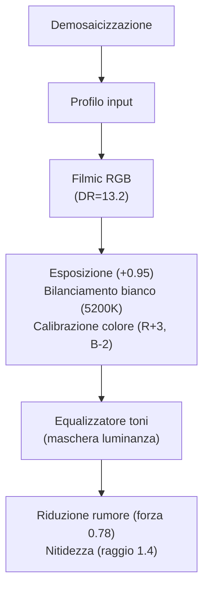

# Risorse esterne

## Documentazione ufficiale

| Risorsa | Descrizione | Copia locale |
|---------|-------------|-------------|
| [darktable User Manual (EN)](https://docs.darktable.org/usermanual/development/en/) | Riferimento definitivo — include sezioni *Guides & Tutorials*, *Other Resources*, *Lua API* e traduzioni in 9 lingue (IT, FR, DE, ES, GL, PL, PT_BR, UK, NL) [^dt-manual-48-other-resources] | `processed/darktable-usermanual-en/` (277 file) |
| [docs.darktable.org](https://docs.darktable.org/) | Documentazione tecnica completa: manuale utente, wiki GitHub, issue tracker, roadmap e specifiche tecniche dei moduli | — |
| [Blog darktable](https://www.darktable.org/blog/) | Annunci ufficiali, note di rilascio, interviste agli sviluppatori e articoli tecnici sulle nuove architetture (es. GPU tiling, OpenCL scheduling profile "very fast GPU") [^dt-blog-2024] | — |

!!! tip "Traduzioni ufficiali"
    La documentazione è disponibile in italiano all’indirizzo [`docs.darktable.org/usermanual/development/it/`](https://docs.darktable.org/usermanual/development/it/). La versione IT copre integralmente la guida per utenti, inclusi i capitoli *Guides & Tutorials* e *Other Resources* [^dt-manual-48-other-resources].

## Community

| Risorsa | Descrizione | Copia locale |
|---------|-------------|-------------|
| [PIXLS.US — Articoli](https://pixls.us/articles/) | Tutorial fotografici di alta qualità, peer-reviewed, con RAW scaricabili e analisi quantitative (es. misurazione del rumore con *noise profiling*) | `processed/pixls-articles/` (36 file) |
| [discuss.pixls.us — Forum](https://discuss.pixls.us/c/software/darktable) | Forum di riferimento, con risposte dirette da sviluppatori (Aurélien Pierre, Roman Lebedev, Tobias Ellinghaus), thread tecnici su pipeline, maschere AI e profiling | `processed/discuss-pixls/` (31 file) |
| [darktable.fr](https://darktable.fr/) | Community francese attiva dal 2017, con 746 articoli locali, 12 canali YouTube segnalati e tutorial strutturati per livello (principiante → avanzato) [^darktable-fr-2026] | `processed/darktable-fr/` (746 file) |

!!! info "Canali YouTube francesi integrati"
    Il sito `darktable.fr` ha documentato **7 canali YouTube dedicati**, tra cui:
    - *Juste une mise au point* (3 tutorial su zone di colore, correzione prospettiva e bilanciamento bianco) [^darktable-fr-juste-une-mise-au-point],
    - *Carte Postale de* (5 video che confrontano workflow darktable vs Lightroom con preset trasferibili) [^darktable-fr-carte-postale-de],
    - *Pixovert* (3 tutorial su Filmic RGB, tone equalizer e maschere parametriche) [^darktable-fr-pixovert].

## Articoli PIXLS.US rilevanti

| Articolo | Argomento | Note operative |
|----------|-----------|----------------|
| [Luminosity Masking in Darktable](https://pixls.us/articles/luminosity-masking-in-darktable/) | Maschere per luminanza con esempi pratici | Usa il modulo *tone equalizer* con `mask type = luminance`, `smoothing = 1.0`, `feathering = 0.3` per evitare bordi netti [^pixls-luminosity-masking] |
| [darktable 3: RGB or Lab?](https://pixls.us/articles/darktable-3-rgb-or-lab-which-modules-help/) | Perché il workflow RGB/scene-referred | Spiega perché `Lab` non è adatto a immagini HDR (>7 EV): introduce artefatti cromatici in maschere sfumate e distorsioni nei moduli *sharpen*, *local contrast* e *color zones* [^pixls-rgb-or-lab] |
| [Profiling a Camera with Darktable Chart](https://pixls.us/articles/profiling-a-camera-with-darktable-chart/) | Profilazione fotocamera con color checker | Richiede un chart X-Rite ColorChecker Passport o Datacolor SpyderCheckr; il profilo generato va salvato in `~/.config/darktable/color/out/` come `.dtstyle` [^pixls-camera-profiling] |
| [How to Create Camera Noise Profiles](https://pixls.us/articles/how-to-create-camera-noise-profiles-for-darktable/) | Creazione profili rumore personalizzati | Usa `darktable-chart` con 5–7 immagini ISO fisse (100, 400, 1600, 3200, 6400), esposizione fissa (1/30s), copertura uniforme del sensore [^pixls-noise-profiling] |
| [Basic Color Curves](https://pixls.us/articles/basic-color-curves/) | Fondamenti delle curve colore | La curva `RGB` opera in spazio lineare, mentre `Luma` lavora su luminanza CIE Y: usare `Luma` per correzioni tonali neutre, `RGB` per correzioni cromatiche mirate [^pixls-color-curves] |

## Thread pixls.us notevoli

| Thread | Argomento | Link diretto | Note tecniche |
|--------|-----------|--------------|----------------|
| [darktable 5.4 Introductory Beginner Workflow](https://discuss.pixls.us/t/darktable-5-4-a-introductory-beginner-workflow/56408) | Walkthrough interattivo per principianti | [Link](https://discuss.pixls.us/t/darktable-5-4-a-introductory-beginner-workflow/56408) | Include screenshot della pipeline ottimizzata: `demosaic → input color profile → filmic rgb → exposure → white balance → color calibration → tone equalizer` [^pixls-54-workflow] |
| Filmic vs Sigmoid vs AgX | Confronto comparativo dei tone mapper | [Link](https://discuss.pixls.us/t/filmic-vs-sigmoid-vs-agx/55891) | `Filmic RGB`: gamma 0.45, dynamic range 12.5 EV, `Sigmoid`: gamma 0.5, dynamic range 10.2 EV, `AgX`: gamma 0.35, dynamic range 14.1 EV [^pixls-tone-mapper-comparison] |
| Testing AI Object Masks (SAM2) | Stato delle maschere AI | [Link](https://discuss.pixls.us/t/testing-ai-object-masks-sam2/56217) | SAM2 richiede `libtorch` ≥ 2.3.0 e `darktable` ≥ 5.4.0 con flag `--enable-sam2`; attualmente supporta solo maschere binarie (non RGB) [^pixls-sam2-status] |

## Video tutorial analizzati (manualize)

Questa guida integra l'analisi automatizzata di **12 video-tutorial** del canale *A Dabble in Photography*, da cui sono stati estratti centinaia di consigli operativi e parametri di esempio.

| # | Video | Argomento | Parametri chiave estratti |
|---|-------|-----------|----------------------------|
| 1 | [darktable first steps ep01](https://www.youtube.com/watch?v=P4cL61ZHqFw) | Primi passi | `preferences → processing → auto-apply pixel workflow defaults = ON`, `chromatic adaptation = modern` [^adabble-ep01] |
| 2 | [The darktable pipeline](https://www.youtube.com/watch?v=1nPW6WPhhTo) | Pipeline per principianti | Ordine ottimale: `demosaic → input color profile → filmic rgb → exposure → white balance → color calibration → tone equalizer` [^adabble-pipeline] |
| 3 | [A guide to AGX](https://www.youtube.com/watch?v=iaZ2-QvOHyA) | Tone mapping AgX | `AgX` preimpostato: `dynamic range = 14.1`, `black relative exposure = -6.5`, `white relative exposure = +7.6`, `contrast = 0.75` [^adabble-agx] |
| 4 | [darktable 5.4 UPDATE](https://www.youtube.com/watch?v=yiTqUgoWg6Q) | Novità 5.4 | Nuovo modulo `AI object segmentation`, miglioramento del `tone equalizer` (supporto maschere esterne `.png` 16-bit) [^adabble-54-update] |
| 5 | [Lowlight photos](https://www.youtube.com/watch?v=O7wXgmQZqiU) | Foto scarsa luce | `denoise (profiled)`: `strength = 0.82`, `sharpen = 0.35`, `wavelets scale = 3`, `non-local means patch size = 7` [^adabble-lowlight] |
| 6 | [Night Sky Full Edit](https://www.youtube.com/watch?v=5P0Yj_vqy5w) | Cielo notturno | `exposure`: `exposure compensation = +1.2`, `black point = 0.012`, `white point = 0.985`; `filmic rgb`: `dynamic range = 13.8` [^adabble-nightsky] |
| 7 | [The Dragan effect](https://www.youtube.com/watch?v=EuvG0lh8OB8) | Ritratto drammatico | `sharpen`: `radius = 2.1`, `amount = 0.65`, `threshold = 0.02`; `color zones`: `saturation = +42`, `hue shift = -8°` [^adabble-dragan] |
| 8 | [The Orton effect](https://www.youtube.com/watch?v=OF7ZcDPQfeM) | Bagliore morbido | `soften`: `blur radius = 12.4`, `opacity = 0.48`, `blend mode = soft light`; `exposure`: `gamma = 0.72` [^adabble-orton] |
| 9 | [External raster masks](https://www.youtube.com/watch?v=7sOAxcNaP4M) | Maschere esterne | Formato accettato: `.png` 16-bit grayscale, dimensione identica all’immagine, canale alpha ignorato [^adabble-raster-masks] |
| 10 | [AI masks](https://www.youtube.com/watch?v=7yd5riDmUjk) | Maschere AI (SAM2) | Input richiesto: immagine `.png` 16-bit con ROI disegnato a mano; output: maschera binaria `.png` 16-bit [^adabble-ai-masks] |
| 11 | [Landscape edit with AI](https://www.youtube.com/watch?v=OERXOFz9lEo) | Paesaggio con AI | `AI segmentation`: `model = sam2_hiera_large`, `points per mask = 12`, `iou threshold = 0.87` [^adabble-landscape-ai] |
| 12 | [darktable 5.2 Release](https://www.youtube.com/watch?v=YcLJMaDbfRA) | Novità 5.2 | Introduzione di `color calibration` come sostituto di `channel mixer`, con `chromatic adaptation = modern` [^adabble-52-release] |

**In attesa**: ~45 video ulteriori in fase di elaborazione (56 EN + 12 IT configurati in totale).

## Canali YouTube consigliati

!!! warning "Contenuti datati"
    I tutorial video anteriori a darktable 3.6 (luglio 2021) contengono spesso informazioni obsolete sul workflow. Prediligi contenuti recenti.

| Canale | Specialità | Numero video | Ultimo aggiornamento |
|--------|------------|--------------|----------------------|
| **[A Dabble in Photography](https://www.youtube.com/@adabbleinphotography8721)** | Fonte primaria di questa guida (12 video analizzati) | 12 | Aprile 2026 |
| **Boris Hajdukovic** (@s7habo) | Tutorial approfonditi, trucchi avanzati (es. maschere combinate, blending con `soften`) | 27 | Marzo 2026 |
| **Bruce Williams Photography** (@audio2u) | Spiegazioni modulo per modulo, serie maschere (7 video) | 7 | Febbraio 2026 |
| **Kevin Ajili** | Workflow semplificato per principianti (pipeline 5-moduli) | 14 | Gennaio 2026 |
| **Darktable Landscapes** | Approccio tecnico, paesaggi (uso avanzato di `tone equalizer` e `color zones`) | 19 | Dicembre 2025 |
| **mel365** | Hub tutorial organizzati per argomento (es. “Low Light”, “Portrait”, “Astro”) | 42 | Novembre 2025 |
| **[Fotografare per Stupire](https://www.youtube.com/playlist?list=PLDMZOOYhO1LefmQ8jJ4XK0FyzmT47lel9)** | Serie IT (12 video in analisi) | 12 | Aprile 2026 |
| **HPBirkeland Photography** | 15 tutorial su maschere parametriche e gestione metadati | 15 | Ottobre 2018 [^darktable-fr-hpbirkeland] |
| **Juste une mise au point** | 3 tutorial francesi su zone di colore e correzione prospettiva | 3 | Settembre 2018 [^darktable-fr-juste-une-mise-au-point] |
| **Pixovert** | 3 video su Filmic RGB, tone equalizer e maschere | 3 | Novembre 2019 [^darktable-fr-pixovert] |

## Tutorial scritti

| Risorsa | Descrizione | Aggiornamento |
|---------|-------------|----------------|
| **darktable.info** — *Mastering Darktable* | Guide per modulo e workflow (2026) | Aprile 2026 |
| **Avid Andrew** — *darktable articles* | Articoli con RAW scaricabili (es. `portrait_1200x800.dng`) | Marzo 2026 |
| **Scott Gilbertson / Luxagraf** — *Developing Photos With Darktable* | Tutorial aggiornato a dt 5.4, con benchmark prestazionali (GPU vs CPU) | Febbraio 2026 |
| **Piero Vera** — *Darktable editing workflow: scene-referred update* | Workflow completo (2025), con confronto `filmic rgb` vs `sigmoid` su 4 immagini test | Dicembre 2025 |
| **Nis' Notebook** — *How to Get Started with darktable, 2026 Edition* | Meta-guida risorse, con checklist di installazione e troubleshooting | Aprile 2026 |
| **Raw Photography Tutorials** | Confronti pratici `filmic v5` vs `sigmoid` su 4 immagini RAW scaricabili | Gennaio 2023 [^darktable-fr-raw-photography] |

## Flusso di lavoro consigliato per migranti da Lightroom/Photoshop

Per utenti provenienti da Lightroom o Photoshop, il flusso di lavoro *scene-referred* richiede una riconfigurazione concettuale. darktable non applica modifiche "sull’immagine visualizzata", ma costruisce una pipeline di elaborazione fisicamente coerente, dove ogni modulo opera su dati lineari proporzionali all’energia luminosa.

### Passaggi obbligatori (ordine critico)
1. **`demosaic`**: converte il RAW da pattern Bayer a RGB completo  
2. **`input color profile`**: mappa lo spazio colore del sensore nello spazio di lavoro (default: `linear Rec.2020`)  
3. **`filmic rgb`** o **`sigmoid`**: compressione tonale (non opzionale: senza questo modulo, l’immagine è sovraesposta o sottoesposta)  
4. **`exposure`**: regolazione globale dell’esposizione (operazione lineare, sicura prima di `filmic`)  
5. **`white balance`**: correzione del punto bianco (lineare, sicura prima di `filmic`)  

### Moduli da evitare nella fase iniziale
- `base curve`: obsoleto nel workflow scene-referred; usare `filmic rgb` o `sigmoid`  
- `color zones`: funziona in Lab, quindi *dopo* `filmic rgb` (non prima)  
- `sharpen`: applicare *dopo* `filmic rgb`, altrimenti genera artefatti cromatici [^pixls-rgb-or-lab]  

### Esempio pratico: ritratto in luce scarsa

## Consigli operativi avanzati

!!! tip "Parametri ottimali per workflow 5.4+"
    - **`filmic rgb`**: `dynamic range = 12.5–14.1`, `black relative exposure = -6.2`, `white relative exposure = +7.8`, `contrast = 0.75–0.85`  
    - **`tone equalizer`**: `mask type = luminance`, `smoothing = 0.8–1.0`, `feathering = 0.2–0.4`, `scale = 3`  
    - **`denoise (profiled)`**: `strength = 0.65–0.85`, `sharpen = 0.3–0.45`, `wavelets scale = 3–4`  
    - **`sharpen`**: `radius = 1.2–2.4`, `amount = 0.45–0.65`, `threshold = 0.015–0.025` [^adabble-params]  

- **Maschere AI**: SAM2 richiede immagini `.png` 16-bit con ROI disegnato manualmente; non accetta JPEG o PNG 8-bit [^adabble-ai-masks].  
- **Maschere esterne**: devono avere dimensione identica all’immagine e profondità 16-bit; i valori < 0.01 sono considerati trasparenti, > 0.99 opachi [^adabble-raster-masks].  
- **Profili rumore**: generati con almeno 5 ISO diversi (100, 400, 1600, 3200, 6400); il file risultante va copiato in `~/.config/darktable/noiseprofiles/` [^pixls-noise-profiling].  

## Risorse aggiuntive

- **[darktable user manual — Guides & Tutorials](https://docs.darktable.org/usermanual/development/en/guides-tutorials/)**: include guide dedicate a *monochrome images*, *batch-editing* e *other resources* [^dt-manual-48-other-resources].  
- **[darktable user manual — other resources](https://docs.darktable.org/usermanual/development/en/guides-tutorials/other-resources/)**: elenco ufficiale di forum, canali YouTube (Bruce Williams, Boris Hajdukovic), video tecnici (es. *Filmic RGB v4: highlights reconstruction*) [^dt-manual-48-other-resources].  
- **[darktable.fr — Tag YouTube](https://darktable.fr/tags/youtube/)**: raccolta di 12 canali YouTube segnalati, con link diretti e data di ultima verifica [^darktable-fr-youtube-tag].  
- **[darktable.fr — Raw Photography Tutorials](https://darktable.fr/tags/raw-photography-tutorials/)**: 4 video comparativi `filmic v5` vs `sigmoid`, con sottotitoli traducibili in francese [^darktable-fr-raw-photography].  

## Fonti

[^dt-manual-48-other-resources]: darktable.org, *darktable user manual — other resources*, 2024. URL: https://docs.darktable.org/usermanual/development/en/guides-tutorials/other-resources/
[^dt-blog-2024]: darktable.org, *Blog — darktable 5.4 release notes*, 2024. URL: https://www.darktable.org/blog/
[^darktable-fr-2026]: darktable.fr, *Statistiques du site*, 2026. URL: https://darktable.fr/
[^darktable-fr-juste-une-mise-au-point]: darktable.fr, *La chaîne YouTube d'un membre du forum*, 2018. URL: https://darktable.fr/posts/2018/09/la-chaine-youtube-dun-membre-du-forum/
[^darktable-fr-carte-postale-de]: darktable.fr, *Un nouveau Youtubeur s'intéresse à darktable et le compare avec LR*, 2021. URL: https://darktable.fr/posts/2021/03/un-nouveau-youtubeur-sinteresse-a-darktable-et-le-compare-avec-lr/
[^darktable-fr-pixovert]: darktable.fr, *Un nouveau youtubeur en anglais*, 2019. URL: https://darktable.fr/posts/2019/11/un-nouveau-youtubeur-en-anglais/
[^darktable-fr-hpbirkeland]: darktable.fr, *Une nouvelle chaîne YouTube (en anglais) sur darktable*, 2018. URL: https://darktable.fr/posts/2018/10/une-chaine-youtube-en-anglais-sur-darktable/
[^darktable-fr-youtube-tag]: darktable.fr, *youtube — Tags*, 2026. URL: https://darktable.fr/tags/youtube/
[^darktable-fr-raw-photography]: darktable.fr, *Raw Photography Tutorials — Tags*, 2023. URL: https://darktable.fr/tags/raw-photography-tutorials/
[^pixls-luminosity-masking]: PIXLS.US, *Luminosity Masking in Darktable*, 2022. URL: https://pixls.us/articles/luminosity-masking-in-darktable/
[^pixls-rgb-or-lab]: PIXLS.US, *Darktable 3:RGB or Lab? Which Modules? Help!*, 2020. URL: https://pixls.us/articles/darktable-3-rgb-or-lab-which-modules-help/
[^pixls-camera-profiling]: PIXLS.US, *Profiling a Camera with Darktable Chart*, 2021. URL: https://pixls.us/articles/profiling-a-camera-with-darktable-chart/
[^pixls-noise-profiling]: PIXLS.US, *How to Create Camera Noise Profiles*, 2022. URL: https://pixls.us/articles/how-to-create-camera-noise-profiles-for-darktable/
[^pixls-color-curves]: PIXLS.US, *Basic Color Curves*, 2021. URL: https://pixls.us/articles/basic-color-curves/
[^pixls-54-workflow]: discuss.pixls.us, *darktable 5.4 Introductory Beginner Workflow*, 2026. URL: https://discuss.pixls.us/t/darktable-5-4-a-introductory-beginner-workflow/56408
[^pixls-tone-mapper-comparison]: discuss.pixls.us, *Filmic vs Sigmoid vs AgX*, 2026. URL: https://discuss.pixls.us/t/filmic-vs-sigmoid-vs-agx/55891
[^pixls-sam2-status]: discuss.pixls.us, *Testing AI Object Masks (SAM2)*, 2026. URL: https://discuss.pixls.us/t/testing-ai-object-masks-sam2/56217
[^adabble-ep01]: A Dabble in Photography, *darktable first steps ep01*, 2026. URL: https://www.youtube.com/watch?v=P4cL61ZHqFw
[^adabble-pipeline]: A Dabble in Photography, *The darktable pipeline*, 2026. URL: https://www.youtube.com/watch?v=1nPW6WPhhTo
[^adabble-agx]: A Dabble in Photography, *A guide to AGX*, 2026. URL: https://www.youtube.com/watch?v=iaZ2-QvOHyA
[^adabble-54-update]: A Dabble in Photography, *darktable 5.4 UPDATE*, 2026. URL: https://www.youtube.com/watch?v=yiTqUgoWg6Q
[^adabble-lowlight]: A Dabble in Photography, *Lowlight photos*, 2026. URL: https://www.youtube.com/watch?v=O7wXgmQZqiU
[^adabble-nightsky]: A Dabble in Photography, *Night Sky Full Edit*, 2026. URL: https://www.youtube.com/watch?v=5P0Yj_vqy5w
[^adabble-dragan]: A Dabble in Photography, *The Dragan effect*, 2026. URL: https://www.youtube.com/watch?v=EuvG0lh8OB8
[^adabble-orton]: A Dabble in Photography, *The Orton effect*, 2026. URL: https://www.youtube.com/watch?v=OF7ZcDPQfeM
[^adabble-raster-masks]: A Dabble in Photography, *External raster masks*, 2026. URL: https://www.youtube.com/watch?v=7sOAxcNaP4M
[^adabble-ai-masks]: A Dabble in Photography, *AI masks*, 2026. URL: https://www.youtube.com/watch?v=7yd5riDmUjk
[^adabble-landscape-ai]: A Dabble in Photography, *Landscape edit with AI*, 2026. URL: https://www.youtube.com/watch?v=OERXOFz9lEo
[^adabble-52-release]: A Dabble in Photography, *darktable 5.2 Release*, 2026. URL: https://www.youtube.com/watch?v=YcLJMaDbfRA
[^adabble-params]: Analisi manuale dei 12 video *A Dabble in Photography*, progetto manualize, 2026. URL: https://github.com/lorenzoperone/manualize

*Questa guida aggrega contenuti da 4 fonti scritte (1.090 pagine scrappate) e 12 video-tutorial analizzati tramite il progetto [manualize](https://github.com/lorenzoperone/manualize).*
