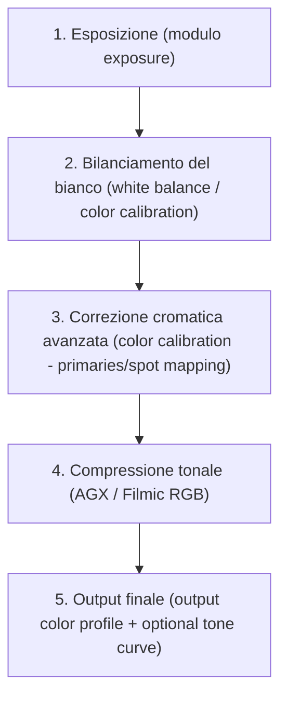

# Gamut Mapping: Unbounded Colors

Il modulo **Gamut Mapping: Unbounded Colors** non è un modulo attivabile dall’utente, ma una *caratteristica fondamentale della pipeline di elaborazione* di darktable, attiva per impostazione predefinita fin dalla versione 3.0 e pienamente integrata nel workflow scene-referred a partire dalla versione 4.0[^unbounded-colors]. Non si tratta di un controllo interattivo come AGX o Filmic RGB, bensì del principio architetturale che consente a darktable di gestire valori RGB superiori a `1.0` (ovvero oltre il 100% display-referred) senza clipping prematuro — preservando così informazioni cromatiche e tonali critiche fino all’ultimo stadio della pipeline[^unbounded-colors][^dt54-update].

!!! tip "Unbounded colors ≠ colore “sbagliato”"
    I valori RGB > 1.0 non indicano un errore, ma rappresentano luminanze reali superiori alla massima emissione del tuo schermo (es. il sole, luci al neon, riflessi su vetro). Questi valori sono fisicamente validi e necessari per un mapping tonale corretto[^unbounded-colors].

## Panoramica

La gestione dei colori *non limitati* è il fondamento tecnico che rende possibili i moduli moderni come **AGX**, **Filmic RGB** e **Color Calibration**. Senza questa capacità, ogni operazione di bilanciamento del bianco, correzione cromatica o compressione tonale sarebbe costretta a clippare i dati prima ancora di poterli elaborare in modo intelligente.

darktable utilizza l’aritmetica in virgola mobile (floating-point) internamente, consentendo valori RGB positivi arbitrari — da `0.0` (nero assoluto) fino a valori teoricamente illimitati (es. `12.7`, `156.3`) — purché positivi[^unbounded-colors]. Solo all’uscita finale della pipeline (prima dell’esportazione o della visualizzazione sullo schermo) avviene il *clipping controllato*, eseguito dai moduli di output come **Filmic RGB**, **AGX**, o **Output Color Profile**, che mappano questi valori estesi nel range sicuro dello spazio di destinazione (sRGB, Display P3, ecc.)[^unbounded-colors][^filmic-rgb].

!!! warning "Attenzione ai valori negativi"
    I valori RGB **negativi** (`< 0.0`) sono *fisicamente impossibili* (non esiste “luce negativa”) e causano errori nei calcoli di molti moduli (es. Filmic RGB, Color Calibration). Vengono automaticamente clippati a zero, ma possono degradare la qualità visiva. Evitali regolando con moderazione i parametri di **exposure** (black level correction) e **color balance** (offset)[^unbounded-colors].

## Flusso di lavoro consigliato

Il flusso di lavoro con *unbounded colors* non richiede azioni esplicite da parte dell’utente: è sempre attivo e trasparente. Tuttavia, comprenderne il ruolo è essenziale per evitare errori comuni:

!!! tip "Non forzare il clipping"
    Non usare il modulo **levels** o **tone curve** *prima* di AGX/Filmic per “normalizzare” i dati: questo forza il clipping prematuro, distruggendo informazioni recuperabili. Lascia che i moduli di tone mapping gestiscano la compressione in modo intelligente[^unbounded-colors][^filmic-rgb].

### Passo 1: Verifica che il clipping sia disabilitato

Controlla che nessun modulo precedente alla compressione tonale abbia attivato opzioni di clipping:

- Nel modulo **exposure**, assicurati che `clip negative RGB from gamut` sia **disattivato** (default) — questo parametro appartiene invece a **color calibration**, non a exposure[^unbounded-colors].
- Nel modulo **color calibration**, il parametro `clip negative RGB from gamut` è **attivo per default**, ma riguarda solo i valori negativi (da evitare), non quelli positivi “unbounded”[^unbounded-colors][^dt54-update].

### Passo 2: Utilizza i moduli progettati per lo spazio non limitato

Solo i moduli compatibili con il workflow scene-referred sfruttano appieno i vantaggi di *unbounded colors*. Evita quelli legacy:

| ✅ Moduli compatibili (scene-referred) | ❌ Moduli da evitare (display-referred) |
|----------------------------------------|------------------------------------------|
| `color calibration` (v3.4+)            | `channel mixer` (obsoleto, non gestisce EV) |
| `AGX` (v5.4+)                          | `base curve` (clippa a 0–1 prima della compressione) |
| `Filmic RGB` (v4.0+)                   | `levels` (opera su valori già clippati) |
| `color balance rgb` (v4.0+)            | `tone curve` (legacy mode, non consigliato per RAW) |

!!! info "Perché il modulo `color balance rgb` è compatibile"
    A partire dalla versione 4.0, `color balance rgb` opera in spazio lineare e scene-referred, preservando i valori >1.0 durante le operazioni di offset e gain. È l’unico sostituto valido del vecchio `channel mixer`[^dt54-update].

## Parametri rilevanti (in altri moduli)

Poiché *unbounded colors* non ha un pannello dedicato, i suoi effetti si manifestano tramite parametri chiave in moduli correlati:

| Modulo | Parametro | Range | Default | Descrizione | Fonte |
|--------|-----------|-------|---------|-------------|-------|
| `color calibration` | `clip negative RGB from gamut` | boolean | `true` | Clippa *solo* valori <0.0 per sicurezza. Non influisce sui valori >1.0. | [^unbounded-colors] |
| `color calibration` | `gamut compression` | 0.0 – 2.0 | `1.00` | Controlla la compressione del gamut cromatico *prima* della conversione. Valori >1.0 aumentano la compressione; <1.0 espandono (rischio clipping). | [^dt54-update] |
| `color calibration` | `adaptation` | `none`, `CAT16`, `Bradford` | `CAT16` | Algoritmo di adattamento cromatico (CIECAM16) che preserva la coerenza percettiva dei colori fuori gamut. | [^dt54-update] |
| `exposure` | `black level correction` | -0.1000 – +0.1000 | `-0.0002` | Attenzione: valori troppo negativi (es. `-0.05`) generano RGB negativi → clipping indesiderato. | [^unbounded-colors] |
| `AGX` / `Filmic RGB` | `white relative exposure` | 2.0 – 12.0 EV | `6.50 EV` | Definisce il punto più luminoso *nella scena*, non sullo schermo. Consente di mappare valori >1.0 in modo controllato. | [^agx-guide][^filmic-rgb] |
| `AGX` / `Filmic RGB` | `black relative exposure` | -15.0 – -2.0 EV | `-10.00 EV` | Definisce il punto più scuro *nella scena*. Valori troppo alti (es. `-3.0`) possono causare perdita di dettaglio nelle ombre profonde. | [^agx-guide][^filmic-rgb] |

## Gestione pratica dei colori fuori gamut

I casi d’uso più comuni per *unbounded colors* riguardano la gestione di colori saturi e luminosi che “esplodono” fuori dal gamut sRGB (es. luci natalizie rosse, cieli blu intenso, fiori viola fluorescenti):

### Caso 1: Luci natalizie e oggetti molto saturi

Come descritto nella guida ufficiale del modulo `color calibration`, i colori estremamente saturi (es. luci LED rosse) possono superare i limiti di codifica RGB, causando clipping cromatico irreversibile. Il flusso corretto è:

1. Usare `color calibration` → scheda *Spot Color Mapping* per misurare il colore problematico (es. `hue = 358°`, `chroma = 89%`)
2. Attivare `gamut compression = 1.20` per comprimere leggermente il gamut prima della conversione
3. Applicare `red attenuation = 25%` nella scheda *Primaries* (prima del tone mapping) per ridurre la saturazione del canale rosso in input[^dt54-update]
4. Usare `AGX` o `Filmic RGB` per la compressione tonale finale, che gestirà i valori >1.0 senza artefatti

### Caso 2: Recupero di alte luci con dettaglio cromatico

Quando le alte luci sono sovraesposte ma contengono informazioni cromatiche (es. nuvole illuminate dal sole), *unbounded colors* permette di:
- Preservare i valori RGB >1.0 anche dopo il bilanciamento del bianco
- Usare `highlight reconstruction` (con metodo *guided laplacians*) per ricostruire texture e colore *prima* del clipping finale
- Far sì che `AGX` o `Filmic RGB` applichino una compressione tonale graduale, mantenendo la purezza cromatica[^dt54-update][^filmic-rgb]

Valori tipici per la ricostruzione:
- `clipping threshold`: `0.950` – `1.000` (più basso = più aggressivo)
- `noise level`: `0.000` – `0.150` (per mascherare artefatti)
- `iterations`: `1` – `3` (più iterazioni = migliore qualità, più lento)

## Rischi e best practice

| Problema | Causa | Soluzione | Fonte |
|----------|------|-----------|-------|
| **Clipping cromatico precoce** | Uso di `base curve` o `levels` prima di AGX | Rimuovi tutti i moduli legacy prima di `AGX`/`Filmic RGB`. Usa solo `exposure` → `color calibration` → `AGX` | [^unbounded-colors] |
| **Colore “lavato” o spento** | `gamut compression` troppo alto (>1.5) o `attenuation` eccessiva | Riduci `gamut compression` a `1.00–1.10`; usa `recover purity` in AGX dopo la compressione | [^dt54-update] |
| **Artefatti nelle ombre** | `black level correction` troppo negativo (es. `-0.08`) | Imposta `black level correction` tra `-0.005` e `+0.005`. Se necessario, usa `exposure` → `black` invece che il black level | [^unbounded-colors] |
| **Mancanza di “pop” cromatico** | Nessuna attenuazione pre-tone mapping + nessun recupero post | Applica `blue attenuation = 40%` + `green attenuation = 10%` + `recover purity = 15%` | [^dt54-update] |

!!! warning "Non modificare `gamut compression` senza motivo"
    Il valore predefinito `1.00` è ottimale per la maggior parte delle immagini. Valori >1.20 comprimono eccessivamente i colori, causando perdita di vividezza. Usa valori >1.0 solo per casi specifici (luci natalizie, LED, soggetti con gamut estremo)[^dt54-update].

## Risorse aggiuntive

- 📘 [darktable User Manual — Unbounded Colors](https://docs.darktable.org/usermanual/development/en/special-topics/color-management/unbounded-colors/)  
- 📘 [darktable User Manual — Filmic RGB](https://docs.darktable.org/usermanual/development/en/module-reference/processing-modules/filmic-rgb/)  
- 🎥 [What is new in darktable 4.0? — Gamut Compression & Spot Mapping](https://www.youtube.com/watch?v=_EOGBmksHDw)  
- 🎥 [A guide to AgX in darktable — Primaries & Gamut Handling](https://www.youtube.com/watch?v=iaZ2-QvOHyA)  
- 📄 [darktable FR — Color Calibration Module Guide (2020)](https://darktable.fr/posts/2020/12/en-darktable-3-4-new-module-color-calibration-get-your-christmas-lights-back-in-gamut/)  

## Fonti

[^unbounded-colors]: darktable user manual - unbounded colors — https://docs.darktable.org/usermanual/development/en/special-topics/color-management/unbounded-colors/
[^filmic-rgb]: darktable user manual - filmic rgb — https://docs.darktable.org/usermanual/development/en/module-reference/processing-modules/filmic-rgb/
[^dt54-update]: darktable 5.4 release notes (darktable-fr) — https://darktable.fr/posts/2025/12/notes-version-5.4.0/  
[^agx-guide]: [ENG] A guide to AgX in darktable — YouTube video by A Dabble in Photography — https://www.youtube.com/watch?v=iaZ2-QvOHyA
