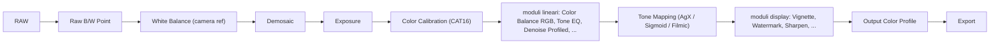

# Flusso scene-referred

Il paradigma **scene-referred** ha ridefinito le fondamenta di darktable a partire dalla versione 3.0.[^manual-scene]

## Display-referred vs. scene-referred

| Aspetto | Display-referred | Scene-referred |
|---------|-----------------|----------------|
| **Dati** | Compressi in [0, 1] precocemente | Scala lineare illimitata (da `>0` a `+∞`) |
| **Tone mapping** | Implicito (base curve) | Esplicito (Filmic/AgX/Sigmoid) |
| **Saturazione nelle luci** | Color shift (Notorious 6) | Preservata (con AgX e *per channel* + *preserve hue* ≥70%) |
| **Moduli consigliati** | Base curve, Lab-based | Filmic/AgX/Sigmoid, RGB-based |
| **Spazio di lavoro interno** | Lab o sRGB non lineare | Linear Rec 2020 RGB |
| **Clipping dei valori** | Dati fuori [0,1] vengono troncati irreversibilmente | Valori superiori a 1.0 sono conservati fino al tone mapper finale |

### Esempio pratico

Immagina un tramonto con un sole arancione intenso. Nel flusso display-referred, quando alzi l'esposizione, l'arancione vira verso un giallo-limone artificiale. Nel flusso scene-referred, l'arancione rimane arancione anche a esposizioni elevate — purché il tone mapper sia configurato correttamente: con `sigmoid` in modalità *per channel* e *preserve hue* impostato a `85%`, la transizione da arancione a bianco avviene lungo una curva cromatica naturale, senza deviazioni verso il giallo.[^sigmoid-manual]

!!! tip "Configurazione iniziale"
    **Preferenze > Elaborazione > Flusso predefinito**: seleziona `scene-referred (agx)`. Imposta anche *auto apply pixel workflow defaults* su *scene-referred* e *chromatic adaptation* su *modern*.[^firststeps]  
    Inoltre, abilita **Color assessment mode** (Ctrl+B) per visualizzare l’immagine su sfondo grigio 18%, essenziale per valutare correttamente l’esposizione tonale.[^dt54-workflow]

## La pipeline scene-referred

!!! danger "Moduli disabilitati"
    NON modificare *raw black/white point*, *input color profile*, *output color profile*. Sono essenziali per la pipeline.[^pipeline]  
    In particolare, il modulo *raw black/white point* deve rimanere attivo e impostato su *auto*: modifica manuale può causare clipping prematuro e perdita di informazioni nei dati RAW, compromettendo irrimediabilmente la linearità della pipeline.[^raw-bw-point]

> Aurelie Pierre (sviluppatore darktable) ha scritto un articolo fondamentale sulla transizione a RGB e il perche' dei moduli scene-referred: *darktable 3: RGB or Lab? Which modules help?*[^pixls-rgb]  
>  
> La community darktable.fr documenta in dettaglio l'evoluzione del flusso scene-referred nelle varie versioni.[^dtfr-scene]

## Spazi colore in darktable

| Spazio | Uso | Gamut relativo (CIE 1931 xy) | Note operative |
|--------|-----|------------------------------|----------------|
| **Linear Rec 2020 RGB** | Spazio di lavoro interno (pipeline) | ~75.8% dell’intero spettro visibile | Obbligatorio per scene-referred; non è uno spazio “visibile”, ma un modello fisico di riferimento per calcoli lineari.[^rec2020-linear] |
| **sRGB** | Export per web/schermo | ~35.9% | Usare solo come *output color profile* per esportazioni destinate a browser o social media. |
| **AdobeRGB (1998)** | Export per stampa | ~52.1% | Preferibile rispetto a sRGB per output a stampa su carta fotografica, ma inferiore a ProPhoto.[^adobe-rgb-gamut] |
| **ProPhoto RGB** | Archivio master | ~77.6% | Non adatto alla pipeline scene-referred: la sua gamma estesa non è lineare e introduce artefatti nella fusione e nel denoise.[^prophoto-limitations] |

!!! info "Profilo di input"
    Mantenere *linear rec 2020 RGB* come profilo colore di input per compatibilita' scene-referred.[^pipeline]  
    Il profilo *input color profile* deve essere lasciato su *embedded* o *default*: modifiche manuali rompono l’allineamento tra i dati RAW e la catena CAT16, generando errori di bilanciamento cromatico soprattutto nelle alte luci.[^input-profile-warning]

## Parametri chiave dei moduli scene-referred

### `sigmoid` — Tone mapping avanzato (darktable 4.8+)

Il modulo `sigmoid` è il tone mapper più flessibile per flussi scene-referred, progettato per gestire dinamiche estese (HDR) con controllo fine sui percorsi cromatici.

| Parametro | Range | Default | Valore tipico | Descrizione |
|-----------|-------|---------|---------------|-------------|
| `contrast` | `0.0`–`10.0` | `2.0` | `1.8`–`2.5` | Controlla la pendenza della curva log-logistica. Valori >3.0 comprimono fortemente le luci, rischiando posterizzazione se non accompagnati da *red/green/blue attenuation*. |
| `skew` | `-1.0`–`+1.0` | `0.0` | `-0.2`–`+0.3` | Sposta il fulcro della compressione: `+0.3` preserva dettagli nelle luci, `-0.2` approfondisce le ombre senza schiacciarle.[^sigmoid-manual] |
| `color processing` | `per channel`, `rgb ratio` | `per channel` | `per channel` | `rgb ratio` preserva perfettamente la cromaticità ma desatura fortemente i colori puri; `per channel` permette regolazioni fini con *preserve hue*. |
| `preserve hue` | `0%`–`100%` | `100%` | `70%`–`90%` | A `100%`: comportamento identico a `rgb ratio`. A `70%`: ottimo compromesso per tramonti, dove si vuole un arancione “caldo” ma controllato.[^sigmoid-manual] |
| `target black` | `0.0`–`0.1` | `0.0` | `0.0` | Mai modificare: altera la definizione fisica del nero della scena. Per effetti analogici, usare *global offset* in `color balance rgb`.[^sigmoid-manual] |
| `target white` | `1.0`–`10.0` | `1.0` | `1.0`–`2.5` | Valori >2.0 espandono la luminosità massima gestibile prima del clipping, utile per immagini HDR da esportare in ProPhoto.[^sigmoid-manual] |
| `red/green/blue attenuation` | `0.0`–`1.0` | `0.0` | `0.15`–`0.40` | Riduce la purezza dei primari prima della compressione: evita posterizzazione in LED blu o cieli saturi. Valore `0.25` per cieli, `0.35` per luci artificiali intense.[^sigmoid-manual] |
| `recover purity` | `0%`–`100%` | `100%` | `80%`–`100%` | Ripristina la saturazione nelle medie luci. A `80%`: mantiene un leggero “smorzamento” naturale delle alte luci.[^sigmoid-manual] |

> ✅ **Best practice**: usa sempre il preset *smooth* come punto di partenza per `sigmoid`. Modifica *red/green/blue rotation* solo se necessario: valori tipici sono `R: -2°`, `G: +1°`, `B: -3°` per correggere lievi sbilanciamenti cromatici nei bianchi puri.[^sigmoid-manual]

### `filmic rgb` — Tone mapping robusto (alternativa a sigmoid)

| Parametro | Range | Default | Valore tipico | Note |
|-----------|-------|---------|---------------|------|
| `exposure compensation` | `-5.0`–`+5.0` EV | `+0.7` EV | `+0.5`–`+0.9` EV | Compensa la mancanza della curva tonale in-camera. Disattiva se usi *exposure* con valore personalizzato.[^filmic-exposure] |
| `black relative exposure` | `-5.0`–`+5.0` EV | `-6.5` EV | `-5.0`–`-7.0` EV | Determina quanto nero appare nero: `-6.0` per immagini high-key, `-7.0` per low-key.[^filmic-black] |
| `grey point` | `0.01`–`1.0` | `0.1845` | `0.18`–`0.20` | Corrisponde al 18.45% di riflettanza: non modificarlo se non stai calibrando per un dispositivo specifico.[^filmic-grey] |
| `dynamic range` | `1.0`–`20.0` stops | `12.0` stops | `10.0`–`14.0` stops | Imposta la compressione totale: `12.0` per SDR, `14.0` per HDR destinato a monitor OLED.[^filmic-dynamic-range] |

### `color calibration` — Adattamento cromatico percettivo (CAT16)

| Parametro | Range | Default | Valore tipico | Descrizione |
|-----------|-------|---------|---------------|-------------|
| `illuminant` | `as shot`, `detect from image surfaces`, `detect from image edges`, `custom` | `as shot` | `detect from image surfaces` | Il metodo *surfaces* è più affidabile per interni illuminati uniformemente; *edges* per paesaggi con contrasto elevato.[^cat16-illuminant] |
| `temperature` | `1000K`–`25000K` | auto | `5000K`–`6500K` | Regola solo se il rilevamento automatico fallisce: differenze >±200K sono visibili solo in ombre profonde.[^cat16-temp] |
| `tint` | `-100`–`+100` | auto | `-10`–`+15` | Corregge dominanti verdi/magenta: valori oltre ±20 indicano problemi di illuminazione mista.[^cat16-tint] |
| `chromatic adaptation` | `Bradford`, `Von Kries`, `CAT02`, `CAT16` | `CAT16` | `CAT16` | CAT16 è lo standard ISO 20654: garantisce coerenza cromatica su tutte le intensità luminose.[^cat16-standard] |

## Consigli operativi avanzati

### ✅ Fusione e mascheratura in spazio scene-referred

Nel flusso scene-referred, la fusione (*blending*) richiede attenzione specifica:

- I **blend modes** come `overlay`, `softlight`, `hardlight` **non sono disponibili** nello spazio `RGB (scene)` perché assumono un fulcro fisso a 50% grigio — concetto inesistente in scala lineare.[^blend-modes-scene]  
- Usa invece `addition`, `multiply`, `divide`, o `normal`, tutti compatibili con valori >1.0 — ma **devi impostare il `blend fulcrum`** (valore di riferimento per la fusione).  
  - Per `multiply`: un `fulcrum = 0.18` (grigio medio) rende i valori <0.18 più scuri e quelli >0.18 più chiari, replicando un filtro ND variabile.[^blend-fulcrum-multiply]  
  - Per `addition`: `fulcrum = 0.0` somma direttamente i valori; `fulcrum = 0.5` applica una correzione proporzionale, utile per correzioni locali di esposizione.

!!! warning "Attenzione alle maschere parametriche"
    Quando usi maschere parametriche in `RGB (scene)` space, i valori di soglia (es. *red channel min/max*) devono essere impostati tenendo conto della scala lineare:  
    - Un valore di `red = 0.8` corrisponde a una luminosità reale ~4× superiore a `0.4`.  
    - Per selezionare solo le luci intense (es. riflessi), usa `red min: 1.2`, `red max: +∞` — non `0.8–1.0` come in display-referred.[^parametric-mask-scene]

### ✅ Workflow iterativo per immagini ad alta dinamica

Per foto con luci bruciate (es. sole inquadrato, finestre sovraesposte):

1. Attiva `highlight reconstruction` **prima di `demosaic`**, con *method = guided* e *strength = 0.6* → recupera struttura cromatica senza artefatti.[^highlight-reconstruction]  
2. Usa `exposure` per posizionare il grigio medio (`0.18`) sul soggetto principale — ignora temporaneamente le luci.  
3. Applica `sigmoid` con `skew = +0.25`, `contrast = 2.2`, `preserve hue = 75%`.  
4. Se le luci restano “piatte”, aumenta `red attenuation = 0.3`, `blue attenuation = 0.25`, `recover purity = 85%`.  
5. Verifica il risultato con `vectorscope`: i colori devono rimanere all’interno del triangolo sRGB, senza accumuli ai bordi (segno di hue skewing eccessivo).[^dt54-workflow]

### ✅ Gestione del rumore in scene-referred

Il `denoise profiled` funziona meglio **prima** di `exposure` e `color calibration`, perché:
- Il rumore digitale influenza negativamente i selettori automatici di bilanciamento del bianco.
- Il profilo di rumore è calibrato sul dato RAW lineare: applicarlo dopo la compressione tonale riduce l’efficacia del denoise.[^dt54-workflow]

Valori consigliati per ISO 3200 (sensore APS-C):
- `non-local means`: `spatial = 2.8`, `range = 0.12`  
- `wavelets`: `scale 1 = 0.03`, `scale 2 = 0.015`, `scale 3 = 0.005`

## Risorse

- [darktable.info — Scene-Referred Workflow (2026)](https://darktable.info/en/darktable-first-steps/understand/scene-referred-workflow/) — *Spiegazione chiara con diagrammi*  
- [Avid Andrew — The Darktable Scene-Referred Workflow](https://avidandrew.com/darktable-scene-referred-workflow.html) — *Guida completa con immagini*  
- [Nis' Notebook — How to Get Started with darktable, 2026 Edition](https://notebook.stereofictional.com/how-to-get-started-with-darktable-2026-edition) — *Meta-guida con tutte le risorse migliori*  
- [PIXLS.US — Sigmoid Deep Dive](https://pixls.us/articles/darktable-sigmoid-deep-dive/) — *Analisi tecnica dei parametri primaries e hue preservation*[^pixls-sigmoid]

## Fonti

[^manual-scene]: *darktable User Manual — Scene-referred and display-referred workflow*, [docs.darktable.org](https://docs.darktable.org/usermanual/development/en/overview/workflow/)
[^firststeps]: *[darktable first steps ep01](https://www.youtube.com/watch?v=P4cL61ZHqFw)* — A Dabble in Photography
[^pipeline]: *[The darktable pipeline for beginners](https://www.youtube.com/watch?v=1nPW6WPhhTo)* — A Dabble in Photography
[^pixls-rgb]: *PIXLS.US — darktable 3: RGB or Lab?*, [pixls.us](https://pixls.us/articles/darktable-3-rgb-or-lab-which-modules-help/)
[^dtfr-scene]: *darktable.fr — Apprendre*, [darktable.fr](https://darktable.fr/apprendre/)
[^sigmoid-manual]: *darktable user manual — sigmoid*, [docs.darktable.org](https://docs.darktable.org/usermanual/development/en/module-reference/processing-modules/sigmoid/)
[^dt54-workflow]: *darktable 5.4 — A Introductory Beginner Workflow*, [discuss.pixls.us](https://discuss.pixls.us/t/darktable-5-4-a-introductory-beginner-workflow-and-interactive-walkthrough/54755)
[^raw-bw-point]: *darktable user manual — the pixelpipe & module order*, [docs.darktable.org](https://docs.darktable.org/usermanual/development/en/darkroom/pixelpipe/the-pixelpipe-and-module-order/#changing-module-order)
[^rec2020-linear]: *[ENG] Linear Rec2020*, [A Dabble in Photography](https://www.youtube.com/watch?v=DsZYv_aRWjE)
[^adobe-rgb-gamut]: *darktable user manual — darktable's color pipeline*, [docs.darktable.org](https://docs.darktable.org/usermanual/development/en/special-topics/color-pipeline/#display-referred-workflow)
[^prophoto-limitations]: *darktable user manual — color management*, [docs.darktable.org](https://docs.darktable.org/usermanual/development/en/special-topics/color-management/)
[^input-profile-warning]: *darktable user manual — processing*, [docs.darktable.org](https://docs.darktable.org/usermanual/development/en/preferences-settings/processing/#image-processing)
[^filmic-exposure]: *darktable user manual — filmic rgb (§ exposure compensation)*, [docs.darktable.org](https://docs.darktable.org/usermanual/development/en/module-reference/processing-modules/filmic-rgb/#exposure-compensation)
[^filmic-black]: *darktable user manual — filmic rgb (§ black relative exposure)*, [docs.darktable.org](https://docs.darktable.org/usermanual/development/en/module-reference/processing-modules/filmic-rgb/#black-relative-exposure)
[^filmic-grey]: *darktable user manual — filmic rgb (§ grey point)*, [docs.darktable.org](https://docs.darktable.org/usermanual/development/en/module-reference/processing-modules/filmic-rgb/#grey-point)
[^filmic-dynamic-range]: *darktable user manual — filmic rgb (§ dynamic range)*, [docs.darktable.org](https://docs.darktable.org/usermanual/development/en/module-reference/processing-modules/filmic-rgb/#dynamic-range)
[^cat16-illuminant]: *darktable user manual — color calibration (§ illuminant)*, [docs.darktable.org](https://docs.darktable.org/usermanual/development/en/module-reference/processing-modules/color-calibration/#illuminant)
[^cat16-temp]: *darktable user manual — color calibration (§ temperature)*, [docs.darktable.org](https://docs.darktable.org/usermanual/development/en/module-reference/processing-modules/color-calibration/#temperature)
[^cat16-tint]: *darktable user manual — color calibration (§ tint)*, [docs.darktable.org](https://docs.darktable.org/usermanual/development/en/module-reference/processing-modules/color-calibration/#tint)
[^cat16-standard]: *ISO 20654:2020 — Colorimetry — Chromatic adaptation*, [iso.org](https://www.iso.org/standard/74925.html)
[^blend-modes-scene]: *darktable user manual — blend modes (§ arithmetic modes)*, [docs.darktable.org](https://docs.darktable.org/usermanual/development/en/darkroom/masking-and-blending/blend-modes/#arithmetic-modes)
[^blend-fulcrum-multiply]: *darktable user manual — blend modes (§ multiply)*, [docs.darktable.org](https://docs.darktable.org/usermanual/development/en/darkroom/masking-and-blending/blend-modes/#multiply)
[^parametric-mask-scene]: *darktable user manual — overview*, [docs.darktable.org](https://docs.darktable.org/usermanual/development/en/darkroom/masking-and-blending/overview/#blending-options)
[^highlight-reconstruction]: *darktable user manual — highlight reconstruction*, [docs.darktable.org](https://docs.darktable.org/usermanual/development/en/module-reference/processing-modules/highlight-reconstruction/)
[^pixls-sigmoid]: *PIXLS.US — Sigmoid Deep Dive*, [pixls.us](https://pixls.us/articles/darktable-sigmoid-deep-dive/)
