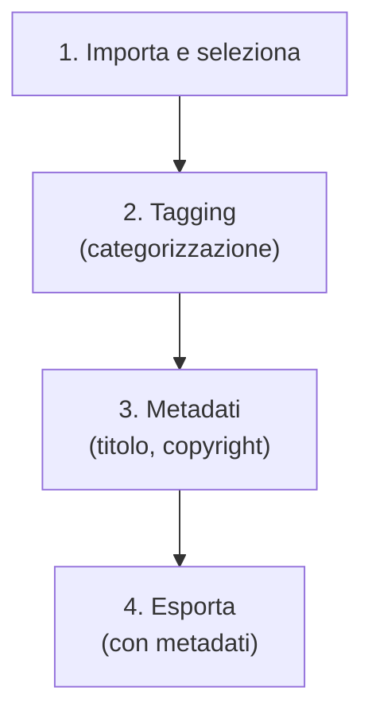

# Metadati e tag

In darktable, la gestione delle informazioni non distruttive (DAM) è divisa in due moduli principali: **metadata editor** e **tagging**. A differenza di Lightroom, dove queste funzioni sono spesso concentrate in pannelli laterali unici, in darktable sono moduli distinti e indipendenti che lavorano in sinergia per memorizzare dati nel database dell'applicazione e nei file XMP sidecar.[^manual-meta-tag][^manual-sidecar]

!!! info "Archiviazione non distruttiva"
    Tutti i metadati, i tag e i passaggi di elaborazione vengono salvati automaticamente in file `.XMP` separati (sidecar) e nel database di darktable, senza modificare il file RAW originale.[^manual-sidecar]

## Panoramica

Il sistema di gestione dei metadati in darktable si basa su due concetti distinti:

1.  **Metadata** (*metadata editor*) -- Informazioni testuali libere (titolo, descrizione, autore, copyright, ecc.) che solitamente differiscono per ogni immagine.
2.  **Tagging** (*tagging*) -- Parole chiave condivise tra più immagini, organizzate in un dizionario gerarchico. I tag servono a categorizzare, raggruppare e filtrare le collezioni.[^manual-meta-tag]

Queste informazioni sono persistenti: vengono scritte nei file sidecar e possono essere incluse nelle immagini esportate (JPEG, TIFF, ecc.) per garantire la portabilità dei dati.[^manual-meta-tag]

## Flusso di lavoro consigliato

Per gli utenti provenienti da Lightroom, il flusso tipico di assegnazione metadati in darktable segue questo ordine:[^manual-meta-editor][^manual-tagging]

### Passo 1: Applicazione dei Tag (Tagging)

Inizia assegnando i tag nel modulo **tagging**. Questo è fondamentale per organizzare la libreria.

- **Seleziona le immagini** nella lighttable.
- Nel **tag dictionary** (sezione inferiore del modulo), cerca o seleziona il tag desiderato.
- Clicca su **attach** o fai doppio clic sul tag per assegnarlo alle immagini selezionate.[^manual-tagging]

!!! tip "Importazione da Lightroom"
    Se migri da Lightroom, puoi importare le tue parole chiave esistenti cliccando sul pulsante **import…** nel modulo *tagging*. darktable supporta il formato file delle parole chiave di Lightroom.[^manual-tagging]

### Passo 2: Editing Metadati (Metadata Editor)

Una volta categorizzate le immagini, usa il modulo **metadata editor** per inserire dettagli specifici come titolo, descrizione e copyright.

- Seleziona una o più immagini.
- Compila i campi (es. *Title*, *Creator*, *Rights*).
- Premi **Apply** per salvare le modifiche nel database e nel file XMP.[^manual-meta-editor]

!!! tip "Gestione multi-immagine"
    Quando selezioni più immagini con valori diversi per uno stesso campo, il modulo mostrà `_< leave unchanged>_`. Se inserisci un nuovo valore, questo verrà applicato a tutte le immagini selezionate sovrascrivendo i dati precedenti (o unendosi, a seconda delle impostazioni). Se fai clic destro sul campo, puoi scegliere uno dei valori esistenti tra le immagini selezionate per applicarlo a tutte.[^manual-meta-editor]

### Passo 3: Sincronizzazione Metadati (Opzionale)

Per replicare il comportamento di "Sync Metadata" di Lightroom su gruppi di immagini, puoi utilizzare il modulo **actions on selection** (scheda *metadata*):[^manual-actions]

1.  Seleziona l'immagine sorgente e clicca **copy** nella scheda *metadata*.
2.  Seleziona le immagini di destinazione.
3.  Scegli la modalità **merge** (unisce) o **overwrite** (sovrascrive) e clicca **paste**.[^manual-actions]

## Parametri: Metadata Editor

Il modulo *metadata editor* fornisce campi di testo personalizzabili per i dati EXIF/IPTC/XMP.[^manual-meta-editor]

| Parametro/Controllo | Descrizione | Note |
|---------------------|-------------|------|
| **metadata entry fields** | Campi di input per titolo, descrizione, autore, ecc. | Premi `Ctrl+Enter` per andare a capo in un campo. Doppio clic sull'etichetta del campo per svuotarlo.[^manual-meta-editor] |
| **apply** | Salva le modifiche nei campi nelle immagini selezionate. | Necessario per confermare le modifiche. |
| **reset** | Elimina i metadati visibili dalle immagini selezionate. | Azione distruttiva. |

### Preferenze del Modulo

Dal menu dei preset (icona ingranaggio), è possibile configurare quali campi visualizzare:[^manual-meta-editor]

| Opzione | Funzione |
|---------|----------|
| **visible** | Mostra o nasconde il campo. I campi nascosti non vengono inclusi nelle immagini esportate. |
| **private** | Mantiene il campo privato. I campi privati non vengono inclusi nelle immagini esportate. |

È possibile aggiungere nuovi campi metadata cliccando sul pulsante **"+"** nella finestra delle preferenze e cercando il tag XMP desiderato (es. `Xmp.iptc.location`).[^manual-meta-editor]

## Parametri: Tagging

Il modulo *tagging* è diviso in due sezioni principali: *attached tags* (alto) e *tag dictionary* (basso).[^manual-tagging]

### Struttura dei Tag

I tag possono essere organizzati gerarchicamente usando il simbolo pipe `|`. Ad esempio: `Luoghi|Italia|Roma`.
- **Tag**: Una stringa descrittiva (es. `Luoghi|Italia|Roma`).
- **Node**: Qualsiasi parte del percorso (es. `Luoghi`, `Luoghi|Italia`).
- **Free Node**: Un nodo non definito esplicitamente come tag. Non può avere proprietà (come "private") e non può essere allegato direttamente se non definito come tag.[^manual-tagging]

!!! info "Allegazione implicita"
    Se alleghi il tag `Luoghi|Italia|Roma` a un'immagine, e `Luoghi|Italia` è definito come un tag separato nel dizionario, anch'esso verrà implicitamente allegato all'immagine.[^manual-tagging]

### Controlli Attached Tags (Superiore)

Questa sezione mostra i tag attualmente associati alle immagini selezionate (o sotto il mouse in lighttable).[^manual-tagging]

| Controllo | Funzione |
|-----------|----------|
| **attach** | Allega il tag selezionato nel dizionario alle immagini. |
| **detach** | Rimuove il tag selezionato dalle immagini. |
| **hidden tags** (icona occhio) | Mostra/nasconde i tag nascosti (es. tag automatici di darktable). |
| **sort** (icona ordinamento) | Ordina i tag alfabeticamente o per numero di occorrenze. |
| **parents** (icona meno) | Mostra o nasconde le categorie genitori. |

### Controlli Tag Dictionary (Inferiore)

Questa sezione mostra tutti i tag disponibili nel database.[^manual-tagging]

| Controllo | Funzione |
|-----------|----------|
| **Casella di testo** | Filtra i tag per nome o sinonimo. Digitare e premere `Enter` crea e allega un nuovo tag (se non esiste). |
| **new** | Crea un nuovo tag con il nome inserito. |
| **import… / export…** | Importa/esporta tag da/verso file di parole chiave Lightroom. |
| **suggestions** (icona lampo) | Mostra suggerimenti basati sui tag già presenti nelle immagini selezionate (può essere lento con database grandi). |
| **list/tree** (icona vista) | Commuta tra vista elenco piatto e vista albero gerarchico. |

### Proprietà del Tag (Tasto Destro)

Facendo clic destro su un tag nel dizionario, si accede alle proprietà:[^manual-tagging]

| Proprietà | Descrizione |
|-----------|-------------|
| **private** | Se impostato, il tag non viene esportato di default nelle immagini. |
| **category** | Se impostato, il tag non viene esportato nel campo `XMP-dc Subject` (ma sì in `XMP-lr Hierarchical Subject`). Utile per organizzare la libreria senza inquinare i metadati di export. |
| **synonyms** | Permette di definire sinonimi (es. "bambino" per "child") utili per la ricerca. |

## Consigli e Scorciatoie

!!! tip "Navigazione tastiera nel Metadata Editor"
    Quando il cursore è in un campo di input:
    - `Tab`: Salva il campo corrente e passa al successivo.
    - `Shift + Tab`: Salva e passa al precedente.
    - `Enter`: Salva il campo corrente senza spostare il focus.[^manual-meta-editor]

!!! tip "Assegnazione rapida tag"
    Puoi assegnare un tag rapidamente digitando il suo nome nella casella di testo del *tag dictionary* e premendo `Enter`. Se il tag non esiste, verrà creato automaticamente.[^manual-tagging]

!!! tip "Trascina e Rilascia per Organizzare"
    Nella vista *tree*, puoi trascinare un nodo e rilasciarlo su un altro per riorganizzare la gerarchia dei tag. Trascinare un nodo sulla parte superiore della finestra lo sposta al livello radice.[^manual-tagging]

!!! warning "Annulla operazioni (Undo)"
    In modalità lighttable, la maggior parte delle modifiche ai metadati, tag e colori può essere annullata con `Ctrl + Z`. Tuttavia, l'undo è resettato quando si cambia vista (es. passando a darkroom).[^manual-undo]

## Risorse

- **Manuale Utente darktable - Metadata and Tagging**: https://docs.darktable.org/usermanual/development/en/lighttable/digital-asset-management/metadata-tagging/[^manual-meta-tag]
- **Manuale Utente darktable - Metadata Editor**: https://docs.darktable.org/usermanual/development/en/module-reference/utility-modules/shared/metadata-editor/[^manual-meta-editor]
- **Manuale Utente darktable - Tagging**: https://docs.darktable.org/usermanual/development/en/module-reference/utility-modules/shared/tagging/[^manual-tagging]
- **Manuale Utente darktable - Sidecar Files**: https://docs.darktable.org/usermanual/development/en/overview/sidecar-files/sidecar/[^manual-sidecar]

## Fonti

[^manual-meta-tag]: darktable user manual - metadata and tagging. URL: https://docs.darktable.org/usermanual/development/en/lighttable/digital-asset-management/metadata-tagging/
[^manual-meta-editor]: darktable user manual - metadata editor. URL: https://docs.darktable.org/usermanual/development/en/module-reference/utility-modules/shared/metadata-editor/
[^manual-tagging]: darktable user manual - tagging. URL: https://docs.darktable.org/usermanual/development/en/module-reference/utility-modules/shared/tagging/#
[^manual-actions]: darktable user manual - actions on selection. URL: https://docs.darktable.org/usermanual/development/en/module-reference/utility-modules/lighttable/selected-image/#
[^manual-sidecar]: darktable user manual - sidecar files. URL: https://docs.darktable.org/usermanual/development/en/overview/sidecar-files/sidecar/
[^manual-undo]: darktable user manual - undo/redo. URL: https://docs.darktable.org/usermanual/development/en/lighttable/undo-redo/
