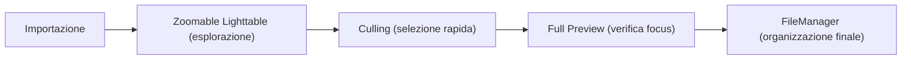

# Modalità della lighttable

La sezione **lighttable modes** definisce il modo in cui le immagini vengono visualizzate e navigate nel pannello centrale della vista Lighttable (Tavolo Luminoso). darktable offre quattro modalità distinte per adattarsi a diverse fasi del flusso di lavoro, dalla semplice organizzazione file alla selezione accurata (culling) e all'ispezione dei dettagli.[^lighttable-modes]

Il selettore delle modalità è situato nel pannello inferiore, accanto ai controlli di valutazione (stelle ed etichette colore).[^lighttable-view-layout]

## Panoramica

Le quattro modalità disponibili sono:[^lighttable-modes]

1.  **filemanager**: La visualizzazione predefinita a griglia, ottimizzata per la gestione ordinata dei file.
2.  **zoomable lighttable**: Un canvas infinito che permette di zoomare e navigare liberamente tra le miniature, ideale per esplorare grandi collezioni.
3.  **culling**: Una modalità dedicata alla rapida selezione e scarto delle immagini (spesso associata alla visualizzazione a schermo intero).
4.  **full preview**: Una funzione di sovrapposizione per ispezionare rapidamente un'immagine a pieno schermo o ingrandita senza lasciare la modalità corrente.

A differenza di Lightroom, dove la visualizzazione è fissa, darktable permette di cambiare radicalmente l'interazione con la libreria attraverso queste modalità, mantenendo sempre accessibili i filtri e le collezioni nei pannelli laterali.[^lighttable-view-layout]

## Flusso di lavoro consigliato

L'utilizzo delle modalità dipende dalla fase del processo DAM (Digital Asset Management) in cui ti trovi:

### Passo 1: Esplorazione con Zoomable Lighttable

Per navigare grandi set di immagini (es. dopo un importo massiccio), usa la modalità **zoomable lighttable**. Questo ti permette di avere una panoramica visiva più ampia rispetto alla semplice griglia del filemanager.[^zoomable-lighttable]

### Passo 2: Ispezione rapida con Full Preview

Durante la valutazione, invece di aprire ogni immagine nella vista Darkroom, usa la funzione **full preview** direttamente dalla Lighttable. Ti permette di verificare nitidezza ed esposizione in pochi secondi.[^full-preview]

!!! tip "Anteprima 'Sticky'"
    Se vuoi che l'anteprima rimanga fissa senza tenere premuto il tasto, attiva la modalità "sticky preview". Questo trasforma temporaneamente la vista in uno strumento simile alla modalità Culling, permettendoti di zoomare e spostarti nell'immagine.[^full-preview]

## Controlli e Parametri

Poiché le modalità di visualizzazione non sono moduli di elaborazione con slider, i loro "parametri" sono costituiti da interazioni con mouse, tastiera e comportamenti di navigazione specifici.

### Zoomable Lighttable

Questa modalità modifica il modo in cui interagisci con la griglia delle miniature:[^zoomable-lighttable]

| Controllo | Azione | Note |
|-----------|--------|------|
| **Mouse wheel** | Zoom in/out | In questa modalità lo scroll dello mouse zooma direttamente (nel filemanager invece scorre la lista).[^zoomable-lighttable] |
| **Trascinamento (Click sinistro + Drag)** | Naviga (Pan) | Ti sposti all'interno del canvas infinito. Trascinare sposta l'intera visualizzazione, non riordina le immagini.[^zoomable-lighttable] |
| **Click** o **Enter** | Seleziona immagine | Seleziona l'immagine sotto il cursore.[^zoomable-lighttable] |
| **Shift + Click** | Selezione intervallo | Seleziona un range di immagini dalla prima selezionata a quella corrente.[^zoomable-lighttable] |
| **Ctrl + Click** o **Spazio** | Aggiungi/Rimuovi dalla selezione | Modifica la selezione corrente senza deselezionare le altre.[^zoomable-lighttable] |

!!! warning "Limitazioni nell'ordinamento"
    Nella modalità *zoomable lighttable*, trascinare le miniature serve solo a navigare (pan) nella vista. Non è possibile modificare l'ordinamento personalizzato (*custom sort*) trascinando le immagini in questa modalità.[^zoomable-lighttable]

### Full Preview

Questa funzione è accessibile da qualsiasi modalità della Lighttable e agisce come una lente d'ingrandimento temporanea:[^full-preview]

| Tasto | Funzione | Dettagli |
|-------|----------|----------|
| **W (tieni premuto)** | Anteprima completamente ingrandita | Mostra l'immagine sotto il cursore a pieno schermo (o zoomata). Rilascia per tornare alla vista precedente.[^full-preview] |
| **Ctrl + W (tieni premuto)** | Anteprima Focus | Esegue lo zoom pieno e **identifica le regioni di nitidezza**. I bordi rossi indicano alta nitidezza, i bordi blu indicano nitidezza moderata. Richiede una JPEG incorporata nel file RAW (standard per la maggior parte dei RAW).[^full-preview] |
| **F** | Attiva/Disattiva Sticky Preview | Attiva l'anteprima permanente. Puoi zoomare e spostarti (come in Culling). Premi di nuovo **F** o **ESC** per uscire.[^full-preview] |

!!! info "Troubleshooting Full Preview"
    Se premendo **W** o **Ctrl+W** non succede nulla, prova a cliccare una volta sulla miniatura dell'immagine e riprova. A volte il focus dell'interfaccia può impedire l'attivazione immediata dell'anteprima.[^full-preview]

## Consigli

### Ottimizzazione delle performance

Se noti che le miniature sono lente a caricare mentre esegui lo zoom velocemente in modalità *zoomable lighttable*, puoi generare una cache anticipata di tutte le miniature usando lo strumento a riga di comando `darktable-generate-cache`. Questo renderà la navigazione molto più fluida, specialmente con collezioni numerose.[^zoomable-lighttable]

### Verifica del Focus

Utilizza la combinazione **Ctrl + W** per un controllo rapido del messa a fuoco durante il culling. I bordi colorati (rosso per alto dettaglio, blu per moderato) offrono un feedback visivo immediato superiore al semplice ingrandimento, permettendoti di scartare immagini mosse con sicurezza.[^full-preview]

### Hover vs Selezione

Nella modalità *zoomable lighttable*, passare il mouse sopra una miniatura (hover) la evidenzia e la seleziona implicitamente per le scorciatoie da tastiera (come assegnare stelle), proprio come nel filemanager. Tuttavia, poiché il trascinamento è usato per spostare la vista, fai attenzione a non confondere l'azione di spostamento del canvas con il tentativo di riordinare le immagini.[^zoomable-lighttable]

## Risorse

- [Guida utente darktable: Lighttable Modes](https://docs.darktable.org/usermanual/development/en/lighttable/lighttable-modes/#)
- [Guida utente darktable: Zoomable Lighttable](https://docs.darktable.org/usermanual/development/en/lighttable/lighttable-modes/zoomable-lighttable/)
- [Guida utente darktable: Full Preview](https://docs.darktable.org/usermanual/development/en/lighttable/lighttable-modes/full-preview/#)
- [Guida utente darktable: Lighttable View Layout](https://docs.darktable.org/usermanual/development/en/lighttable/lighttable-view-layout/#)

## Fonti

[^lighttable-modes]: darktable user manual - lighttable modes. https://docs.darktable.org/usermanual/development/en/lighttable/lighttable-modes/#
[^lighttable-view-layout]: darktable user manual - lighttable view layout. https://docs.darktable.org/usermanual/development/en/lighttable/lighttable-view-layout/#
[^zoomable-lighttable]: darktable user manual - zoomable lighttable. https://docs.darktable.org/usermanual/development/en/lighttable/lighttable-modes/zoomable-lighttable/
[^full-preview]: darktable user manual - full preview. https://docs.darktable.org/usermanual/development/en/lighttable/lighttable-modes/full-preview/#
