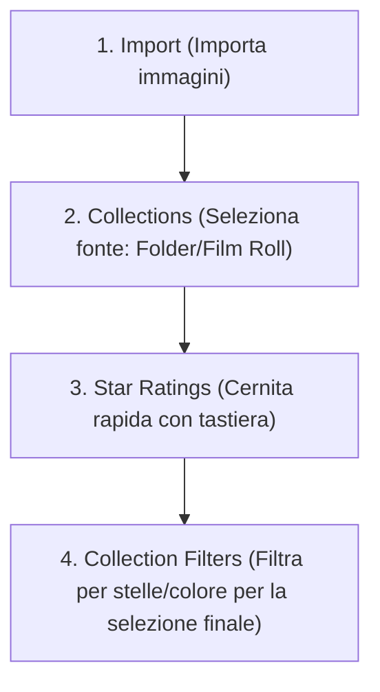

# Collezioni, raggruppamento e valutazioni

Il sistema di **Collections** (collezioni), **Grouping** (raggruppamento) e **Star Ratings** (valutazione a stelle) costituisce il cuore del Digital Asset Management (DAM) di darktable. A differenza di Lightroom, che usa un sistema di cartelle e collezioni statiche, darktable utilizza un approccio basato su regole dinamiche: una collezione non è un contenitore fisico, ma una vista filtrata del database basata su attributi come file, metadati, Exif e dati specifici di darktable.[^collections][^collections-film-rolls]

!!! info "Differenza con Lightroom"
    In darktable non "sposti" le foto in una collezione. Definisci dei criteri (es. "tutte le foto con 5 stelle scattate nel 2023") e il modulo **collections** mostra le immagini che corrispondono. Se un'immagine acquisisce quella proprietà, appare automaticamente nella collezione.[^collections]

## Panoramica

Il modulo **collections** permette di filtrare le immagini mostrate nella vista Lighttable e nel filmstrip utilizzando attributi immagine. Questo insieme filtrato è definito appunto come _collection_.[^collections]

Le funzionalità chiave includono:

1.  **Filtraggio dinamico**: Selezione tramite attributi (cartella, data, tag, Exif, ecc.).[^collections]
2.  **Star Ratings & Color Labels**: Sistema di classificazione da 0 a 5 stelle ed etichette colore (Rosso, Giallo, Verde, Blu, Viola) per cernite rapide.[^star-color]
3.  **Grouping**: Possibilità di raggruppare immagini (es. esposizioni bracketing o HDR) e filtrare in base all'attributo "group".[^collections]
4.  **Collection Filters**: Modulo separato per affinare la collezione corrente con filtri rapidi (es. range di valutazione) spesso fissati nel pannello superiore.[^collection-filters]

## Flusso di lavoro consigliato

Il flusso tipico per organizzare una sessione di riproduzione in darktable segue questi passi logici:[^collections][^star-color][^collection-filters]

### Passo 1: Definire la Collezione base

Utilizza il modulo **collections** nel pannello sinistro per selezionare le immagini su cui lavorare. La collezione predefinita è basata sull'attributo *film roll* (rullino film), che mostra tutte le immagini dell'ultima cartella importata.[^collections]

Puoi filtrare per:
*   **Folder**: Percorso del file system.
*   **Film Roll**: Raggruppamento per cartella di importazione.
*   **Capture Date/Time**: Data o ora di scatto.[^collections]

### Passo 2: Assegnazione Star Ratings e Color Labels

Una volta selezionata la collezione base (es. un intero servizio), esegui la cernita (culling) direttamente sulla griglia della Lighttable o nel filmstrip:[^star-color]

*   **Valutazione a stelle**: Premi i tasti numerici `0` - `5` per assegnare da 0 a 5 stelle.
*   **Reject**: Premi `R` per scartare un'immagine (contrassegnata come rifiutata).
*   **Color Labels**: Premi i tasti funzione `F1` (Rosso), `F2` (Giallo), `F3` (Verde), `F4` (Blu), `F5` (Viola) per etichettare.

!!! tip "Selezione multipla"
    Puoi valutare più immagini contemporaneamente. Seleziona le immagini nella Lighttable o nel filmstrip, quindi premi il tasto di scelta rapida appropriato o clicca sul widget di valutazione nel pannello inferiore.[^star-color]

### Passo 3: Affinare con Collection Filters

Dopo aver assegnato i voti, usa il modulo **collection filters** (spesso nel pannello superiore) per visualizzare solo le migliori. Ad esempio, imposta un filtro *range rating* per mostrare solo le immagini con 3 stelle o più.[^collection-filters]

## Parametri del modulo Collections

Il modulo **collections** è il punto centrale per definire quali immagini sono visibili.

### Definizione dei criteri di filtro

La parte superiore del modulo definisce i criteri di base:[^collections]

| Parametro | Descrizione |
|-----------|-------------|
| **Image attribute** | Menu a tendina per scegliere l'attributo (es. *folder*, *tag*, *camera*, *rating*). |
| **Search pattern** | Campo di testo per inserire il pattern di corrispondenza. Usa `%` come carattere jolly (wildcard). Per attributi numerici o date, usa operatori come `<`, `<=`, `>`, `>=`, `=`, `<>` o range `[da;a]`. |
| **Select by value** | Lista dei valori presenti nelle immagini attualmente corrispondenti. Doppio clic per selezionare. |

### Attributi di filtraggio (Filtering Attributes)

Il modulo supporta diverse categorie di attributi per costruire la collezione:[^collections]

*   **Files**: `film roll`, `folder`, `filename`.
*   **Metadata**: `tag`, `title`, `description`, `creator`, `publisher`, `rights`, `notes`, `version name`, `rating`, `color label`.
*   **Times**: `capture date`, `capture time`, `import time`, `modification time`, `export time`, `print time`.
*   **Capture details**: `camera`, `lens`, `aperture`, `exposure`, `exposure bias`, `focal length`, `ISO`, `aspect ratio`, `white balance`, `flash`, `exposure program`, `metering mode`.
*   **Darktable**: `group` (per raggruppare immagini), `local copy`, `history`, `module`, `module order`.

### Combinazione di filtri (Logica)

Cliccando sull'icona espander (solitamente a destra del campo di ricerca), puoi aggiungere regole combinandole con operatori logici:[^collections]

*   **Narrow down search (AND)**: Restringe la ricerca. L'immagine deve soddisfare il nuovo criterio E i precedenti.
*   **Add more images (OR)**: Aggiunge immagini. L'immagine deve soddisfare il nuovo criterio OPPURE i precedenti.
*   **Exclude images (EXCEPT)**: Esclude le immagini che soddisfano il nuovo criterio.

## Parametri: Star Ratings & Color Labels

Questi parametri controllano l'assegnazione delle etichette e il loro comportamento.

### Star Ratings

| Caratteristica | Descrizione |
|----------------|-------------|
| **Range** | Da 0 a 5 stelle. È possibile marcare come "rejected" (rifiutato).[^star-color] |
| **Reset** | Cliccando la prima stella una seconda volta si resetta la valutazione (o premendo il tasto `0`). Questo comportamento può essere modificato nelle preferenze.[^star-color] |
| **Reject** | Premendo `R` si rifiuta l'immagine. Rimuove la valutazione a stelle attuale. Premendo di nuovo `R` si annulla il rifiuto.[^star-color] |

### Color Labels

| Caratteristica | Descrizione |
|----------------|-------------|
| **Colori disponibili** | Red, Yellow, Green, Blue, Purple.[^star-color] |
| **Assegnazione** | Tasti funzione `F1` a `F5`.[^star-color] |
| **Comportamento multi-immagine** | Selezionando più immagini, l'etichetta viene aggiunta a tutte se *almeno una* non ce l'ha; viene rimossa da tutte se *tutte* ce l'hanno già. Il pulsante grigio rimuove tutte le etichette.[^star-color] |

## Parametri del modulo Collection Filters

Questo modulo permette di affinare la collezione definita nel modulo **collections** con widget specifici, spesso fissati (pinned) al pannello superiore per accesso rapido.[^collection-filters]

### Widget principali

*   **Color labels**: Interfaccia grafica per filtrare per colore. Clicca per includere, `Ctrl+clic` per escludere. Tasto `AND` (immagini con tutte le etichette selezionate) o `OR` (almeno una).[^collection-filters]
*   **Range rating**: Widget a slider per selezionare un range di stelle (es. 3-5). Trascina per definire l'intervallo. Clic destro per opzioni predefinite.[^collection-filters]
*   **Numeric attributes (Aperture, ISO, etc.)**: Istogramma interattivo. Trascina per selezionare il range di valori (es. ISO 100-800). Campi min/max per inserimento manuale.[^collection-filters]
*   **Date attributes**: Widget range per date. Formato `YYYY:MM:DD HH:MM:SS`. Supporta keyword `now` e valori relativi (es. `+0000:01`).[^collection-filters]

### Ordinamento (Sorting)

La parte inferiore del modulo definisce l'ordine delle immagini:[^collection-filters]

*   **Sort order**: Criterio di ordinamento (es. *import time*, *rating*, *custom sort*).
*   **Ascending/Descending**: Direzione dell'ordinamento.
*   **Custom sort**: Permette di riordinare le immagini trascinandole nella vista Lighttable.
    *   *Attenzione*: L'ordinamento personalizzato è perso se le immagini vengono rimosse o se i tag vengono staccati (l'ordine non è salvato nei file sidecar). "Undo" non funziona per il drag-and-drop di riordinamento.[^collection-filters]

## Consigli

!!! tip "Aggiornamento percorsi spostati"
    Se hai spostato o rinominato cartelle fuori da darktable, non perdere le modifiche. Nel modulo **collections**, seleziona l'attributo *folder* o *film roll* (verranno mostrati barrati se mancanti), clic col destro e scegli **"update path to files..."** per indicare la nuova posizione.[^collections]

!!! warning "Attenzione al Custom Sort"
    Evita di usare "Custom Sort" per collezioni basate su tag con wildcard (`*` o `%`), poiché il riordinamento potrebbe non funzionare come previsto o applicarsi solo al primo tag corrispondente.[^collection-filters]

!!! info "Filtri fissati (Pinned Filters)"
    I filtri predefiniti nel pannello superiore sono "fissati" e non possono essere rimossi o disattivati accidentalmente. Usa il tasto reset del modulo per ripristinare i filtri non fissati. `Ctrl+clic` sul reset rimuove anche quelli fissati.[^collection-filters]

## Risorse

*   [darktable user manual - collections & film rolls](https://docs.darktable.org/usermanual/development/en/lighttable/digital-asset-management/collections/)
*   [darktable user manual - collections module](https://docs.darktable.org/usermanual/development/en/module-reference/utility-modules/shared/collections/)
*   [darktable user manual - star ratings & color labels](https://docs.darktable.org/usermanual/development/en/lighttable/digital-asset-management/star-color/)
*   [darktable user manual - collection filters](https://docs.darktable.org/usermanual/development/en/module-reference/utility-modules/shared/collection-filters/)

## Fonti

[^collections]: darktable user manual - collections module. URL: https://docs.darktable.org/usermanual/development/en/module-reference/utility-modules/shared/collections/#
[^collections-film-rolls]: darktable user manual - collections & film rolls. URL: https://docs.darktable.org/usermanual/development/en/lighttable/digital-asset-management/collections/
[^star-color]: darktable user manual - star ratings & color labels. URL: https://docs.darktable.org/usermanual/development/en/lighttable/digital-asset-management/star-color/#
[^collection-filters]: darktable user manual - collection filters. URL: https://docs.darktable.org/usermanual/development/en/module-reference/utility-modules/shared/collection-filters/
