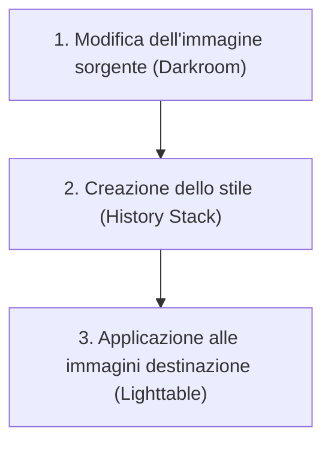

# Stili e copia della cronologia

Il modulo **styles** e le funzionalità correlate nel modulo **history stack** sono gli strumenti principali per replicare le modifiche tra più immagini in darktable. A differenza dei semplici preset di altri software, gli *styles* in darktable salvano l'intera *history stack* (la sequenza di modifiche), permettendo di applicare complesse elaborazioni non distruttive con un singolo clic o una scorciatoia da tastiera.[^styles-man]

Gli *styles* sono salvati come file `.dtstyle` (formato XML) nella directory di configurazione dell'utente e possono includere non solo i valori dei parametri, ma anche lo stato attivo o disattivo di ogni modulo.[^styles-man][^config-dir]

## Panoramica

La gestione degli *styles* in darktable avviene principalmente attraverso due punti d'accesso:

1.  **Modulo styles** (nel pannello destro del **Lighttable**): Permette di gestire, applicare, importare ed esportare gli stili esistenti. È il centro di controllo per l'applicazione batch delle modifiche.[^styles-man]
2.  **Modulo history stack** (nel pannello sinistro della **Darkroom**): Permette di creare un nuovo stile basato sulle modifiche dell'immagine corrente e di visualizzare la cronologia delle operazioni.[^history-stack]

Gli stili supportano una struttura gerarchica utilizzando il simbolo della pipe `|` nel nome (ad esempio `wedding|warm|high-contrast`), creando categorie e sottocategorie per un'organizzazione avanzata.[^styles-man]

!!! info "Stili predefiniti e Camera Styles"
    darktable fornisce una vasta selezione di stili "camera" progettati per approssimare il look JPEG della fotocamera per i modelli supportati, raggruppati sotto "darktable camera styles". È possibile applicarli automaticamente all'importazione usando script Lua dedicati.[^styles-man]

## Flusso di lavoro consigliato

Il flusso tipico per creare e applicare uno stile (copy history) prevede tre fasi:[^styles-man][^history-stack]

### Passo 1: Creazione dello stile dalla History Stack

Una volta soddisfatto dell'editing di un'immagine nella Camera Oscura:

1.  Apri il modulo **history stack**.
2.  Clicca sul pulsante **create style** (a destra di "compress history stack").
3.  Nella finestra di dialogo, assegna un nome univoco (puoi usare `|` per le categorie).
4.  Seleziona specificamente quali elementi della *history stack* includere. Puoi anche scegliere di resettare un modulo (includerlo nello stile ma con i valori predefiniti).
5.  Salva lo stile.[^history-stack][^styles-man]

!!! tip "Creare stili di default personalizzati"
    Poiché gli stili includono lo stato attivo/disattivo dei moduli, puoi creare i tuoi "default". Imposta i tuoi parametri ideali, disabilita i moduli che non vuoi attivare automaticamente, e salva tutto come stile. Applicandolo, riporterai l'immagine nel tuo stato di partenza preferito.[^styles-man]

### Passo 2: Applicazione nel Lighttable

Per applicare lo stile ad altre immagini:

1.  Seleziona le immagini destinazione nel **Lighttable**.
2.  Nel modulo **styles**, individua lo stile desiderato (puoi usare la barra di ricerca).
3.  **Applicazione**: Doppio clic sul nome dello stile oppure usa la scorciatoia da tastiera assegnata nelle preferenze.[^styles-man]
4.  Sposta il mouse sul nome dello stile per vedere un'anteprima rapida (tooltip) sulla prima immagine selezionata, se abilitata.[^styles-man]

### Passo 3: Scelta della modalità di applicazione

Prima di applicare, controlla le opzioni nel modulo **styles**:[^styles-man]

-   **create duplicate**: Se spuntato, crea un duplicato dell'immagine (un'istanza virtuale nel database) prima di applicare lo stile. L'originale rimane invariato.
-   **mode**:
    -   *append*: Aggiunge lo stile alla cronologia esistente dell'immagine.
    -   *overwrite*: Sovrascrive la cronologia esistente con quella contenuta nello stile.

!!! warning "Attenzione alla sovrascrittura"
    Se usi la modalità **overwrite** senza aver spuntato "create duplicate", la *history stack* precedente dell'immagine andrà persa e non sarà recuperabile (salvo usando annulla o backup del database).[^styles-man]

## Parametri principali

I controlli sono divisi tra il modulo **styles** (Lighttable) e le funzioni di creazione nel modulo **history stack** (Darkroom).

### Modulo Styles (Lighttable)

| Parametro | Descrizione |
|-----------|-------------|
| **hide preview** | Checkbox per nascondere l'anteprima nel tooltip. Utile su computer lenti per evitare rallentamenti durante il rendering dell'anteprima.[^styles-man] |
| **create duplicate** | Se attivo, crea un duplicato dell'immagine prima di applicare lo stile. Se inattivo, lo stile viene applicato direttamente all'immagine selezionata.[^styles-man] |
| **mode** | Combobox per scegliere la modalità di applicazione: *append* (aggiunge) o *overwrite* (sovrascrive) la history stack.[^styles-man] |
| **create** | Apre la finestra di dialogo per creare nuovi stili basati sull'immagine selezionata. Richiede un nome univoco e permette di selezionare quali item includere.[^styles-man] |
| **edit** | Apre una finestra per modificare i contenuti di uno stile esistente (includere/escludere item). Offre l'opzione "duplicate" per creare un nuovo stile invece di sovrascrivere quello esistente.[^styles-man] |
| **remove** | Rimuove lo stile selezionato senza ulteriori richieste di conferma.[^styles-man] |
| **import** | Importa uno stile precedentemente salvato (file `.dtstyle`). Se esiste un omonimo, chiede se sovrascrivere.[^styles-man] |
| **export** | Esporta lo stile selezionato su disco come file `.dtstyle` per la condivisione.[^styles-man] |

### Modulo History Stack (Darkroom)

| Parametro | Descrizione |
|-----------|-------------|
| **compress history stack** | Genera la history stack più breve possibile che riproduce l'immagine attuale. Scarta le modifiche sopra il punto selezionato. Se tenuto premuto **Ctrl**, tronca la history senza comprimerla (scarta i moduli sopra lasciando il resto invariato).[^history-stack] |
| **create style** | Pulsante per creare un nuovo stile dalla history stack dell'immagine corrente. Apre una finestra per nominare lo stile e selezionare i moduli da includere.[^history-stack] |
| **reset parameters** | Scarta l'intera history stack e riattiva i moduli predefiniti. Equivale a selezionare l'item "original image" e comprimere lo stack.[^history-stack] |

### Creazione stili via darktable-chart

Lo strumento a riga di comando `darktable-chart` permette di creare stili da coppie di immagini RAW+JPEG o file di misurazione colori.[^darktable-chart]

-   **Comando**: `darktable-chart --csv <csv file> <number patches> <output dtstyle file>`
-   **Parametri**:
    -   `<csv file>`: File CSV salvato precedentemente.
    -   `<number patches>`: Numero di patch colori da utilizzare nelle impostazioni della tabella di lookup (LUT) dello stile creato.
    -   `<output dtstyle file>`: Nome del file stile di output.[^darktable-chart]

## Consigli

-   **Organizzazione gerarchica**: Usa il separatore pipe `|` per creare strutture tipo `Landscape|Tone Curve|Contrast +0.5`. Questo crea una categoria "Landscape" con una sottocategoria "Tone Curve".[styles-man]
-   **Anteprima performance**: Se lavori su un hardware lento, attiva **hide preview** nel modulo styles per evitare che il rendering dell'anteprima rallenti la navigazione tra gli stili.[^styles-man]
-   **Sicurezza prima di tutto**: Quando applichi stili distruttivi o sperimentali a un set di immagini, usa sempre l'opzione **create duplicate**. Questo preserva l'originale e crea una nuova versione con lo stile applicato.[^styles-man]
-   **Reset selettivo**: Durante la creazione di uno stile, puoi scegliere di "resetare" un modulo. Questo è utile se vuoi che lo stile attivi quel modulo ma con i suoi valori di fabbrica, pulendo eventuali modifiche precedenti non volute.[^styles-man]

## Risorse aggiuntive

-   [darktable user manual - styles](https://docs.darktable.org/usermanual/development/en/module-reference/utility-modules/lighttable/styles/)
-   [darktable user manual - history stack](https://docs.darktable.org/usermanual/development/en/module-reference/utility-modules/darkroom/history-stack/#)
-   [darktable user manual - darktable-chart](https://docs.darktable.org/usermanual/development/en/special-topics/program-invocation/darktable-chart/#)

## Fonti

[^styles-man]: darktable user manual - styles (darktable-usermanual-en). https://docs.darktable.org/usermanual/development/en/module-reference/utility-modules/lighttable/styles/
[^history-stack]: darktable user manual - history stack (darktable-usermanual-en). https://docs.darktable.org/usermanual/development/en/module-reference/utility-modules/darkroom/history-stack/#
[^config-dir]: darktable user manual - configuration directory (darktable-usermanual-en). https://docs.darktable.org/usermanual/development/en/preferences-settings/config-directory/
[^darktable-chart]: darktable user manual - darktable-chart (darktable-usermanual-en). https://docs.darktable.org/usermanual/development/en/special-topics/program-invocation/darktable-chart/#
