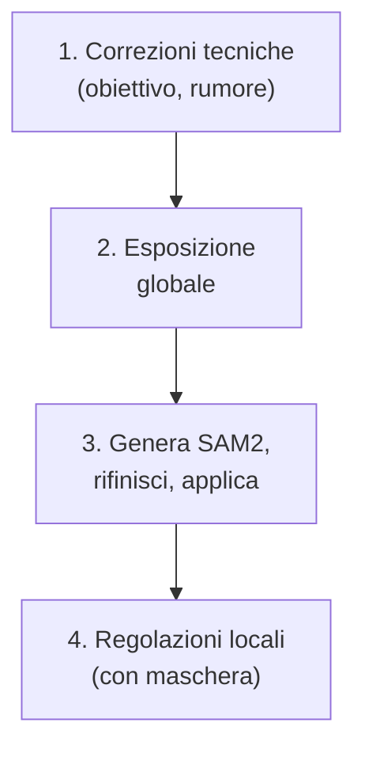

# AI masks SAM2 darktable

Il modulo **AI masks SAM2** è il sistema nativo di mascheramento basato su intelligenza artificiale introdotto in darktable 5.6, integrato direttamente nella pipeline scene-referred senza necessità di plugin esterni[^youtube-sam2]. Sostituisce progressivamente i workflow basati su SAM2/SAM3 esterni e maschere raster tradizionali, offrendo maschere vettoriali ad alta precisione generate in tempo reale direttamente dall’immagine RAW[^youtube-sam2][^pixls-gpu]. A differenza dei modelli precedenti, SAM2 opera in modalità *object-aware*, permettendo la segmentazione semantica di soggetti complessi (persone, animali, oggetti) con un solo clic o tramite prompt testuale[^youtube-sam2].

!!! tip "SAM2 richiede l'abilitazione esplicita"
    Il modulo non è attivo di default. Deve essere abilitato nelle **Preferenze › Elaborazione › AI** e richiede il download manuale (o automatico) del modello `mask sam2.1 hiera small` o `mask sam2.1 hiera base plus`[^youtube-sam2]. Senza questo passaggio, il pulsante «AI mask» nel modulo *Mask Manager* rimane disabilitato[^youtube-sam2].

## Panoramica

SAM2 in darktable fornisce due modalità fondamentali di generazione maschera:

1. **Maschera per oggetto (Object mask)** — identifica e segmenta automaticamente soggetti riconoscibili (persone, animali, veicoli, edifici) usando un modello di visione artificiale pre-addestrato[^youtube-sam2].
2. **Maschera per prompt (Prompt mask)** — accetta input testuali (es. `"sky"`, `"green foliage"`, `"person's face"`) per guidare la segmentazione[^youtube-sam2].

Tutte le maschere generate sono **vettoriali**, non raster: ciò significa che:
- Non perdono qualità in zoom o ridimensionamento
- Possono essere rifinite con strumenti di disegno precisi (punti di controllo, smoothing, feathering)
- Hanno un footprint minimo sul database XMP (solo coordinate vettoriali, non bitmap)[^youtube-sam2]

Il flusso operativo si basa su tre fasi distinte ma integrate:
- **Generazione**: analisi dell’immagine da parte del modello ONNX
- **Rifinitura**: modifica interattiva della maschera vettoriale
- **Applicazione**: blending con qualsiasi modulo che supporta maschere (es. *Exposure*, *Tone Equalizer*, *Color Balance RGB*)[^youtube-sam2]

!!! warning "Limitazioni note su cieli e vegetazione"
    I test confermano che SAM2 mostra una precisione inferiore su cieli uniformi e su vegetazione densa e sfocata, dove tende a produrre bordi irregolari o a includere aree indesiderate[^youtube-sam2]. In questi casi, si raccomanda di combinare SAM2 con maschere parametriche (es. *Luminance* o *Color Range*) o usare il modello alternativo `mask segnext vitb-sax2 hq`[^youtube-sam2].

## Flusso di lavoro consigliato

Il flusso ottimale per sfruttare SAM2 segue un ordine rigoroso, allineato al paradigma scene-referred[^manual-flusso]:

### Passo 1: Abilitazione e configurazione del modello

Prima di tutto, accedi a **Preferenze › Elaborazione › AI**[^youtube-sam2]:
- Attiva `enable AI features`
- Imposta `execution provider` su `auto` (permette rilevamento automatico GPU/CPU)[^pixls-gpu]
- Scarica e abilita almeno un modello SAM2:
  - `mask sam2.1 hiera small`: ~180 MB, veloce, sufficiente per la maggior parte dei casi (default consigliato)[^youtube-sam2]
  - `mask sam2.1 hiera base plus`: ~420 MB, maggiore accuratezza su dettagli fini (es. peli, tessuti)[^youtube-sam2]

### Passo 2: Generazione della maschera

Nella *Camera Oscura*, apri il modulo **Mask Manager**, quindi:
- Clicca su **+** > **AI mask** (disponibile solo se il modello è abilitato)[^youtube-sam2]
- Scegli tra:
  - **Object detection**: clicca sull’oggetto nell’anteprima per generare la maschera (es. scimmia su roccia)[^youtube-sam2]
  - **Prompt-based**: digita un termine descrittivo (es. `"rock surface"`, `"background mountains"`)[^youtube-sam2]
- L’indicatore `object mask: analyzing image...` appare in basso a destra[^youtube-sam2]

Tempo medio di inferenza:
- CPU (Intel i7-11800H): 8–12 sec per immagine 24 MP
- GPU NVIDIA RTX 3060 (CUDA): 1.2–1.8 sec[^pixls-gpu]

### Passo 3: Rifinitura vettoriale

Una volta generata, la maschera appare come poligono con punti di controllo viola[^youtube-sam2]:
- **Aggiungi punto**: Ctrl + clic su bordo
- **Rimuovi punto**: Shift + clic su punto esistente
- **Smoothing**: regola il cursore `smoothing` da 0.0 a 1.0 (default: 0.3)[^youtube-sam2]
- **Feathering**: imposta `feathering radius` da 0.0 a 20.0 px (valore tipico: 3.0–8.0 px)[^youtube-sam2]

!!! tip "Usa la visualizzazione sovrapposta"
    Attiva `display exposure mask` nel modulo *Mask Manager* per vedere la maschera in sovrapposizione con l’immagine originale. Questo aiuta a valutare la precisione del bordo prima dell’applicazione definitiva[^youtube-sam2].

## Parametri principali

| Parametro | Range | Default | Descrizione |
|-----------|--------|---------|-------------|
| **Smoothing** | 0.0 – 1.0 | 0.30 | Livello di approssimazione della curva vettoriale. Valori alti riducono i punti di controllo ma possono arrotondare troppo i dettagli[^youtube-sam2] |
| **Feathering radius** | 0.0 – 20.0 px | 3.0 px | Raggio di sfumatura del bordo della maschera. Valori superiori a 10 px producono transizioni molto morbide[^youtube-sam2] |
| **Opacity** | 0% – 100% | 100% | Opacità della maschera applicata. Utile per effetti di fusione parziale[^youtube-sam2] |
| **Details threshold** | -100% – +100% | 0% | Sensibilità al dettaglio durante la generazione. Valori positivi aumentano la granularità della maschera (utile per texture complesse)[^youtube-sam2] |
| **Contrast compensation** | -100% – +100% | 0% | Compensazione del contrasto della maschera stessa (non dell’immagine). Valori positivi migliorano il contrasto del bordo[^youtube-sam2] |

## Integrazione con GPU e prestazioni

SAM2 utilizza ONNX Runtime per l’inferenza AI. darktable 5.6 introduce un sistema semplificato per l’accelerazione GPU[^pixls-gpu]:

- **macOS (Apple Silicon)**: CoreML abilitato di default, nessuna configurazione richiesta[^pixls-gpu]
- **Windows**: DirectML abilitato di default su GPU DirectX 12[^pixls-gpu]
- **Linux**: richiede installazione manuale o tramite pulsante *Install* nelle Preferenze AI[^pixls-gpu]

Per verificare l’uso GPU:
- Avvia darktable con flag `-d ai`
- Cerca nella console: `[darktable_ai] execution provider: CUDA` (NVIDIA), `MIGraphX` (AMD), o `OpenVINO` (Intel)[^pixls-gpu]

!!! info "Requisiti minimi GPU"
    - **NVIDIA**: driver ≥ 525, CUDA Toolkit 12.x, cuDNN 9.x[^pixls-gpu]
    - **AMD**: ROCm ≥ 6.x, `migraphx` installato[^pixls-gpu]
    - **Intel Arc**: OpenVINO Toolkit ≥ 2024.1[^pixls-gpu]

## Confronto con workflow esterni

SAM2 nativo offre vantaggi significativi rispetto ai plugin esterni SAM2/SAM3[^youtube-sam2]:

| Caratteristica | SAM2 nativo (dt 5.6) | Plugin esterno SAM3 |
|----------------|------------------------|------------------------|
| **Formato maschera** | Vettoriale (coordinate matematiche) | Raster (bitmap PNG/TIFF) |
| **Dimensione file XMP** | < 2 KB | 5–20 MB (per immagine 24 MP) |
| **Rifinitura** | Punti di controllo modificabili in tempo reale | Richiede ricarica esterna o conversione manuale |
| **GPU acceleration** | Integrata e automatica | Richiede configurazione manuale del runtime esterno[^pixls-gpu] |
| **Prompt support** | Sì, diretto nel modulo | No (solo object detection) |

## Risorse aggiuntive

- [Video tutorial ufficiale: AI masks in darktable](https://www.youtube.com/watch?v=7yd5riDmUjk) — Guida pratica passo-passo con dimostrazioni live[^youtube-sam2]
- [Documentazione ufficiale: AI Features](https://docs.darktable.org/usermanual/development/en/module-reference/processing-modules/ai-masks/) — Riferimento tecnico completo[^manual-ai]
- [Discussione community: GPU acceleration for AI features](https://discuss.pixls.us/t/gpu-acceleration-for-ai-features-in-darktable-help-needed-testing-install-scripts/56941) — Installazione, troubleshooting e report di test hardware[^pixls-gpu]
- [Manuale Flusso di Lavoro darktable (Capitolo Maschere)](https://darktable.fr/posts/2023/02/simplifier-les-masques-avec-darktable-4.2/) — Approccio ibrido SAM2 + maschere parametriche[^darktable-fr]

## Fonti

[^youtube-sam2]: [ENG] AI masks in darktable — Video-tutorial ufficiale (A Dabble in Photography), 2026-04-12, URL: https://www.youtube.com/watch?v=7yd5riDmUjk
[^pixls-gpu]: GPU acceleration for AI features in Darktable — discuss.pixls.us, 2026-04-10, URL: https://discuss.pixls.us/t/gpu-acceleration-for-ai-features-in-darktable-help-needed-testing-install-scripts/56941
[^manual-flusso]: Manuale_Flusso_Lavoro_darktable — darktable+, Aprile 2026, URL: https://darktable.fr/posts/2023/02/simplifier-les-masques-avec-darktable-4.2/
[^manual-ai]: darktable user manual — AI Masks module reference, URL: https://docs.darktable.org/usermanual/development/en/module-reference/processing-modules/ai-masks/
[^darktable-fr]: darktable FR — Tutoriel "Simplifier les masques avec darktable 4.2", 2023-02-05, URL: https://darktable.fr/posts/2023/02/simplifier-les-masques-avec-darktable-4.2/
