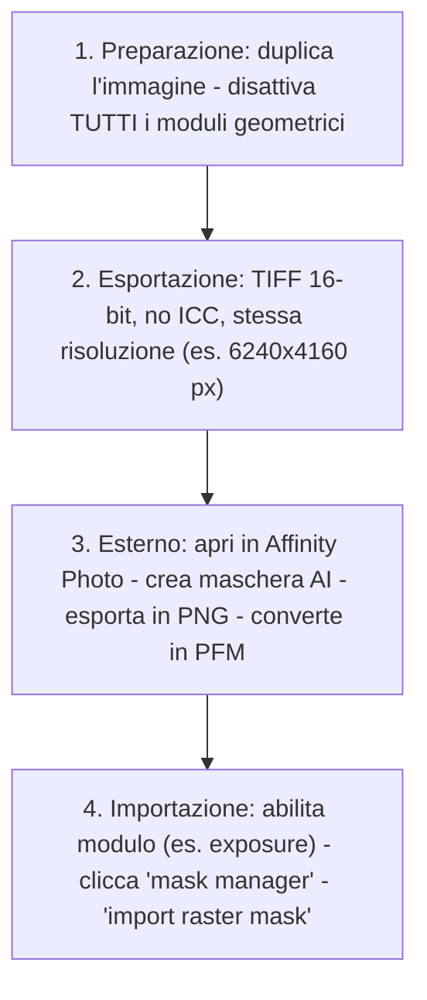

# Raster Masks: External Plugins

Il modulo **raster masks external plugins** non è un singolo modulo nativo di darktable, ma una *categoria funzionale* che descrive il flusso di lavoro per importare, convertire e applicare maschere raster generate esternamente (es. con AI tools come SAM2/SAM3, Affinity Photo o Photoshop) nel pipeline di elaborazione di darktable 5.4+[^raster-manual][^external-masks-video]. Questo workflow consente di sfruttare algoritmi di segmentazione avanzati non disponibili nativamente, integrandoli in modo non distruttivo nella pipeline scene-referred[^ai-subsystem-pr].

!!! info "Raster mask ≠ vettoriale"
    Una *raster mask* è un'immagine in scala di grigi (8/16 bit), dove ogni pixel ha un valore di opacità da 0.0 (trasparente) a 1.0 (opaco). A differenza delle maschere vettoriali (disegnate o AI-integrate), non è scalabile senza perdita di qualità e richiede un formato specifico: **PFM (Portable FloatMap)** per preservare la precisione floating-point necessaria alla pipeline scene-referred[^raster-manual][^external-masks-video].

## Panoramica

Le maschere raster esterne sono utilizzate principalmente per:

1. **Segmentazione AI avanzata**: isolamento preciso di soggetti complessi (capelli, pelliccia, foglie) tramite modelli come SAM2/SAM3, Light HQ-SAM o Segment Anything[^ai-subsystem-pr][^external-masks-video]  
2. **Controllo locale fine**: applicazione di regolazioni solo su aree definite con precisione sub-pixel, impossibile con maschere parametriche native[^raster-manual]  
3. **Integrazione con tool professionali**: uso di maschere create in Affinity Photo, Photoshop o GIMP, dove si dispone di strumenti di ritocco manuale superiori[^external-masks-video]

Il processo si articola in **quattro fasi obbligatorie**, tutte critiche per il successo finale[^external-masks-video]:

- ✅ Preparazione dell’immagine base (nessuna trasformazione geometrica)  
- ✅ Esportazione in TIFF/PNG a dimensioni identiche all’originale  
- ✅ Creazione della maschera esterna e conversione in **PFM**  
- ✅ Importazione e assegnazione come *raster mask* in un modulo attivo  

!!! warning "Errore comune: trasformazioni geometriche"
    Qualsiasi operazione di `crop`, `rotate`, `lens correction` o `perspective` prima dell’esportazione **invalida la maschera**. La maschera PFM deve corrispondere pixel-per-pixel all’immagine RAW originale, altrimenti si verificano shift, stretching o clipping catastrofici[^external-masks-video].

## Flusso di lavoro consigliato

Il workflow standard, dimostrato in [A Dabble in Photography](https://www.youtube.com/watch?v=7sOAxcNaP4M), è il seguente[^external-masks-video]:

### Passo 1: Preparazione dell’immagine base

Prima di esportare, devi garantire che l’immagine sia “pulita” dal punto di vista geometrico:

- ✅ Abilita `duplicate manager` e crea un duplicato dedicato alle maschere  
- ✅ Disattiva **tutti** i moduli geometrici: `crop`, `orientation`, `lens correction`, `rotate and perspective`[^external-masks-video]  
- ✅ Evita modifiche cromatiche aggressive (es. `color balance rgb` con `highlights = -25%`) che alterano la percezione AI[^external-masks-video]  
- ❌ Non usare `velvia`, `LUT 3D` o `tone equalizer` prima dell’esportazione — possono confondere gli algoritmi esterni  

### Passo 2: Esportazione in TIFF/PNG

L’esportazione deve rispettare questi vincoli tecnici[^external-masks-video]:

| Parametro | Valore richiesto | Perché |
|-----------|------------------|--------|
| **Formato** | TIFF (preferito) o PNG | Conserva profondità bit e dimensioni esatte[^external-masks-video] |
| **Risoluzione** | Identica all’originale (es. `6240×4160 px`) | Mismatch causa shift della maschera[^external-masks-video] |
| **Colore** | No ICC profile embedded | Profili esterni possono alterare la luminanza interpretata da SAM[^external-masks-video] |
| **Bit depth** | 16-bit per TIFF, 8-bit per PNG | Maggiore precisione per la successiva conversione PFM[^external-masks-video] |

!!! tip "Suggerimento pratico: usa 'Affinity Photo' come editor esterno"
    Configura `external editors` in darktable con Affinity Photo come programma predefinito. Il flusso “Edit → Refine Selection → Export PNG” è testato e affidabile[^external-masks-video].

### Passo 3: Conversione in PFM

La maschera deve essere convertita in **PFM (Portable FloatMap)**, non in JPG, WEBP o TIFF compresso[^raster-manual][^external-masks-video]. Il formato PFM supporta float32 e mantiene la gamma dinamica necessaria alla pipeline scene-referred.

- ✅ Strumenti raccomandati:  
  - `ImageMagick`: `magick input.png -depth 32 -define quantum:format=floating-point output.pfm`  
  - `ffmpeg`: `ffmpeg -i input.png -pix_fmt grayf32le -f rawvideo output.pfm`  
- ❌ Non usare strumenti che introducono gamma o tonemapping (es. GIMP con “convert to sRGB”)  

### Passo 4: Importazione in darktable

Una volta ottenuto il file `.pfm`, procedi così[^external-masks-video]:

1. Apri l’immagine duplicata in `darkroom`  
2. Attiva un modulo che supporta le maschere (es. `exposure`, `color calibration`, `tone equalizer`)  
3. Clicca l’icona **mask manager** (a sinistra) → `+` → `import raster mask`  
4. Seleziona il file `.pfm` → conferma  
5. Nella sezione *mask blending*, seleziona la maschera appena importata dal menu a tendina  

La maschera apparirà come un’opzione nel combobox “raster mask”, con nome derivato dal file (es. `sky_mask.pfm`)[^raster-manual].

## Parametri principali (in fase di utilizzo)

Una volta importata, la maschera raster viene gestita tramite i controlli standard di blending, accessibili dal modulo attivo[^raster-manual]:

| Parametro | Range | Default | Descrizione |
|-----------|-------|---------|-------------|
| **Opacity** | 0–100% | 100% | Opacità globale della maschera (non modifica il file PFM) |
| **Feathering radius** | 0.0–200.0 px | 0.0 px | Sfumatura del bordo della maschera (in pixel, non %) |
| **Blurring radius** | 0.0–200.0 px | 0.0 px | Diffusione gaussiana della maschera (usa con cautela: può ridurre precisione) |
| **Details threshold** | -100% to +100% | 0% | Regola la sensibilità ai dettagli fini nella maschera (valori positivi aumentano il contrasto interno della maschera) |
| **Combine masks** | `exclusive`, `inclusive`, `additive`, `subtractive` | `exclusive` | Modalità di combinazione con altre maschere attive nello stesso modulo[^raster-manual] |

!!! warning "Feathering radius > 0.0 px è rischioso"
    Un valore superiore a `5.0 px` può causare **halo artifacts** visibili intorno ai bordi, specialmente su maschere ad alta frequenza (capelli, foglie). Usa `feathering radius = 0.0` e preferisci il `details threshold` per affinare i bordi[^external-masks-video].

## Integrazione con maschere AI native (darktable 5.6+)

A partire da darktable 5.6, le maschere raster esterne possono essere **vettorizzate** tramite lo strumento integrato `ras2vect`, parte del subsystem AI[^ai-subsystem-pr]. Questo permette di:

- Convertire una maschera PFM in un percorso Bézier editabile  
- Applicare smoothing, feathering e scaling senza perdita di qualità  
- Combinare maschere raster e vettoriali nello stesso modulo  

Il processo è accessibile tramite `mask manager` → `convert to vector` dopo aver importato la PFM[^ai-subsystem-pr].

## Consigli avanzati

- **Usa due istanze dello stesso modulo**: es. due `exposure`, una per il cielo (con maschera raster `sky.pfm`) e una per il primo piano (con `ground.pfm`). Questo evita conflitti di blending[^landscape-ai-video]  
- **Nominare i file PFM in modo descrittivo**: `tree_highlight_6240x4160.pfm`, non `mask1.pfm` — il nome appare nel menu a tendina[^external-masks-video]  
- **Verifica la corrispondenza pixel-per-pixel**: zooma al 100% e confronta bordi di oggetti chiave (es. contorno di un albero) tra immagine e maschera sovrapposta[^external-masks-video]  
- **Evita la compressione lossy**: mai usare JPEG come intermediario — introduce artefatti di quantizzazione che diventano bordi frastagliati nella maschera[^raster-manual]

## Risorse aggiuntive

- 📺 [Video tutorial: External Raster Masks in darktable](https://www.youtube.com/watch?v=7sOAxcNaP4M) — Guida passo-passo con Affinity Photo  
- 📺 [Video tutorial: AI Masks in darktable (SAM2/SAM3)](https://www.youtube.com/watch?v=7yd5riDmUjk) — Confronto tra esterno e nativo  
- 📚 [darktable User Manual — Raster Masks](https://docs.darktable.org/usermanual/development/en/darkroom/masking-and-blending/masks/raster/) — Documentazione ufficiale  
- 🛠️ [GitHub PR #20322: AI Subsystem with ONNX Runtime](https://github.com/darktable-org/darktable/pull/20322) — Implementazione tecnica di `ras2vect` e integrazione PFM  

## Fonti

[^raster-manual]: darktable user manual - raster masks, https://docs.darktable.org/usermanual/development/en/darkroom/masking-and-blending/masks/raster/#
[^external-masks-video]: [ENG] darktable external raster masks, A Dabble in Photography, https://www.youtube.com/watch?v=7sOAxcNaP4M
[^ai-subsystem-pr]: [[AI] AI inference subsystem with ONNX Runtime backend](https://github.com/darktable-org/darktable/pull/20322), darktable GitHub PR #20322
[^landscape-ai-video]: [ENG] Darktable landscape edit with AI, A Dabble in Photography, https://www.youtube.com/watch?v=OERXOFz9lEo
