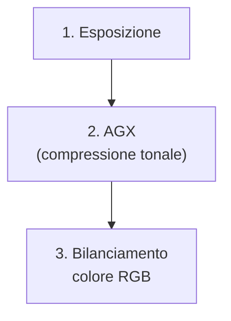
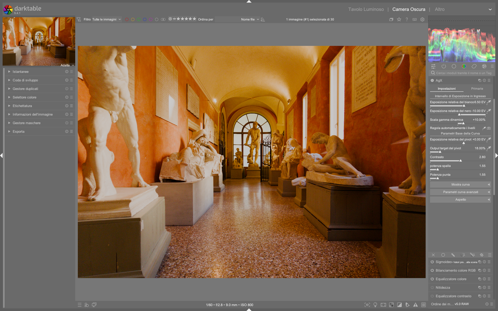

# Tone Mapping: AGX

Il modulo **AGX** (Academy Color Encoding System-inspired tone mapping) e' il tone mapper predefinito in darktable 5.4+. Sostituisce gradualmente Filmic RGB e Sigmoid, offrendo un approccio ispirato al workflow cinematografico ACES per la compressione tonale scene-referred.[^agx-guide][^manual-agx]

!!! info "AGX e' il default da darktable 5.4"
    Dalla versione 5.4, AGX e' il modulo di tone mapping predefinito nella pipeline scene-referred. Questo significa che ogni nuova immagine RAW verra' elaborata con AGX automaticamente.[^dt54-update]

## Panoramica

AGX gestisce due aspetti fondamentali in un unico modulo:

1. **Compressione tonale** (scheda *Primaries* / *Tone*) -- comprime l'ampia gamma dinamica del RAW nel range visualizzabile dello schermo
2. **Gestione del colore** (scheda *Color* / *Primaries*) -- controlla saturazione, rotazioni e recupero della puretta cromatica dopo la compressione[^agx-guide][^dt54-update]

A differenza di Filmic RGB, AGX gestisce la saturazione seguendo il comportamento della pellicola analogica: i colori molto luminosi si desaturano naturalmente, come avviene nella realta'.[^manual-agx] Questo risolve il cosiddetto problema dei "**Notorious 6**" -- sei comportamenti problematici dei tone mapper precedenti con colori saturi e luminosi.[^agx-guide]

## Flusso di lavoro consigliato

Il flusso di lavoro tipico con AGX si articola in tre fasi:[^agx-guide][^pipeline-beginner]

!!! tip "Regola d'oro: esponi prima, comprimi dopo"
    Imposta **sempre** l'esposizione globale *prima* di toccare AGX. Il tone mapper lavora sui dati gia' esposti; se l'esposizione e' sbagliata, nessun parametro di AGX potra' recuperare la situazione.[^agx-guide]

### Passo 1: Auto Tune Levels

Il primo passo pratico in AGX e' quasi sempre il pulsante **Auto Tune Levels**:[^agx-guide]

- Cliccalo una sola volta all'inizio dell'editing
- Calcola automaticamente i punti di bianco e nero dell'immagine
- Funziona meglio se l'esposizione globale e' gia' stata regolata[^pipeline-beginner]

### Passo 2: Contrasto

Il parametro **Contrast** controlla la pendenza della curva S globale:[^agx-guide]

- **Default**: ~2.80
- **Aumenta** per piu' impatto visivo (tipicamente 3.0-4.5)
- **Riduci** per scene gia' contrastate o per un look piu' morbido[^agx-guide]

!!! tip "Valuta il contrasto a distanza"
    Riduci la dimensione di visualizzazione dell'immagine (Ctrl + -) per percepire meglio l'impatto globale del contrasto, invece di lavorare sempre zoomato al 100%.[^pipeline-beginner]

### Passo 3: Shoulder e Toe Power

Questi due parametri controllano separatamente le estremita' della curva:[^agx-guide]

| Parametro | Cosa controlla | Effetto pratico |
|-----------|---------------|-----------------|
| **Shoulder Power** | Compressione alte luci | Aumenta per recuperare dettagli nelle zone luminose (cieli, finestre). Valori alti schiariscono le luci gradualmente.[^agx-guide] |
| **Toe Power** | Compressione ombre | Aumenta per aprire le ombre senza appiattirle. Valori alti schiariscono le zone scure mantenendo profondita'.[^agx-guide] |

!!! warning "Non esagerare"
    Valori estremi di shoulder/toe power possono distruggere la forma a S della curva, riducendo il controllo locale. Se la curva diventa arancione nelle estremita', stai spingendo troppo.[^agx-guide]

## Parametri principali

| Parametro | Range tipico | Default | Descrizione |
|-----------|-------------|---------|-------------|
| **White relative exposure** | 2.0 - 8.0 EV | 6.50 EV | Punto piu' luminoso dell'immagine. Usa la pipetta per campionare.[^agx-guide] |
| **Black relative exposure** | -4.0 - -15.0 EV | -10.00 EV | Punto piu' scuro dell'immagine. Usa la pipetta per campionare.[^agx-guide] |
| **Dynamic range scaling** | -50% - +50% | +10.00% | Scala simmetricamente il range dinamico calcolato. Utile come margine di sicurezza per luminanze estreme.[^dt54-update] |
| **Pivot relative exposure** | Variabile | +0.00 EV | Punto di massimo contrasto sulla curva. Spostalo sulla zona dell'immagine che vuoi sia piu' nitida.[^agx-guide] |
| **Pivot target output** | 0% - 50% | 18.00% | Luminanza di output del pivot. 18% corrisponde al grigio medio (riflettanza neutra).[^agx-guide] |
| **Contrast** | 1.0 - 5.0 | 2.80 | Pendenza della curva S. Controlla il contrasto globale.[^agx-guide] |
| **Shoulder power** | 1.0 - 5.0 | 1.55 | Controllo della compressione nelle alte luci.[^agx-guide] |
| **Toe power** | 1.0 - 5.0 | 1.55 | Controllo della compressione nelle ombre.[^agx-guide] |

## Parametri avanzati della curva

Espandendo la sezione *Advanced Curve Parameters*, si trovano controlli aggiuntivi:[^agx-guide]

| Parametro | Funzione | Quando usarlo |
|-----------|----------|---------------|
| **Shoulder start** | Dove inizia la compressione delle luci | Per anticipare o ritardare la curva nella zona luminosa[^agx-guide] |
| **Toe start** | Dove inizia la compressione delle ombre | Per controllare da dove parte la curva nelle zone scure[^agx-guide] |
| **Target white** | Luminanza massima di output | Di solito 100%. Abbassare per look desaturato.[^agx-guide] |
| **Target black** | Luminanza minima di output | Alza leggermente (1-3%) per effetto "pellicola sbiadita" (black lift)[^agx-guide] |
| **Curve Y gamma** | Gamma della curva | Workaround quando shoulder/toe non bastano. Aumenta per schiarire senza perdere controllo sulla spalla.[^agx-guide] |
| **Slope** | Pendenza lineare | Regolazione fine della pendenza globale[^agx-guide] |

!!! warning "Parametri da non toccare (di solito)"
    I seguenti parametri sono sconsigliati per l'uso quotidiano:[^agx-guide]

    - **Dynamic range scaling** oltre +/-10% -- rischio clipping
    - **Target white/black** estremi -- effetto sbiadito innaturale
    - **Parametri avanzati della curva** -- usa solo se shoulder/toe non sono sufficienti

## Gestione del colore in AGX

La seconda faccia di AGX e' la gestione cromatica, accessibile dalla scheda *Color* o tramite il modulo *Color Calibration* con tab *Primaries*.[^agx-guide][^dt54-update]

### Attenuazione delle primarie (Before Tone Mapping)

Prima della compressione tonale, puoi desaturare selettivamente i canali RGB:[^dt54-update]

| Parametro | Funzione | Valore tipico |
|-----------|----------|---------------|
| **Red attenuation** | Desatura i rossi prima del tone mapping | 10-30%[^dt54-update] |
| **Green attenuation** | Desatura i verdi prima del tone mapping | 0-10%[^dt54-update] |
| **Blue attenuation** | Desatura i blu prima del tone mapping | 10-70% (scene con blu saturi)[^dt54-update] |
| **Red/Green/Blue rotation** | Ruota la tonalità del canale | +/- 1-5°[^dt54-update] |

!!! tip "Perche' attenuare prima del tone mapping"
    I colori troppo saturi e luminosi vengono troncati a valori massimi sullo schermo (clipping cromatico). Attenuandoli *prima* della compressione, li porti in uno "spazio sicuro" dove il tone mapper puo' gestirli correttamente.[^dt54-update]

### Recupero della purezza (After Tone Mapping)

Dopo la compressione, puoi recuperare la vividezza cromatica persa:[^dt54-update]

| Parametro | Funzione | Quando usarlo |
|-----------|----------|---------------|
| **Recover purity** | Recupera saturazione persa dal tone mapping | Quando i colori sembrano spenti dopo AGX[^dt54-update] |
| **Master purity boost** | Aumento globale di purezza cromatica | Per dare piu' "pop" ai colori[^dt54-update] |
| **Red/Green/Blue purity boost** | Aumento selettivo per canale | Per correggere dominanti o enfatizzare colori specifici[^dt54-update] |

### Reversals (inversioni)

I controlli *reversal* permettono di "tornare indietro" parzialmente sulle correzioni applicate:[^dt54-update]

| Parametro | Funzione |
|-----------|----------|
| **Master rotation reversal** | Inverte parzialmente le rotazioni di tonalità |
| **Red/Green/Blue attenuation reversal** | Recupera parte dell'attenuazione applicata |
| **Red/Green/Blue rotation reversal** | Corregge la rotazione dopo l'attenuazione |

!!! info "Come funzionano le reversals"
    Le reversals non annullano le correzioni, ma ne mitigano l'effetto. Questo permette un controllo fine: attenui molto per evitare clipping, poi recuperi parzialmente con la reversal.[^dt54-update]

## Uso della pipetta (eyedropper)

AGX offre strumenti pipetta per impostare automaticamente i parametri:[^agx-guide]

| Strumento | Cosa fa | Come usarlo |
|-----------|---------|-------------|
| **Auto tune levels** | Calcola white/black exposure | Clicca una volta dopo aver regolato l'esposizione[^agx-guide] |
| **Pipetta pivot** | Campiona l'esposizione media di un'area | Trascina un rettangolo sulla zona che vuoi sia a massimo contrasto[^agx-guide] |

!!! tip "Tecnica del rettangolo"
    Quando usi la pipetta per il pivot, non cliccare su un singolo pixel. Trascina un rettangolo sulla zona di interesse (es. il soggetto principale) per campionare l'esposizione media di quell'area.[^agx-guide]

## Casi d'uso pratici

### Ritratti

Per i ritratti, AGX offre toni della pelle naturali e buona gestione delle alte luci:[^agx-guide]

1. **Esposizione**: regola per esporre correttamente il volto (spesso +0.5 a +1.5 EV)
2. **Auto tune levels** per impostare i punti bianco/nero
3. **Contrast**: 2.80-3.50 (moderato, non aggressivo)
4. **Shoulder power**: 1.55-2.00 (protegge le alte luci della pelle)
5. **Toe power**: 1.55-2.00 (apre le ombre senza appiattire)
6. **Color balance RGB**: preset *Basic Colorfulness - Standard* per saturazione naturale[^agx-guide]

!!! tip "Toni della pelle"
    Se i toni della pelle risultano troppo saturi, usa il *Color Equalizer* sulla saturazione per desaturare selettivamente la zona dei rossi/arancioni.[^dragan-effect]

### Paesaggi

I paesaggi beneficiano della gestione avanzata della dinamica di AGX:[^landscape]

1. **Exposure**: esponi per le alte luci (proteggi il cielo)
2. **Auto tune levels**
3. **Contrast**: 3.0-4.5 (i paesaggi reggono contrasti piu' alti)
4. **Shoulder power**: 2.0-3.0 (recupera dettagli nel cielo)
5. **Toe power**: 1.55-2.50 (mantieni profondita' nelle ombre)
6. **Pivot**: campiona sulla zona principale (es. albero, montagna)[^landscape]

!!! tip "Maschere parametriche"
    Per paesaggi complessi, usa maschere parametriche su moduli Exposure aggiuntivi per lavorare separatamente su cielo, terreno e soggetti.[^landscape]

### Tramonti

I tramonti sono la sfida piu' difficile per un tone mapper a causa dei colori estremamente saturi:[^agx-guide]

1. **Exposure**: esponi per il cielo (spesso sottoesponi leggermente)
2. **Auto tune levels**
3. **Blue attenuation**: aumenta significativamente (30-70%) per evitare clipping dei blu[^dt54-update]
4. **Red attenuation**: 10-20% per gestire i rossi saturi[^dt54-update]
5. **Contrast**: 2.5-3.5
6. **Recover purity**: 50-100% per recuperare vividezza dopo la compressione[^dt54-update]

!!! warning "Attenzione al color banding"
    I tramonti con colori molto saturi possono mostrare *color banding* (bande di colore) nelle zone di transizione. Se succede, aumenta l'attenuazione del blu e del rosso, poi recupera con *recover purity*.[^dt52-release]

### Scene in scarsa luce (Lowlight)

Per foto scattate in condizioni di scarsa luce:[^lowlight]

1. **Exposure**: aumenta significativamente (+1.0 a +2.0 EV o piu')
2. **AGX+** come profilo di output (evita tonalita' magenta indesiderate)[^lowlight]
3. **Black relative exposure**: spingi piu' in basso (-15 a -20 EV) per pulire il rumore nelle ombre[^lowlight]
4. **Shoulder power**: 2.0-2.5 (proteggi le luci artificiali)
5. **Toe power**: 1.5-2.0 (controlla le ombre sollevate dall'esposizione)
6. **Color Balance RGB**: usa la scheda *4 Ways* per color grading creativo nelle ombre e luci[^lowlight]

!!! tip "Foto ISO alti"
    Per foto ad alto ISO, AGX+ (la variante con profilo esteso) gestisce meglio le dominanti cromatiche rispetto ad AGX standard. Selezionalo nelle impostazioni del profilo di output.[^lowlight]

### Effetto Dragan (ritratti drammatici)

Per il look ad alto contrasto stile Andrzej Dragan:[^dragan-effect]

1. Elaborazione base con AGX (contrasto medio-alto)
2. Duplica l'immagine
3. Sulla duplicata: converti in bianco e nero (Color Calibration - Monochrome)
4. Applica sfocatura (Blur module, gaussiano, raggio 15-20px)
5. Composite: fondi con modalita' *Overlay* o *Hard Light*
6. Regola l'opacita' del composite per controllare l'intensita'[^dragan-effect]

!!! info "Il modulo Composite e' fondamentale"
    Il modulo *Composite* permette di fondere due versioni della stessa immagine. E' posizionato nella pipeline: i moduli *sotto* di esso vengono elaborati separatamente, quelli *sopra* lavorano sul risultato fuso.[^dragan-effect]

## I "Notorious 6"

I "Notorious 6" sono sei problemi noti dei tone mapper scene-referred (in particolare Filmic RGB e Sigmoid) quando gestiscono colori molto saturi e luminosi:[^agx-guide]

| # | Problema | Descrizione | Come AGX lo risolve |
|---|----------|-------------|---------------------|
| 1 | **Hue shift** | Le tonalità cambiano quando i colori diventano molto luminosi | AGX preserva le tonalità durante la compressione, seguendo il modello ACES[^agx-guide] |
| 2 | **Luminance inversion** | Colori saturi appaiono piu' scuri del previsto | La mappatura AGX mantiene la relazione luminanza-saturazione della pellicola[^manual-agx] |
| 3 | **Gamut clipping** | Colori fuori gamut vengono troncati bruscamente | AGX comprime il gamut gradualmente, come farebbe una pellicola[^agx-guide] |
| 4 | **Desaturation delle luci** | Le alte luci perdono colore troppo rapidamente | Il comportamento filmico di AGX desatura in modo naturale e progressivo[^manual-agx] |
| 5 | **Saturation pumping** | Alcuni colori diventano innaturalmente saturi | La compressione AGX e' uniforme su tutti i canali[^agx-guide] |
| 6 | **Black crush** | Le ombre collassano perdendo dettaglio | Il controllo toe power indipendente permette di aprire le ombre senza distruggere il contrasto[^agx-guide] |

!!! info "Perche' si chiamano cosi'"
    Il termine "Notorious 6" nasce nella community di darktable per descrivere i sei comportamenti piu' problematici che si manifestavano con Filmic RGB quando si elaboravano immagini con colori saturi (tramonti, luci al neon, fiori).[^agx-guide] AGX e' stato progettato specificamente per risolvere questi problemi.

## AGX vs Filmic RGB vs Sigmoid

| Caratteristica | AGX | Sigmoid | Filmic RGB |
|---------------|-----|---------|------------|
| **Complessita'** | Media | Bassa | Alta |
| **Notorious 6** | Risolti | Parzialmente | Parzialmente |
| **Toni pelle** | Buoni | Ottimi | Buoni con tuning |
| **Controllo** | Buono | Minimo | Massimo |
| **Curve visualizzabile** | Si' | No | Si' |
| **Gestione saturazione** | Automatica (filmica) | Manuale | Manuale |
| **Default dt 5.4** | **Si'** | No | No |
| **Ideale per** | Uso generale, tramonti, ritratti | Ritratti, editing rapido | Controllo totale, B/N |

!!! tip "Quale scegliere?"
    - **AGX**: default consigliato per la maggior parte delle situazioni. Eccelle con tramonti, paesaggi e scene ad alto contrasto cromatico.[^agx-guide]
    - **Sigmoid**: ancora ottimo per ritratti rapidi con toni della pelle naturali "out of the box".[^manual-sigmoid]
    - **Filmic RGB**: preferito da alcuni per il bianco e nero, dove offre un controllo granulare su curve e latitudine.[^dt52-release]

!!! danger "Usa un solo tone mapper alla volta"
    Non attivare mai piu' di un tone mapper simultaneamente. AGX, Sigmoid e Filmic RGB sono mutualmente esclusivi: usarne due insieme crea artefatti imprevedibili.[^manual-agx][^manual-sigmoid]

## Errori comuni e come evitarli

### 1. Non regolare l'esposizione prima di AGX

**Problema**: AGX applicato a un'immagine sotto/sovraesposta produce risultati scadenti.[^agx-guide]

**Soluzione**: Sempre il modulo *Exposure* prima, poi *Auto Tune Levels* in AGX.[^pipeline-beginner]

### 2. Contrast troppo alto

**Problema**: Valori di contrasto > 5.0 distruggono la forma a S, riducono il controllo di shoulder/toe e possono generare artefatti.[^agx-guide]

**Soluzione**: Resta tra 2.5 e 4.0 per la maggior parte delle immagini. Se serve piu' contrasto, usa shoulder/toe power.[^agx-guide]

### 3. Ignorare l'attenuazione delle primarie

**Problema**: Colori molto saturi (tramonti, luci al neon) causano clipping cromatico e color banding.[^dt54-update]

**Soluzione**: Attenua i blu (e talvolta i rossi) *prima* del tone mapping, poi recupera con *recover purity*.[^dt54-update]

### 4. Pivot mal posizionato

**Problema**: Il pivot di default (0 EV, 18% output) potrebbe non corrispondere al soggetto principale.[^agx-guide]

**Soluzione**: Usa la pipetta per campionare la zona dell'immagine che deve avere il massimo contrasto.[^agx-guide]

### 5. Dynamic range scaling aggressivo

**Problema**: Valori estremi di dynamic range scaling causano clipping nelle alte luci o nelle ombre.[^agx-guide]

**Soluzione**: Mantieni il dynamic range scaling tra -10% e +10%. Il default +10% va bene per la maggior parte dei casi.[^agx-guide]

### 6. Target black troppo alto

**Problema**: Alzare troppo il target black (es. > 5%) crea un effetto "sbiadito" innaturale.[^agx-guide]

**Soluzione**: Se vuoi l'effetto pellicola, alza il target black gradualmente (1-3%) e valuta il risultato.[^agx-guide]

### 7. Curve avanzata senza motivo

**Problema**: Modificare i parametri avanzati della curva (shoulder start, toe start, gamma) senza bisogno complica l'editing senza benefici.[^agx-guide]

**Soluzione**: Usa solo contrast, shoulder power e toe power. Passa ai parametri avanzati solo se questi non bastano.[^agx-guide]

## Scorciatoie da tastiera utili

| Scorciatoia | Azione |
|-------------|--------|
| **E** | Attiva/disattiva il modulo exposure |
| **Scroll del mouse** su un modulo | Regola il primo parametro visibile |
| **Ctrl + click destro** su uno slider | Reset del parametro al valore default |
| **Click destro** su slider di tonalità | Apre la ruota cromatica visuale[^dt54-update] |
| **Cmd/Ctrl + B** | Mostra bordo bianco di riferimento per valutare l'esposizione[^agx-guide] |

## Parametri di riferimento rapido

| Scenario | Contrast | Shoulder | Toe | Note |
|----------|----------|----------|-----|------|
| **Ritratto** | 2.80-3.50 | 1.55-2.00 | 1.55-2.00 | Toni pelle naturali |
| **Paesaggio** | 3.00-4.50 | 2.00-3.00 | 1.55-2.50 | Recupera cielo |
| **Tramonto** | 2.50-3.50 | 1.55-2.00 | 1.55-2.00 | Attenua blu/rossi |
| **Lowlight** | 2.50-3.50 | 2.00-2.50 | 1.50-2.00 | Usa profilo AGX+ |
| **B/N** | 3.00-4.00 | 1.55-2.00 | 1.55-2.00 | Poi desatura |
| **Alto contrasto** | 3.50-4.50 | 2.00-3.00 | 1.55-2.00 | Dragan effect[^dragan-effect] |

## Note sulla curva arancione

In AGX, quando la curva tonale mostra una porzione **arancione** nelle estremita', questo e' un **avviso**, non un errore:[^agx-guide]

- Indica che la curva sta raggiungendo limiti dove ulteriori correzioni potrebbero generare artefatti
- A differenza di Filmic RGB (dove l'arancione era un errore bloccante), in AGX e' solo un suggerimento
- Se vedi arancione: riduci il contrasto o aggiusta shoulder/toe power per riportare la curva in zona sicura[^agx-guide]

## Walkthrough da video tutorial

### Esempio: Regolazione AGX per concerti notturni  
*Da [Lowlight photos in darktable](https://www.youtube.com/watch?v=O7wXgmQZqiU) (01:40–05:50)*  
1. Imposta `exposure = +1.000 EV` per illuminare i soggetti principali  
2. Nella scheda *Tone*: imposta `white relative exposure = 5.93 EV`, `black relative exposure = -19.20 EV`  
3. Regola `shoulder power = 2.31` per proteggere le luci artificiali  
4. Imposta `toe power = 1.68` per preservare dettagli nelle ombre senza appiattirle  
5. Attiva `Preserve Hue = 100%` per evitare hue shift nei colori saturi[^lowlight]  

### Esempio: AGX per paesaggi con cielo nuvoloso  
*Da [Darktable landscape edit with AI](https://www.youtube.com/watch?v=OERXOFz9lEo) (02:20–05:00)*  
1. Usa `sigmoid` per il primo passaggio, poi sostituiscilo con `AGX`  
2. Imposta `dynamic range scaling = +10.00%` per margini di sicurezza  
3. Regola `pivot relative exposure = -0.00 EV` e `pivot target output = 18.00%`  
4. Aumenta `contrast = 3.00` per definizione senza alterare la curva S  
5. Usa `blue attenuation = 16.75%` e `blue rotation = -3.0°` per spostare i toni fuori dal gamut[^landscape]  

### Esempio: Setup AGX+ per ritratti ad alta ISO  
*Da [The Dragan effect in darktable](https://www.youtube.com/watch?v=EuvG0lh8OB8) (00:00–01:50)*  
1. Seleziona `output color profile = AgX+ scene-referred default`  
2. Imposta `black relative exposure = -10.00 EV` e `dynamic range scaling = +10.00%`  
3. Usa `shoulder power = 1.55` e `toe power = 1.55` per equilibrio tonale  
4. Attiva `color calibration` → *CAT* → `detect from image surfaces` per bilanciamento preciso[^dragan-effect]  

## Domande frequenti

### Problema: AGX+ non appare nel menu dei profili  
AGX+ è disponibile solo con profili di input/output compatibili con scene-referred (non con display-referred). Verifica che `Preferences > Processing > Pixel workflow defaults` sia impostato su `scene-referred (agx)` e non su `display-referred`. Se il profilo non compare, reinstalla i profili ICC da `darktable.org/downloads`[^discussion-pixls-54755]  

### Problema: La curva tonale non si aggiorna in tempo reale  
Questo accade quando OpenCL non è completamente inizializzato. Controlla i popup di avvio: l’elaborazione sarà più lenta fino al completamento dell’inizializzazione di OpenCL in background. Disabilitare temporaneamente `OpenCL` in `Preferences > Performance` risolve il problema, ma riduce le prestazioni[^darktable-fr-4.6]  

### Problema: Maschere parametriche non funzionano con AGX  
Le maschere parametriche richiedono che i moduli siano posizionati *prima* di AGX nella pipeline (es. `exposure`, `color equalizer`). Se applichi una maschera a un modulo *dopo* AGX, i valori tonali saranno già compressi e la maschera perderà precisione. Usa sempre `tone equalizer` o `color calibration` *prima* di AGX per mascherature precise[^discussion-pixls-54755]  

## Riferimenti visuali

*Il modulo «AgX» nell'interfaccia di darktable (vista darkroom).*

## Fonti

[^agx-guide]: *[A guide to AGX in darktable](https://www.youtube.com/watch?v=iaZ2-QvOHyA)* -- A Dabble in Photography
[^lowlight]: *[Lowlight photos in darktable](https://www.youtube.com/watch?v=O7wXgmQZqiU)* -- A Dabble in Photography
[^landscape]: *[Landscape edit with AI](https://www.youtube.com/watch?v=OERXOFz9lEo)* -- A Dabble in Photography
[^pipeline-beginner]: *[The darktable pipeline for beginners](https://www.youtube.com/watch?v=1nPW6WPhhTo)* -- A Dabble in Photography
[^dt54-update]: *[darktable 5.4 NEW UPDATE!](https://www.youtube.com/watch?v=yiTqUgoWg6Q)* -- A Dabble in Photography
[^dt52-release]: *[New Release: darktable 5.2](https://www.youtube.com/watch?v=YcLJMaDbfRA)* -- A Dabble in Photography
[^dragan-effect]: *[The Dragan effect in darktable](https://www.youtube.com/watch?v=EuvG0lh8OB8)* -- A Dabble in Photography
[^manual-agx]: *darktable User Manual -- AgX*, [docs.darktable.org](https://docs.darktable.org/usermanual/development/en/module-reference/processing-modules/agx/)
[^manual-sigmoid]: *darktable User Manual -- Sigmoid*, [docs.darktable.org](https://docs.darktable.org/usermanual/development/en/module-reference/processing-modules/sigmoid/)
[^discussion-pixls-54755]: *[darktable 5.4 - A Introductory Beginner Workflow](https://discuss.pixls.us/t/darktable-5-4-a-introductory-beginner-workflow-and-interactive-walkthrough/54755)* -- discuss.pixls.us
[^darktable-fr-4.6]: *[Version 4.6.0 - darktable FR](https://darktable.fr/posts/2023/12/notes-version-4.6/)* -- darktable.fr
