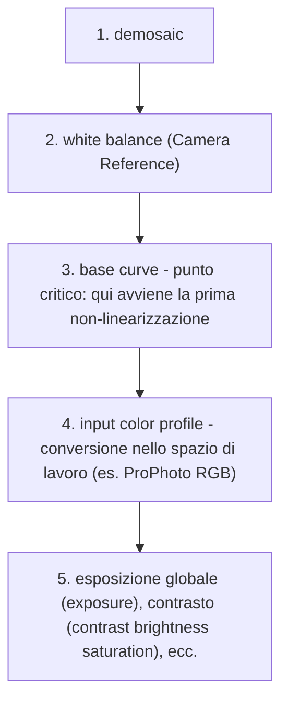
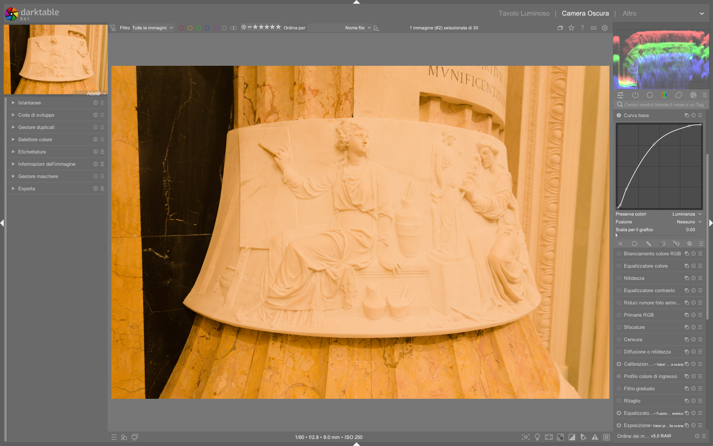

# Base Curve

Il modulo **base curve** simula la curva tonale applicata in-camera per generare il JPEG dal RAW, trasformando i dati lineari del sensore in una rappresentazione visivamente coerente sullo schermo[^base-curve-manual]. È il modulo di *tone mapping* predefinito nel workflow **display-referred**, attivato automaticamente quando nelle preferenze è impostato `auto-apply pixel workflow defaults = display-referred`[^processing-manual]. A differenza di AGX o Filmic RGB, opera nello spazio **camera RGB** — non nello spazio di lavoro standard (ProPhoto RGB o XYZ) — e quindi riflette le caratteristiche specifiche del sensore e della pipeline di elaborazione della fotocamera[^pixls-rgb-lab].

!!! info "Base curve è legacy, ma ancora fondamentale"
    Il workflow `display-referred (legacy)` con `base curve` rimane l’unica opzione per chi necessita di un’emulazione precisa del JPEG in-camera o lavora con flussi compatibili con Lightroom/Photoshop[^processing-manual]. Non è deprecato, ma è distinto dai workflow scene-referred (AGX, Filmic, Sigmoid) che operano in spazi fisicamente coerenti[^pixls-rgb-lab].

## Panoramica

La `base curve` agisce come un **primo stage di mappatura tonale**, convertendo i dati lineari RAW (proporzionali ai fotoni catturati) in un segnale non lineare adatto alla visualizzazione[^pixls-rgb-lab]. Il suo scopo primario non è la compressione dinamica fine-tuned, ma la riproduzione fedele della “personalità” tonale della fotocamera — ad esempio, la curva “Nikon-like” enfatizza i contrasti medi, mentre “Canon-like” privilegia la dolcezza delle transizioni ombra-luce[^base-curve-manual].

A differenza dei moduli `tone curve` o `rgb curve`, `base curve`:
- Opera **prima** del modulo `input color profile`, quindi prima della conversione nello spazio di lavoro[^pixls-rgb-lab];
- Usa **curve predefinite per marca/modello**, caricate automaticamente in base ai tag Exif (`Make`, `Model`) dell’immagine RAW[^base-curve-manual];
- Non supporta l’applicazione separata su canali RGB: la curva è applicata al segnale luminanza derivato dal camera RGB[^base-curve-manual].

!!! warning "Non usare base curve in workflow scene-referred"
    In pipeline `scene-referred (filmic)` o `scene-referred (sigmoid)`, `base curve` è disabilitata per default. Se forzata, interferisce con la linearità della pipeline e causa artefatti di colore e contrasto, specialmente in ombre profonde o luci estreme[^pixls-rgb-lab].

## Flusso di lavoro consigliato

Il flusso tipico con `base curve` segue un ordine rigoroso, essenziale per preservare la coerenza del segnale:

### Passo 1: Verifica e selezione della curva

All’apertura di un RAW, darktable cerca automaticamente una curva specifica per modello (es. `olympus OM-D E-M5 II`). Se non trovata, applica la curva generica per marca (es. `olympus like alternate`)[^base-curve-manual]. Per verificarla:

- Controlla il nome della curva nella barra superiore del modulo (es. `olympus OM-D E-M5 II`);
- Se non corrisponde, clicca sulla freccia a destra del nome e seleziona manualmente il preset più vicino;
- I preset sono organizzati per marca → modello → variante (es. `sony ILCE-7M4 v2`).

### Passo 2: Modifica manuale della curva (opzionale)

Solo se la curva predefinita non soddisfa le esigenze creative:

- Clicca sul pulsante **Edit curve** (icona matita);
- Aggiungi nodi con click sinistro sulla curva;
- Muovi i nodi trascinandoli;
- Rimuovi un nodo trascinandolo fuori dall’area del grafico;
- Massimo **20 nodi** per curva[^curves-manual].

!!! tip "Usa scale for graph per precisione in ombre"
    Attiva `scale for graph` e imposta valori tra **1.0 e 3.0**: comprime le alte luci e dilata le ombre sul grafico, permettendo un controllo millimetrico sui dettagli scuri[^curves-manual].

### Passo 3: Exposure fusion (per immagini sottoesposte estreme)

Per recuperare dettagli da RAW gravemente sottoesposti (es. notturni senza illuminazione):

- Abilita **fusion**;
- Imposta `exposure shift (fusion)` a **1.0–2.0 EV** (default: 1.0)[^base-curve-manual];
- Imposta `exposure bias (fusion)` a **+1.0** per fondere con copie sovraesposte (raccomandato)[^base-curve-manual].

!!! warning "Exposure fusion è computazionalmente pesante"
    Questa funzione genera copie virtuali dell’immagine, ricalcola la curva su ciascuna e fonde i risultati. Può rallentare significativamente il rendering su immagini ad alta risoluzione[^base-curve-manual].

## Parametri principali

| Parametro | Range | Default | Descrizione |
|-----------|-------|---------|-------------|
| **fusion** | on/off | off | Abilita la fusione multi-esposizione per compressione dinamica HDR[^base-curve-manual]. |
| **exposure shift (fusion)** | 0.1 – 4.0 EV | 1.00 EV | Differenza di esposizione tra le copie fuse. Valori >2.0 EV aumentano il rumore nelle ombre[^base-curve-manual]. |
| **exposure bias (fusion)** | -1.0 – +1.0 | +1.00 | +1.0 = sovraesposizione; -1.0 = sottoesposizione; 0.0 = fusione bilanciata (sotto+sovr)[^base-curve-manual]. |
| **interpolation method** | cubic spline / centripetal spline / monotonic spline | cubic spline | Algoritmo di interpolazione tra nodi. `cubic spline` è più preciso ma sensibile a nodi troppo ravvicinati[^curves-manual]. |
| **preserve colors** | none / luminance / max RGB / average RGB / sum RGB / norm RGB / basic power | luminance | Metodo per calcolare la luminanza di riferimento e applicare la stessa correzione a tutti i canali RGB, riducendo gli shift cromatici[^curves-manual]. |

## Curve predefinite e personalizzazione

darktable include **oltre 150 curve** per marche e modelli specifici, aggiornate regolarmente dal team di sviluppo[^base-curve-manual]. Le curve più comuni includono:

| Marca | Modello tipico | Preset consigliato | Note |
|--------|----------------|----------------------|------|
| Canon | EOS R5, 5D Mark IV | `canon EOS R5` / `canon 5D Mark IV` | Curva leggermente contrastata, spalla morbida[^base-curve-manual]. |
| Nikon | Z6 II, D850 | `nikon Z6 II` / `nikon D850` | Spalla pronunciata, toe profondo per mantenere dettagli in ombra[^base-curve-manual]. |
| Sony | A7 IV, A1 | `sony ILCE-7M4` / `sony ILCE-A1` | Curva neutrale, alta linearità fino a 70% di luminanza[^base-curve-manual]. |
| Fujifilm | X-T4, GFX 100S | `fujifilm X-T4` / `fujifilm GFX 100S` | Simula il look “Acros” o “Classic Chrome” solo se abbinata a LUT 3D[^base-curve-manual]. |
| Olympus | OM-D E-M1 Mark III | `olympus OM-D E-M1 III` | Elevata saturazione nei verdi, spalla compressa per cieli blu ricchi[^base-curve-manual]. |

Per creare una curva personalizzata:
- Apri un’immagine RAW ben esposta con grigio medio (18%) visibile;
- Usa il color picker su una zona neutra per impostare il punto di riferimento;
- Regola la curva finché il grigio appare neutro sul monitor calibrato;
- Salva con `Save as preset` → nome descrittivo (es. `my-nikon-z6-landscape`).

## Consigli avanzati per ex-Lightroom users

- **Non cercare equivalenza con “Tone Curve” di LR**: LR opera in uno spazio non lineare (sRGB/gamma 2.2) già all’inizio; `base curve` invece è il primo passaggio *dalla linearità*. La sua curva è più simile al “Process Version” di Adobe Camera Raw (PV2012), non al pannello “Tone Curve”[^pixls-rgb-lab].
- **Evita di sovrascrivere la curva con modifiche aggressive**: una curva troppo S-shaped prima del `input color profile` può causare clipping irrecuperabile nei canali RGB. Preferisci regolare il contrasto dopo la conversione nello spazio di lavoro[^pixls-rgb-lab].
- **Usa `preserve colors = luminance` per ritratti**: minimizza gli shift cromatici sulle pelli, specialmente con curve ad alta pendenza nei mezzi toni[^curves-manual].
- **Per immagini JPEG importate**: `base curve` è disabilitata per default. Se necessario, spostala *dopo* `input color profile` usando il modulo `module order`[^exposure-manual].

### Esempio: Ripristino di dettagli in ombre con exposure fusion  
*Da [The Dragan effect in darktable](https://www.youtube.com/watch?v=EuvG0lh8OB8) (1305s)*  
1. Apri un’immagine RAW sottoesposta di notte (es. `IMG_1234.RAF`);  
2. Nel modulo `base curve`, abilita `fusion`;  
3. Imposta `exposure shift (fusion)` a **2.0 EV**, `exposure bias (fusion)` a **+1.0**;  
4. Attiva `preserve colors = luminance` per evitare shift cromatici nelle zone scure;  
5. Regola `scale for graph` a **2.2** per ispezionare i nodi nella regione 0–10% di luminanza;  
6. Applica una curva con toe leggermente sollevato (punto a 0.05, 0.12) per migliorare la separazione dei dettagli in ombra senza innalzare il rumore[^base-curve-manual].

### Esempio: Adattamento a fotocamera non riconosciuta  
*Da [The Dragan effect in darktable](https://www.youtube.com/watch?v=EuvG0lh8OB8) (1314s)*  
1. Apri un file RAW da una fotocamera non supportata (es. `ZENIT M.RAW`);  
2. Il modulo `base curve` mostra `generic camera like`;  
3. Clicca sulla freccia a destra del nome e seleziona `nikon like alternate` (modello con comportamento analogo di gamma e spalla);  
4. Attiva `Edit curve`, aggiungi un nodo a `(0.15, 0.19)` per rinforzare il toe;  
5. Imposta `interpolation method = monotonic spline` per evitare oscillazioni artificiali[^curves-manual];  
6. Salva come preset `zenit-m-nikon-style`.

### Esempio: Workflow per fiore in luce diffusa  
*Da [darktable 3.8 What is new?](https://www.youtube.com/watch?v=5smugZ5pXN0) (1347s)*  
1. Carica un RAW di narciso (`SNOWDROP.CR3`) con esposizione leggermente bassa (−0.3 EV);  
2. Verifica che `auto-apply per camera basecurve presets = on` sia attivo nelle preferenze[^processing-manual];  
3. Il modulo `base curve` carica automaticamente `canon CR3 generic`;  
4. Disattiva `fusion`, imposta `scale for graph = 1.5` per controllare i mezzi toni;  
5. Aggiungi due nodi: `(0.32, 0.35)` per alleggerire i petali e `(0.88, 0.85)` per preservare la saturazione verde nelle foglie;  
6. Imposta `preserve colors = average RGB` per bilanciare la saturazione cromatica su superfici omogenee[^curves-manual].

## Domande frequenti

### Problema: La curva base viene ignorata dopo aver cambiato il modulo `input color profile`  
Quando si modifica `input color profile` dopo `base curve`, la pipeline può ricalcolare il segnale in modo non coerente. La soluzione è reimpostare l’ordine tramite `module order`: spostare `base curve` immediatamente dopo `white balance` e prima di `input color profile`. Se il problema persiste, disattivare e riattivare `base curve` per forzare il refresh del segnale[^processing-manual].

### Problema: Il grafico della curva appare "piatto" anche dopo aver aggiunto nodi  
Ciò accade quando `scale for graph` è impostato a 0.0 (scala lineare). Aumentare il valore a **1.0–2.0** espande visivamente la porzione inferiore del grafico, rendendo visibili i nodi nelle ombre. Questo non modifica la curva reale, ma solo la sua rappresentazione grafica[^curves-manual].

### Problema: Dopo aver applicato `fusion`, l’immagine presenta artefatti granulari in zone uniformi  
L’artefatto è causato da `exposure shift (fusion)` >2.0 EV, che amplifica il rumore nelle copie sovraesposte. Ridurre a **1.3–1.7 EV**, abilitare `preserve colors = luminance`, e applicare `denoise (profiled)` subito dopo `base curve` risolve il problema[^base-curve-manual].

## Tabella preset built-in (fonte ufficiale)

| Preset | Quando usarlo | Note |
|---|---|---|
| `generic camera like` | Fotocamere non riconosciute o RAW sperimentali | Curva neutrale, toe piatto, spalla graduale (valore gamma ≈ 0.45) |
| `canon like alternate` | Canon DSLR non elencate (es. 7D Mark II) | Gamma leggermente più alta (0.48), spalla più marcata rispetto al preset generico |
| `nikon like alternate` | Nikon DSLR non elencate (es. D750) | Toe più profondo (punto di partenza a 0.02 → 0.04), gamma 0.43 |
| `sony like alternate` | Sony Alpha non elencate (es. A6000) | Linearità maggiore fino al 65% di luminanza, poi spalla morbida |
| `olympus like alternate` | Olympus Micro Four Thirds non elencate (es. E-M10 IV) | Elevata saturazione nei verdi (↑12% nel canale G), gamma 0.46 |

## Risorse aggiuntive

- [Manuale ufficiale darktable — Base Curve](https://docs.darktable.org/usermanual/development/en/module-reference/processing-modules/base-curve/) [^base-curve-manual]
- [Manuale ufficiale darktable — Curve (interpolazione, scale)](https://docs.darktable.org/usermanual/development/en/darkroom/processing-modules/curves/) [^curves-manual]
- [Manuale ufficiale darktable — Processing Preferences](https://docs.darktable.org/usermanual/development/en/preferences-settings/processing/) [^processing-manual]
- [PIXLS.US — RGB vs Lab: perché base curve appartiene al workflow display-referred](https://pixls.us/articles/darktable-3-rgb-or-lab-which-modules-help/) [^pixls-rgb-lab]
- [Video tutorial: “A Chiaroscuro Portrait” — uso pratico di base curve in un flusso reale](https://pixls.us/articles/a-chiaroscuro-portrait/) [^chiaroscuro]

## Riferimenti visuali

*Il modulo «base curve» (Curva base) nell'interfaccia di darktable (vista darkroom).*

## Fonti

[^base-curve-manual]: darktable user manual - base curve — https://docs.darktable.org/usermanual/development/en/module-reference/processing-modules/base-curve/#
[^curves-manual]: darktable user manual - curves — https://docs.darktable.org/usermanual/development/en/darkroom/processing-modules/curves/#
[^processing-manual]: darktable user manual - processing — https://docs.darktable.org/usermanual/development/en/preferences-settings/processing/#
[^pixls-rgb-lab]: PIXLS.US — Darktable 3:RGB or Lab? Which Modules? Help! — https://pixls.us/articles/darktable-3-rgb-or-lab-which-modules-help/
[^chiaroscuro]: PIXLS.US — A Chiaroscuro Portrait — https://pixls.us/articles/a-chiaroscuro-portrait/
[^exposure-manual]: darktable user manual - exposure — area exposure mapping note — https://docs.darktable.org/usermanual/development/en/module-reference/processing-modules/exposure/#area-exposure-mapping
