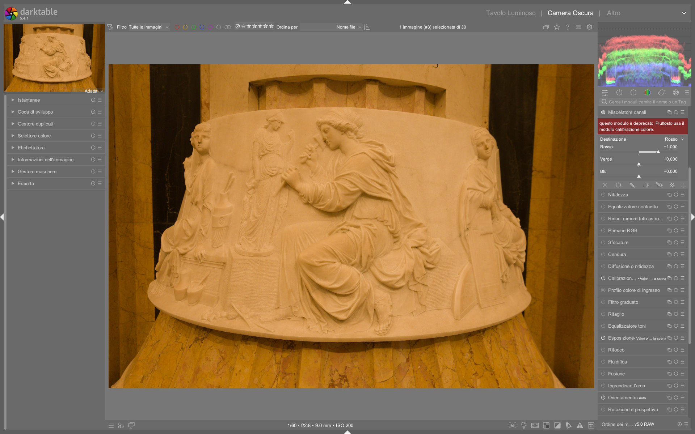

# Channel Mixer (Mix di Canali)

Il **Channel Mixer** (Mix di Canali) è uno dei moduli più potenti di darktable per la manipolazione cromatica. Permette di controllare in modo indipendente quanto ciascun canale di ingresso (Rosso, Verde, Blu) contribuisce a ciascun canale di uscita, attraverso una **moltiplicazione matriciale 3x3**.[^manual]

!!! warning "Modulo deprecato"
    Questo modulo è **deprecato dalla versione 3.4** di darktable. La funzionalità è stata integralmente sostituita dal modulo [Color Calibration](color-calibration.md), che offre le stesse capacità di mix dei canali tramite i cursori **input R/G/B** nelle schede di destinazione colore. Questa documentazione è valida per entrambi i moduli, poiché la logica matematica è identica.[^manual]

## Come funziona

Il Channel Mixer esegue una trasformazione lineare dei canali RGB dell'immagine. Ogni pixel viene elaborato secondo la seguente operazione matriciale:[^ch1]

```
┌ R_out ┐     ┌ Rr Rg Rb ┐     ┌ R_in ┐
│ G_out │  =  │ Gr Gg Gb │  ×  │ G_in │
└ B_out ┘     └ Br Bg Bb ┘     └ B_in ┘
```

Che si espande in tre equazioni scalari:

- **R_out** = Rr × R_in + Rg × G_in + Rb × B_in
- **G_out** = Gr × R_in + Gg × G_in + Gb × B_in
- **B_out** = Br × R_in + Bg × G_in + Bb × B_in

### Stato iniziale: matrice identita

Per impostazione predefinita, il modulo non altera l'immagine. La matrice è quella **identità**, dove ogni canale di uscita riceve contributo solo dal corrispondente canale di ingresso:[^ch1]

```
┌ R_out ┐     ┌ 1  0  0 ┐     ┌ R_in ┐
│ G_out │  =  │ 0  1  0 │  ×  │ G_in │
└ B_out ┘     └ 0  0  1 ┘     └ B_in ┘
```

Nell'interfaccia di darktable (modulo Color Calibration), questo corrisponde a:

| Destinazione | Input R | Input G | Input B |
|-------------|---------|---------|---------|
| **Rosso**   | 1.000   | 0.000   | 0.000   |
| **Verde**   | 0.000   | 1.000   | 0.000   |
| **Blu**     | 0.000   | 0.000   | 1.000   |

!!! info "Come leggere i controlli"
    Ogni scheda di destinazione (R, G, B) ha tre cursori che indicano quanto i canali di **ingresso** R, G, B contribuiscono a quel canale di **uscita**. Spostare un cursore verso destra aggiunge quel canale di ingresso; spostarlo verso sinistra (valori negativi) lo sottrae.[^manual]

## Regola fondamentale: la somma dei coefficienti

!!! tip "Mantieni la somma vicina a 1"
    Per ogni canale di uscita, mantieni la **somma dei tre coefficienti** vicina a **1.0**. Questo preserva la luminosità originale dell'immagine. Somme maggiori di 1 schiariscono l'immagine; somme minori la scuriscono.[^ch1]

Ad esempio, per un canale di uscita con coefficienti `[0.5, 0.3, 0.2]`, la somma è `1.0` — la luminosità rimane invariata. Con `[1.5, 0.3, 0.2]` la somma è `2.0` — il risultato sarà più luminoso.[^ch1]

## Interpretazione intuitiva dei cursori

Per comprendere rapidamente l'effetto di ciascun cursore:[^manual]

| Destinazione | Cursore a destra (positivo) | Cursore a sinistra (negativo) |
|-------------|----------------------------|-------------------------------|
| **Rosso**   | Le zone R, G, B diventano più **rosse** | Diventano più **ciano** |
| **Verde**   | Le zone R, G, B diventano più **verdi** | Diventano più **magenta** |
| **Blu**     | Le zone R, G, B diventano più **blu** | Diventano più **gialle** |

## Uso pratico 1: Conversione in bianco e nero

Uno degli impieghi più utili del Channel Mixer è la creazione di immagini monocromatiche personalizzate. Seleziona la destinazione **Grigio** (gray) e regola i cursori R, G, B per controllare come ciascun canale contribuisce alla luminosità finale.[^manual]

```
GRAY_out = [r  g  b] × [R_in, G_in, B_in]
```

### Simulare pellicole tradizionali

Diverse pellicole bianco e nero hanno sensibilità differenti ai colori. Il Channel Mixer permette di simulare queste caratteristiche:[^manual]

| Stile pellicola | Rosso | Verde | Blu | Caratteristiche |
|----------------|-------|-------|-----|-----------------|
| **Pelle morbida** | 0.90 | 0.30 | -0.30 | Enfatizza il rosso per una pelle uniforme, riduce il blu per evitare texture indesiderate |
| **Maggior dettaglio** | 0.40 | 0.75 | -0.15 | Enfatizza il verde per maggiori dettagli, riduce il blu |
| **Solo canale rosso** | 1.00 | 0.00 | 0.00 | Cielo molto scuro, vegetazione chiara — utile per infrarosso |
| **Solo canale verde** | 0.00 | 1.00 | 0.00 | Buon bilanciamento per paesaggi naturali |
| **Solo canale blu** | 0.00 | 0.00 | 1.00 | Effetto drammatico, cieli molto contrastati |

!!! tip "Infrarosso in bianco e nero"
    Per foto infrarosse, il solo canale **rosso** produce risultati eccellenti: la vegetazione che riflette IR appare molto chiara, mentre il cielo diventa scuro. È un punto di partenza classico per il B&W infrarosso.[^ch1]

## Uso pratico 2: Fotografia infrarosso a falsi colori

La fotografia infrarossa con filtro (es. 720nm) produce immagini con forte dominante rossa. Il Channel Mixer permette di convertire queste immagini in **falsi colori** realistici attraverso lo scambio dei canali.[^ir]

### Ricetta base: scambio rosso-blu

Questa è la trasformazione fondamentale per l'infrarosso a falsi colori. Il canale rosso (che contiene la riflessione IR della vegetazione) viene mappato sul blu in uscita, e il blu viene mappato sul rosso:[^ch1]

| Destinazione | Input R | Input G | Input B |
|-------------|---------|---------|---------|
| **Rosso**   | 0.00    | 0.00    | 1.00    |
| **Verde**   | 0.00    | 1.00    | 0.00    |
| **Blu**     | 1.00    | 0.00    | 0.00    |

Il risultato: la vegetazione (che era rossa nell'immagine IR) diventa blu/ciano, e il cielo (che era blu) diventa rosso. L'effetto è simile al filtro Wratten #80A usato in pellicola.[^ir]

### Personalizzare la ricetta IR

Non esiste una combinazione "giusta" universale. Ogni sensore e filtro produce risultati leggermente diversi. Ecco come personalizzare:[^ir]

1. **Parti dallo scambio R-B** come base
2. **Regola la saturazione** modificando i coefficienti: valori più alti aumentano la saturazione
3. **Controlla la luminanza** mantenendo la somma dei coefficienti vicina a 1 per ogni canale
4. **Usa il vettorscopio** per monitorare la distribuzione cromatica e evitare dominanti indesiderate
5. **Verifica con campioni live** (color picker) i valori RGB nelle zone chiave (vegetazione, cielo)

!!! tip "Ricetta personalizzata da video tutorial"
    Una ricetta avanzata per falsi colori con maggiore saturazione del fogliame:[^ir]

    | Destinazione | Input R | Input G | Input B |
    |-------------|---------|---------|---------|
    | **Rosso**   | 0.00    | 0.00    | 1.00    |
    | **Verde**   | 0.00    | 1.00    | 0.00    |
    | **Blu**     | -1.00   | 0.00    | 0.00    |

    Il valore negativo sul blu in ingresso crea un'inversione che produce tonalità più ricche e saturazione differenziata.[^ch1]

### Workflow completo per infrarosso

1. **Importa il RAW** e imposta il profilo colore di ingresso su `Linear Rec 2020`[^ir]
2. **Bilanciamento del bianco**: punta su vegetazione (foglie o erba) — la riflessione IR funziona come riferimento neutro[^ir]
3. **Color Calibration** (tab CAT): applica il preset "infrared" se disponibile, oppure imposta manualmente lo scambio R-B[^ir]
4. **Filmic RGB**: regola esposizione relativa bianco/nero per il mapping tonale[^ir]
5. **Color Balance RGB** (opzionale): per affinamenti creativi sulle tonalità[^ir]

## Uso pratico 3: Correzione colore mirata

Il Channel Mixer eccelle nel correggere problemi cromatici specifici che altri moduli non affrontano facilmente.[^manual]

### Dominanti da LED blu

Le luci LED blu spesso producono colori fuori gamut sgradevoli. Una matrice utile per renderli più magenta:[^manual]

| Destinazione | Input R | Input G | Input B |
|-------------|---------|---------|---------|
| **Rosso**   | 1.00    | -0.18   | 0.18    |
| **Verde**   | -0.20   | 1.00    | 0.20    |
| **Blu**     | 0.05    | -0.05   | 1.00    |

!!! warning "Usa maschere parametriche"
    Quando correggi colori specifici (come LED blu), applica il Channel Mixer solo sulle zone problematiche usando una **maschera parametrica** basata sulla luminanza o sul canale blu. Applicarlo globalmente altererebbe tutta l'immagine.[^manual]

### Viraggio del cielo

Per modificare il colore del cielo senza alterare il resto della scena, il Channel Mixer offre un controllo chirurgico:[^ch2]

**Esempio: cielo blu verso ciano**

Il cielo blu ha valori RGB tipo `(86, 100, 159)`. Per spostarlo verso il ciano, occorre aggiungere verde al canale blu. La scelta del canale di ingresso è cruciale:[^ch2]

- Usando **input Blu** (valore 159): la modifica è più forte, ma altera anche altre zone blu
- Usando **input Rosso** (valore 86): la modifica è più selettiva, perché il rosso ha il valore più basso nel cielo

!!! tip "Scegli il canale con il differenziale maggiore"
    Per minimizzare gli effetti collaterali, seleziona il canale di ingresso in cui la differenza tra il valore del colore target e quello dei colori da preservare è massima. Il valore del cursore e il valore del pixel in ingresso hanno la stessa importanza matematica.[^ch2]

### Viraggio verso il magenta

Per un cielo al tramonto che tende al magenta senza alterare gialli e arancioni:[^ch2]

1. Posiziona **campioni live** (color picker) sul cielo e sulle zone da preservare
2. Monitora i valori RGB in tempo reale sul vettorscopio
3. Aggiungi rosso o sottrai verde/blu dal canale blu di destinazione
4. Confronta diverse combinazioni: aggiungere rosso schiarisce, sottrarre verde/blu scurisce[^ch2]

## Uso pratico 4: Tonalita globali ed effetti creativi

### Effetto "marrone vintage"

Per dare a un'immagine un aspetto invecchiato con tonalità marrone:[^ch2]

1. Identifica un grigio neutro con il color picker (es. valori circa `61, 62, 61`)[^ch2]
2. Nel Channel Mixer, modifica i canali per introdurre più rosso e verde, meno blu
3. Il marrone nel modello additivo è: molto rosso, meno verde, ancora meno blu (es. `161, 106, 64`)[^ch2]
4. Bilancia la luminosità compensando con valori negativi dove necessario[^ch2]

### Falsi colori estremi

Per effetti creativi estremi (non fotograficamente realistici), si possono usare coefficienti molto alti e illuminanti personalizzati. L'immagine risultante avrà tonalità innaturali ma artisticamente interessanti.[^ir]

## Parametri del modulo

### Destinazione (Destination)

Seleziona il canale di uscita influenzato dai cursori:[^manual]

| Destinazione | Uso |
|-------------|-----|
| **Rosso**   | Miscelazione colore — canale rosso di uscita |
| **Verde**   | Miscelazione colore — canale verde di uscita |
| **Blu**     | Miscelazione colore — canale blu di uscita |
| **Grigio**  | Immagini monocromatiche — luminanza di uscita |
| **Tonalita** | Applicazione HSL (uso specialistico) |
| **Saturazione** | Applicazione HSL (uso specialistico) |
| **Luminosita** | Applicazione HSL (uso specialistico) |

### Cursori Input R / G / B

Per ogni destinazione, definiscono quanto ciascun canale di ingresso contribuisce al canale di uscita selezionato:[^manual]

- **Valore positivo**: aggiunge il canale di ingresso, spostando il colore verso la tinta corrispondente
- **Valore negativo**: sottrae il canale di ingresso, spostando il colore verso la tinta complementare
- **Valore zero**: il canale di ingresso non contribuisce

### Normalize Channels

Quando attivata, questa opzione normalizza automaticamente i coefficienti. Utile per evitare variazioni di luminosità non intenzionali, ma riduce il controllo fine.[^ch1]

## Workflow e buone pratiche

### Quando usare Channel Mixer vs altri moduli

| Scenario | Modulo consigliato | Motivazione |
|----------|-------------------|-------------|
| Bilanciamento del bianco globale | Color Calibration (tab CAT) | Adattamento cromatico percettivo con CAT16[^pipeline] |
| Viraggio creativo mirato | **Channel Mixer** | Controllo matriciale preciso su ogni canale |
| Conversione B&W personalizzata | **Channel Mixer** (destinazione Grigio) | Controllo dei pesi dei canali RGB |
| Correzione colore locale | Channel Mixer + maschera parametrica | Isolamento cromatico preciso[^manual] |
| Regolazione tonale generale | Color Balance RGB | Controle separato ombre/mezzi/lucci |

### Gestione delle maschere

!!! warning "Non mascherare il bilanciamento del bianco"
    Evita di applicare maschere al Channel Mixer quando lo usi per bilanciamento del bianco o calibrazione globale. Differenze di bilanciamento cromatico localizzate risultano innaturali. Preferisci correzioni globali e sottili.[^ch2]

Le maschere parametriche sono invece molto utili quando il Channel Mixer viene usato per **correzioni selettive** (es. correggere solo le luci LED blu). In questo caso, maschera basandoti sul canale cromatica dominante o sulla luminanza.[^manual]

### Ordine nella pipeline

Il Channel Mixer (tramite Color Calibration) si colloca nella fase di **calibrazione colore** della pipeline scene-referred:[^pipeline]

1. White Balance (lasciare su *Camera Reference*)
2. Profilo colore in ingresso (`Linear Rec 2020`)
3. **Color Calibration / Channel Mixer** <-- qui
4. Esposizione / Filmic RGB
5. Color Balance RGB (per affinamenti creativi)

### Istanze multiple

Per illuminazione mista o correzioni complesse, puoi usare **istanze multiple** del modulo Color Calibration con maschere diverse. Ad esempio, una istanza per il cielo e una per il terreno in un paesaggio infrarosso.[^ir]

!!! warning "Evita applicazioni duplicate"
    Quando duplichi un modulo di calibrazione, darktable potrebbe segnalare un'applicazione doppia. Verifica la modalita operativa per evitare conflitti tra le istanze.[^ir]

## Esempi passo-passo

### Esempio 1: B&W con pelle morbida

1. Aggiungi un modulo **Color Calibration** (nuova istanza)
2. Vai alla scheda di destinazione **Grigio** (o usa il Channel Mixer deprecato, destinazione Gray)
3. Imposta i cursori: **Rosso = 0.90**, **Verde = 0.30**, **Blu = -0.30**[^manual]
4. Verifica sull'istogramma che la distribuzione tonale sia bilanciata
5. Se la pelle appare troppo chiara, riduci il cursore Rosso a 0.80
6. Per più dettaglio nei tessuti, aumenta il Verde a 0.40

### Esempio 2: Infrarosso a falsi colori

1. Apri il RAW della foto infrarossa in darktable
2. Imposta **Linear Rec 2020** come profilo colore di ingresso[^ir]
3. Nel modulo **White Balance**, punta il contagocce su vegetazione (foglie o erba)[^ir]
4. Aggiungi un modulo **Color Calibration** (seconda istanza)
5. Imposta i coefficienti per lo scambio R-B:[^ch1]

   | Destinazione | Input R | Input G | Input B |
   |-------------|---------|---------|---------|
   | Rosso       | 0.00    | 0.00    | 1.00    |
   | Verde       | 0.00    | 1.00    | 0.00    |
   | Blu         | 1.00    | 0.00    | 0.00    |

6. Valuta il risultato: se il fogliame è troppo saturo, riduci il coefficiente Blu nella destinazione Rosso (es. 0.80 invece di 1.00)
7. Usa **Filmic RGB** per il mapping tonale e **Color Balance RGB** per affinamenti[^ir]

### Esempio 3: Correggere dominante blu globale

1. Identifica una zona che dovrebbe essere grigio neutro
2. Usa il **color picker** per verificare i valori RGB (es. `61, 62, 61`)[^ch2]
3. Se i valori indicano una dominante blu (B più alto di R e G), aggiungi un modulo **Color Calibration**
4. Nella destinazione **Blu**, riduci l'input Blu sotto 1.0 (es. 0.85)
5. In alternativa, aggiungi input Rosso alla destinazione Blu per compensare
6. Verifica con il color picker che la zona neutra abbia ora valori RGB equilibrati[^ch2]

### Esempio: Correzione dominante verde su sfondo macro (da video tutorial)

*Da [Some Color calibration ideas](https://www.youtube.com/watch?v=MJJR8DJ3rr8) (timestamp 05:20–09:40)*  
1. Attiva **Color Calibration**, tab CAT, seleziona *illuminant → custom*  
2. Imposta `hue = 69.9°`, `chroma = 35.2%` per ridurre la dominante giallo-verde[^MJJR8]  
3. Crea una **maschera parametrica** su `JzCzhz` → `H` con range `65°–85°` per isolare il verde dello sfondo  
4. Applica la maschera e riduci `green hue` di `-0.15` e `blue purity` di `-0.10` per desaturare i verdi[^MJJR8]  
5. Disattiva la visualizzazione della maschera e verifica con il color picker che i valori RGB dello sfondo siano ora `(107, 96, 103)` anziché `(112, 118, 101)`[^MJJR8]  

### Esempio: Viraggio del cielo da blu a ciano (da video tutorial)

*Da [Channel Mixer Part 2](https://www.youtube.com/watch?v=QX_HItCqDtE) (timestamp 05:40–09:40)*  
1. Apri un modulo **Color Calibration** nuovo  
2. Usa il **color picker** per misurare il cielo: `(86, 100, 159)`[^ch2]  
3. Nella scheda **Blu**, imposta `input G = 0.25` (anziché 0.00) per aggiungere verde al blu  
4. Mantieni `input R = 1.000`, `input B = 1.000` per preservare la luminanza (somma = 2.25 → `Normalize Channels` attivo)  
5. Verifica sul vettorscopio che il picco del cielo si sposti da `159` a `182` nel canale verde, confermando il viraggio verso il ciano[^ch2]  

## Preset integrati

Il modulo **Color Calibration**, che sostituisce Channel Mixer, include preset specifici per scenari comuni. Questi preset sono accessibili dal pulsante **preset** in alto a destra del modulo e sono validi solo nella scheda **Grigio**, **Rosso**, **Verde**, **Blu** o **CAT**.

| Preset | Quando usarlo | Note |
|---|---|---|
| `infrared` | Fotografia infrarossa con filtro 720nm | Applica scambio R↔B e leggera riduzione di `blue purity` per attenuare il falso colore eccessivo[^manual] |
| `Kodak Tri-X 400` | Simulazione pellicola B&W ad alta sensibilità | Coefficienti `(0.62, 0.30, 0.08)` per `Grigio`; enfatizza il verde per dettaglio senza accentuare texture pelle[^manual] |
| `Ilford HP5 Plus` | Simulazione pellicola B&W per ritratti | Coefficienti `(0.85, 0.25, -0.10)` per `Grigio`; riduce il blu per pelle morbida e cielo scuro[^manual] |
| `LED correction` | Correzione dominante da lampade LED fredde | Matrice standard `(1.00, -0.18, 0.18 / -0.20, 1.00, 0.20 / 0.05, -0.05, 1.00)`[^manual] |

## Domande frequenti

### Problema: Il canale verde diventa "sporco" dopo aver applicato un valore elevato di `input G` su destinazione `Rosso`
Questo accade perché un alto coefficiente verde in uscita rosso introduce componenti cromatiche non correlate: il verde non è linearmente ortogonale al rosso nel sistema RGB. La soluzione è limitare `input G` a ≤ 0.40 e bilanciare con `input R = 0.60` per mantenere la somma ≤ 1.0, oppure usare `RGB Primaries` per regolazioni più stabili.[^pixls-rgbprimaries]

### Problema: L’immagine diventa completamente nera dopo aver impostato `input R = -1.00`, `input G = -1.00`, `input B = -1.00` su `Grigio`
Questo è previsto: la somma è `-3.00`, quindi ogni pixel subisce una sottrazione totale. Per ottenere un effetto "inverso", usa `invert` (modulo dedicato) o `RGB Curve` con curva invertita, non Channel Mixer.[^manual]

### Problema: Il modulo sembra non avere effetto su immagini già in sRGB o JPEG
Channel Mixer opera in spazio **scene-referred linear RGB**, quindi richiede un profilo ingresso valido (es. `Linear Rec 2020`). Su JPEG, impostare `input color profile → sRGB` e attivare `white balance → camera reference` prima di `Color Calibration` risolve il problema.[^pipeline]

## Riepilogo dei canali di output

| Output | Complementare | Cursore destra | Cursore sinistra |
|--------|--------------|----------------|------------------|
| R      | Ciano        | Piu rosso      | Piu ciano        |
| G      | Magenta      | Piu verde      | Piu magenta      |
| B      | Giallo       | Piu blu        | Piu giallo       |

## Riferimenti visuali


*Il modulo «channel mixer» (Miscelatore canali) nell'interfaccia di darktable (vista darkroom).*

## Fonti

[^manual]: *darktable User Manual -- (deprecated) Channel Mixer*, [docs.darktable.org](https://docs.darktable.org/usermanual/development/en/module-reference/processing-modules/channel-mixer/) | `processed/darktable-usermanual-en/usermanual-48-en-module-reference-processing-modules-channel-mixer.md`
[^ch1]: *[Channel Mixer Part 1](https://www.youtube.com/watch?v=IRIVqQoqPnU)* -- A Dabble in Photography
[^ch2]: *[Channel Mixer Part 2](https://www.youtube.com/watch?v=QX_HItCqDtE)* -- A Dabble in Photography
[^ir]: *[Develop infrared photos with darktable](https://www.youtube.com/watch?v=PKK2QTPKsjY)* -- A Dabble in Photography
[^pipeline]: *[The darktable pipeline for beginners](https://www.youtube.com/watch?v=1nPW6WPhhTo)* -- A Dabble in Photography
[^MJJR8]: *[Some Color calibration ideas](https://www.youtube.com/watch?v=MJJR8DJ3rr8)* -- A Dabble in Photography
[^pixls-rgbprimaries]: *PIXLS.US — RGB Primaries module explained*, [pixls.us/articles/rgb-primaries](https://pixls.us/articles/rgb-primaries/) | `processed/pixls-articles/rgb-primaries.md`
