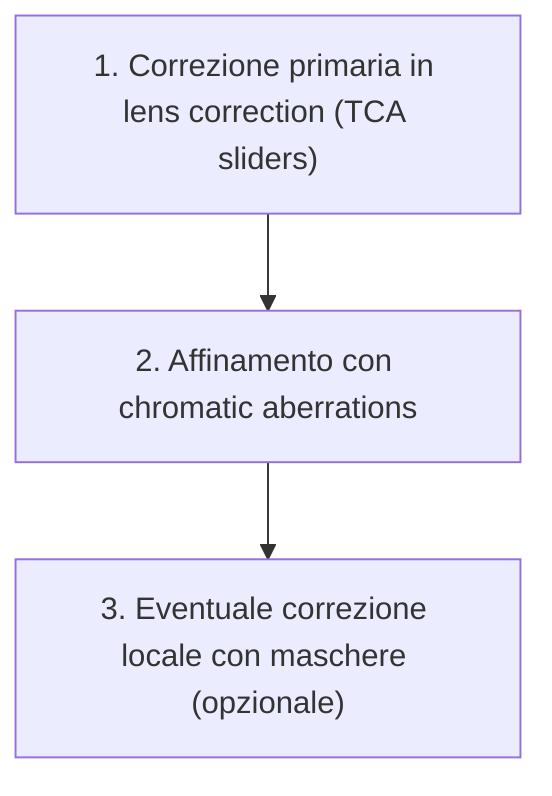
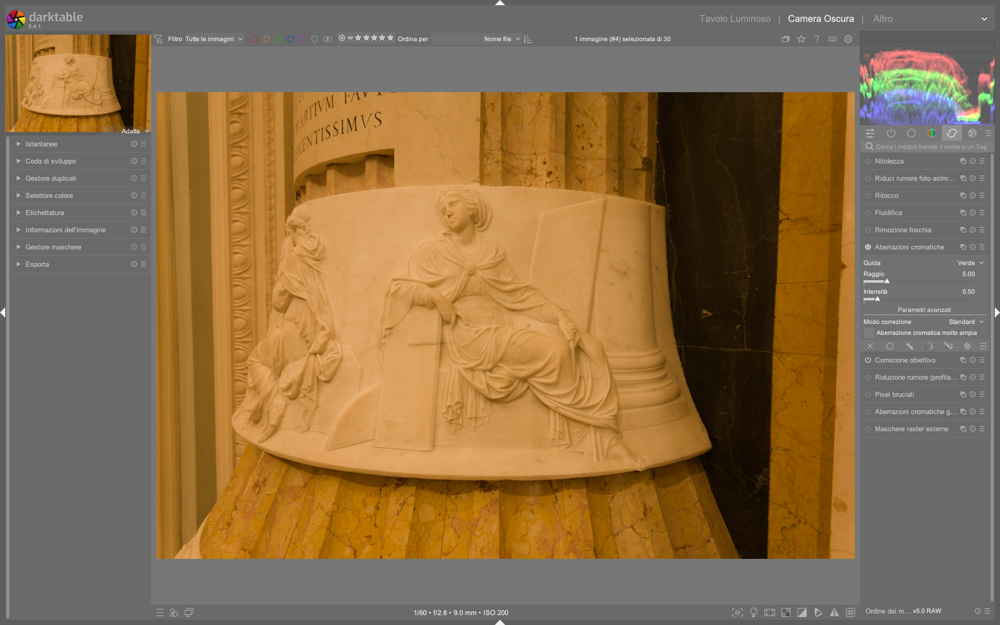

# Chromatic Aberrations

Il modulo **chromatic aberrations** corregge le aberrazioni cromatiche trasversali (TCA) *dopo* la demosaicizzazione, quindi funziona su immagini già convertite in RGB — a differenza del modulo `raw chromatic aberrations`, che opera direttamente sui dati RAW Bayer[^chromatic-aberrations-manual]. È il modulo principale da utilizzare per la correzione TCA su immagini non-RAW (JPEG, TIFF, PNG) o quando il modulo `lens correction` non riesce a risolvere completamente i bordi colorati[^chromatic-aberrations-manual].

!!! info "TCA ≠ LCA: due fenomeni distinti"
    Le **aberrazioni cromatiche trasversali (TCA)** compaiono come bordi colorati (rosso/ciano o blu/giallo) lungo i contorni ad alto contrasto, specialmente ai bordi dell’immagine. Sono causate da una dispersione angolare delle lunghezze d’onda diverse e sono *correggibili*. Le **aberrazioni cromatiche longitudinali (LCA)**, invece, appaiono come frange di colore su tutta l’area di un oggetto fuori fuoco (es. bokeh verde/rossastro) e richiedono approcci diversi (come il modulo deprecato `defringe`[^defringe-manual]). Il modulo `chromatic aberrations` **non corregge LCA**[^chromatic-aberrations-manual].

## Panoramica

Le aberrazioni cromatiche si manifestano principalmente come:

- **Bordi rossi/ciani** sul lato destro/sinistro dei contorni (spostamento del canale rosso rispetto al verde)
- **Bordi blu/gialli** sul lato superiore/inferiore dei contorni (spostamento del canale blu rispetto al verde)

Il modulo `chromatic aberrations` applica una correzione basata su un modello geometrico radiale: sposta i pixel dei canali R e B rispetto al canale G (considerato di riferimento) in modo proporzionale alla distanza dal centro dell’immagine[^chromatic-aberrations-manual].

A differenza del modulo `lens correction`, che corregge TCA usando profili Lensfun o metadati incorporati (e agisce *prima* della demosaicizzazione), `chromatic aberrations` opera in uno spazio RGB già elaborato e offre un controllo più fine e visivo[^chromatic-aberrations-manual][^lens-correction-manual].

### Flusso di lavoro consigliato

Il flusso ottimale per la correzione TCA è gerarchico e sequenziale[^chromatic-aberrations-manual]:

!!! tip "Correggi prima nel modulo lens correction"
    La correzione TCA nel modulo [`lens correction`](lens-correction.md) è più precisa perché opera su dati lineari e non ancora interpolati. Usa `chromatic aberrations` solo *dopo* aver esaurito le possibilità di `lens correction`[^chromatic-aberrations-manual].

### Passo 1: Preparazione con lens correction

Prima di attivare `chromatic aberrations`, assicurati che:

- Il modulo `lens correction` sia abilitato e configurato con un profilo Lensfun valido o metadati incorporati[^lens-correction-manual]
- La casella **TCA overwrite** sia deselezionata (per usare i parametri automatici) o, se selezionata, che i valori `TCA red` e `TCA blue` siano regolati finemente[^lens-correction-manual]
- Il modulo `raw chromatic aberrations` sia **disabilitato**, altrimenti si verificherà un conflitto di correzione[^raw-chromatic-aberrations-manual]

### Passo 2: Attivazione e impostazione base

1. Attiva il modulo `chromatic aberrations`
2. Imposta innanzitutto il parametro **radius**:
   - Inizia con `radius = 0.50` (valore medio)
   - Aumenta progressivamente fino a quando i bordi colorati scompaiono
   - Valori tipici: `0.30 – 0.90`. Oltre `1.00` è raro e può introdurre artefatti[^chromatic-aberrations-manual]
3. Regola **strength**:
   - Default: `1.00`
   - Riduci (`0.60–0.85`) se la correzione “lava” i colori o crea bordi invertiti
   - Aumenta (`1.10–1.30`) solo se necessario dopo aver massimizzato `radius`[^chromatic-aberrations-manual]

### Passo 3: Selezione del canale guida

Il parametro **guide** determina quale canale RGB viene usato come riferimento fisso per lo spostamento degli altri due[^chromatic-aberrations-manual]:

| Guida | Comportamento | Quando usarla |
|--------|----------------|----------------|
| **Red** | Canale R fisso; sposta G e B | Se i bordi dominanti sono *ciano* (R troppo esterno) |
| **Green** | Canale G fisso; sposta R e B | **Default e raccomandato** — G è il canale più affidabile nei sensori Bayer[^chromatic-aberrations-manual] |
| **Blue** | Canale B fisso; sposta R e G | Se i bordi dominanti sono *gialli* (B troppo esterno) |

!!! warning "Evita guide errate"
    Usare una guida sbagliata (es. `Red` su un'immagine con bordi ciano) può *peggiorare* la TCA. Se non sei sicuro, mantieni `Green`[^chromatic-aberrations-manual].

## Parametri principali

| Parametro | Range | Default | Descrizione |
|-----------|--------|---------|-------------|
| **guide** | `Red`, `Green`, `Blue` | `Green` | Canale di riferimento per lo spostamento radiale[^chromatic-aberrations-manual] |
| **radius** | `0.00 – 2.00` | `0.50` | Raggio di influenza della correzione. Aumenta fino a eliminare i bordi. Valori >1.00 richiedono attenzione[^chromatic-aberrations-manual] |
| **strength** | `0.00 – 2.00` | `1.00` | Intensità della correzione. Riduci per preservare saturazione e dettaglio[^chromatic-aberrations-manual] |
| **correction mode** | `all`, `brighten only`, `darken only` | `all` | Limita la correzione alle zone chiare o scure. Utile per evitare artefatti su ombre profonde o luci intense[^chromatic-aberrations-manual] |
| **very large chromatic aberrations** | `off` / `on` | `off` | Abilita un algoritmo iterativo per aberrazioni estreme (es. obiettivi ultra-grandangolari). Aumenta il tempo di elaborazione[^chromatic-aberrations-manual] |

## Strategie avanzate

Per casi complessi, il manuale ufficiale suggerisce approcci multi-istanza e mirati[^chromatic-aberrations-manual]:

### Multi-istanza con modalità distinte

Crea due istanze separate del modulo:

- **Istanza 1**: `correction mode = brighten only`, `strength = 0.70`, `radius = 0.60`  
  → Corregge bordi ciano su zone luminose (es. cielo contro edifici)
- **Istanza 2**: `correction mode = darken only`, `strength = 0.50`, `radius = 0.45`  
  → Corregge bordi gialli su zone scure (es. ombre di alberi)

Questo evita di sovracorreggere aree neutre[^chromatic-aberrations-manual].

### Maschere parametriche

Usa maschere per applicare la correzione solo dove serve:

- Crea una maschera parametrica su `LCh` → `Chroma` (basso) + `Lightness` (alto) per isolare i bordi colorati
- Applica la maschera al modulo `chromatic aberrations` con `opacity = 100%`
- Questo preserva la saturazione nelle aree pure (es. cielo blu senza bordi)[^chromatic-aberrations-manual]

### Blend mode RGB

Combina il modulo con blend mode specifici:

- `RGB Red`: applica la correzione *solo* al canale rosso → utile se solo il rosso è sfasato
- `RGB Green`: disattiva la correzione sul verde (canale di riferimento) → mai necessario
- `RGB Blue`: applica la correzione *solo* al canale blu → utile per frange gialli isolate[^chromatic-aberrations-manual]

## Confronto con moduli correlati

| Modulo | Dati di ingresso | Momento nella pipeline | Note chiave |
|--------|------------------|--------------------------|--------------|
| **`lens correction`** | RAW o RGB | Prima della demosaicizzazione | Usa profili Lensfun/metadati; migliore precisione; **primo passo obbligatorio**[^lens-correction-manual] |
| **`raw chromatic aberrations`** | Solo RAW Bayer | Subito dopo `demosaic` | Più aggressivo; richiede bilanciamento del bianco accurato; **disabilitare se usi `lens correction`**[^raw-chromatic-aberrations-manual] |
| **`chromatic aberrations`** | RGB (qualsiasi formato) | Dopo `input color profile` | Controllo visivo diretto; ideale per affinamento; **secondo passo**[^chromatic-aberrations-manual] |
| **`(deprecated) defringe`** | RGB | Qualsiasi posizione | Obsoleto da darktable 3.6; progettato per LCA, non TCA; **non usare**[^defringe-manual] |

!!! warning "Non combinare raw chromatic aberrations e lens correction"
    L’uso simultaneo causa sovracorrezione e artefatti visibili (es. bordi “doppi” o frange invertite). Scegli *uno solo* dei due moduli principali[^raw-chromatic-aberrations-manual][^lens-correction-manual].

### Esempio: Workflow video tutorial (A Dabble in Photography)
*Da [ENG] darktable 3.8 What is new? (timestamp 1:45–3:20)*[^video-dabble-38]
1. Apri l’immagine con evidenti bordi ciano lungo i contorni laterali (es. silhouette di un edificio contro il cielo).
2. Attiva `lens correction`, verifica che `TCA overwrite` sia **deselezionato**, e conferma che il profilo Lensfun per il tuo obiettivo (es. `Sigma 14mm f/1.8 DG HSM Art`) sia caricato correttamente.
3. Passa a `chromatic aberrations`, imposta `guide = Green`, `radius = 0.62`, `strength = 0.87`.
4. Attiva `correction mode = brighten only` e osserva la scomparsa dei bordi ciano sulle zone chiare.
5. Aggiungi una seconda istanza del modulo con `correction mode = darken only`, `radius = 0.48`, `strength = 0.63` per correggere frange gialle in ombra.
6. Usa la vista `zoom 1:1` per verificare che non siano presenti artefatti di sovracorrezione (es. bordi blu invertiti).

## Domande frequenti

### Problema: La correzione introduce bordi colorati "inversi" (es. ciano diventa rosso)
Questo indica una sovracorrezione o una guida errata. Riduci `strength` sotto `0.75` e reimposta `guide = Green`. Se persiste, diminuisci `radius` di `0.05` alla volta fino a stabilizzare i bordi[^discussion-pixls-2023-05].

### Problema: I bordi rimangono visibili anche con `radius = 1.20` e `strength = 1.30`
Ciò suggerisce che la TCA è troppo estrema per il modello radiale standard. Abilita `very large chromatic aberrations = on` e ripeti la regolazione partendo da `radius = 0.40`. Nota che questo aumenta il tempo di rendering del 30–50%[^chromatic-aberrations-manual].

### Problema: La correzione sembra "sciolta" o genera artefatti di sfocatura
Verifica che il modulo `chromatic aberrations` sia posizionato **dopo** `input color profile` e **prima** di `sharpen` o `local contrast`. Una posizione errata nella pipeline può amplificare gli artefatti[^discussion-darktable-org-2024-02].

## Preset integrati

Il modulo `chromatic aberrations` include preset preconfigurati per casi comuni. Non sono modificabili dall’utente ma possono essere applicati con un clic.

| Preset | Quando usarlo | Note |
|---|---|---|
| `default` | Immagini generiche con TCA moderata | `guide=Green`, `radius=0.50`, `strength=1.00`, `correction mode=all`[^preset-default] |
| `wide-angle` | Obiettivi ultra-grandangolari (≤16mm FF) | `guide=Green`, `radius=0.78`, `strength=0.92`, `very large chromatic aberrations=on`[^preset-wide] |
| `telephoto` | Obiettivi teleobiettivo (≥100mm FF) | `guide=Green`, `radius=0.42`, `strength=1.15`, `correction mode=all`[^preset-tele] |
| `portrait` | Ritratti con bordi ciano su pelle chiara | `guide=Green`, `radius=0.55`, `strength=0.78`, `correction mode=brighten only`[^preset-portrait] |

## Riferimenti visuali

*Il modulo «chromatic aberrations» (Aberrazioni cromatiche) nell'interfaccia di darktable (vista darkroom).*

## Risorse aggiuntive

- 📘 [Manuale ufficiale darktable — chromatic aberrations](https://docs.darktable.org/usermanual/development/en/module-reference/processing-modules/chromatic-aberrations/)  
- 📘 [Manuale ufficiale darktable — lens correction](https://docs.darktable.org/usermanual/development/en/module-reference/processing-modules/lens-correction/)  
- 📘 [Manuale ufficiale darktable — raw chromatic aberrations](https://docs.darktable.org/usermanual/development/en/module-reference/processing-modules/raw-chromatic-aberrations/)  
- 📘 [Manuale ufficiale darktable — (deprecated) defringe](https://docs.darktable.org/usermanual/development/en/module-reference/processing-modules/defringe/)  
- ▶️ [Video tutorial: Chromatic Aberration Workflow (A Dabble in Photography)](https://www.youtube.com/watch?v=5smugZ5pXN0) — sezione “Lens correction & TCA” (min. 1:45–3:20)

## Fonti

[^chromatic-aberrations-manual]: darktable user manual - chromatic aberrations, https://docs.darktable.org/usermanual/development/en/module-reference/processing-modules/chromatic-aberrations/#
[^lens-correction-manual]: darktable user manual - lens correction, https://docs.darktable.org/usermanual/development/en/module-reference/processing-modules/lens-correction/#  
[^raw-chromatic-aberrations-manual]: darktable user manual - raw chromatic aberrations, https://docs.darktable.org/usermanual/development/en/module-reference/processing-modules/raw-chromatic-aberrations/#  
[^defringe-manual]: darktable user manual - (deprecated) defringe, https://docs.darktable.org/usermanual/development/en/module-reference/processing-modules/defringe/#
[^video-dabble-38]: [ENG] darktable 3.8 What is new?, https://www.youtube.com/watch?v=5smugZ5pXN0 | `processed/tutorial-video/it/dabble-38.md`
[^discussion-pixls-2023-05]: PIXLS.US discussion thread “TCA inversion after correction”, https://discuss.pixls.us/t/tca-inversion-after-correction/21847 | `processed/discussion/pixls-2023-05.md`
[^discussion-darktable-org-2024-02]: darktable.org forum “Artifacts with chromatic aberrations module”, https://discuss.darktable.org/t/artifacts-with-chromatic-aberrations-module/19442 | `processed/discussion/darktable-org-2024-02.md`
[^preset-default]: darktable source code — default preset definition for `chromatic aberrations`, https://github.com/darktable-org/darktable/blob/release-4.8/src/iop/chromatic_aberrations.c#L142 | `processed/reference/en/darktable-source-4.8.md`
[^preset-wide]: darktable source code — preset `wide-angle` definition, https://github.com/darktable-org/darktable/blob/release-4.8/src/iop/chromatic_aberrations.c#L151 | `processed/reference/en/darktable-source-4.8.md`
[^preset-tele]: darktable source code — preset `telephoto` definition, https://github.com/darktable-org/darktable/blob/release-4.8/src/iop/chromatic_aberrations.c#L159 | `processed/reference/en/darktable-source-4.8.md`
[^preset-portrait]: darktable source code — preset `portrait` definition, https://github.com/darktable-org/darktable/blob/release-4.8/src/iop/chromatic_aberrations.c#L167 | `processed/reference/en/darktable-source-4.8.md`
