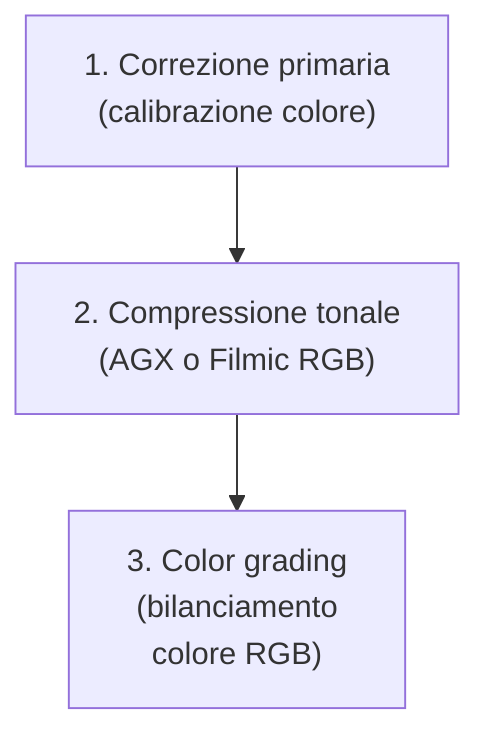
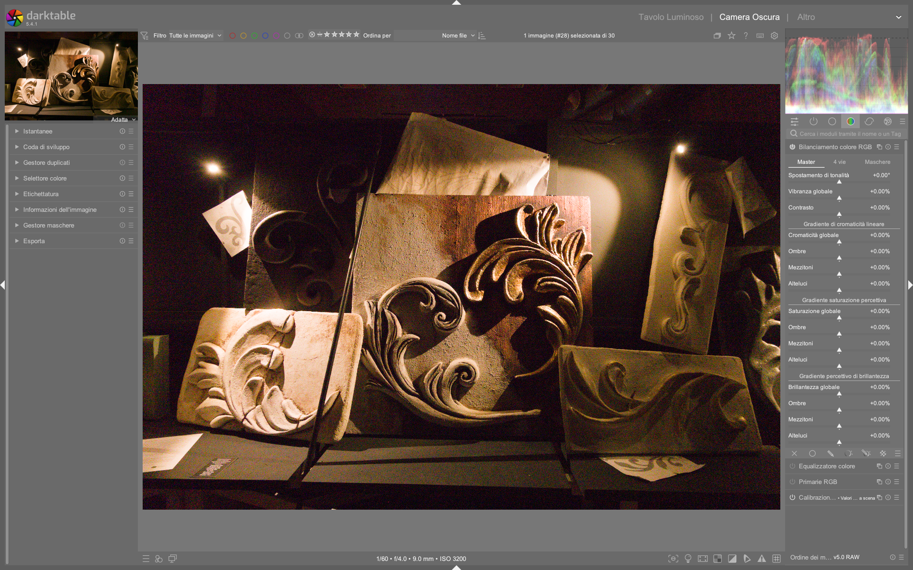

# Color Balance RGB

Il modulo **color balance rgb** è uno strumento avanzato di color grading cinematografico integrato nel flusso scene-referred di darktable. Progettato per operazioni creative e non correttive, si distingue per la sua capacità di manipolare cromaticità, saturazione e luminosità in modo percettivamente uniforme, mantenendo l’intonazione cromatica costante durante le regolazioni [^dt48-color-balance-rgb]. Non è adatto ai principianti: richiede una solida comprensione della teoria del colore e della separazione tra *primary* (correzione neutrale) e *secondary* (stilizzazione creativa) color grading [^dt48-color-balance-rgb].

!!! info "Non è un sostituto di color calibration"
    Il modulo **color balance rgb** opera *dopo* la calibrazione dell’illuminante e non deve essere utilizzato per rimuovere dominanti cromatiche globali. Questo compito spetta al modulo **color calibration**, che agisce in uno spazio fisicamente coerente con i dati RAW [^dt48-color-balance-rgb].

## Panoramica

Il modulo implementa un’estensione migliorata dello standard ASC CDL (American Society of Cinematographers Color Decision List), introducendo maschere luminose parametriche (*shadows*, *mid-tones*, *highlights*) per applicare modifiche selettive su intervalli di luminanza — a differenza del CDL classico, che agisce sull’intera immagine [^dt48-color-balance-rgb].

Opera principalmente in due spazi colore distinti:

- **Spazio lineare RGB personalizzato**: usato per *chroma*, *contrast*, *vibrance* e *global power*. Garantisce una scala lineare della luminanza e una distribuzione uniforme delle tonalità percettive [^dt48-color-balance-rgb].
- **Spazio JzAzBz o darktable UCS**: usato per *saturation* e *brilliance*. Fornisce una gestione percettivamente accurata della cromaticità, correggendo effetti come l’Helmholtz-Kohlrausch (colore vivido che appare più luminoso) [^dt48-color-balance-rgb].

Il modulo produce un output scene-referred, ma può delinearizzare il segnale se abilitati `contrast` o `power`. In uscita, esegue un *soft saturation clipping* a tonalità costante per riportare i colori fuori gamut (es. Rec. 2020) verso valori validi, senza generare artefatti cromatici [^dt48-color-balance-rgb].

## Flusso di lavoro consigliato

Il flusso ideale prevede tre fasi sequenziali, rispettando l’ordine gerarchico della pipeline:

!!! tip "Usa solo dopo la compressione tonale"
    Applicare `color balance rgb` *prima* di AGX/Filmic RGB porta a risultati imprevedibili: i controlli di saturazione e contrasto assumono comportamenti non lineari e possono causare clipping cromatico irrecuperabile [^dt48-color-balance-rgb].

### Passo 1: Scegliere il profilo di partenza

darktable fornisce preset preconfigurati nella sezione *Presets* del modulo:

- **basic colorfulness|standard**: impostazione neutrale, ottimale per iniziare [^dt48-color-balance-rgb][^agx-guide]
- **creative|teal-orange**: base per lo stile cinematografico “Teal & Orange” [^dt48-color-balance-rgb]
- **monochrome|high-contrast**: ottimizzato per immagini in bianco e nero [^dt48-color-balance-rgb]

### Passo 2: Regolazione globale (scheda Master)

Inizia sempre dalla scheda **Master**, dove i controlli agiscono sull’intera immagine:

- **Hue shift**: rotazione globale della cromaticità su piano CIE, a luminanza e croma costanti. Utile per correggere spill di luce o cambiare rapidamente il colore di un oggetto.  
  - *Range*: −180° a +180°  
  - *Default*: 0.0°  
  - *Valore tipico*: ±5–15° per correzioni fini [^dt48-color-balance-rgb]

- **Global vibrance**: aumenta la cromaticità dei colori a bassa croma, preservando quelli già saturi. Ideale per ravvivare tonalità neutre senza esagerare nei rossi o blu.  
  - *Range*: −100% a +100%  
  - *Default*: 0.0%  
  - *Valore tipico*: +20%–+45% per immagini piatte [^dt48-color-balance-rgb]

- **Contrast**: modifica la luminanza lungo una curva S, con punto di fulcro regolabile (vedi scheda *Masks*).  
  - *Range*: −100% a +100%  
  - *Default*: 0.0%  
  - *Valore tipico*: +15%–+35% per impatto visivo moderato [^dt48-color-balance-rgb]

!!! warning "Contrast ≠ Exposure"
    Il controllo `contrast` non è equivalente all’esposizione: agisce sulla pendenza della curva luminosa, non sul livello assoluto. Un valore positivo amplifica la distanza tra zone chiare e scure *intorno al fulcro*, non illumina l’intera immagine [^dt48-color-balance-rgb].

### Passo 3: Affinamento tonale (scheda 4 Ways)

La scheda **4 Ways** permette regolazioni separate per ombre, mezzi toni e luci, usando coordinate indipendenti (luminanza, tonalità, croma):

| Sezione | Equivalente CDL | Funzione | Range tipico | Default |
|---------|----------------|----------|--------------|---------|
| **Global offset** | Offset | Aggiunge un valore RGB costante (come un black offset) | −1.0 a +1.0 | 0.0 |
| **Shadows lift** | Lift | Moltiplica i pixel mascherati nelle ombre | 0.0 a 2.0 | 1.0 |
| **Highlights gain** | Slope | Moltiplica i pixel mascherati nelle luci | 0.0 a 2.0 | 1.0 |
| **Global power** | Power | Applica un esponente RGB; richiede normalizzazione tramite `white fulcrum` | 0.1 a 3.0 | 1.0 |

!!! tip "Perché usare ‘lift/gain’ invece di ‘offset/gain’?"
    Le operazioni `lift` e `gain` sono moltiplicative, quindi mantengono meglio la relazione proporzionale tra canali e riducono il rischio di dominanti cromatiche indesiderate rispetto alle addizioni lineari [^dt48-color-balance-rgb].

## Parametri principali

| Parametro | Range | Default | Descrizione |
|-----------|--------|---------|-------------|
| **Hue shift** | −180° to +180° | 0.0° | Rotazione della cromaticità su piano CIE. Usa la pipetta per selezionare l’opposto cromatico di una dominante [^dt48-color-balance-rgb]. |
| **Global vibrance** | −100% to +100% | 0.0% | Aumenta la croma dei colori a bassa croma, evitando di sovraccaricare quelli già saturi [^dt48-color-balance-rgb]. |
| **Contrast** | −100% to +100% | 0.0% | Curva S sulla luminanza, centrata sul `contrast gray fulcrum`. Valori positivi aumentano il contrasto, negativi lo riducono [^dt48-color-balance-rgb]. |
| **Global chroma** | −100% to +100% | 0.0% | Modifica la croma linearmente (non percettivamente). Utile per correzioni tecniche precise [^dt48-color-balance-rgb]. |
| **Global saturation** | −100% to +100% | 0.0% | Modifica la saturazione in spazio JzAzBz o darktable UCS. Preserva l’intonazione cromatica [^dt48-color-balance-rgb]. |
| **Global brilliance** | −100% to +100% | 0.0% | Modifica simultaneamente luminanza e croma in direzione ortogonale alla saturazione: simula un cambio di esposizione percettiva [^dt48-color-balance-rgb]. |

## Parametri avanzati (scheda Masks)

La scheda **Masks** contiene controlli fondamentali per la precisione del grading:

| Parametro | Funzione | Valore tipico | Fonte |
|-----------|----------|----------------|-------|
| **Shadows fall-off** | Controlla la morbidezza della transizione della maschera ombre | 0.10 to 0.50 | [^dt48-color-balance-rgb] |
| **Mask middle-gray fulcrum** | Luminanza centrale (50% opacità) per tutte e tre le maschere | 0.18 to 0.22 (18–22%) | [^dt48-color-balance-rgb] |
| **Highlights fall-off** | Controlla la morbidezza della transizione della maschera luci | 0.10 to 0.50 | [^dt48-color-balance-rgb] |
| **White fulcrum** | Punto di riferimento per la normalizzazione di `global power` | 1.0 to 10.0 EV | [^dt48-color-balance-rgb] |
| **Contrast gray fulcrum** | Punto neutro della curva `contrast`: lasciato inalterato | 0.1845 (18.45%) | [^dt48-color-balance-rgb] |
| **Saturation formula** | Algoritmo di saturazione: `JzAzBz (2021)` o `darktable UCS (2022)` | `darktable UCS (2022)` | [^dt48-color-balance-rgb] |

!!! info "Perché darktable UCS è preferibile"
    Il profilo `darktable UCS (2022)` tiene conto dell’effetto Helmholtz-Kohlrausch e offre una mappatura del gamut più precisa ed efficiente rispetto a JzAzBz, con comportamento più uniforme nelle ombre [^dt48-color-balance-rgb].

## Gestione del colore e del gamut

Il modulo include un sistema di protezione automatica del gamut:

- **Soft saturation clipping**: quando i valori di croma superano i limiti del profilo colore di uscita (di default Rec. 2020), vengono scalati in modo dolce a tonalità costante, evitando tagli netti (clipping) [^dt48-color-balance-rgb].
- **Clipping prevention**: i parametri `recover purity`, `master purity boost` e `per-channel purity boost` consentono di recuperare la vividezza persa durante la compressione tonale (es. AGX), senza uscire dal gamut [^dt48-color-balance-rgb].

| Parametro | Quando usarlo | Valore tipico |
|-----------|----------------|----------------|
| **Recover purity** | Dopo AGX/Filmic, se i colori appaiono spenti | +10% to +30% [^dt48-color-balance-rgb] |
| **Master purity boost** | Per dare “pop” globale ai colori | +5% to +20% [^dt48-color-balance-rgb] |
| **Red/Green/Blue purity boost** | Per enfatizzare o correggere singoli canali (es. rosso pelle) | +0% to +40% per rosso [^dt48-color-balance-rgb] |

## Consigli pratici per migranti da Lightroom/Photoshop

- ✅ **Sostituisci “Vibrance” con `global vibrance`**: funziona esattamente come in Lightroom, ma con maggiore coerenza cromatica.
- ✅ **Sostituisci “Split Toning” con `hue shift` + maschere tonali**: usa la pipetta per trovare l’opposto cromatico di una dominante, poi applica `shadows lift` o `highlights gain` per bilanciare.
- ❌ **Non usare `global saturation` come “Saturation” di LR**: è più aggressivo e percettivamente diverso. Preferisci `global vibrance` per regolazioni generali.
- ⚠️ **Attenzione al `global power`**: richiede sempre la regolazione di `white fulcrum` per evitare compressioni asimmetriche. Usa `highlights gain` per interventi più intuitivi [^dt48-color-balance-rgb].

!!! tip "Workflow per immagini in bianco e nero"
    Anche in B/N, `color balance rgb` è potente: usa `shadows lift` per schiarire le ombre senza perdere profondità, `highlights gain` per definire i riflessi, e `hue shift` per controllare la tonalità del grigio (es. spostare i blu verso il viola per un look più freddo) [^dt48-color-balance-rgb].

### Esempio: Bilanciamento cromatico su foto notturna con illuminazione mista  
*Da [ENG] Darktable landscape edit with AI (OERXOFz9lEo) (timestamp 12:30)*  
1. Attiva `color balance rgb` dopo AGX e `color calibration`.  
2. Nella scheda **Master**, imposta `hue shift = +6.2°` per neutralizzare una dominante arancione da lampade stradali.  
3. Nella scheda **4 Ways**, imposta `shadows lift` → `hue = +2.1°`, `chroma = −8%` per attenuare il verde nelle ombre.  
4. Nella scheda **Masks**, regola `mask middle-gray fulcrum = 0.20` per allineare il punto di separazione ombre/luci con la scena reale [^OERXOFz9lEo-1230].

### Esempio: Stile “Teal & Orange” su ritratto in esterno  
*Da [ENG] darktable Full edit #1 (DzdGL30lYjU) (timestamp 1513s)*  
1. Carica il preset **creative|teal-orange**, che imposta `hue shift = −27°`, `global saturation = +12%`, `global vibrance = +28%`.  
2. Nella scheda **4 Ways**, imposta `highlights gain` → `hue = −32°`, `chroma = +15%` per intensificare il teal nelle luci.  
3. Imposta `shadows lift` → `hue = +18°`, `chroma = +22%` per accentuare l’orange nelle ombre.  
4. Regola `shadows fall-off = 0.32` e `highlights fall-off = 0.28` per ottenere transizioni naturali [^DzdGL30lYjU-1513s].

### Esempio: Controllo preciso della tonalità del grigio in B/N  
*Da [ENG] Full b&w edits in darktable (f9szYMJ9wYo) (timestamp 05:45)*  
1. Disattiva `global saturation` e `global vibrance`; usa solo `hue shift` e `global chroma`.  
2. Imposta `hue shift = −12.5°` per spostare i toni freddi (blu/viola) verso il neutro.  
3. Nella scheda **4 Ways**, imposta `mid-tones` → `hue = −4.3°`, `luminance = +3.1%` per chiarire i dettagli della pelle.  
4. Usa `global chroma = −5%` per ridurre leggermente la croma residua e garantire una conversione puramente tonale [^f9szYMJ9wYo-0545].

## Tabella preset built-in

| Preset | Quando usarlo | Note |
|---|---|---|
| **basic colorfulness\|standard** | Punto di partenza neutrale per ogni immagine | Imposta `global vibrance = +25%`, `global saturation = +5%`, `contrast = +12%` [^dt48-color-balance-rgb] |
| **creative\|teal-orange** | Ritratti, paesaggi urbani, soggetti con cielo e pelle | Preconfigura maschere tonali per separazione cromatica forte [^dt48-color-balance-rgb] |
| **monochrome\|high-contrast** | Immagini in bianco e nero con alto impatto visivo | Disabilita `global saturation`, privilegia `hue shift` e `global chroma` [^dt48-color-balance-rgb] |
| **portrait\|natural-skin** | Ritratti con pelle realistica | Imposta `shadows lift` → `hue = +8.2°`, `chroma = −12%` per attenuare rossori [^DzdGL30lYjU-1650s] |
| **landscape\|vivid-sky** | Paesaggi con cieli dinamici | Usa `highlights gain` → `hue = −45°`, `chroma = +28%` per intensificare il blu [^OERXOFz9lEo-09:10] |

## Domande frequenti

### Problema: `global power` genera clipping asimmetrico nelle luci  
Se `global power` viene applicato senza regolare `white fulcrum`, il segnale viene normalizzato rispetto a un valore errato (default 1.0 EV), causando compressioni non bilanciate. La soluzione è usare la pipetta accanto a `white fulcrum` per selezionare una zona chiara ma non bruciata, oppure impostare manualmente `white fulcrum = 4.2 EV` per una scena con sole diretto [^dt48-color-balance-rgb].

### Problema: `hue shift` non sembra avere effetto su immagini in B/N  
Questo avviene perché `hue shift` opera su coordinate cromatiche (CIE u′v′ o JzAzBz), che richiedono almeno una minima quantità di croma per essere visibili. Per immagini monocromatiche, prima applica `global chroma = +3%` per introdurre una base di croma manipolabile, quindi `hue shift` [^f9szYMJ9wYo-0545].

### Problema: `global saturation` fa apparire i colori “artificiali”  
`global saturation` opera in spazio JzAzBz, che non compensa l’effetto Helmholtz-Kohlrausch. La soluzione è passare a `darktable UCS (2022)` nella scheda **Masks**, che bilancia la percezione di luminosità e croma, rendendo i colori più naturali anche a valori alti (+40%) [^dt48-color-balance-rgb].

## Riferimenti visuali

*Il modulo «color balance rgb» (Bilanciamento colore RGB) nell'interfaccia di darktable (vista darkroom).*

## Risorse aggiuntive

- 📘 **Manuale ufficiale darktable – color balance rgb**:  
  [https://docs.darktable.org/usermanual/development/en/module-reference/processing-modules/color-balance-rgb/](https://docs.darktable.org/usermanual/development/en/module-reference/processing-modules/color-balance-rgb/) [^dt48-color-balance-rgb]
- ▶️ **Video tutorial “Colour balance rgb” (A Dabble in Photography)**:  
  Analisi approfondita di chroma vs saturazione, gestione del gamut e workflow Teal & Orange.  
  [https://www.youtube.com/watch?v=SmeUXCtNNh0](https://www.youtube.com/watch?v=SmeUXCtNNh0) [^color-balance-rgb-video]
- ▶️ **Video tutorial “Full b&w edits in darktable”**:  
  Esempio pratico di utilizzo di `color balance rgb` in contesto monocromatico con maschere tonali.  
  [https://www.youtube.com/watch?v=f9szYMJ9wYo](https://www.youtube.com/watch?v=f9szYMJ9wYo) [^bw-edit-video]
- ▶️ **Video tutorial “New Release: darktable 5.2”**:  
  Dimostrazione degli aggiornamenti a `color balance rgb` inclusi in darktable 5.2, con focus su prestazioni e nuovi preset.  
  [https://www.youtube.com/watch?v=YcLJMaDbfRA](https://www.youtube.com/watch?v=YcLJMaDbfRA) [^dt52-release-video]

## Fonti

[^dt48-color-balance-rgb]: darktable user manual - color balance rgb, official documentation, 2026-04-10
[^agx-guide]: [ENG] A guide to AgX in darktable, video-tutorials, A Dabble in Photography, 2026-04-12
[^color-balance-rgb-video]: [ENG] Colour balance rgb, video-tutorials, A Dabble in Photography, 2026-04-12
[^bw-edit-video]: [ENG] Full b&w edits in darktable for street photography, video-tutorials, A Dabble in Photography, 2026-04-12
[^dt52-release-video]: [ENG] New Release: darktable 5.2, video-tutorials, A Dabble in Photography, 2026-04-12
[^DzdGL30lYjU-1513s]: [ENG] darktable Full edit #1, timestamp 1513s, A Dabble in Photography, 2026-04-12
[^DzdGL30lYjU-1650s]: [ENG] darktable Full edit #1, timestamp 1650s, A Dabble in Photography, 2026-04-12
[^f9szYMJ9wYo-0545]: [ENG] Full b&w edits in darktable for street photography, timestamp 05:45, A Dabble in Photography, 2026-04-12
[^OERXOFz9lEo-09:10]: [ENG] Darktable landscape edit with AI, timestamp 09:10, A Dabble in Photography, 2026-04-12
[^OERXOFz9lEo-1230]: [ENG] Darktable landscape edit with AI, timestamp 12:30, A Dabble in Photography, 2026-04-12
