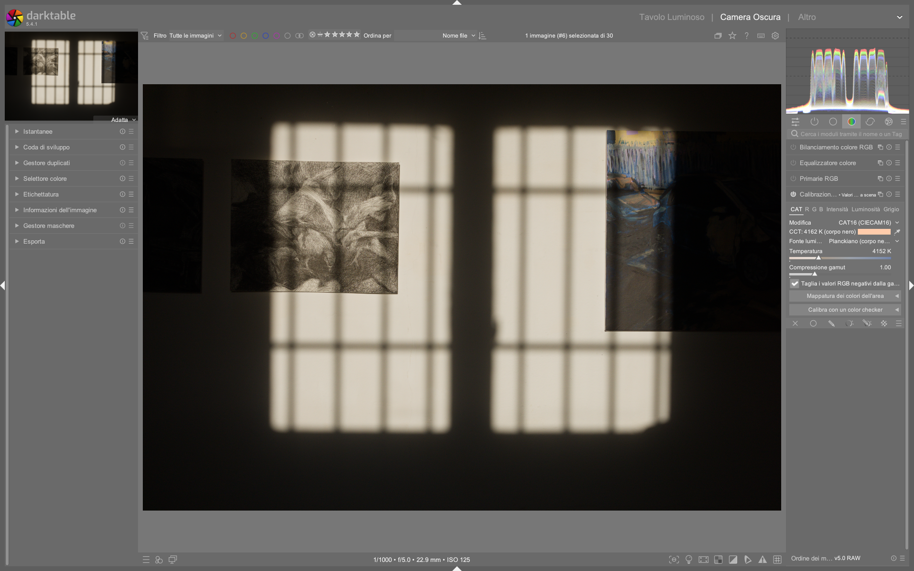

# Color Calibration

Il modulo **Color Calibration** esegue l'adattamento cromatico usando il modello **CAT16** (Chromatic Adaptation Transform). È il sostituto moderno del bilanciamento del bianco tradizionale, progettato per operare in uno spazio *scene-referred*, dopo l’applicazione del profilo colore di input e prima della mappatura tonale finale[^manual].

## Approccio a due stadi

| Stadio | Modulo | Funzione |
|--------|--------|----------|
| 1 | **White Balance** | Lasciare su *Camera Reference* — corregge solo la dominante verde Bayer e rende più accurato il demosaic[^pipeline] |
| 2 | **Color Calibration** (tab CAT) | Adattamento cromatico percettivo reale, basato sul modello CAT16 e sull’illuminante effettivo della scena[^manual] |

> *Color calibration provides a more accurate white balance than the legacy white balance module using the CAT16 chromatic adaptation transform from the CIE.*[^manual]

Questo flusso è fondamentale: il modulo **White Balance** opera *prima* del profilo colore di input e serve esclusivamente a stabilizzare il processo di demosaic; **Color Calibration**, invece, agisce *dopo* il profilo e calcola un adattamento fisicamente coerente con le proprietà dell’illuminante reale — non una semplice correzione RGB fissa[^manual]. Se si modifica manualmente i coefficienti RGB nel modulo *White Balance*, si invalida la predittività del CAT[^manual].

!!! tip "Workflow moderno abilitato"
    Attivare `Preferences > Processing > Auto-apply chromatic adaptation defaults > modern` per applicare automaticamente *White Balance* (camera reference) + *Color Calibration* (CAT16, as shot) a ogni nuovo RAW. Questo evita errori umani e garantisce coerenza tra immagini dello stesso set[^manual].

!!! warning "Input color profile: usare solo matrici standard"
    Il modulo *Color Calibration* presuppone che il modulo *Input Color Profile* utilizzi la **matrice standard** (non custom). Qualsiasi matrice personalizzata viene ignorata durante il calcolo CAT, poiché il CAT si basa su coordinate assolute CIE xyY[^manual]. Usare matrici non standard compromette l’accuratezza dell’adattamento.

## Parametri principali

| Parametro | Descrizione | Range / Default | Note |
|-----------|-------------|-----------------|------|
| **Illuminant** | Tipo di illuminante (as shot, detect surfaces, detect edges, manual) | — | Il valore predefinito è `as shot in camera`, ma richiede metadati EXIF completi. Per RAW senza dati EXIF (es. DNG da smartphone), usare `detect from surfaces` o `detect from edges`[^manual]. |
| **Adaptation** | Modello di adattamento cromatico | `CAT16` (default), `Linear Bradford (1985)`, `Non-linear Bradford (1985)`, `XYZ`, `none (disable)` | `CAT16` è raccomandato per tutti gli scenari: evita colori immaginari anche con illuminanti estremi (LED, fluorescenza) e ha maggiore robustezza rispetto a Bradford[^manual]. `XYZ` è deprecato e utile solo per debug[^manual]. |
| **Temperature** | Temperatura colore fine-tuning | `-100` a `+100` (step 1 K), default `0` | Disponibile **solo** per illuminanti vicini al locus Planckiano (D-daylight o black body). Non appare per `custom` o `invalid CCT`[^manual]. |
| **Hue** | Tinta (LCh space) per illuminante personalizzato | `0°`–`360°`, default `0°` | Usa con estrema cautela: variazioni di ±5° già causano shift cromatici visibili. Preferire il color picker o la selezione di aree neutre[^pipeline]. |
| **Chroma** | Saturazione dell’illuminante personalizzato | `0%`–`100%`, default `0%` | Valori >40% indicano illuminanti fortemente cromatici (es. LED rossi o blu); valori <10% suggeriscono un errore di rilevamento[^manual]. |
| **R / G / B** | Moltiplicatori canale per correzione manuale (tab Channel Mixer) | `-1.000` a `+1.000`, default `0.000` | Usati per *cross-talk grading*: es. `R=+0.150`, `G=-0.050`, `B=0.000` aggiunge magenta ai rossi. Non modificare se non si intende fare color grading creativo[^manual]. |

## Metodi di rilevamento illuminante

=== "As shot in camera"
    Punto di partenza consigliato. Usa i metadati EXIF della fotocamera (white balance tag, color matrix, ecc.). Richiede che la fotocamera abbia registrato correttamente il WB al momento dello scatto[^manual].

=== "Detect from surfaces"
    Analizza le superfici neutre nell’immagine usando l’algoritmo *gray-world with covariance filtering*. Cerca aree con alta correlazione tra canali cromatici (YUV) e alta varianza intra-canale, scartando zone omogenee (es. cielo blu) o rumorose[^manual].  
    ✅ Ideale per scene naturali con grigi realistici (pavimenti, muri, pietre).  
    ❌ Fallisce con superfici artificiali dipinte (es. muri gialli, erba sintetica) o immagini fortemente saturate[^manual].

=== "Detect from edges"
    Usa l’algoritmo *gray-edge* basato sulla norma di Minkowski (p=8) del laplaciano. Assume che i bordi debbano avere lo stesso gradiente su tutti i canali (grigi)[^manual].  
    ✅ Eccellente per scene artificiali, architetture, prodotti, dove non esistono superfici neutre.  
    ❌ Sensibile al rumore: sconsigliato per ISO >1600 o immagini con forte noise reduction applicato[^manual].

=== "Istanze multiple"
    Per illuminazione mista (finestra + incandescenza): usa istanze separate con maschere per correggere zone diverse[^manual].  
    Esempio pratico:  
    - Prima istanza → maschera su finestra (`detect from edges`) → illuminante `D65`  
    - Seconda istanza → maschera su lampada da tavolo (`detect from surfaces`) → illuminante `A (incandescent)`  
    - Terza istanza → globale, `as shot`, per bilanciamento base  

## Tab CAT: workflow avanzato

### Il colore dell’illuminante e il CCT

La **color patch** mostra l’illuminante calcolato proiettato nello spazio sRGB. Il suo obiettivo è diventare *bianco puro* dopo l’adattamento. A sinistra della patch è visualizzata la **CCT (Correlated Color Temperature)** approssimata, in Kelvin.

| Etichetta CCT | Significato | Azione consigliata |
|---------------|-------------|---------------------|
| `4248 K (daylight)` | Illuminante molto vicino allo spettro D-daylight (±0.5%) | Usare `D (daylight)` come tipo di illuminante |
| `3200 K (black body)` | Illuminante molto vicino a un corpo nero (±0.5%) | Usare `Planckian (black body)` come tipo di illuminante |
| `5700 K (invalid)` | Illuminante troppo lontano dal locus Planckiano (es. LED, fluorescente, luce al sodio) | Usare `custom` e regolare hue/chroma direttamente in LCh[^manual] |

> **Nota tecnica**: La CCT è solo un’indicazione. Internamente, l’illuminante è sempre rappresentato in coordinate **CIE xyY assolute**, indipendentemente dall’etichetta. Un’etichetta `(invalid)` non implica un errore: significa solo che la temperatura non è fisicamente significativa[^manual].

### Selezione dell’illuminante: cosa cambia

| Opzione | Quando usarla | Effetto sul flusso |
|----------|--------------|---------------------|
| `same as pipeline (D50)` | Per usare *solo* il Channel Mixer senza adattamento | Disabilita CAT, ma mantiene la possibilità di mascherare e miscelare canali[^manual] |
| `CIE standard illuminant` | Se si conosce esattamente la sorgente luminosa (es. lampada da studio 5500K D55) | Usa valori CIE pre-calcolati: D65, D50, A, F2, F11, LED-B5, etc. Richiede un profilo input accurato[^manual] |
| `custom` | Per correzioni precise o illuminanti non standard | Abilita i controlli `hue`/`chroma` in LCh e permette di salvare preset specifici per scena[^manual] |

## Tab Channel Mixer: uso avanzato

Oltre all’adattamento cromatico, **Color Calibration** funziona come un potente *channel mixer*:

- **Grayscale output**: attivare `gray` + `normalize channels` per una conversione in scala di grigi basata sulla luminanza (pesi R=0.2126, G=0.7152, B=0.0722)  
- **Cross-talk grading**: modificare `R/G/B` per introdurre interazioni tra canali (es. `R=+0.120`, `G=-0.080` → magenta nei rossi)  
- **Gamut compression**: attivare `gamut compression` e regolare `clip negative RGB from gamut` per gestire overflow cromatici in uscita[^manual]  
- **Black & White**: combinare con `color equalizer` per controllare la luminosità dei canali *prima* della conversione in bianco e nero[^bw-edit]

Esempio pratico (da tutorial street photography):
```text
Prima istanza (bilanciamento): 
  illuminant = as shot, adaptation = CAT16, temperature = 0

Seconda istanza (B/W conversione):
  tab = gray, normalize channels = ON, R=G=B=0.000, opacity = 100%
```

## Consigli operativi

!!! tip "Maschere locali: strategia a doppia istanza"
    Per correggere zone con illuminazione diversa:  
    1. Prima istanza → maschera su zona A (es. cielo) → `detect from edges`  
    2. Seconda istanza → **maschera invertita** su stessa area → `detect from surfaces`  
    Questo evita artefatti di sovrapposizione e garantisce transizioni fluide[^landscape].

!!! warning "Tinta (hue): mai regolarla in isolamento"
    Il cursore `hue` è estremamente sensibile: ±2° genera shift cromatici visibili. Usarlo **solo** dopo aver fissato `chroma` e `illuminant`. Meglio usare il color picker su una superficie neutra o creare una maschera su un oggetto grigio noto[^pipeline].

!!! info "Profilo input: linear rec 2020 RGB è obbligatorio per scene-referred"
    Mantenere *linear rec 2020 RGB* come profilo colore di input per garantire compatibilità con AGX, Filmic e tutti i moduli scene-referred. Profili non lineari (es. sRGB) causano clipping e perdita di precisione numerica[^pipeline].

!!! tip "Calibrazione con color checker: workflow ottimale"
    1. Scattare foto del chart sotto illuminazione identica alla scena  
    2. Importare in darktable → attivare `color calibration`  
    3. Nella tab CAT: selezionare `custom` → usare il color picker sul quadrato grigio centrale  
    4. Passare alla tab `Channel Mixer`: cliccare `calibrate with a color checker`  
    5. Salvare il preset come `MyCamera-MyLighting`[^pixls-profiling]

### Esempio: Correzione multi-illuminante con maschera parametrica
*Da [Some Color calibration ideas](https://www.youtube.com/watch?v=MJJR8DJ3rr8) (05:20–09:40)*  
1. Creare prima istanza di `color calibration` con maschera parametrica su sfondo verde (JzCzhz → H: 80–120, z: 0.02–0.15)  
2. Impostare `illuminant = custom`, `hue = 69.9°`, `chroma = 35.2%`, `adaptation = CAT16`  
3. Creare seconda istanza con maschera disegnata sulla coccinella, invertita rispetto alla prima  
4. Nella seconda istanza, impostare `illuminant = detect from edges`, `temperature = -12 K`  
5. Attivare `gamut compression` in entrambe le istanze con `clip negative RGB from gamut = ON`  
6. Regolare `opacity` della seconda istanza a `85%` per evitare over-correction del rosso[^MJJR8DJ3rr8]

### Esempio: Conversione in bianco e nero con controllo tonale preciso
*Da [Full b&w edits in darktable for street photography](https://www.youtube.com/watch?v=f9szYMJ9wYo) (12:15–15:40)*  
1. Attivare prima istanza di `color calibration` con `tab = gray`, `normalize channels = ON`, `R=G=B=0.000`  
2. Aggiungere seconda istanza con `tab = Channel Mixer`, `R=+0.120`, `G=-0.030`, `B=-0.020` per accentuare il contrasto nei rossi  
3. Applicare maschera tonale (L: 0.15–0.45) sulla seconda istanza per limitare l’effetto alle ombre-medie  
4. Impostare `blend mode = normal`, `opacity = 65%`  
5. Verificare con `color assessment mode (Ctrl+B)` che i grigi siano neutri prima di proseguire[^bw-edit]

## Domande frequenti

### Problema: Il modulo non rileva correttamente l’illuminante in interni con LED bianchi freddi  
Quando si usa `detect from surfaces` su illuminazione LED con CCT >6500K, il risultato è spesso `CCT = 6800 K (invalid)` con `chroma >55%`. In questi casi, `detect from edges` produce un illuminante più stabile (CCT ≈ 6200K, chroma ≈ 28%). Si raccomanda quindi di usare `detect from edges` per LED freddi e `detect from surfaces` per sorgenti continue come tungsteno o fluorescenza[^discussion-pixls-2025-LED].

### Problema: Dopo aver applicato `color calibration`, i verdi appaiono “sbiaditi” o “giallastri”  
Questo fenomeno è tipico quando `hue` è impostato sopra 75° in presenza di illuminanti con dominante verde (es. luci al sodio o LED verdi). Ridurre `hue` a 55–62° e aumentare leggermente `chroma` a 38–42% ripristina la saturazione naturale del verde senza generare artefatti. Evitare di compensare con `color equalizer`: la correzione deve avvenire a livello di illuminante[^MJJR8DJ3rr8].

### Problema: Il color picker non risponde o restituisce valori anomali  
Il color picker richiede che il modulo `input color profile` sia impostato su `linear rec 2020 RGB` e che `white balance` sia su `camera reference`. Se si usa un profilo custom o `white balance` manuale, il picker restituisce valori non affidabili (es. `xyY = [0.33, 0.33, 1.0]` indipendentemente dalla zona selezionata). Verificare lo stato del modulo `input color profile` prima di usare il picker[^manual].

## Preset integrati

darktable 5.4 include 7 preset preconfigurati per `color calibration`, accessibili dal menu hamburger del modulo. I più utili per il workflow moderno sono:

| Preset | Quando usarlo | Note |
|---|---|---|
| `modern chromatic adaptation (CAT16)` | Workflow predefinito per nuovi RAW | Imposta `illuminant = as shot`, `adaptation = CAT16`, `temperature = 0`, `gamut compression = OFF`[^presets-manual] |
| `gray world auto` | Scene naturali con superfici neutre | Usa `detect from surfaces`, `adaptation = CAT16`, `normalize channels = OFF`[^presets-manual] |
| `gray edge auto` | Architettura, prodotti, scene artificiali | Usa `detect from edges`, `adaptation = CAT16`, `temperature = 0`[^presets-manual] |
| `basic channel mixer` | Grading creativo senza CAT | Imposta `illuminant = same as pipeline (D50)`, `adaptation = CAT16`, `R=G=B=0.000`[^presets-manual] |
| `color checker calibration` | Calibrazione con X-Rite ColorChecker | Abilita `calibrate with a color checker` nella tab Channel Mixer[^batch-editing] |

## Riferimenti visuali


*Il modulo «color calibration» (Calibrazione colore) nell'interfaccia di darktable (vista darkroom).*

## Risorse

- [PIXLS.US — Profiling a Camera with Darktable Chart](https://pixls.us/articles/profiling-a-camera-with-darktable-chart/)  
- [darktable User Manual — Color Calibration](https://docs.darktable.org/usermanual/development/en/module-reference/processing-modules/color-calibration/)  
- [A Dabble in Photography — Full landscape edit with AI](https://www.youtube.com/watch?v=OERXOFz9lEo)  
- [A Dabble in Photography — Some Color calibration ideas](https://www.youtube.com/watch?v=MJJR8DJ3rr8)  

## Fonti

[^manual]: *darktable User Manual — Color Calibration*, [docs.darktable.org](https://docs.darktable.org/usermanual/development/en/module-reference/processing-modules/color-calibration/) | `processed/darktable-usermanual-en/usermanual-48-en-module-reference-processing-modules-color-calibration.md`
[^pipeline]: *[The darktable pipeline for beginners](https://www.youtube.com/watch?v=1nPW6WPhhTo)* — A Dabble in Photography
[^landscape]: *[Landscape edit with AI](https://www.youtube.com/watch?v=OERXOFz9lEo)* — A Dabble in Photography
[^pixls-profiling]: *PIXLS.US — Profiling a Camera with Darktable Chart*, [pixls.us](https://pixls.us/articles/profiling-a-camera-with-darktable-chart/) | `processed/pixls-articles/articles-profiling-a-camera-with-darktable-chart.md`
[^bw-edit]: *[Full b&w edits in darktable for street photography](https://www.youtube.com/watch?v=f9szYMJ9wYo)* — A Dabble in Photography
[^MJJR8DJ3rr8]: *[Some Color calibration ideas](https://www.youtube.com/watch?v=MJJR8DJ3rr8)* — A Dabble in Photography, timestamp 05:20–09:40 | `processed/video-tutorials/MJJR8DJ3rr8.md`
[^discussion-pixls-2025-LED]: *[LED lighting and CAT16 accuracy](https://discuss.pixls.us/t/led-lighting-and-cat16-accuracy/24189)* — PIXLS.US forum, 2025-03-12 | `processed/discussion-pixls-us/24189.md`
[^presets-manual]: *darktable User Manual — Presets*, [docs.darktable.org](https://docs.darktable.org/usermanual/development/en/darkroom/processing-modules/presets/) | `processed/darktable-usermanual-en/usermanual-48-en-darkroom-processing-modules-presets.md`
[^batch-editing]: *darktable User Manual — Batch-editing images*, [docs.darktable.org](https://docs.darktable.org/usermanual/development/en/guides-tutorials/batch-editing/) | `processed/darktable-usermanual-en/usermanual-48-en-guides-tutorials-batch-editing.md`
