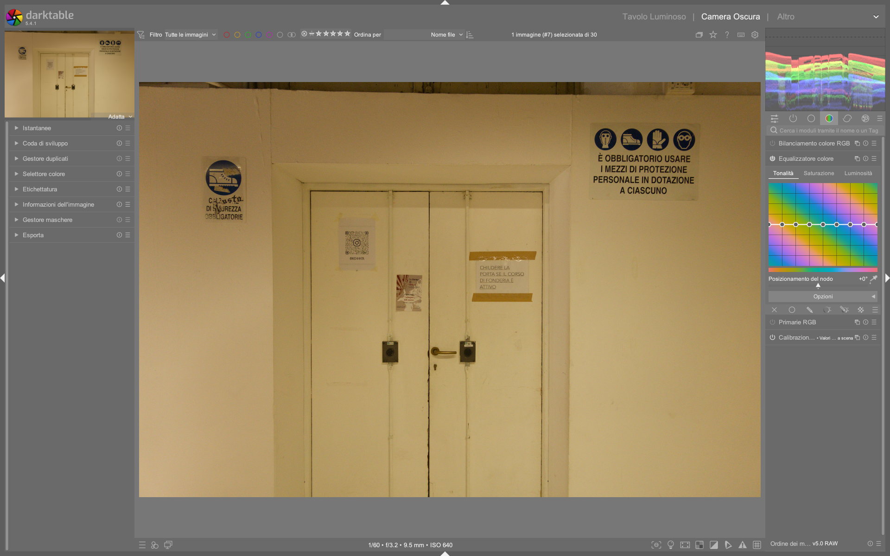

# Color Equalizer

Il modulo **Color Equalizer** e' uno strumento di manipolazione cromatica avanzata che opera nello spazio colore **HSL** (Hue, Saturation, Lightness). Permette di regolare selettivamente tonalita', saturazione e luminosita' per specifiche gamme di colore tramite curve interattive e un sistema di mascheramento cromatico integrato.[^ce-in-depth]

## Come funziona

Il Color Equalizer analizza l'immagine e costruisce una maschera basata sulle proprieta' cromatiche dei pixel. A differenza di **Color Balance RGB** -- che lavora nello spazio RGB lineare con bilanciamento per ombre/mezzetinte/luci -- il Color Equalizer opera su una rappresentazione HSL, consentendo selezioni basate sulla **tonalita'** (hue) del colore.

### Spazio HSL e mascheramento cromatico

Il modulo utilizza tre parametri fondamentali per costruire la maschera di selezione:

| Parametro | Descrizione |
|-----------|-------------|
| **Hue analysis radius** | Raggio di analisi della tonalita' (in pixel). Media i colori circostanti per evitare selezioni erratiche causate da rumore o texture. Valori tipici: 1.5-10 px.[^ce-in-depth] |
| **Saturation threshold** | Soglia di saturazione minima (%). Esclude le aree poco sature (vicine al grigio) dalla modifica. Valore predefinito: 10%.[^ce-in-depth] |
| **Effect radius** | Raggio dell'effetto (in pixel). Controlla la morbidezza della transizione ai bordi della maschera. Aumentarlo riduce lo "spill" (traboccamento) dell'effetto su zone adiacenti.[^ce-in-depth] |

!!! info "Guided filter"
    L'opzione **Use guided filter** applica un filtro guidato che fonde le correzioni con i toni circostanti, producendo transizioni piu' naturali. Particolarmente utile per i toni della pelle.[^ce-in-depth]

### Le tre schede

Il modulo e' organizzato in tre tab principali:

=== "Hue (Tonalita')"
    Permette di ruotare i colori lungo il cerchio cromatico. Ogni nodo sulla curva rappresenta una tonalita' e puo' essere spostato in gradi (+/- 180 gradi). A differenza di saturazione e luminosita', la curva hue permette di regolare l'**ampiezza dell'effetto** per ogni nodo.[^ce-in-depth]

    **Uso tipico:** Correggere dominanti cromatiche selettive, trasformare colori specifici (es. rendere un cielo piu' caldo), isolare colori per conversioni creative.

=== "Saturation (Saturazione)"
    Controlla l'intensita' dei colori per ogni gamma tonale. Nodi positivi aumentano la saturazione, negativi la riducono. Non supporta la regolazione dell'ampiezza dell'effetto.[^ce-in-depth]

    **Uso tipico:** Aumentare la vividezza di colori specifici senza alterare il resto dell'immagine, desaturare selettivamente elementi di disturbo.

=== "Brightness (Luminosita')"
    Regola la luminosita' per ogni tonalita'. Opera come un equalizzatore tonale ma selettivo per colore anziche' per luminanza.[^ce-in-depth]

    **Uso tipico:** Illuminare i toni della pelle, scurire cieli, controllare la luminanza di elementi specifici prima della conversione in B/N.

### Controlli aggiuntivi

| Controllo | Funzione |
|-----------|----------|
| **White level** | Limita il valore massimo di luminosita' consentito per i pixel modificati. Utile per prevenire il clipping nelle alte luci quando si aumenta la luminosita' di colori molto saturi.[^ce-in-depth] |
| **Contrast** | Indurisce o ammorbidisce la transizione della maschera cromatica. Valori negativi rendono la transizione piu' graduale, valori positivi piu' netta.[^ce-in-depth] |

!!! tip "Ctrl+clic per slider HSL"
    Premendo **Ctrl+clic** sulla griglia cromatica si accede a slider individuali stile Lightroom per ogni canale, offrendo un controllo piu' preciso sulla posizione dei nodi.[^ce-in-depth]

## Quando usare Color Equalizer vs Color Balance RGB

I due moduli hanno scopi complementari ma distinti:

| Caratteristica | Color Equalizer | Color Balance RGB |
|----------------|-----------------|-------------------|
| **Spazio colore** | HSL (Hue, Saturation, Lightness) | RGB lineare (JzCzHz) |
| **Selezione** | Basata sulla tonalita' (hue) del colore | Basata su ombre/mezzetinte/luci |
| **Maschera interna** | Si (automatica, basata su hue/saturation) | No (usa maschere parametriche esterne) |
| **Curva interattiva** | Si, con nodi posizionabili | No, controlli globali per zona |
| **Ideale per** | Correzione selettiva di colori specifici | Bilanciamento cromatico globale, look creativo |
| **Conversione B/N** | Si, controlla la luminanza dei singoli colori | No, non progettato per questo |
| **Presenza di preset** | Si (es. *skin*) | Si |

### Linee guida pratiche

**Usa Color Equalizer quando:**

- Devi regolare la luminanza di un colore specifico (es. pelle, cielo, vegetazione)[^ce-in-depth]
- Vuoi convertire in B/N controllando come ogni colore viene mappato in scala di grigi[^b-and-w]
- Hai bisogno di isolare un colore saturo senza influenzare toni simili ma meno saturi[^ce-in-depth]
- Vuoi correggere una dominante cromatica localizzata senza alterare il bilanciamento globale[^ce-in-depth]

**Usa Color Balance RGB quando:**

- Devi applicare un look cromatico globale (es. viraggio ombre fredde, luci calde)[^color-balance]
- Vuoi controllare la saturazione per zona tonale (ombre/mezzetinte/luci)[^color-balance]
- Hai bisogno di correzioni di tinta globali[^color-balance]
- Lavori su ritratti e vuoi uniformare i toni della pelle in modo globale[^color-balance]

!!! tip "Combinazione"
    I due moduli possono essere usati insieme nella pipeline: Color Balance RGB per il bilanciamento globale, Color Equalizer per correzioni selettive successive.[^pipeline]

## Parametri dettagliati

### Hue analysis radius

Questo parametro controlla quanto il modulo "guarda intorno" a ogni pixel per determinare la sua tonalita'. Un valore piu' alto media su un'area piu' ampia, riducendo l'impatto del rumore digitale sulla selezione cromatica.

| Situazione | Valore consigliato |
|------------|-------------------|
| Immagini pulite (ISO bassi) | 1.5 px |
| ISO medi (800-3200) | 3-6 px |
| ISO alti (> 3200) | 6-10 px |
| Texture fini (tessuti, pelle) | 2-4 px |

!!! warning "Rumore e artefatti"
    Con immagini ad alto ISO non denoisate, il Color Equalizer puo' produrre artefatti a chiazze (*blotchiness*) e granulosita'. **Applicare sempre la riduzione rumore prima** di qualsiasi regolazione cromatica con questo modulo.[^ce-in-depth]

### Saturation threshold

La soglia di saturazione funziona come un filtro: solo i pixel con saturazione superiore al valore specificato verranno influenzati dalle regolazioni.

- **10%** (default): include quasi tutti i colori visibili
- **20-30%**: esclude i toni della pelle poco saturi, utile per proteggere la pelle quando si regolano colori vivaci[^ce-in-depth]
- **50%+**: agisce solo sui colori piu' intensi

!!! tip "Proteggere la pelle"
    Per modificare colori vivaci (es. vesti arancioni, fiori) senza alterare i toni della pelle, aumentare la saturation threshold al 20-30%. La pelle, essendo meno satura, verra' esclusa automaticamente dalla maschera.[^ce-in-depth]

### Effect radius

Controlla la diffusione dell'effetto oltre i confini della maschera cromatica.

- **1.0 px** (default): effetto preciso, bordi netti
- **10-50 px**: transizione piu' morbida, riduce artefatti ai bordi
- **100+ px**: effetto molto diffuso, utile per correzioni globali all'interno di un'area mascherata[^ce-in-depth]

!!! warning "Effetto spill"
    Un effect radius elevato puo' causare il traboccamento dell'effetto oltre i bordi desiderati. Se noti aloni innaturali, riduci il valore o combina con una maschera parametrica per delimitare l'area.[^ce-in-depth]

## Workflow pratici

### Workflow 1: Conversione Bianco e Nero controllata

Questo workflow, tratto dal tutorial *Full B&W Edit in Darktable*, permette di convertire in scala di grigi controllando esattamente come ogni colore contribuisce alla luminanza finale.[^b-and-w]

**Posizionamento nella pipeline:** Inserire il Color Equalizer **tra due istanze di Color Calibration**. La prima istanza prepara i colori, il Color Equalizer controlla la luminanza, la seconda istanza esegue la conversione in B/N.[^b-and-w]

**Passaggi:**

1. Applicare la prima istanza di **Color Calibration** (tab CAT) per il bilanciamento cromatico di base
2. Aggiungere un'istanza di **Color Equalizer**, rinominarla "black and white"
3. Nella tab **Brightness**, creare una curva a **U** per i toni della pelle:
   - Aumentare la luminosita' di rosso e arancione (+40-50%)
   - Ridurre leggermente il giallo centrale per evitare appiattimento[^b-and-w]
4. In alternativa, applicare il preset **skin** come punto di partenza[^b-and-w]
5. Aggiungere una seconda istanza di **Color Calibration** e desaturare completamente per la conversione in B/N[^b-and-w]

!!! tip "Curva a U per la pelle"
    La curva a U (rosso e arancione alti, giallo basso al centro) illumina i toni della pelle evitando che l'immagine risulti piatta. Questo e' l'equivalente cromatico della tecnica dodge & burn.[^b-and-w]

**Esempio con maschere:** Per controllare separatamente diverse aree dell'immagine:

1. Prima istanza di Color Equalizer: maschera sul soggetto principale, regolazione luminosita' rosso[^b-and-w]
2. Seconda istanza: maschera diversa, regolazione globale[^b-and-w]

### Workflow 2: Correzione selettiva di colori vivaci

Basato sull'esempio pratico con i monaci e le vesti arancioni nel tutorial *The Colour Equaliser in depth*.[^ce-in-depth]

**Scenario:** Vuoi aumentare la luminosita' e saturazione delle vesti arancioni dei monaci senza alterare i toni della pelle sullo sfondo.

**Passaggi:**

1. Aprire il Color Equalizer, selezionare la tab **Brightness**
2. Cliccare sull'arancione delle vesti con il selettore colore per posizionare un nodo
3. Aumentare la luminosita' del nodo arancione (+1.00 EV)[^ce-in-depth]
4. Passare alla tab **Saturation** e aumentare leggermente la saturazione per lo stesso nodo[^ce-in-depth]
5. **Aumentare la saturation threshold** al 20-30% per escludere la pelle meno satura dalla modifica[^ce-in-depth]
6. Attivare **Use guided filter** per transizioni naturali[^ce-in-depth]
7. Se necessario, ridurre il **Contrast** (-0.7 a -1.0) per ammorbidire la transizione della maschera[^ce-in-depth]

!!! warning "Attenzione ai bordi"
    Con curve molto aggressive, i bordi tra pelle e colore modificato possono mostrare un alone (*spill*). Per correggere: aumentare l'effect radius o combinare con una maschera parametrica basata su hue per delimitare precisamente l'area.[^ce-in-depth]

### Workflow 3: Illuminare i toni della pelle

Per ritratti dove si vuole dare luminosita' ai toni cutanei senza influenzare il resto dell'immagine.[^ce-in-depth]

**Passaggi:**

1. Aprire il Color Equalizer, selezionare la tab **Brightness**
2. Usare il selettore colore per campionare un tono medio della pelle[^ce-in-depth]
3. Posizionare un nodo sulla curva e aumentare la luminosita'[^ce-in-depth]
4. Regolare l'**hue analysis radius** in base all'ISO: valori piu' alti per ISO elevati riducono le macchie[^ce-in-depth]
5. Attivare **Use guided filter** per una fusione naturale con i toni circostanti[^ce-in-depth]
6. Se la pelle appare granulosa, aumentare il raggio di analisi della tonalita' (6-10 px)[^ce-in-depth]

### Workflow 4: Rendere le immagini piu' vivaci (POP)

Dal tutorial *How to Make Your Images POP*, il Color Equalizer puo' essere combinato con altri moduli per un impatto visivo maggiore.[^pop]

**Pipeline suggerita:**

1. **Esposizione** e **Filmic RGB/Sigmoid** per la base tonale
2. **Color Calibration** per il bilanciamento cromatico globale
3. **Tone Equalizer** per contrasto globale[^pop]
4. **Color Equalizer**: aumentare saturazione e luminosita' dei colori chiave (es. blu del cielo, verde della vegetazione)
5. **Contrasto locale** o **Diffondi e Nitidezza** per i dettagli finali[^pop]

## Esempi pratici dai video tutorial

### Esempio 1: Isolamento di un soggetto (ape su fiore)

Nel tutorial *The Colour Equaliser in depth*, il modulo viene usato per illuminare un'ape in volo vicino a un fiore viola. La sfida principale e' gestire il rumore ad alto ISO (4000 ISO) che causa artefatti cromatici.[^ce-in-depth]

**Soluzione adottata:**

- Aumentare l'**hue analysis radius** per mediare il rumore e ottenere una maschera piu' uniforme[^ce-in-depth]
- Usare una **maschera disegnata** per delimitare l'area dell'ape ed escludere lo sfondo[^ce-in-depth]
- Aumentare la luminosita' dei toni dell'ape tramite la curva brightness[^ce-in-depth]

!!! warning "Denoise prima del Color Equalizer"
    Il tutorial enfatizza che e' **cruciale applicare il denoise prima** di qualsiasi regolazione con il Color Equalizer. Il rumore ad alto ISO viene interpretato come variazione cromatica, causando macchie e artefatti imprevedibili.[^ce-in-depth]

### Esempio 2: Gestione fiori e toni della pelle

Sempre nel tutorial approfondito, un'immagine con una donna che lavora con fiori gialli presenta la sfida di modificare i fiori senza alterare la pelle.[^ce-in-depth]

**Approccio:**

1. Usare una **maschera disegnata** (cerchio) sulla pelle per proteggerla[^ce-in-depth]
2. Applicare il Color Equalizer sui toni giallo-arancione dei fiori[^ce-in-depth]
3. Regolare **contrast** (-0.701) e **effect radius** (74.6 px) per un effetto diffuso ma controllato[^ce-in-depth]
4. Usare il **guided filter** per fondere le correzioni con i toni circostanti[^ce-in-depth]

### Esempio 3: Albe e tramonti -- effetto Bezold-Brucke

Nel tutorial *How to Get Accurate Colours*, viene discusso il fenomeno percettivo per cui i colori caldi di albe e tramonti appaiono rossi invece che arancioni/gialli quando si attivano i tone mapper (Filmic/Sigmoid). Questo e' legato all'**effetto Bezold-Brucke**, per cui la percezione della tonalita' cambia con la luminanza.[^accurate-colours]

**Come il Color Equalizer puo' aiutare:**

1. Dopo aver applicato **Filmic RGB** o **Sigmoid**, il sole puo' apparire giallo invece che arancione/rosso[^accurate-colours]
2. Usare il Color Equalizer nella tab **Hue** per spostare i toni gialli verso l'arancione nella zona del sole
3. Nella tab **Saturation**, aumentare la saturazione dei toni caldi per enfatizzare l'effetto tramonto
4. Usare una **maschera parametrica basata sulla luminanza** per limitare l'effetto alle alte luci[^accurate-colours]

!!! info "Filmic v5 per i tramonti"
    Il tutorial nota che **Filmic RGB v5 (2021)** gestisce meglio i colori caldi dei tramonti rispetto alle versioni v6 e v7. Se usi v6/v7 e perdi i toni gialli/arancioni, il Color Equalizer puo' recuperare selettivamente queste tonalita'.[^accurate-colours]

### Esempio: Correzione del cielo con maschera parametrica (da *Darktable landscape edit with AI*)
*Da [Darktable landscape edit with AI](https://www.youtube.com/watch?v=OERXOFz9lEo) (05:00–09:10)*  
1. Creare una **maschera parametrica** nel modulo Exposure usando `Jz` (luminanza) > 75% e `Cz` (crominanza) < 25% per isolare il cielo nuvoloso  
2. Applicare una seconda istanza di **Color Equalizer**, rinominata `sky`, e collegarla alla maschera  
3. Nella tab **Brightness**, abbassare la luminosita' del blu (-0.45 EV) e del cyan (-0.30 EV)  
4. Nella tab **Saturation**, aumentare la saturazione del blu (+0.25) e ridurre quella del lavender (-0.15)  
5. Impostare **Effect radius = 32 px**, **Contrast = -0.4**, e attivare **Use guided filter**  

### Esempio: Smoothing dei toni della pelle (da *How to smooth up colors?*)
*Da [How to smooth up colors? - discuss.pixls.us](https://discuss.pixls.us/t/how-to-smooth-up-colors/56946) (post #7)*  
1. Aprire **Color Equalizer**, selezionare la tab **Hue**  
2. Campionare un’area di pelle con il selettore colore  
3. Creare un nodo e impostare **Hue shift = +2°** per uniformare leggermente la tonalità  
4. Nella tab **Saturation**, aggiungere un secondo nodo sulla stessa tonalità e impostare **Saturation = -5%** per attenuare piccole variazioni cromatiche  
5. Impostare **Saturation threshold = 25%**, **Effect radius = 18 px**, **Contrast = -0.6**  
6. Attivare **Use guided filter** per una fusione naturale[^pixls-smooth]

## Domande frequenti

### Problema: "Vorrei uniformare le tonalità irregolari della pelle (macchie marroni/rosse), come in Capture One 'Uniformity'"
La soluzione più efficace è combinare **Color Equalizer** con **Retouch** in modalità *chroma blending*: prima uniformare la tonalità con Color Equalizer (Hue shift ±2°), poi applicare un retouch locale con chroma blending e raggio di 3–5 px per livellare la crominanza[^pixls-smooth].

### Problema: "Il modulo produce artefatti a chiazze anche su immagini ben denoisate"
Verificare che **Color Equalizer** sia posizionato **dopo** `denoise (profiled)` e **prima** di `filmic rgb`. Se gli artefatti persistono, ridurre **Hue analysis radius** a 1.0–2.5 px e aumentare **Saturation threshold** a 15–20% per restringere la maschera[^pixls-smooth].

### Problema: "Non riesco a isolare il verde della vegetazione senza influenzare la pelle"
Usare una **maschera parametrica** basata su `Cz` (crominanza) > 30% e `hz` (tonalità) tra 120°–180°, quindi applicare il Color Equalizer su quella maschera. Evitare di dipendere esclusivamente dal `saturation threshold`, poiché pelle e foglie possono avere sovrapposizioni di saturazione[^pixls-smooth].

## Posizionamento nella pipeline

Il posizionamento del Color Equalizer nella catena di elaborazione e' cruciale per il risultato:

| Scenario | Posizionamento | Motivazione |
|----------|---------------|-------------|
| Correzione cromativa generica | Dopo Color Calibration, prima di Filmic/Sigmoid | Opera su colori ancora lineari, massimo controllo[^pipeline] |
| Conversione B/N | **Tra due istanze di Color Calibration** | Controlla la luminanza dei colori prima della desaturazione[^b-and-w] |
| Ritocco finale | Dopo Filmic/Sigmoid, prima dell'export | Correzioni sottili sul risultato tonale finale |
| Con maschere parametriche | Dopo il modulo che genera la luminanza di riferimento | La maschera parametrica opera correttamente sulla luminanza processata |

!!! tip "Pipeline consigliata per B/N"
    `RAW -> White Balance -> Color Calibration (1) -> Color Equalizer -> Color Calibration (2, desaturato) -> Filmic/Sigmoid -> Tone Equalizer`[^b-and-w]

## Consigli per colori accurati

1. **Denoise prima di tutto:** Il rumore viene interpretato come variazione cromatica. Applicare sempre la riduzione rumore prima del Color Equalizer.[^ce-in-depth]

2. **Usare il selettore colore:** Invece di posizionare nodi manualmente, cliccare direttamente sull'immagine con il selettore colore per campionare la tonalita' esatta da modificare.[^ce-in-depth]

3. **Monitorare la maschera:** Visualizzare la maschera cromatica generata (le aree rosse/blu indicano zone selezionate/escluse) per verificare che la selezione corrisponda all'area desiderata.[^ce-in-depth]

4. **Combinare con maschere parametriche:** Per un controllo ancora piu' preciso, applicare una maschera parametrica basata su hue (Cz) o luminanza (Jz) al modulo.[^ce-in-depth]

5. **Attenzione all'ISO:** Per immagini sopra ISO 1600, aumentare significativamente l'hue analysis radius (6-10 px) per evitare artefatti.[^ce-in-depth]

6. **Preservare i neutri:** Usare la saturation threshold per proteggere le aree vicine al grigio dalle modifiche cromatiche.[^ce-in-depth]

7. **Istanze multiple:** Come con Color Calibration, e' possibile usare piu' istanze di Color Equalizer con maschere diverse per controllare aree separate dell'immagine.[^b-and-w]

## Riepilogo rapido

| Azione | Tab | Procedura |
|--------|-----|-----------|
| Spostare un colore | Hue | Cliccare sul colore, spostare il nodo in gradi |
| Rendere un colore piu' vivido | Saturation | Aumentare il nodo del colore target |
| Illuminare un colore | Brightness | Aumentare il nodo del colore target |
| Proteggere la pelle | -- | Aumentare saturation threshold al 20-30% |
| Transizioni morbide | -- | Attivare guided filter, aumentare effect radius |
| Ridurre artefatti da rumore | -- | Aumentare hue analysis radius |
| Evitare clipping luci | -- | Ridurre white level |

## Riferimenti visuali

*Il modulo «color equalizer» (Equalizzatore colore) nell'interfaccia di darktable (vista darkroom).*

## Fonti

[^ce-in-depth]: *[The Colour Equaliser in depth](https://www.youtube.com/watch?v=hvn7CCGh-ts)* -- A Dabble in Photography
[^b-and-w]: *[Full B&W edit in darktable for street photography](https://www.youtube.com/watch?v=f9szYMJ9wYo)* -- A Dabble in Photography
[^pop]: *[How to make your images POP!](https://www.youtube.com/watch?v=PWyCbGHE3C0)* -- A Dabble in Photography
[^accurate-colours]: *[How to get accurate colours in darktable](https://www.youtube.com/watch?v=TMlF85TFIUo)* -- A Dabble in Photography
[^color-balance]: *[Colour balance RGB](https://www.youtube.com/watch?v=SmeUXCtNNh0)* -- A Dabble in Photography
[^pipeline]: *[The darktable pipeline for beginners](https://www.youtube.com/watch?v=1nPW6WPhhTo)* -- A Dabble in Photography
[^pixls-smooth]: *[How to smooth up colors?](https://discuss.pixls.us/t/how-to-smooth-up-colors/56946)* -- discuss.pixls.us
