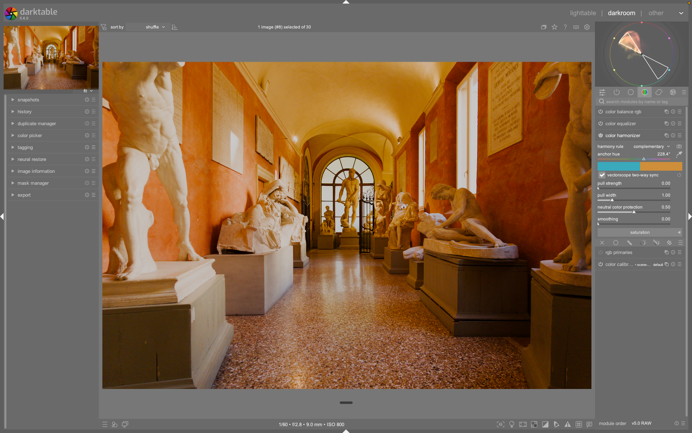

# Color Harmonizer

Il modulo **color harmonizer**, introdotto in darktable 5.6, riduce la *dissonanza cromatica* spingendo le tonalità verso una palette di colori selezionata.[^manual-ch] La palette è definita da un insieme di angoli di tonalità chiamati **nodi armonici**: i colori "fuori palette" vengono attratti dolcemente verso il nodo più vicino, mentre quelli già su un nodo restano invariati. Un moltiplicatore di saturazione per nodo può inoltre aumentare o ridurre la vividezza dei colori vicini a ciascun nodo.[^manual-ch]

!!! info "Posizione nella pipeline"
    Opera in spazio scene-referred sulla ruota delle tonalità: usalo come passo di armonizzazione cromatica prima della compressione tonale (agx, filmic rgb).

## Come funziona

Ogni colore viene spostato in funzione della sua **prossimità ai nodi**: lo spostamento è massimo per i pixel a metà strada tra due nodi e nullo per i pixel esattamente su un nodo.[^manual-ch] L'entità e la profondità dell'attrazione si regolano con `pull strength` e `pull width`; i toni neutri si proteggono con `neutral color protection`.

Il modulo è nato dalla community ed è stato integrato ufficialmente in darktable; la discussione di sviluppo documenta scelte e casi d'uso.[^discuss-ch]

## Controlli principali

### Harmony rule

Seleziona la regola armonica. Tutte le posizioni dei nodi sono **offset rispetto all'`anchor hue`**, espressi in gradi.[^manual-ch]

| Regola | Nodi | Posizioni (da anchor) | Carattere |
|---|---|---|---|
| Monochromatic | 1 | 0° | Singola famiglia di tonalità |
| Analogous | 3 | 0°, −30°, +30° | Vicini adiacenti; naturale, coeso |
| Analogous complementary | 4 | 0°, −30°, +30°, +180° | Triade analoga più l'opposto |
| Complementary | 2 | 0°, +180° | Opposti diretti; massimo contrasto |
| Split complementary | 3 | 0°, +150°, +210° | Anchor più i due vicini del suo complementare |
| Dyad | 2 | −30°, +30° | Anchor = asse di simmetria, non un nodo |
| Triad | 3 | 0°, +120°, +240° | Equispaziati; bilanciato, colorato |
| Tetrad | 4 | −30°, +30°, +150°, +210° | Due coppie dyad; anchor = asse, non un nodo |
| Square | 4 | 0°, +90°, +180°, +270° | Quattro tonalità equidistanti |
| Custom | 2–4 | Libere | Posizioni definite dall'utente |

!!! warning "Dyad e Tetrad: l'anchor è l'asse, non un nodo"
    In *dyad* e *tetrad* l'`anchor hue` definisce l'**asse di simmetria** del pattern, non la posizione di un nodo: la palette è simmetrica attorno all'anchor. Questo corrisponde all'overlay della guida armonica nel vectorscope.[^manual-ch]

!!! tip "*Infer from image* per partire in fretta"
    Analizza l'istogramma delle tonalità dell'anteprima pesato per croma e seleziona automaticamente regola + anchor hue che meglio coprono la distribuzione di colore già presente — cioè la combinazione che richiede la minore correzione. Disponibile solo nelle modalità standard.[^manual-ch]

### Anchor hue

La tonalità primaria da cui derivano tutte le posizioni dei nodi (non mostrata in modalità *custom*), espressa in gradi. È disponibile un **contagocce** per campionare un colore direttamente dall'immagine; la striscia di campioni sotto lo slider mostra i colori effettivi dei nodi come riscontro visivo immediato.[^manual-ch]

### Vectorscope two-way sync

Abilitato per impostazione predefinita.[^manual-ch] Ogni modifica a regola, anchor hue o posizioni dei nodi custom si riflette subito nell'overlay armonico del vectorscope; viceversa, ruotare l'overlay o cambiare la regola nel vectorscope si riflette nel modulo. Disabilitalo per lavorare senza alterare il vectorscope. Con il sync attivo, usare il modulo porta automaticamente il pannello *scopes* sul vectorscope.

Il pulsante **import from vectorscope** (solo modalità standard) importa regola e anchor hue configurati nel vectorscope e passa il pannello alla vista vectorscope.[^manual-ch]

### Nodi custom

In modalità *custom*, `nodes` imposta il numero di nodi attivi (2–4): solo le prime N righe sono mostrate e attive. Ogni riga ha un campione colore e uno slider di tonalità (0°–360°) con contagocce, per posizionare il nodo sulla ruota delle tonalità.[^manual-ch]

## Controlli di effetto

| Parametro | Default | Comportamento |
|---|---|---|
| **Pull strength** | — | Intensità dello spostamento. Massimo tra i nodi, nullo (o minimo) sui nodi. **Scala solo la correzione di tonalità**: la saturazione per nodo è applicata indipendentemente, a piena intensità.[^manual-ch] |
| **Pull width** | 1 (medio) | Ampiezza della zona di attrazione di ciascun nodo. `<1`: decadimento rapido, solo le tonalità vicinissime a un nodo sono attratte (correzione chirurgica). `=1`: separazione netta con transizioni morbide. `>1`: nessun decadimento, tutti i pixel sono attratti (utile per sopprimere colori fuori armonia). Aumentarlo non sposta mai i pixel già su un nodo.[^manual-ch] |
| **Neutral color protection** | 0.50 | Protegge i pixel a bassa croma. Valori bassi proteggono solo i grigi quasi assoluti; valori alti estendono la protezione a toni smorzati e pastello. Anche al massimo, i colori vividi restano in gran parte inalterati.[^manual-ch] |
| **Smoothing** | 0 (off) | Ammorbidisce le transizioni spaziali ai bordi delle zone (gradini di colore visibili in cieli/pelle). `0`: dettaglio massimo (consigliato). `0.1–0.5`: media spaziale leggera contro il rumore cromatico. `>1.0`: fusione ampia, effetto pittorico, può sbavare oltre i bordi. Il sigma del blur scala anche con `pull width`.[^manual-ch] |

## Sezione saturazione (a comparsa)

Una riga per ogni nodo armonico attivo, con campione colore e slider del moltiplicatore di saturazione.[^manual-ch]

- **100 % (default):** saturazione invariata.
- **< 100 %:** desatura i colori vicini al nodo, proporzionalmente alla prossimità gaussiana.
- **> 100 %:** aumenta la saturazione vicino al nodo.

L'effetto è pesato dalla prossimità gaussiana del pixel al nodo e ulteriormente modulato da `neutral color protection`, così i pixel quasi acromatici sono risparmiati. Esattamente sul nodo (peso massimo) la saturazione è moltiplicata per il valore esatto dello slider.[^manual-ch]

## Consigli d'uso

- Correggi il **bilanciamento del bianco** prima di usare il modulo: i nodi armonici si calcolano sulla ruota delle tonalità, e un bianco sbagliato distorce il riferimento.
- Tieni il **vectorscope** aperto durante l'editing: l'overlay armonico mostra quali colori sono dentro o fuori palette e rende valutabile l'effetto.
- Parti da `infer from image`, poi affina regola e anchor manualmente.
- Alza `pull strength` con gradualità su gradienti morbidi (cieli, pelle) per evitare transizioni innaturali; verifica a 100%.

## Riferimenti visuali

*Il modulo Color Harmonizer nell'interfaccia di darktable (vista darkroom).*

## Fonti

[^manual-ch]: darktable user manual — color harmonizer, <https://docs.darktable.org/usermanual/development/en/module-reference/processing-modules/color-harmonizer/>
[^discuss-ch]: "[New module] [Merged] Color harmonizer", discuss.pixls.us, <https://discuss.pixls.us/t/new-module-merged-color-harmonizer/56322>
