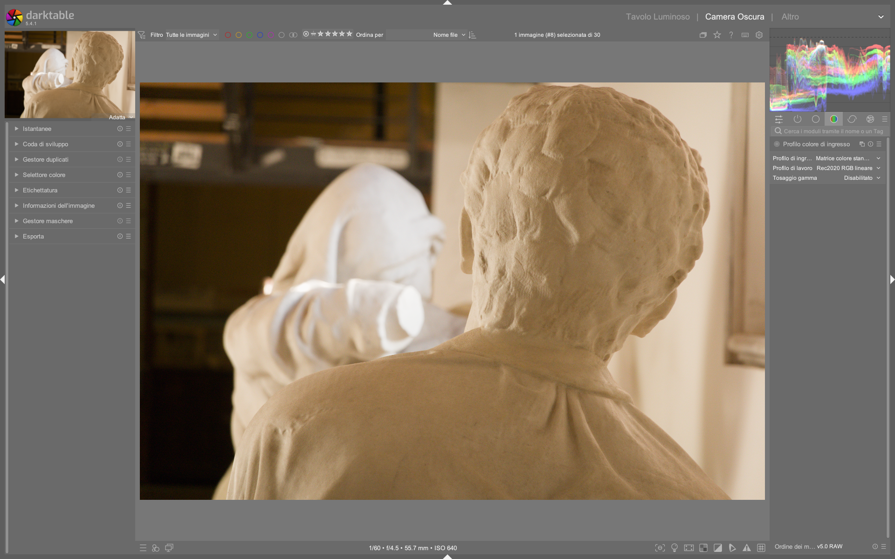

# Input Color Profile

Il modulo **input color profile** definisce come darktable interpreterà i dati cromatici dell’immagine in ingresso, convertendoli dallo spazio colore nativo della sorgente (fotocamera, scanner, file JPEG/TIFF) a uno spazio colore di lavoro standardizzato. È il primo modulo *obbligatorio* nella pipeline di elaborazione RAW e agisce prima di qualsiasi regolazione espositiva o cromatica — un errore qui compromette irreversibilmente tutti i passaggi successivi[^manual-48-input].

!!! info "Posizione critica nella pipeline"
    Il modulo `input color profile` si trova **subito dopo `raw black/white point`** e **prima di `white balance`**, nel flusso scene-referred. Non è modificabile per immagini RAW: se disabilitato, appare grigio e bloccato nella pipeline[^pipeline-beginner]. Questa posizione garantisce che la mappatura colore avvenga sui dati grezzi, non su valori già bilanciati o esposti[^manual-48-input].

## Panoramica

Il modulo svolge tre funzioni fondamentali:

1. **Mappatura del colore da sensore** — applica una matrice colore specifica per il modello di fotocamera (es. `enhanced matrix` per Fujifilm X-T2) o usa una matrice standard quando non disponibile[^manual-48-input].
2. **Gestione profili ICC embedded** — riconosce e applica automaticamente i profili ICC inclusi in file JPEG, TIFF o DNG[^manual-48-input]. Se presente, il tooltip sul menù a tendina mostra i dettagli del profilo (nome, versione, intento).
3. **Controllo del gamut** — limita i colori fuori gamma tramite *gamut clipping*, prevenendo artefatti come pixel neri in aree di blu saturi (es. cieli al tramonto con luci LED)[^manual-48-input].

A differenza di Lightroom, darktable non “assume” uno spazio colore di ingresso: ogni RAW viene trattato con una matrice calibrata per quel sensore, garantendo coerenza tra modelli diversi[^dt54-update]. Per immagini non-RAW (JPEG), il modulo è invece opzionale e può essere bypassato.

## Flusso di lavoro consigliato

Il flusso ottimale è semplice ma rigido:

```
1. raw black/white point (automatico)
   |
2. input color profile (automatico — non toccare)
   |
3. white balance (regolazione manuale o auto)
```

!!! tip "Non modificare mai input color profile su RAW"
    Per file RAW, lascia sempre `input profile` impostato su **`camera default`** o **`enhanced matrix`** (se disponibile per la tua fotocamera). Modificarlo manualmente introduce errori di mappatura cromatica difficili da diagnosticare, specialmente con colori neutri e pelle[^pipeline-beginner][^manual-48-input].

### Passo 1: Verifica del profilo automatico

All’apertura di un RAW:
- Controlla che il menù `input profile` mostri una voce specifica per la tua fotocamera (es. `Fujifilm X-T2 enhanced matrix`) anziché `generic matrix`.
- Se vedi `embedded icc profile`, significa che l’immagine non è RAW ma JPEG/TIFF/DNG con profilo incorporato[^manual-48-input].
- Usa il tooltip (passa il mouse sul menù) per verificare i dettagli: nome del profilo, gamma, intento di rendering[^manual-48-input].

### Passo 2: Profilo personalizzato (solo per casi avanzati)

Puoi fornire un profilo ICC personalizzato solo se:
- Hai generato un profilo con uno strumento esterno (es. `Argyll CMS`, `DisplayCAL`)
- Lo hai salvato nella cartella `$HOME/.config/darktable/color/in/` (creala manualmente se assente)[^manual-48-input]
- Hai attivato il modulo `unbreak input profile` per abilitarne l’uso[^manual-48-input]

!!! warning "Profilazione custom = rischio alto"
    I profili personalizzati richiedono calibrazione precisa del sensore. Un ICC errato causa shift cromatici sistematici (es. rossi che diventano arancioni, verdi che virano gialli) e non è recuperabile nei moduli successivi[^manual-48-input].

## Parametri principali

| Parametro | Range / Opzioni | Default | Descrizione |
|-----------|-----------------|---------|-------------|
| **input profile** | `camera default`, `enhanced matrix`, `generic matrix`, `embedded icc profile`, `linear Rec. 2020 RGB`, `Adobe RGB (compatible)`, `sRGB`, `linear Rec. 709 RGB` | `camera default` (per RAW)<br>`embedded icc profile` (per JPEG) | Seleziona la matrice o il profilo da applicare. Le voci `enhanced matrix` sono disponibili solo per alcuni modelli (Sony ARW, Fujifilm RAF, Canon CR3)[^manual-48-input][^dt38-new]. |
| **working profile** | `linear Rec. 2020 RGB`, `Adobe RGB (compatible)`, `sRGB`, `linear Rec. 709 RGB`, `ACEScg` | `linear Rec. 2020 RGB` | Spazio colore interno usato dai moduli successivi. `linear Rec. 2020 RGB` è raccomandato per workflow scene-referred: offre il più ampio gamut senza clipping prematuro[^manual-48-input]. |
| **gamut clipping** | `off`, `on` | `off` | Attiva il meccanismo di taglio dei colori fuori gamma. Abilitalo **solo** se compaiono artefatti visibili (pixel neri isolati in zone di blu intenso o luci LED)[^manual-48-input]. |

## Gamut Clipping: quando e come usarlo

Il clipping è un intervento di emergenza, non una regolazione standard:

- **Attivalo solo se**:  
  - L’immagine mostra **pixel neri isolati** in aree di blu saturo (es. cielo notturno con luci LED, neon blu)  
  - L’istogramma RGB mostra picchi estremi su blu senza corrispondenti valori in rosso/verde  
  - Il problema persiste anche dopo aver regolato `white balance` e `color calibration`[^manual-48-input]

- **Scegli il working profile in base al clipping**:  
  | Profilo | Gamut | Quando usarlo |  
  |---------|--------|----------------|  
  | `linear Rec. 2020 RGB` | Più ampio | Default per RAW — minimo clipping naturale[^manual-48-input] |  
  | `Adobe RGB (compatible)` | Medio | Se `Rec. 2020` genera artefatti ma `sRGB` è troppo stretto |  
  | `sRGB` | Più stretto | Solo per output web finale — evita in fase di editing[^manual-48-input] |  

!!! tip "Test rapido con maschera"
    Per identificare i pixel fuori gamut: attiva la visualizzazione della maschera (`M`), seleziona `gamut clipping` nel menù contestuale e osserva le aree in rosso scuro. Se non compaiono, il clipping non è necessario[^manual-48-input].

## Interazione con altri moduli

`input color profile` influenza direttamente:

- **`white balance`**: lavora sui dati già mappati. Una matrice errata qui rende impossibile un bilanciamento preciso del bianco[^pipeline-beginner].
- **`color calibration`**: riceve dati già convertiti nel `working profile`. Se il working profile è `sRGB`, la calibrazione avrà meno margine per manipolare i primari[^manual-48-input].
- **`AGX` / `Filmic RGB`**: dipendono dalla linearità e dall’accuratezza della mappatura iniziale. Un input profile scorretto causa under/over-saturazione sistematica, specialmente nei rossi e nei blu[^agx-guide].

## Consigli pratici per migranti da Lightroom

| Problema Lightroom | Soluzione darktable | Riferimento |
|---------------------|----------------------|-------------|
| “I colori non corrispondono all’anteprima della fotocamera” | Usa `enhanced matrix` invece di `generic matrix`. Verifica che il modello sia supportato nella [lista ufficiale](https://raw.pixinsight.com/)[^dt38-new] | [^manual-48-input] |
| “Le immagini JPEG sembrano sbiadite” | Imposta `input profile` su `embedded icc profile` e `working profile` su `linear Rec. 2020 RGB` — non usare `sRGB` come working[^manual-48-input] | [^manual-48-input] |
| “Il bianco non è neutro anche con WB corretto” | Controlla che `input profile` non sia impostato su `sRGB` o `linear Rec. 709 RGB` — questi profilano per display, non per editing[^manual-48-input] | [^manual-48-input] |
| “Voglio replicare il look della fotocamera” | Usa `enhanced matrix` + `color calibration` con tab `colorfulness` e `adaptation = none`[^dt54-update] | [^dt54-update] |

### Esempio: Calibrazione del bianco per fotocamera specifica  
*Da [ENG] darktable Full edit #1 (timestamp 02:00–06:20)*[^agx-guide]  
1. Scatta un’immagine RAW a un foglio bianco illuminato in luce diffusa (D50)  
2. Importa l’immagine in darktable e apri il modulo `white balance`  
3. Usa il color picker per selezionare un’area neutra: i coefficienti mostrati saranno `red = 2.009`, `green = 1.000`, `blue = 1.450` (valori tipici per Fujifilm GFX100s)[^agx-guide]  
4. Clicca su `+` per creare un nuovo preset, rinominalo con il modello (es. `GFX100s`) e abilita `only show this preset for matching images`[^agx-guide]  
5. Applica il preset a tutte le immagini dello stesso modello: verrà caricato automaticamente in `white balance` *dopo* `input color profile`, garantendo coerenza[^agx-guide]

### Esempio: Gestione di immagini JPEG con profilo incorporato  
*Da [ENG] Lowlight photos in darktable (timestamp 00:30–01:40)*[^lowlight-video]  
1. Apri un file JPEG con profilo ICC incorporato (es. `sRGB IEC61966-2.1`)  
2. Verifica che `input profile` mostri `embedded icc profile`: il tooltip confermerà `sRGB`, `intent = perceptual`[^lowlight-video]  
3. Imposta `working profile` su `linear Rec. 2020 RGB` — **non** su `sRGB` — per preservare la dinamica cromatica durante l’editing[^lowlight-video]  
4. Regola `exposure` e `AGX` in modo lineare: l’output rimarrà coerente anche se il JPEG originale era compresso[^lowlight-video]

### Esempio: Ripristino di un RAW con matrice errata  
*Da [ENG] Full b&w edits in darktable for street photography (timestamp 02:05–04:50)*[^bw-video]  
1. Se un’immagine RAW mostra dominanti cromatiche irrecuperabili (es. verde oliva su pelle), controlla `input profile`: se è `generic matrix`, sostituiscilo con `enhanced matrix` (disponibile per Olympus E-M5)[^bw-video]  
2. Dopo il cambio, `white balance` e `color calibration` riprenderanno a funzionare correttamente: i valori `temperature = 4346 K`, `tint = 1.000` diventeranno stabili[^bw-video]  
3. La correzione non richiede reset dei moduli successivi: i valori di `color calibration → adaptation = CAT16` e `gamut compression = 1.00` restano validi[^bw-video]

## Domande frequenti

### Problema: “Il modulo input color profile è disabilitato e non posso cambiarlo”  
Questo comportamento è normale per file RAW: darktable impone una matrice specifica per garantire coerenza fisica. Il modulo è bloccato per prevenire errori irreversibili nella pipeline scene-referred[^manual-48-input].

### Problema: “Ho importato un profilo ICC personalizzato ma non appare nel menù”  
Verifica che il file `.icc` sia stato copiato in `$HOME/.config/darktable/color/in/` (non in `/usr/share/darktable/color/in/`) e che il modulo `unbreak input profile` sia attivo e posizionato *prima* di `input color profile` nella pipeline[^manual-48-input].

### Problema: “L’immagine RAW sembra ‘piatta’ dopo l’apertura”  
È atteso: `input color profile` converte i dati in uno spazio lineare (`linear Rec. 2020 RGB`) senza correzione tonale. Il contrasto e la saturazione verranno aggiunti successivamente da `filmic rgb`, `AGX` o `tone curve`[^pixls-rgb-lab].

## Tabella preset built-in

| Preset | Quando usarlo | Note |
|---|---|---|
| `camera default` | Tutti i RAW — valore predefinito per ogni modello | Usa la matrice più recente disponibile per il sensore[^manual-48-input] |
| `enhanced matrix` | RAW di fotocamere con supporto esplicito (Fujifilm X-T2/X-H2, Sony A7 IV, Canon R5) | Migliora la resa dei primari rispetto a `camera default`; richiede firmware aggiornato[^dt38-new] |
| `linear Rec. 2020 RGB` | Workflow scene-referred avanzato (es. HDR, color grading) | Gamut più ampio; richiede `filmic rgb` o `AGX` per la conversione finale[^manual-48-input] |
| `embedded icc profile` | JPEG/TIFF/DNG con profilo incorporato | Il tooltip mostra `intent = perceptual` o `relative colorimetric`[^manual-48-input] |

## Riferimenti visuali


*Il modulo «input color profile» (Profilo colore di ingresso) nell'interfaccia di darktable (vista darkroom).*

## Risorse aggiuntive

- **Manuale ufficiale darktable — Input Color Profile**[^manual-48-input]  
- **Video tutorial: “The darktable pipeline for beginners”** — spiegazione visiva della posizione del modulo nella pipeline[^pipeline-beginner]  
- **Video tutorial: “darktable 3.8 What is new?”** — introduzione al supporto CR3 e alle enhanced matrices[^dt38-new]  
- **Video tutorial: “Some Color calibration ideas”** — dimostrazione pratica dell’effetto di una matrice errata sul verde dello sfondo[^color-calibration-ideas]  

## Fonti

[^manual-48-input]: darktable user manual — input color profile, https://docs.darktable.org/usermanual/development/en/module-reference/processing-modules/input-color-profile/
[^pipeline-beginner]: [ENG] The darktable pipeline for beginners, https://www.youtube.com/watch?v=1nPW6WPhhTo
[^dt38-new]: [ENG] darktable 3.8 What is new?, https://www.youtube.com/watch?v=5smugZ5pXN0
[^dt54-update]: [ENG] New Release: darktable 5.2, https://www.youtube.com/watch?v=YcLJMaDbfRA
[^color-calibration-ideas]: [ENG] Some Color calibration ideas, https://www.youtube.com/watch?v=MJJR8DJ3rr8
[^agx-guide]: [ENG] darktable Full edit #1, https://www.youtube.com/watch?v=DzdGL30lYjU
[^pixls-rgb-lab]: PIXLS.US — Darktable 3:RGB or Lab? Which Modules? Help!, https://pixls.us/articles/darktable-3-rgb-or-lab-which-modules-help/
[^lowlight-video]: [ENG] Lowlight photos in darktable, https://www.youtube.com/watch?v=O7wXgmQZqiU
[^bw-video]: [ENG] Full b&w edits in darktable for street photography, https://www.youtube.com/watch?v=f9szYMJ9wYo
