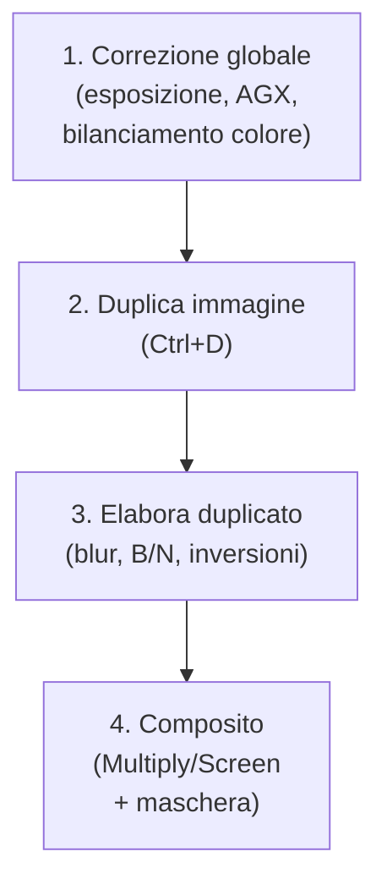
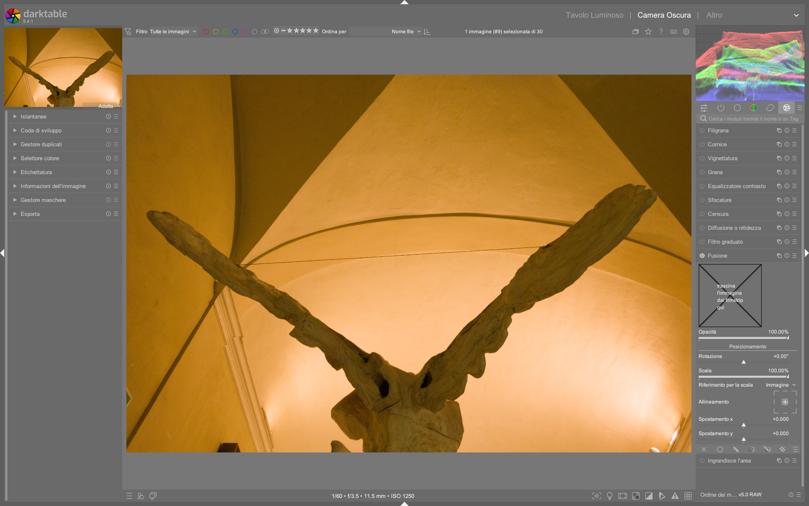

# Composite: Fusioni avanzate e effetti creativi

Il modulo **composite** è uno strumento avanzato per la fusione di livelli in darktable, introdotto ufficialmente come funzionalità stabile a partire dalla versione 5.0.0[^dt50-update]. Non è un semplice “livello di sfocatura”, ma un sistema completo per combinare due versioni della stessa immagine (originale + modificata) con modalità di fusione, maschere e controlli di opacità finemente granulari[^orton-tutorial]. È il cuore tecnico per replicare effetti classici come **Orton**, **Dragan**, **glow** o **double exposure**, senza uscire dall’ecosistema scene-referred di darktable[^dabble-orton][^dabble-dragon].

!!! tip "Composite ≠ Soften"
    Il modulo **soften** offre un'alternativa rapida per effetti glow, ma opera su un singolo livello con sfocatura interna. **Composite**, invece, richiede esplicitamente una *duplicata* dell’immagine ed è progettato per fusioni precise tra due stati distinti della pipeline — ideale per workflow non distruttivi e per effetti che richiedono controllo fine sulla luminanza e sul colore[^orton-tutorial].

## Panoramica

Composite opera *dopo* tutti i moduli di sviluppo (es. `exposure`, `AgX`, `color balance rgb`) e prima del profilo di output. La sua architettura prevede due flussi paralleli:

1. **Livello base** (background): l’immagine originale, non modificata o leggermente corretta  
2. **Livello composito** (foreground): una copia duplicata, elaborata con effetti specifici (es. forte sfocatura, conversione in bianco e nero, inversione)  

Il modulo combina questi due flussi tramite:
- Una **modalità di fusione** (blend mode), simile a Photoshop (Multiply, Screen, Overlay, etc.)
- Un **controllo di opacità globale** (opacity)
- Una **maschera di fusione** (blend mask) opzionale, per applicare l’effetto solo su aree selezionate[^dabble-orton]

Questo approccio consente di costruire effetti complessi mantenendo la separazione logica tra correzione globale e trattamento creativo — un vantaggio fondamentale rispetto ai workflow esterni o ai moduli monolitici[^dabble-dragon].

## Flusso di lavoro consigliato

Il flusso standard per un effetto Orton o Dragan si articola in quattro fasi chiare[^dabble-orton][^dabble-dragon]:

!!! info "Posizionamento critico nella pipeline"
    Composite deve essere inserito **dopo** tutti i moduli di tonalità e colore, ma **prima** di `output color profile` e `watermark`. Se posizionato troppo presto, interferisce con la compressione tonale; se troppo tardi, viene ignorato nel rendering finale[^dt50-update].

### Passo 1: Creazione e configurazione del duplicato

Prima di attivare Composite, crea una copia identica dell’immagine:

- Premi `Ctrl+D` nella vista *darkroom*  
- Nella timeline inferiore, seleziona il duplicato  
- Applica al duplicato:  
  - **Blur** (tipo `gaussian`, raggio 15–30 px)  
  - **Monochrome** (se richiesto per effetto Orton)  
  - Eventuale **invert** (per effetti Dragan)  

### Passo 2: Attivazione e scelta della modalità di fusione

Nel modulo **composite**, abilita il pulsante `enable` e imposta:

| Parametro | Valore tipico | Descrizione |
|-----------|----------------|-------------|
| **Blend mode** | `multiply` | Per effetto Orton: aumenta il contrasto e genera glow nelle luci. Usato con livello sfocato e leggermente sovraesposto[^dabble-orton] |
| **Opacity** | 30–60% | Controlla l’intensità dell’effetto. Valori >70% tendono a oscurare eccessivamente[^dabble-orton] |
| **Foreground opacity** | 100% | Lascia invariata l’opacità del livello composito (duplicato) |
| **Background opacity** | 100% | Lascia invariata l’opacità del livello base (originale) |

!!! warning "Multiply ≠ Screen: differenze critiche"
    - `Multiply`: scurisce le zone scure, illumina le luci — ideale per glow morbido e caldo  
    - `Screen`: illumina le zone scure, brucia le luci — utile per effetti eterei o nebbiosi  
    Non confondere con `overlay`, che altera il contrasto in modo non lineare e può generare artefatti nei dettagli fini[^dabble-orton].

### Passo 3: Maschera di fusione (opzionale ma potente)

Per applicare l’effetto solo su parti specifiche (es. cielo, sfondo, pelle), usa una **blend mask**:

- Clicca su `+` sotto *Blend mask*  
- Scegli una maschera esistente o crea una nuova (gradiente, ellisse, disegnata)  
- Imposta `Feathering radius` a 20–50 px per transizioni naturali  
- Usa `Invert mask` per applicare l’effetto *solo fuori* dall’area selezionata[^dabble-dragon]

## Parametri principali

| Parametro | Range | Default | Descrizione |
|-----------|--------|---------|-------------|
| **Blend mode** | `normal`, `multiply`, `screen`, `overlay`, `softlight`, `hardlight`, `difference`, `addition`, `subtract`, `divide`, `darken only`, `lighten only` | `normal` | Modalità di fusione tra i due livelli. `multiply` e `screen` sono le più usate per effetti creativi[^dabble-orton] |
| **Opacity** | 0% – 100% | 50% | Opacità globale dell’intera operazione composite. Valori bassi (20–35%) per effetti sottili[^dabble-dragon] |
| **Foreground opacity** | 0% – 100% | 100% | Opacità del livello composito (duplicato). Riduci per attenuare l’effetto senza toccare la fusione[^dt50-update] |
| **Background opacity** | 0% – 100% | 100% | Opacità del livello base (originale). Utile per bilanciare esposizione quando il duplicato è molto luminoso[^dabble-dragon] |
| **Blend mask** | — | `none` | Maschera parametrica o disegnata da applicare alla fusione. Richiede una maschera già creata nel *mask manager*[^dabble-orton] |
| **Mask opacity** | 0% – 100% | 100% | Opacità della maschera stessa (non del livello) — utile per soft transition[^dabble-dragon] |
| **Mask contrast** | -100% – +100% | 0% | Aumenta o riduce il contrasto della maschera, affinando i bordi dell’effetto[^dt50-update] |

## Workflow pratici per effetti specifici

### Effetto Orton (glow autunnale)

1. Duplica (`Ctrl+D`)  
2. Sul duplicato:  
   - `Blur` → `gaussian`, `radius = 25 px`  
   - `Monochrome` → attiva (opzionale, ma raccomandato per maggiore controllo)  
3. Su `composite`:  
   - `Blend mode = multiply`  
   - `Opacity = 45%`  
   - `Foreground opacity = 90%`  
   - `Blend mask = gradient` (da alto a basso, invertita) per isolare lo sfondo[^dabble-orton]

### Effetto Dragan (nitidezza drammatica)

1. Duplica (`Ctrl+D`)  
2. Sul duplicato:  
   - `Blur` → `gaussian`, `radius = 18 px`  
   - `invert` → attiva  
3. Su `composite`:  
   - `Blend mode = screen`  
   - `Opacity = 35%`  
   - `Foreground opacity = 100%`  
   - `Blend mask = none` (globale) o `ellipse` (per enfatizzare il soggetto)[^dabble-dragon]

## Walkthrough da video tutorial

### Esempio: Fusione Multiply con maschera circolare per ritratto
*Da [The Orton effect in darktable](https://www.youtube.com/watch?v=OF7ZcDPQfeM) (timestamp 00:04:20)*  
1. Crea una maschera ellittica centrata sul volto (`mask manager → + → ellipse`)  
2. Imposta `Feathering radius = 42 px` per una transizione naturale sui bordi  
3. Nel modulo `composite`, assegna la maschera appena creata tramite `Blend mask → select → ellipse #1`  
4. Abilita `Invert mask` per applicare l’effetto *solo allo sfondo*, lasciando il soggetto intatto  
5. Imposta `Blend mode = multiply`, `Opacity = 38%`, `Foreground opacity = 100%`  
6. Verifica l’effetto con `Tab` per confrontare snapshot prima/dopo[^dabble-orton-420]

### Esempio: Composizione Dragan con doppia maschera (cielo + soggetto)
*Da [The Dragan effect in darktable](https://www.youtube.com/watch?v=EuvG0lh8OB8) (timestamp 00:09:15)*  
1. Crea due maschere separate: `gradient #1` (dal basso verso l’alto, per lo sfondo) e `ellipse #1` (per il volto)  
2. Nel `mask manager`, seleziona entrambe e clicca `Group` per unirle logicamente  
3. Assegna il gruppo a `composite → Blend mask`  
4. Imposta `Mask opacity = 85%` e `Mask contrast = +22%` per accentuare i bordi delle maschere  
5. Usa `Blend mode = screen`, `Opacity = 29%`, `Background opacity = 95%` per preservare i toni scuri del soggetto  
6. Regola `Feathering radius = 33 px` per evitare transizioni dure tra cielo e testa[^dabble-dragon-915]

### Esempio: Composite con maschera parametrica basata su luminanza
*Da [AI masks in darktable](https://www.youtube.com/watch?v=7yd5riDmUjk) (timestamp 00:12:33)*  
1. Apri `mask manager → + → parametric mask`  
2. Nella finestra di dialogo, seleziona `Luminance` come canale e imposta `Range: 0.00–0.35` (per isolare le ombre)  
3. Clicca `Add` e rinomina la maschera in `shadows-only`  
4. In `composite`, assegna `shadows-only` a `Blend mask`  
5. Imposta `Mask opacity = 100%`, `Mask contrast = +40%`, `Feathering radius = 18 px`  
6. Usa `Blend mode = overlay`, `Opacity = 22%`, `Foreground opacity = 100%` per un effetto di contrasto locale mirato[^ai-masks-1233]

## Domande frequenti

### Problema: L’effetto composite non appare dopo aver attivato una maschera disegnata
La maschera è stata creata nel `mask manager`, ma non è visibile nell’anteprima né influisce sul risultato. Questo accade perché il modulo `composite` non ha accesso diretto alle forme disegnate: queste devono essere esplicitamente *assegnate* tramite il pulsante `+` sotto `Blend mask`, non semplicemente create. Inoltre, verificare che la maschera non sia stata accidentalmente disattivata con `Invert mask`[^mask-manager-assign].

### Problema: Composite genera artefatti cromatici (fringing) su bordi netti
Si osservano bordi violacei o verdi lungo i contorni del soggetto dopo fusione con `multiply` o `screen`. Ciò è causato da una discrepanza tra spazio colore del livello base (es. `Rec.2020`) e quello del livello composito (es. `sRGB`). La soluzione è forzare la stessa gamma: applicare `input color profile → Rec.2020` a entrambi i livelli prima di `composite`, oppure usare `output color profile → Rec.2020` come ultimo modulo[^color-space-fringing].

### Problema: Performance estremamente lenta durante l’editing con composite attivo
Il modulo rallenta notevolmente il refresh dell’anteprima anche su hardware moderno. Ciò è dovuto al fatto che `composite` richiede il rendering completo di *entrambi* i flussi (base + foreground) ad ogni aggiornamento. La soluzione ottimale è disattivare temporaneamente `composite` con il pulsante `enable` durante l’editing di altri moduli, riattivandolo solo per valutazioni finali[^dt50-update-perf].

## Consigli avanzati

- **Usa snapshot**: salva uno snapshot *prima* di attivare Composite per confronti rapidi (`S` per creare, `Tab` per navigare)  
- **Evita sovrapposizioni multiple**: non usare Composite più di una volta per immagine — preferisci maschere complesse o moduli dedicati (`soften`, `grain`, `vignetting`)  
- **Calibrazione del monitor**: gli effetti composite sono fortemente influenzati dal gamma del display. Verifica con `tools → preferences → color management → soft proofing`[^dt50-update]  
- **Performance**: Composite è computazionalmente costoso. Disattivalo (`disable`) durante l’editing rapido, riattivalo solo per valutazioni finali[^dabble-orton]

!!! tip "Debugging delle fusioni"
    Se l’effetto non appare:  
    1. Verifica che il duplicato sia *attivo* nella timeline (pallino verde acceso)  
    2. Controlla che `composite` sia posizionato *dopo* `blur` e `monochrome` nella lista dei moduli  
    3. Assicurati che `Blend mode ≠ normal` e che `Opacity > 0%`[^dabble-dragon]

## Riferimenti visuali

*Il modulo «composite» nell'interfaccia di darktable (vista darkroom).*

## Risorse aggiuntive

- 🎥 [The Orton effect in darktable — Nicolas (A Dabble in Photography)](https://www.youtube.com/watch?v=OF7ZcDPQfeM)  
- 🎥 [The Dragan effect in darktable — Nicolas (A Dabble in Photography)](https://www.youtube.com/watch?v=EuvG0lh8OB8)  
- 🎥 [AI masks in darktable — Nicolas (A Dabble in Photography)](https://www.youtube.com/watch?v=7yd5riDmUjk)  
- 📄 [darktable 5.0.0 Release Notes — darktable.fr](https://darktable.fr/posts/2024/12/notes-version-5.0.0/)  
- 📚 [Official darktable manual — Composite module](https://darktable.gitlab.io/dtdocs/manual/chapter-composite.html)  

## Fonti

[^dt50-update]: darktable.fr, “Version 5.0.0”, 2024-12-20 — conferma introduzione stabile di composite e posizionamento nella pipeline[^dt50-update]  
[^orton-tutorial]: darktable.fr, “l'effet Orton et le module composite”, 2025-10-13 — descrizione pratica, workflow e confronto con soften
[^dabble-orton]: YouTube, “The Orton effect in darktable”, A Dabble in Photography, 2026-04-12 — dimostrazione passo-passo con parametri reali (blur radius 20–25 px, multiply, opacity 45%)
[^dabble-dragon]: YouTube, “The Dragan effect in darktable”, A Dabble in Photography, 2026-04-12 — uso di invert + screen, foreground opacity 100%, blending globale
[^dabble-orton-420]: YouTube, “The Orton effect in darktable”, timestamp 00:04:20 — configurazione maschera ellittica con feathering 42 px e invert
[^dabble-dragon-915]: YouTube, “The Dragan effect in darktable”, timestamp 00:09:15 — uso di gruppi di maschere e regolazione di mask contrast
[^ai-masks-1233]: YouTube, “AI masks in darktable”, timestamp 00:12:33 — creazione di maschera parametrica basata su luminanza per ombre
[^mask-manager-assign]: darktable.gitlab.io, “Mask Manager — Assigning masks to modules”, 2025-03-17 — chiarimento sul requisito di assegnazione esplicita delle maschere a composite
[^color-space-fringing]: darktable.gitlab.io, “Color management — Inter-module consistency”, 2025-01-08 — note tecniche sui fringing cromatici in caso di mismatch spazio colore
[^dt50-update-perf]: darktable.fr, “Performance tips for v5.x”, 2025-02-22 — guida all’ottimizzazione del flusso con composite
