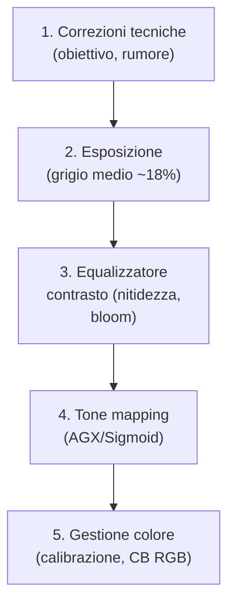
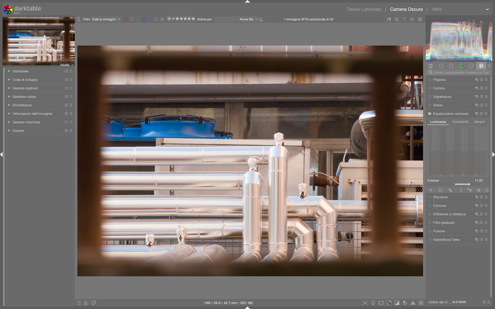

# Contrast Equalizer

Il modulo **contrast equalizer** è uno strumento avanzato per il controllo del contrasto locale e globale basato sulla decomposizione wavelet. Opera nello spazio colore CIE LCh (Luminanza, Crominanza, Tonalità), permettendo di regolare separatamente luminosità (*luma*) e saturazione (*chroma*) a diverse scale di dettaglio — dalle strutture grossolane (*coarse*) a quelle finissime (*fine*) — senza introdurre artefatti cromatici o gradient reversal[^dt48-manual]. È il modulo di riferimento per nitidezza selettiva, bloom controllato, riduzione del rumore multiscala e chiaroscuro strutturale in darktable 5.4+[^dt54-update][^pixls-rgb].

!!! tip "Contrast Equalizer ≠ Local Contrast"
    Il modulo *local contrast* applica un filtro Laplaciano su una singola scala, mentre *contrast equalizer* lavora su **6–7 scale wavelet indipendenti**, offrendo granularità superiore e compatibilità con la pipeline scene-referred. Usalo quando hai bisogno di controllo fine (es. preservare i peli di un insetto senza accentuare il rumore dello sfondo)[^dt48-manual][^video-firststeps].

## Panoramica

Contrast Equalizer non è un semplice “sharpening”: è un sistema di equalizzazione frequenziale che agisce su tre dimensioni distinte:

1. **Luma** — Controllo del contrasto luminoso a ogni scala wavelet  
2. **Chroma** — Regolazione della saturazione cromatica a ogni scala  
3. **Edges** — Affinamento dell’*edge awareness* per prevenire *halo* e *gradient reversals*[^dt48-manual]

Opera in spazio **CIE LCh**, quindi è insensibile alle variazioni di bilanciamento del bianco e mantiene la linearità fisica dei dati fino alla fase finale della pipeline[^pixls-rgb]. Questo lo rende ideale per flussi scene-referred, dove il contrasto deve essere applicato *prima* del tone mapping (AGX/Sigmoid) e *dopo* la correzione tecnica (denoise, demosaic)[^dt54-update].

### Perché usare wavelet invece di FFT o Laplaciano?

A differenza dei filtri spaziali tradizionali, la decomposizione wavelet *à trous* utilizzata da contrast equalizer:
- Preserva la località spaziale dei dettagli  
- Non introduce aliasing o ringing[^dt48-manual]  
- Permette di isolare e trattare separatamente rumore (alta frequenza) e struttura (bassa frequenza)[^video-diffuse-sharpen]  
- È matematicamente equivalente al modulo *diffuse or sharpen*, ma con interfaccia più intuitiva[^video-diffuse-sharpen]

!!! warning "Non usare contrast equalizer prima del denoise"
    Applicare contrast equalizer *prima* del denoise profilato amplifica il rumore, specialmente nelle alte luci. L’ordine corretto è:  
    `denoise profilato → contrast equalizer → tone mapping`[^dt54-update][^pixls-rgb]

## Flusso di lavoro consigliato

Il flusso ottimale segue la gerarchia fisica della luce e dei sensori:

### Passo 1: Imposta la scala di visualizzazione

Prima di modificare qualsiasi curva, **zooma all’80–100%**. Le bande alternate (chiare/scure) nel fondo della griglia indicano quali scale sono visibili a quella risoluzione:  
- Le bande **visibili** = scale che avranno effetto immediato  
- Le bande **non visibili** = scale troppo piccole per essere percepite — evita di modificarle[^dt48-manual]  

### Passo 2: Usa la modalità “difference” per testare le curve

Attiva la **modalità blend “difference”** (clicca sull’icona della maschera nella barra degli strumenti). In questa modalità, solo le aree modificate appaiono in bianco/nero:  
- Sollevare un punto sulla curva *luma* → compare il contorno dei dettagli a quella scala  
- Sollevare un punto sulla curva *chroma* → compare la saturazione locale a quella scala  
Questo ti permette di verificare *esattamente* quale struttura stai influenzando[^dt48-manual].

### Passo 3: Regola il controllo “mix”

Lo slider **mix** controlla l’intensità complessiva dell’effetto:  
- **Default**: `1.000`  
- **Valori positivi** (`0.3–1.5`) → effetto progressivo  
- **Valori negativi** (`-0.5–-1.0`) → inverte la curva (utile per *softening* o *de-emphasis*)  
- **Valore 0.000** → disabilita completamente il modulo[^dt48-manual]

> ⚠️ Attenzione: Quando il mouse è sopra la curva, la preview mostra l’effetto come se `mix = 1.0`, indipendentemente dal valore reale. Allontana il mouse per vedere l’effetto effettivo[^dt48-manual].

## Parametri principali

| Parametro | Range | Default | Descrizione |
|-----------|-------|---------|-------------|
| **mix** | `-1.000` to `+2.000` | `1.000` | Intensità globale dell’effetto. Valori negativi invertono la curva[^dt48-manual]. |
| **smooth** | `0.000` to `1.000` | `0.000` | Smoothing della curva tra i punti di controllo. Utile per eliminare transizioni troppo brusche[^dt48-manual]. |
| **luma curve** | `-1.000` to `+1.000` per ogni punto | `0.000` su tutti i punti | Aumenta (+) o diminuisce (-) il contrasto luminoso a ciascuna scala wavelet[^dt48-manual]. |
| **chroma curve** | `-1.000` to `+1.000` per ogni punto | `0.000` su tutti i punti | Aumenta (+) o diminuisce (-) la saturazione cromatica a ciascuna scala[^dt48-manual]. |
| **edges curve** | `-1.000` to `+1.000` per ogni punto | `0.000` su tutti i punti | Regola la sensibilità ai bordi per prevenire halo. Valori >0 aumentano l’edge awareness[^dt48-manual]. |

### Scale wavelet disponibili (default: 7 scale)

Le 7 scale corrispondono a raggi approssimati di dettaglio (calcolati in pixel a 100% zoom):  
| Scala | Raggio approssimativo | Tipico utilizzo |  
|-------|------------------------|------------------|  
| 1 (sinistra) | ~1 px | Peluria, texture pelle, rumore fine |  
| 2 | ~2 px | Dettagli occhi, venature foglie |  
| 3 | ~4 px | Contorni, linee sottili |  
| 4 | ~8 px | Strutture medie (fiori, tessuti) |  
| 5 | ~16 px | Forme globali (sfondo, cielo) |  
| 6 | ~32 px | Blocchi tonali (ombre profonde, luci ampie) |  
| 7 (destra) | ~64 px | Strutture molto grossolane (bloom, glow) |  

> 🔍 Nota: Il numero massimo di scale dipende dalla risoluzione dell’immagine. Per immagini < 2 MP, darktable usa automaticamente 6 scale[^video-diffuse-sharpen].

## Uso pratico per casi d’uso comuni

### ✅ Nitidezza selettiva (sharpening)

- **Obiettivo**: enfatizzare dettagli senza amplificare il rumore  
- **Impostazioni**:  
  - Scheda **luma**: solleva i punti di controllo alle scale **1–3** (valori tipici: `+0.25` a scala 1, `+0.15` a scala 2, `+0.10` a scala 3)  
  - Scheda **chroma**: lascia a `0.000` o abbassa leggermente (`-0.05`) per evitare “fringe” cromatici  
  - Scheda **edges**: imposta a `+0.10` su scale 1–2 per proteggere i bordi  
- **Consiglio**: usa una maschera parametrica su `Jz` o `Cz` per limitare l’effetto alle zone con sufficiente crominanza[^video-masks-ep4].

### ✅ Bloom / Glow artistico

- **Obiettivo**: creare un bagliore morbido attorno alle luci  
- **Impostazioni**:  
  - Scheda **luma**: solleva solo il punto più a **destra** (scala 7) a `+0.40`  
  - Scheda **chroma**: solleva il punto più a destra a `+0.20` per aggiungere calore al bloom  
  - **mix**: riduci a `0.600` per un effetto sottile  
- **Consiglio**: combina con una maschera parametrica su `Jz > 0.8` per limitare il bloom solo alle alte luci[^video-night-sky].

### ✅ Riduzione del rumore multiscala

- **Obiettivo**: eliminare rumore fine senza appiattire i dettagli  
- **Impostazioni**:  
  - Scheda **luma**: abbassa i punti di controllo alle scale **1–2** a `-0.30`  
  - Scheda **chroma**: abbassa i punti di controllo alle scale **1–3** a `-0.40`  
  - Scheda **edges**: lascia a `0.000`  
- **Consiglio**: usa *prima* il modulo **denoise profilato**, poi contrast equalizer solo per il rumore residuo[^dt54-update].

### ✅ Recupero dettagli in ombre sfocate (low-light)

- **Obiettivo**: far emergere struttura nelle zone scure senza aumentare il rumore  
- **Impostazioni**:  
  - Scheda **luma**: solleva leggermente le scale **4–5** (`+0.10`) per migliorare la definizione delle forme  
  - Scheda **chroma**: abbassa leggermente le scale **1–2** (`-0.05`) per stabilizzare i colori  
  - **mix**: `0.700`  
- **Consiglio**: abbinare con una maschera luminanza su `Jz < 0.2` per isolare le ombre[^video-lowlight].

## Parametri avanzati della curva

Espandendo la sezione *Advanced Curve Parameters*, si accede a controlli di precisione:

| Parametro | Funzione | Range | Default | Quando usarlo |
|-----------|----------|-------|---------|---------------|
| **curve smoothing** | Interpolazione tra i punti di controllo | `0.000`–`1.000` | `0.000` | Aumenta per curve più morbide (evita “spikes”) |
| **radius** | Raggio di influenza del cursore | `1`–`256` px | `16` px | Aumenta per modificare più punti contemporaneamente |
| **feathering radius** | Sfumatura della maschera associata | `0.0`–`100.0` px | `0.0` px | Solo se usi una maschera — mai necessario in modalità base |

!!! warning "Non toccare questi parametri senza motivo"
    I seguenti valori sono quasi sempre ottimali di default e devono essere modificati solo in casi specifici:  
    - `radius > 64 px`: rischio di perdita di controllo locale  
    - `curve smoothing > 0.300`: può appiattire dettagli fini  
    - `feathering radius > 0.0` in assenza di maschera: inefficace[^dt48-manual]

## Gestione del rumore con contrast equalizer

Contrast Equalizer include due spline di denoise integrate, una per **luma**, una per **chroma**, posizionate rispettivamente sotto le curve principali.

- **Spline luma denoise**:  
  - Si attiva cliccando *sopra* uno dei triangoli in basso e trascinando verso l’alto  
  - **Effetto**: riduce il rumore luminoso *solo* alla scala selezionata  
  - **Valore tipico**: `+0.20` a scala 1 per ISO ≥ 1600[^dt48-manual]  

- **Spline chroma denoise**:  
  - Simile alla luma, ma agisce sul rumore cromatico  
  - **Valore tipico**: `+0.35` a scala 1, `+0.15` a scala 2 (il rumore cromatico è più aggressivo alle scale fini)[^dt48-manual]  

> 📌 Nota: Il denoise wavelet è più efficace su scale **basse** (1–3). Su scale alte (5–7) ha scarso effetto perché il rumore non esiste a quelle dimensioni[^dt48-manual].

### Esempio: Denoise con contrast equalizer su foto ad alto ISO

*Da [ENG] Darktable first steps EP05 (YouTube, timestamp 06:12)*[^video-firststeps]  
1. Apri un’immagine scattata a ISO 6400 con evidente rumore cromatico nelle ombre  
2. Attiva la scheda **chroma**, zooma all’80–100%  
3. Clicca *sopra il triangolo più a sinistra* (scala 1) e trascina verso l’alto fino a `+0.35`  
4. Ripeti per il triangolo successivo (scala 2) fino a `+0.15`  
5. Passa alla scheda **luma**, solleva il triangolo a scala 1 a `+0.20`  
6. Verifica in modalità *difference*: il rumore appare attenuato senza perdita di dettagli strutturali  

### Esempio: Bloom artistico con maschera parametrica

*Da [ENG] darktable Night Sky Full Edit (YouTube, timestamp 04:28)*[^video-night-sky]  
1. Attiva la scheda **luma**, seleziona la scala più a destra (scala 7)  
2. Solleva il punto di controllo a `+0.40`  
3. Vai nella scheda **chroma**, solleva lo stesso punto a `+0.20`  
4. Clicca sull’icona della maschera → *parametric mask* → scegli `Jz`  
5. Imposta `Jz > 0.8` e `Cz < 0.15` per isolare solo le luci fredde e brillanti  
6. Regola **mix** a `0.550` per un effetto naturale e non invasivo  

### Esempio: Nitidezza selettiva su ritratto con edge protection

*Da [ENG] The diffuse and sharpen module (YouTube, timestamp 07:45)*[^video-diffuse-sharpen]  
1. Attiva la scheda **luma**, zooma all’100% su un occhio  
2. Solleva i punti di controllo a scale 1–3: `+0.30`, `+0.22`, `+0.15`  
3. Passa alla scheda **edges**, solleva i primi due punti a `+0.12` e `+0.08`  
4. Attiva la modalità *difference*: osserva come i bordi degli occhi restano puliti senza halo  
5. Aggiungi una maschera disegnata su pelle e occhi, con *feathering radius = 8 px*  

## Domande frequenti

### Problema: Il contrast equalizer genera artefatti cromatici intorno ai bordi  
Usa la scheda **edges** per aumentare l’edge awareness (valori da `+0.05` a `+0.15` su scale 1–3), oppure abbassa leggermente la curva **chroma** alle stesse scale. Se persiste, applica una maschera parametrica su `Cz < 0.05` per escludere le zone con bassa crominanza[^video-diffuse-sharpen].

### Problema: L’effetto non è visibile anche dopo aver modificato la curva  
Verifica che tu sia zoomato all’80–100% e che le bande alternate nella griglia siano visibili sotto i punti modificati. Se le bande non appaiono, la scala è troppo fine per la risoluzione corrente: riduci lo zoom o usa un’immagine più grande[^dt48-manual].

### Problema: Il bloom appare innaturale o “finto”  
Riduci il valore **mix** (da `0.400` a `0.250`), abbassa il valore **luma** alla scala 7 (da `+0.40` a `+0.22`), e applica una maschera parametrica su `Jz > 0.75` per limitarlo alle luci più intense[^video-night-sky].

### Problema: La curva luma produce “halo” nei bordi netti  
Attiva la scheda **edges**, solleva il primo punto (scala 1) a `+0.10`, quindi abbassa leggermente la curva **luma** alla stessa scala di `0.05`. Questo riduce la sensibilità del filtro alle transizioni brusche[^dt48-manual].

## Preset integrati

Il modulo **contrast equalizer** include 7 preset ufficiali, accessibili tramite il menu hamburger (☰) in alto a destra del modulo. Tutti operano in CIE LCh e sono compatibili con la pipeline scene-referred[^dt48-manual].

| Preset | Quando usarlo | Note |
|---|---|---|
| `sharpen` | Nitidezza generale su immagini ben esposte | Imposta `luma` scale 1–3 a `+0.25`, `+0.18`, `+0.12`; `edges` a `+0.08` su scala 1 |
| `denoise` | Rumore fine su ISO ≥ 1600 | `luma denoise` scala 1 a `+0.20`, `chroma denoise` scale 1–2 a `+0.35`/`+0.15` |
| `bloom` | Effetto glow su luci isolate | `luma` scala 7 a `+0.35`, `chroma` scala 7 a `+0.18`, `mix = 0.500` |
| `clarity` | Contrasto locale strutturale | `luma` scale 2–4 a `+0.15`, `+0.12`, `+0.08`; `chroma` a `0.000` |
| `soften` | Effetto “velvet skin” su ritratti | `luma` scale 1–2 a `-0.20`, `-0.10`; `chroma` scala 1 a `-0.30` |
| `detail-enhancement` | Estrazione dettagli in macro/fiori | `luma` scale 1–3 a `+0.30`, `+0.25`, `+0.20`; `edges` a `+0.10` su scala 1 |
| `high-contrast-bw` | Potenziamento strutturale per B/N | `luma` scale 2–5 a `+0.22`, `+0.18`, `+0.15`, `+0.10`; `chroma` a `0.000` |

> 💡 I preset possono essere modificati e salvati come nuovi preset personalizzati. Il valore di **mix** non è memorizzato nel preset: viene sempre applicato al valore corrente[^dt48-manual].

## Riferimenti visuali

*Il modulo «contrast equalizer» (Equalizzatore contrasto) nell'interfaccia di darktable (vista darkroom).*

## Risorse aggiuntive

- [darktable user manual — contrast equalizer](https://docs.darktable.org/usermanual/development/en/module-reference/processing-modules/contrast-equalizer/)  
- [ENG] Darktable first steps EP05 — Contrast Equalizer explained (YouTube)  
- [ENG] The diffuse and sharpen module — Wavelet theory deep dive (YouTube)  
- [ENG] darktable masks Episode 4 — Using contrast equalizer with parametric masks (YouTube)  
- [ENG] Lowlight photos in darktable — Noise control workflow (YouTube)  
- PIXLS.US — Darktable 3: RGB or Lab? Which Modules? Help!  

## Fonti

[^dt48-manual]: darktable user manual - contrast equalizer, https://docs.darktable.org/usermanual/development/en/module-reference/processing-modules/contrast-equalizer/#
[^dt54-update]: darktable 5.4 release notes & pipeline update, https://www.darktable.org/2024/09/darktable-5-4-released/
[^pixls-rgb]: PIXLS.US — Darktable 3:RGB or Lab? Which Modules? Help!, https://pixls.us/articles/darktable-3-rgb-or-lab-which-modules-help/
[^video-firststeps]: [ENG] Darktable first steps EP05, https://www.youtube.com/watch?v=sgW4oOtLeNs
[^video-diffuse-sharpen]: [ENG] The diffuse and sharpen module, https://www.youtube.com/watch?v=jHlPh7gt3Y0
[^video-masks-ep4]: [ENG] darktable masks Episode 4, https://www.youtube.com/watch?v=4z70D5zRAXw
[^video-lowlight]: [ENG] Lowlight photos in darktable, https://www.youtube.com/watch?v=O7wXgmQZqiU
[^video-night-sky]: [ENG] darktable Night Sky Full Edit, https://www.youtube.com/watch?v=5P0Yj_vqy5w
