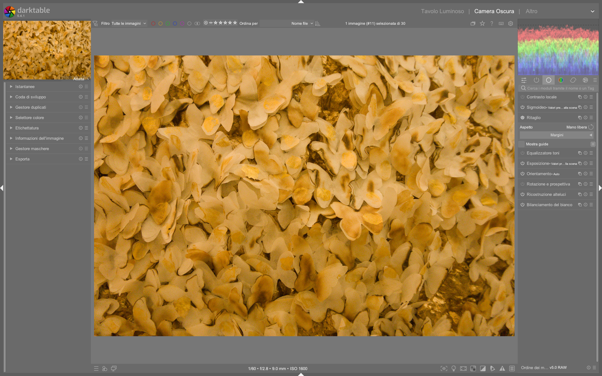

# Crop

Il modulo **crop** è il modulo dedicato al ritaglio geometrico in darktable 5.4+, progettato per sostituire definitivamente il modulo obsoleto *crop and rotate* a partire dalla versione 3.8[^crop-rotate-deprecated]. È posizionato *dopo* i moduli di correzione geometrica (*rotate and perspective*) e *prima* di quelli di ritocco (*retouch*), garantendo che l’intera immagine originale rimanga disponibile per la creazione di sorgenti (*source spots*) nel modulo *retouch*[^crop-manual][^pipeline-order].

!!! info "Posizione strategica nella pipeline"
    Il modulo `crop` è collocato nella fase finale della pipeline tecnica, subito prima dei moduli creativi (es. `color balance rgb`, `AGX`). Questo ordine permette di eseguire ritagli artistici *dopo* aver corretto rotazione, prospettiva e orientamento, preservando la massima flessibilità per interventi locali successivi[^crop-manual][^pipeline-beginner].

## Panoramica

Il modulo `crop` gestisce esclusivamente la selezione dell’area visibile dell’immagine, senza effettuare alcuna trasformazione geometrica (rotazione, keystone, flip). Questa separazione funzionale è fondamentale per un workflow robusto:

1. **Correzione geometrica**: eseguita con `rotate and perspective` (per angoli e distorsioni prospettiche) e `orientation` (per capovolgimenti orizzontali/verticali)[^crop-rotate-deprecated][^dt38-what-new]
2. **Ritaglio finale**: eseguito con `crop`, che opera su un’immagine già geometricamente corretta[^crop-manual]

Il modulo fornisce due modalità di controllo:
- **Interattiva**: trascinamento diretto dei maniglioni sullo schermo
- **Numerica**: impostazione precisa tramite slider *Margins* o input testuale del rapporto d’aspetto[^crop-manual]

A differenza del vecchio `crop and rotate`, non offre controlli per l’angolo né per la prospettiva: tentativi di utilizzo per tali scopi genereranno risultati imprecisi o artefatti di interpolazione[^crop-rotate-deprecated].

## Flusso di lavoro consigliato

Il flusso di lavoro ottimale per il ritaglio in darktable segue una sequenza rigorosa di tre passaggi, rispettando l’ordine della pipeline[^pipeline-beginner][^dt38-what-new]:

```
1. rotate and perspective → correzione angolo e prospettiva
   |
2. orientation → flip orizzontale/verticale (se necessario)
   |
3. crop → ritaglio artistico finale
```

!!! tip "Regola d’oro: ritaglia sempre per ultimo"
    Applica sempre `crop` *dopo* aver completato tutte le correzioni geometriche e tecniche. Ritagliare prima comporta la perdita di dati necessari per operazioni come `retouch` (che richiede aree esterne al crop per le sorgenti) o `diffuse or sharpen` (che beneficia di un contesto più ampio)[^crop-manual][^pipeline-beginner].

### Passo 1: Imposta il rapporto d’aspetto

Prima di disegnare il rettangolo, definisci il rapporto d’aspetto desiderato dal menu a tendina *aspect*:

- **Predefiniti comuni**: `freehand`, `original image`, `square` (1:1), `golden cut` (≈1.62:1)[^crop-manual]
- **Personalizzati**: digita direttamente nel campo `x:y` (es. `13:18` per una stampa 13×18 cm) o come decimale (es. `0.722` per 13/18 ≈ 0.722)[^crop-secrets][^crop-manual]
- **Orientamento**: usa il pulsante accanto al menu per scambiare rapidamente tra *portrait* e *landscape*[^crop-manual]

### Passo 2: Disegna e regola il crop

Con il rapporto impostato:
- **Crea il rettangolo**: clicca e trascina nell’area dell’immagine
- **Ridimensiona**: trascina i maniglioni sui bordi o negli angoli
- **Sposta**: clicca e trascina all’interno del rettangolo
- **Muovi su un asse**: tieni premuto `Ctrl` (orizzontale) o `Shift` (verticale) mentre trascini[^crop-manual]

!!! warning "Attenzione ai maniglioni laterali"
    In alcune versioni recenti (es. 5.5+), i maniglioni sui lati possono essere difficili da afferrare se il bordo del crop coincide con il limite dell’immagine visualizzata. In tal caso, riduci leggermente il crop con un angolo per far apparire i maniglioni laterali[^pixls-crop-bug].

### Passo 3: Affina numericamente (opzionale)

Espandi la sezione *Margins* per controllare con precisione la percentuale di immagine tagliata da ogni lato:
- `left`, `right`, `top`, `bottom`: valori da `0.00%` (nessun taglio) a `100.00%` (taglio totale)[^crop-manual]
- I valori si aggiornano automaticamente quando modifichi il crop interattivamente[^crop-manual]

## Parametri principali

| Parametro | Range | Default | Descrizione |
|-----------|-------|---------|-------------|
| **aspect** | `freehand`, `original image`, `square`, `golden cut`, `x:y` (es. `13:18`) | `freehand` | Constrain the crop rectangle to a fixed width:height ratio. Custom ratios must be integers (e.g., `191:100` for 1.91:1)[^crop-manual][^crop-secrets] |
| **left margin** | 0.00% – 100.00% | 0.00% | Percentage of the image cropped from the left edge[^crop-manual] |
| **right margin** | 0.00% – 100.00% | 0.00% | Percentage of the image cropped from the right edge[^crop-manual] |
| **top margin** | 0.00% – 100.00% | 0.00% | Percentage of the image cropped from the top edge[^crop-manual] |
| **bottom margin** | 0.00% – 100.00% | 0.00% | Percentage of the image cropped from the bottom edge[^crop-manual] |

## Guide e sovrapposizioni

Il modulo supporta guide visive per il composizione, attivabili con la casella *show guides*[^crop-manual]:

- **Tipi disponibili**: `rule of thirds`, `golden spiral`, `diagonal`, `harmonious triangle`, `grid`, `centerline`[^dt38-what-new]
- **Attivazione rapida**: premi `G` per mostrare/nascondere le guide globalmente[^dt38-what-new]
- **Personalizzazione**: clicca sull’icona a destra di *show guides* per modificare colore, opacità e tipo[^crop-manual]

!!! tip "Guide per la stampa fisica"
    Per stampe con dimensioni esatte (es. 13×18 cm), combina il rapporto `13:18` con la guida `rule of thirds`: la griglia ti aiuta a posizionare elementi chiave secondo i principi compositivi standard, mantenendo il rapporto fisico richiesto[^crop-secrets].

## Gestione degli aspetti avanzati

### Aggiunta di nuovi rapporti d’aspetto

Per rendere persistenti rapporti personalizzati (es. `13:18`) nel menu a tendina:
1. Apri il file di configurazione `$HOME/.config/darktable/darktablerc`
2. Aggiungi una riga nel formato:  
   `plugins/darkroom/clipping/extra_aspect_ratios/13x18=13:18`  
   *(il nome `13x18` appare nel menu; `13:18` è il rapporto effettivo)*[^crop-manual]

### Compatibilità con il modulo Retouch

Il modulo `crop` è intenzionalmente posizionato *dopo* `retouch` nella pipeline. Ciò significa che:
- Tutte le aree fuori dal crop sono ancora accessibili come *source spots* per clonazione o riparazione
- Le maschere create in `retouch` possono estendersi oltre i bordi finali del crop[^crop-manual][^crop-rotate-deprecated]

!!! warning "Non usare crop per correggere la prospettiva"
    Il modulo `crop` non esegue alcuna interpolazione. Se utilizzi `crop` invece di `rotate and perspective` per “correggere” linee verticali, otterrai solo un’immagine ritagliata con linee inclinate — non rettificate. La correzione prospettica richiede l’interpolazione fornita da `rotate and perspective`[^crop-rotate-deprecated].

### Esempio: Correzione automatica del crop dopo rotazione

*Da [darktable 3.8 What is new?](https://www.youtube.com/watch?v=5smugZ5pXN0) (timestamp 240s)*  
1. Attiva il modulo `rotate and perspective` e applica una rotazione di +1.7° per raddrizzare l’orizzonte  
2. Abilita *automatic cropping* → *largest area* per eliminare i bordi neri causati dalla rotazione  
3. Verifica che il crop automatico abbia prodotto un rettangolo con margini: `left = 2.3%`, `right = 1.9%`, `top = 0.0%`, `bottom = 0.0%`  
4. Passa al modulo `crop`: il rettangolo automatico è già visibile ed editabile  
5. Regola manualmente i margini per centrare la composizione: `left = 3.1%`, `right = 2.7%`, `top = 0.2%`, `bottom = 0.2%`  
6. Conferma il crop spostando il focus su un altro modulo (es. `exposure`)[^dt38-what-new]

### Esempio: Crop con guida golden spiral per ritratto

*Da [The secrets of cropping](https://www.youtube.com/watch?v=WRIzHRTA_N4) (timestamp 195s)*  
1. Imposta *aspect* su `freehand`  
2. Attiva *show guides* e seleziona `golden spiral`  
3. Allinea l’occhio destro del soggetto con il centro della spirale (posizione approssimativa: 62% dall’alto, 38% da sinistra)  
4. Ridimensiona il crop finché il volto occupa circa il 65% dell’altezza totale  
5. Usa i margini numerici per confermare: `top = 18.2%`, `bottom = 16.8%`, `left = 22.1%`, `right = 22.9%`  
6. Disattiva le guide con `G` e procedi al ritocco[^crop-secrets]

## Domande frequenti

### Problema: Crop non si applica dopo aver usato `rotate and perspective` con *automatic cropping*
Quando `rotate and perspective` applica *automatic cropping*, genera un crop temporaneo che viene sovrascritto dal modulo `crop`. Il crop finale è determinato esclusivamente dal modulo `crop`, non da quello automatico. Se il crop sembra "sparito", verifica che il modulo `crop` sia abilitato e che il rettangolo sia visibile (potrebbe essere ridotto a zero margini). L’automatic cropping serve solo a prevenire bordi neri, non a sostituire il crop artistico[^dt38-what-new].

### Problema: Rapporto d’aspetto personalizzato non compare nel menu *aspect*
I rapporti personalizzati devono essere definiti nel file `$HOME/.config/darktable/darktablerc` con sintassi esatta: `plugins/darkroom/clipping/extra_aspect_ratios/NOME=x:y`, dove `x` e `y` sono interi positivi (es. `191:100`, non `1.91:1`). Dopo la modifica, riavvia darktable. Se il nome contiene caratteri speciali o spazi, potrebbe non caricarsi[^crop-manual].

### Problema: Il crop interattivo "salta" durante il trascinamento
Questo comportamento si verifica quando il cursore si muove troppo velocemente sopra i maniglioni, causando un "effetto slittamento". Soluzione: riduci la sensibilità del mouse nel sistema operativo o usa `Shift` durante il trascinamento per attivare il *fine adjustment mode*, che limita il movimento a incrementi di 0.1% per margine[^crop-manual].

## Preset built-in del modulo crop

Il modulo `crop` include preset preconfigurati per casi d’uso comuni. Sono accessibili dal menu *presets* nell’intestazione del modulo[^crop-manual]:

| Preset | Quando usarlo | Note |
|---|---|---|
| `original image` | Ripristino del crop precedente o reset completo | Annulla tutti i margini (`left=right=top=bottom=0.00%`) |
| `square` | Ritratti, profili social, stampe quadrate | Forza rapporto 1:1, indipendentemente dall’orientamento |
| `golden cut` | Composizioni classiche (paesaggi, architettura) | Rapporto fisso 1.618:1, equivalente a `1618:1000` |
| `freehand` | Massima libertà compositiva | Nessun vincolo, utile per correzioni di framing fine |

## Riferimenti visuali


*Il modulo «crop» (Ritaglio) nell'interfaccia di darktable (vista darkroom).*

## Risorse aggiuntive

- [darktable user manual — crop](https://docs.darktable.org/usermanual/development/en/module-reference/processing-modules/crop/) [^crop-manual]
- [darktable user manual — (deprecated) crop and rotate](https://docs.darktable.org/usermanual/development/en/module-reference/processing-modules/crop-rotate/) [^crop-rotate-deprecated]
- [YouTube — The secrets of cropping](https://www.youtube.com/watch?v=WRIzHRTA_N4) [^crop-secrets]
- [YouTube — darktable 3.8 What is new?](https://www.youtube.com/watch?v=5smugZ5pXN0) [^dt38-what-new]
- [discuss.pixls.us — Auto-crop from 'rotate and perspective' being disabled](https://discuss.pixls.us/t/auto-crop-from-rotate-and-perspective-being-disabled/57031) [^pixls-crop-bug]
- [YouTube — The darktable pipeline for beginners](https://www.youtube.com/watch?v=1nPW6WPhhTo) [^pipeline-beginner]

## Fonti

[^crop-manual]: darktable user manual - crop, https://docs.darktable.org/usermanual/development/en/module-reference/processing-modules/crop/
[^crop-rotate-deprecated]: darktable user manual - (deprecated) crop and rotate, https://docs.darktable.org/usermanual/development/en/module-reference/processing-modules/crop-rotate/
[^dt38-what-new]: [ENG] darktable 3.8 What is new?, https://www.youtube.com/watch?v=5smugZ5pXN0
[^crop-secrets]: [ENG] The secrets of cropping, https://www.youtube.com/watch?v=WRIzHRTA_N4
[^pipeline-beginner]: [ENG] The darktable pipeline for beginners, https://www.youtube.com/watch?v=1nPW6WPhhTo
[^pixls-crop-bug]: Auto-crop from 'rotate and perspective' being disabled, https://discuss.pixls.us/t/auto-crop-from-rotate-and-perspective-being-disabled/57031
[^pipeline-order]: darktable user manual - module order, https://docs.darktable.org/usermanual/development/en/module-reference/utility-modules/darkroom/module-order/
