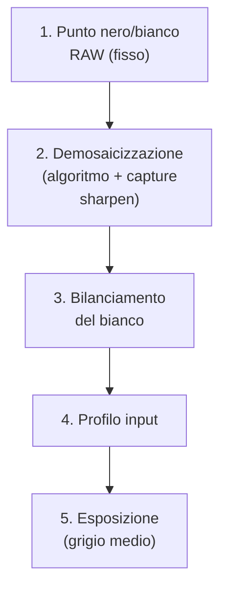
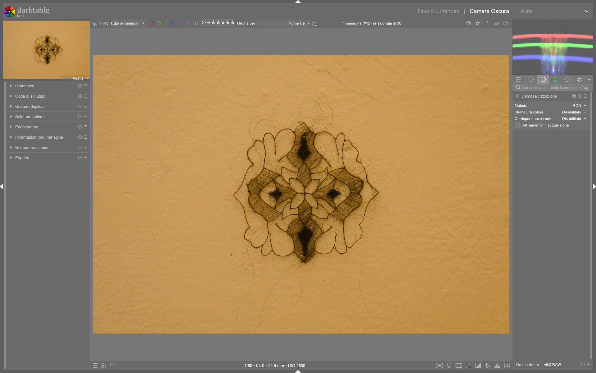

# Demosaicing

Il modulo **demosaicing** è il primo modulo tecnico obbligatorio nella pipeline di elaborazione RAW di darktable. Ricostruisce l’intero spazio colore RGB da un singolo canale per pixel (disposto secondo il pattern del filtro Bayer o X-Trans), trasformando i dati grezzi del sensore in un’immagine visualizzabile con informazioni complete su rosso, verde e blu per ogni punto. È fondamentale per la qualità finale della nitidezza, della risoluzione cromatica e della gestione del rumore, specialmente a ISO elevati[^manual-demosaic][^dt38-demosaic].

!!! info "Demosaicing è obbligatorio e non disabilitabile"
    Il modulo `demosaic` appare grigio e bloccato nella pipeline (non modificabile) in modalità *darkroom* perché è un passaggio tecnico indispensabile: senza di esso, i dati RAW rimangono una matrice di intensità monocromatiche e non possono essere interpretati come immagine RGB. Non è possibile saltarlo né bypassarlo[^pipeline-beginner].

## Panoramica

Il demosaicing opera immediatamente dopo `raw black/white point` e prima di `white balance`, `input color profile` e tutti i moduli creativi. La sua posizione è fissa nella *pixelpipe*, poiché lavora sui dati lineari più grezzi disponibili[^manual-demosaic]. Il suo compito primario è:

1. **Interpolare i valori mancanti** per ogni pixel (es. un pixel verde deve stimare i valori di rosso e blu adiacenti);
2. **Ridurre artefatti cromatici**, come false colori (fringing) e moiré;
3. **Preservare la nitidezza fine** senza introdurre aliasing o bordi frastagliati;
4. **Fornire una base stabile** per i moduli successivi, in particolare per il `capture sharpen` integrato[^dt38-demosaic].

A differenza di Lightroom — dove il demosaicing è completamente opaco — darktable espone tre livelli di controllo:  
- **Algoritmo principale** (scelta tra RCD, AMaZE, Markesteijn, ecc.);  
- **Smoothing cromatico** (per ridurre il rumore cromatico senza appiattire i dettagli);  
- **Capture sharpen** (nitidezza applicata *durante* la ricostruzione, non dopo)[^dragan-effect].

## Flusso di lavoro consigliato

Il flusso ottimale per il demosaicing segue rigorosamente l’ordine fisico della pipeline scene-referred[^pipeline-beginner]:

!!! tip "Capture sharpen va attivato *prima* del denoise"
    Il `capture sharpen` integrato nel modulo `demosaic` agisce sui dati lineari *prima* che il rumore venga amplificato dai moduli successivi. Attivarlo qui è molto più efficace (e meno rumoroso) che usare il modulo `sharpen` o `diffuse or sharpen` in seguito[^dragan-effect].

### Passo 1: Scelta dell’algoritmo

Per la maggior parte degli utenti, **RCD (Raw Color Demosaicing)** è il default bilanciato: veloce, robusto, con buona gestione del rumore e dei bordi[^manual-demosaic].  
Per immagini ad alto ISO o con dettagli finissimi (macro, paesaggi), **Markesteijn 1-pass** offre maggiore precisione ma richiede più tempo di elaborazione[^dt38-demosaic].

| Algoritmo | Velocità | Qualità | Raccomandato per |
|-----------|----------|---------|-------------------|
| **RCD** | ⚡⚡⚡⚡ | ⚡⚡⚡ | Uso generale, editing batch, ISO fino a 3200 |
| **AMaZE** | ⚡⚡⚡ | ⚡⚡⚡⚡ | RAW con basso rumore, ISO < 800, massima fedeltà cromatica |
| **Markesteijn 1-pass** | ⚡⚡ | ⚡⚡⚡⚡⚡ | Macro, architettura, immagini ad alta risoluzione, ISO elevati[^dt38-demosaic] |
| **PPG** | ⚡⚡⚡⚡⚡ | ⚡⚡ | Solo se necessario per compatibilità con vecchi preset |

### Passo 2: Attivazione del Capture Sharpen

Il `capture sharpen` è un’ottimizzazione critica per la nitidezza intrinseca, applicata direttamente sulle bande di colore interpolate. I suoi parametri sono accessibili solo quando l’algoritmo scelto lo supporta (RCD, Markesteijn, AMaZE)[^dragan-effect].

- **Abilita**: checkbox `capture_sharpen` (default: disabilitato)  
- **Iterations**: numero di passaggi iterativi per affinare il kernel (range: **1–16**, default: **8**)  
- **Radius**: raggio di azione del kernel in pixel (range: **0.2–2.0 px**, default: **0.6 px**)  
- **Contrast sensitivity**: soglia minima di contrasto per attivare il sharpen (range: **0.0–1.0**, default: **0.3**)  
- **Corner boost**: rinforzo dei dettagli agli angoli (range: **0.0–1.0**, default: **0.0**)  

!!! warning "Non esagerare con radius e iterations"
    Un `radius > 0.8 px` o `iterations > 12` introduce artefatti di overshoot (alone bianchi/neri ai bordi) e aumenta visibilmente il rumore cromatico. Valori oltre questi limiti sono raramente utili e quasi sempre dannosi[^dragan-effect].

## Parametri principali

| Parametro | Range | Default | Descrizione |
|-----------|--------|---------|-------------|
| **Method** | RCD, AMaZE, Markesteijn 1-pass, PPG, VNG4 | RCD | Algoritmo di interpolazione principale. RCD è il più equilibrato[^manual-demosaic]. |
| **Color smoothing** | disabled, enabled | disabled | Riduce il rumore cromatico nei piani omogenei (es. cielo). Abilitare solo se si osservano false colori[^manual-demosaic]. |
| **Capture sharpen** | on/off | off | Abilita la nitidezza integrata durante la demosaicing[^dragan-effect]. |
| **Iterations** | 1–16 | 8 | Numero di passaggi per affinare il kernel. Più alto = più preciso ma più lento[^dragan-effect]. |
| **Radius** | 0.2–2.0 px | 0.6 px | Estensione spaziale del kernel. Valori alti causano overshoot[^dragan-effect]. |
| **Contrast sensitivity** | 0.0–1.0 | 0.3 | Soglia minima di contrasto per attivare il sharpen. Valori bassi → più aggressivo[^dragan-effect]. |
| **Corner boost** | 0.0–1.0 | 0.0 | Rinforzo specifico per gli angoli. Usare solo per dettagli strutturali marcati[^dragan-effect]. |

## Algoritmi avanzati e casi d’uso

### Markesteijn 1-pass: per ISO elevati e dettaglio estremo

Introdotto in darktable 3.8, questo algoritmo è ottimizzato per immagini rumorose e per sensori Sony ARW, grazie a una stima statistica migliorata dei valori mancanti[^dt38-demosaic]. È l’unico algoritmo che supporta nativamente il `capture_sharpen` con **controllo indipendente su luci/ombre**, rendendolo ideale per:

- Fotografia notturna (ISO ≥ 6400);  
- Macro con profondità di campo ridotta;  
- Architettura con linee nette e texture complesse.

Valori tipici per Markesteijn + capture sharpen:
- `Iterations`: **10–12**  
- `Radius`: **0.5–0.7 px**  
- `Contrast sensitivity`: **0.25–0.35**  
- `Corner boost`: **0.1–0.2** (solo se necessario)[^dt38-demosaic]

### AMaZE: per massima fedeltà cromatica (basso ISO)

L’algoritmo AMaZE (Adaptive Multi-Scale Averaging) è il più conservativo: minimizza le interpolazioni aggressive e preserva la purezza cromatica originale del sensore. È ideale per:

- Studio fotografico con illuminazione controllata;  
- Scatti a ISO 100–400 su fotocamere Fujifilm X-Trans o Canon;  
- Quando si pianifica un’elaborazione molto aggressiva in seguito (es. filmic rgb con alta latitude).

⚠️ Nota: AMaZE è più lento di RCD e non include `corner boost`. Il `capture_sharpen` è supportato, ma richiede valori più cauti (`radius ≤ 0.5 px`) per evitare artefatti[^manual-demosaic].

### Dual demosaic: combinazione intelligente per zone eterogenee

darktable supporta algoritmi duali come **RCD + VNG4**, che applicano due metodi distinti e li fondono in base alla struttura locale dell’immagine[^manual-demosaic]. Questo approccio è particolarmente utile per immagini con aree ad alta frequenza (es. dettagli di tessuto, foglie) e aree a bassa frequenza (cielo uniforme, pareti lisce).

- Il primo algoritmo (es. `RCD`) elabora i dettagli fini;  
- Il secondo (es. `VNG4`) gestisce le zone omogenee con minor rumore cromatico;  
- La fusione avviene tramite una **maschera di blending** calcolata dalla varianza locale (gaussian-blurred luminance mask)[^manual-demosaic];  
- Il parametro `switch dual threshold` regola la sensibilità: valori **bassi (< 0.3)** favoriscono RCD nelle zone più strutturate; valori **alti (> 0.7)** estendono VNG4 anche in zone leggermente strutturate[^manual-demosaic].

### LMMSE: per immagini ad alto ISO con moiré preesistente

L’algoritmo **LMMSE (Linear Minimum Mean Square Error)** è progettato per immagini ad alto ISO caratterizzate da rumore strutturato o moiré già presente nei dati RAW[^manual-demosaic]. Rispetto a RCD e AMaZE, LMMSE genera meno overshoot cromatico e gestisce meglio i pattern ripetitivi, ma richiede più tempo di elaborazione.

- Supporta il parametro `LMMSE refine` (range: **0–16**, default: **4**), che aggiunge passaggi di ricombinazione dei canali rosso/blu per migliorare la stima dei valori mancanti[^manual-demosaic];  
- Non supporta `capture_sharpen`;  
- È particolarmente efficace su sensori Canon e Nikon con ISO ≥ 3200 e su scatti con forti riflessi metallici o trame artificiali (tessuti, griglie)[^manual-demosaic].

## Walkthrough da video tutorial

### Esempio: Setup RCD + capture_sharpen per ritratto in studio  
*Da [The Dragan effect in darktable](https://www.youtube.com/watch?v=EuvG0lh8OB8&t=110) (min 1:50)*  
1. Seleziona `Method = RCD` nel modulo `demosaic`;  
2. Abilita `capture_sharpen`;  
3. Imposta `Iterations = 8`, `Radius = 0.6 px`, `Contrast sensitivity = 0.3`;  
4. Disattiva `color_smoothing` (non necessario su ISO 200–400);  
5. Verifica il risultato zoomando al 100% su occhi e capelli: nessun fringing rosso/ciano, dettagli dei peli ben definiti[^dragan-effect].

### Esempio: Markesteijn 1-pass per macro notturna  
*Da [darktable 3.8 What is new?](https://www.youtube.com/watch?v=5smugZ5pXN0&t=240) (min 4:00)*  
1. Imposta `Method = Markesteijn 1-pass`;  
2. Abilita `capture_sharpen`;  
3. Regola `Iterations = 12`, `Radius = 0.55 px`, `Contrast sensitivity = 0.28`;  
4. Attiva `color_smoothing` solo se si osservano falsi colori sul bordo di petali o ali d’insetto;  
5. Usa `display blending mask` per verificare che la maschera copra uniformemente i dettagli fini senza lasciare buchi[^dt38-demosaic].

## Domande frequenti

### Problema: Comparsa di false colori (fringing rosso/ciano) su bordi contrastati  
Attiva `color_smoothing` e verifica che `match greens` sia impostato su `full and local average` (per sensori Bayer). Se persiste, passa a `Markesteijn 1-pass` o `LMMSE`[^manual-demosaic].

### Problema: Immagine “troppo morbida” nonostante capture_sharpen abilitato  
Controlla che `capture_sharpen` sia effettivamente supportato dall’algoritmo selezionato: `PPG` e `VNG4` **non lo supportano**[^manual-demosaic]. Inoltre, assicurati che `Iterations ≥ 6` e `Radius ≥ 0.4 px`[^dragan-effect].

### Problema: Alto consumo CPU e rallentamenti durante l’anteprima  
Disabilita `color_smoothing`, riduci `Iterations` a **6** per `Markesteijn`, e usa `PPG` solo per anteprime rapide. Su hardware limitato, evita `AMaZE` (il più lento)[^manual-demosaic].

## Consigli operativi

!!! tip "Verifica il risultato con zoom 100% e maschera di sovrapposizione"
    Per valutare la qualità del demosaicing, usa `Ctrl+1` per zoomare al 100% e attiva la **maschera di sovrapposizione** (`O`): evidenzia i falsi colori (fringing rosso/ciano) e i bordi instabili. Se compaiono alone cromatici, prova a abilitare `color_smoothing` o passa a Markesteijn[^manual-demosaic].

!!! warning "Non combinare capture_sharpen con altri moduli di nitidezza"
    Evita di usare contemporaneamente `capture_sharpen`, `sharpen`, `diffuse or sharpen` e `local contrast`. Questo crea una cascata di effetti cumulativi che distruggono la struttura naturale dell’immagine. Usa `capture_sharpen` *una sola volta*, all’inizio della pipeline[^dragan-effect].

### Ottimizzazione per prestazioni

Su hardware limitato (es. Mac Mini M4 Pro con GPU integrata), RCD garantisce il miglior rapporto velocità/qualità. Se l’elaborazione è lenta:
- Disabilita `color_smoothing` (è costoso);
- Riduci `iterations` a **6** per Markesteijn;
- Usa `PPG` solo per test rapidi o anteprime[^mac-mini-m4-pro].

### Preset built-in del modulo demosaic

darktable include preset preconfigurati per casi comuni, accessibili dal menu hamburger del modulo[^manual-demosaic]:

| Preset | Quando usarlo | Note |
|---|---|---|
| `RCD default` | Uso generale, editing rapido | Basato su RCD con `capture_sharpen` disabilitato |
| `Markesteijn high-res` | Immagini ad alta risoluzione (≥ 45 MP), macro | `Iterations = 12`, `Radius = 0.5 px`, `Contrast sensitivity = 0.25` |
| `AMaZE low-noise` | Studio, ISO ≤ 400, massima purezza cromatica | `Radius = 0.45 px`, `Contrast sensitivity = 0.35`, `color_smoothing = disabled` |
| `LMMSE noisy` | ISO ≥ 6400, immagini con moiré | `LMMSE refine = 8`, `color_smoothing = enabled` |

## Riferimenti visuali

*Il modulo «demosaic» (Demosaicizzazione) nell'interfaccia di darktable (vista darkroom).*

## Risorse aggiuntive

- [darktable User Manual — Demosaic](https://docs.darktable.org/usermanual/development/en/module-reference/processing-modules/demosaic/) — Documentazione ufficiale completa[^manual-demosaic]  
- [darktable 3.8 What is new? — Video tutorial (min 4:00)](https://www.youtube.com/watch?v=5smugZ5pXN0&t=240) — Introduzione a LMMSE e Markesteijn[^dt38-demosaic]  
- [The Dragan effect in darktable — Video tutorial (min 1:50)](https://www.youtube.com/watch?v=EuvG0lh8OB8&t=110) — Dimostrazione pratica di `capture_sharpen` con parametri reali[^dragan-effect]  
- [Darktable Scene referred recap — Video tutorial (min 2:00)](https://www.youtube.com/watch?v=Qu_rTTd0mgQ&t=120) — Posizionamento del modulo nella pixelpipe[^pipeline-beginner]

## Fonti

[^manual-demosaic]: darktable user manual - demosaic, https://docs.darktable.org/usermanual/development/en/module-reference/processing-modules/demosaic/
[^dt38-demosaic]: [ENG] darktable 3.8 What is new?, https://www.youtube.com/watch?v=5smugZ5pXN0&t=240
[^pipeline-beginner]: [ENG] The darktable pipeline for beginners, https://www.youtube.com/watch?v=1nPW6WPhhTo&t=90
[^dragan-effect]: [ENG] The Dragan effect in darktable, https://www.youtube.com/watch?v=EuvG0lh8OB8&t=110
[^mac-mini-m4-pro]: [ENG] darktable with the new Mac mini m4 pro, https://www.youtube.com/watch?v=Aqu3ULnYugw
