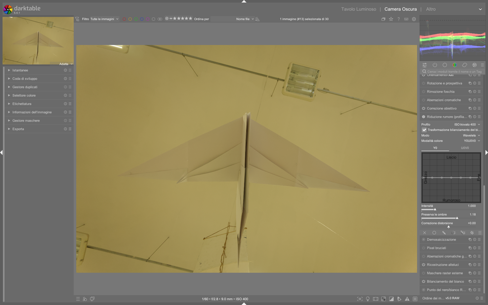

# Denoise (profiled)

Il modulo utilizza profili specifici per sensore e ISO per ridurre il rumore in modo intelligente. Attivarlo **prima** dei selettori automatici (esposizione, calibrazione colore) perché il rumore confonde gli algoritmi[^manual]. Questo posizionamento è critico: il modulo opera *prima* di `input color profile` nella pipeline pixelpipe, garantendo che i parametri di denoising siano applicati sui dati raw correttamente scalati rispetto al profilo di rumore del sensore[^48-profiled]. Ciò permette una correzione più precisa della varianza del rumore — che non è costante, ma dipende dalla luminosità del segnale e dall’ISO effettivo[^48-profiled].

## Panoramica

`denoise (profiled)` è il modulo principale per la riduzione rumore in darktable 5.4+, progettato per essere sia facile da usare che altamente efficace. A differenza di algoritmi generici, sfrutta database di profili di rumore misurati empiricamente su oltre **300 modelli di fotocamere** (Canon, Nikon, Sony, Fujifilm, Panasonic, ecc.)[^48-profiled]. Ogni profilo contiene curve di varianza rumore in funzione della luminanza per diversi valori ISO (es. ISO 100, 200, 400, 800, 1600, 3200, 6400, 12800), con interpolazione automatica per valori intermedi[^48-profiled]. Il modulo supporta due algoritmi fondamentali — *non-local means* e *wavelets* — entrambi disponibili in modalità **auto** (interfaccia semplificata) e **manual** (controllo fine per ogni scala di dettaglio). Non richiede alcuna installazione esterna ed è incluso di default in darktable 5.4+.

!!! info "Posizionamento nella pipeline"
    Il modulo deve essere inserito **subito dopo `raw black/white point` e prima di `demosaic`**, o comunque **prima di `input color profile`**. Questo garantisce che il denoising agisca sui dati raw non ancora trasformati in spazio colore, dove il rumore è meglio modellabile e i profili ISO sono accurati[^48-profiled]. Inserire `denoise (profiled)` dopo `exposure` o `filmic rgb` compromette l’efficacia del profilo.

## Flusso di lavoro consigliato

1. **Prima fase (raw processing)**:  
   - Applica `raw black/white point` → `denoise (profiled)` → `demosaic` → `input color profile`.  
   - Se necessario, attiva `capture sharpening` nel modulo `Demosaic` con `contrast sensitivity` tra **0.15 e 0.35**, per compensare la leggera perdita di nitidezza senza amplificare il rumore[^dt54][^pipeline].

2. **Seconda fase (post-demosaic)**:  
   - Usa `contrast equalizer` per denoise mirato su scale specifiche (es. sopprimere rumore cromatico a bassa frequenza senza toccare i dettagli fini)[^48-contrast-equalizer].  
   - Per immagini ad altissimo ISO (>6400) o con rumore strutturato (es. lunghe esposizioni notturne), aggiungi un secondo `denoise (profiled)` in modalità *wavelets Y0U0V0*, impostato su blend mode *chroma* per affinare solo il rumore cromatico[^48-profiled].

3. **Fase finale (opzionale)**:  
   - Per casi estremi (astrofotografia, scatti in condizioni di luce molto scarsa), combina con `astrophoto denoise` *solo dopo* `denoise (profiled)` e *prima di `shadows and highlights`*, poiché è computazionalmente pesante[^48-astrophoto].

> ✅ **Ordine ottimale della pipeline per ISO > 3200**:  
> `raw black/white point` → `denoise (profiled)` → `demosaic` (con capture sharpening) → `input color profile` → `exposure` → `filmic rgb` → `contrast equalizer` (denoise spline attivata) → `astrophoto denoise` (solo se necessario).

## Modalità

| Modalità | Uso consigliato | Note |
|----------|------------------|------|
| **Non-local means** | ISO bassi-medi (≤1600), texture fine (ritratti, paesaggi con dettagli delicati) | Preserva meglio i dettagli e la microstruttura; richiede più RAM e CPU. Default `patch size`: **3**, `search radius`: **7**, `scattering`: **12**[^48-profiled]. |
| **Wavelets** | ISO alti (≥1600), rumore strutturato (notturno, indoor con poca luce) | Più efficiente in termini di risorse; consente controllo indipendente di luma e chroma. Default `Y0U0V0` mode con `strength`: **0.75**, `preserve shadows`: **0.5**, `bias correction`: **0.0**[^48-profiled]. |
| **Auto** | Uso generale, workflow rapido | Bilancia automaticamente luma/chroma in base al profilo ISO. Utile per batch processing con preset ISO-specifici. |

!!! tip "Modalità avanzata vs. auto"
    La modalità *auto* imposta tutti i parametri in base all’ISO rilevato e al profilo del sensore. Passando a *manual*, il cursore `adjust autoset parameters` viene sostituito da controlli granulari: `patch size`, `scattering`, `Y0 curve`, `U0V0 curve`, ecc. Questo permette di intervenire su singole scale di rumore — ad esempio, alzare solo la parte sinistra della curva `Y0` per eliminare il rumore “grana grossa” senza toccare i dettagli fini[^48-profiled].

## Parametri

### Controlli comuni (validi per tutte le modalità)

| Parametro | Descrizione | Valori tipici | Default | Note |
|-----------|-------------|----------------|---------|------|
| **Profile** | Profilo rumore selezionato. darktable lo sceglie automaticamente da Exif (modello + ISO), con interpolazione lineare tra i due profili ISO più vicini (es. ISO 2500 → interpolazione tra ISO 2000 e 3200)[^48-profiled]. | Lista a tendina con voci come `Canon EOS R5 ISO 800 (interpolated)` | Auto-selezionato | Cliccando sulla prima voce si ripristina il profilo automatico. |
| **Mode** | Algoritmo e livello di controllo: `non-local means auto`, `non-local means manual`, `wavelets Y0U0V0 auto`, `wavelets Y0U0V0 manual`, `wavelets RGB auto`, `wavelets RGB manual`[^48-profiled]. | — | `wavelets Y0U0V0 auto` | `Y0U0V0` è fortemente preferita rispetto a `RGB` per maggiore precisione e minori artefatti[^48-profiled]. |
| **Whitebalance-adaptive transform** | Adatta l’algoritmo alla moltiplicazione dei canali RGB operata dal bilanciamento del bianco. **Abilitare sempre**, tranne in un secondo modulo con blend mode cromatico[^48-profiled]. | `on` / `off` | `on` | Disabilitare solo se usato in cascata con un secondo `denoise (profiled)` in blend mode *chroma*. |
| **Adjust autoset parameters** | Regola l’“ISO efficace”: `actual_ISO × slider_value`. Utile per compensare l’aumento di rumore dopo un aumento di esposizione (es. +1.5 EV → impostare a `1.5`)[^48-profiled]. | `0.1` – `4.0` | `1.0` | Valori >1.5 indicano rumore equivalente a un ISO superiore (es. ISO 800 + `2.0` = rumore come ISO 1600). |
| **Strength** | Intensità complessiva del denoising. Non è lineare: valori <0.5 preservano dettagli, >1.2 possono appiattire texture[^48-profiled]. | `0.0` – `2.0` (soft limit), ma accetta fino a `5.0` con click destro | `0.75` | Per ISO 100–400: usare `0.3–0.6`; per ISO 6400+: `1.0–1.8`. |
| **Preserve shadows** | Controlla quanto aggressivamente il denoising agisce sulle zone scure. Valori bassi = più denoise nelle ombre[^48-profiled]. | `0.0` – `1.0` | `0.5` | Per ISO elevati: abbassare a `0.2–0.3`; per ISO bassi: mantenere a `0.6–0.8` per evitare “ombra grigia”. |
| **Bias correction** | Corregge deviazioni cromatiche nelle ombre causate dal denoising (es. verde o viola). Valori positivi correggono tonalità verdi, negativi quelle violacee[^48-profiled]. | `-1.0` – `+1.0` | `0.0` | Tipico range correttivo: `-0.3` (ombra troppo viola) a `+0.4` (ombra troppo verde). |

### Parametri specifici — Non-local means (modalità manuale)

| Parametro | Descrizione | Valori tipici | Note |
|-----------|-------------|----------------|------|
| **Patch size** | Dimensione del “quadratino” usato per confrontare somiglianze tra pixel. Maggiore = più stabile ma meno dettagli. | `1` – `7` (default: `3`) | Valori >5 rallentano leggermente l’elaborazione ma migliorano la coerenza su rumore coarse-grain[^48-profiled]. |
| **Search radius** | Distanza massima (in pixel) entro cui cercare patch simili. Ha impatto quadratico sul tempo di calcolo[^48-profiled]. | `1` – `15` (default: `7`) | Evitare valori >10: `scattering` è più efficiente per lo stesso scopo. |
| **Scattering** | Estende la ricerca di patch simili *senza* aumentare il numero di confronti → migliora l’efficienza. Ottimo per rumore cromatico[^48-profiled]. | `0` – `20` (default: `12`) | Valori >15 riducono il contrasto locale: usare con moderazione su immagini con alta gamma dinamica. |

### Parametri specifici — Wavelets (modalità manuale)

| Parametro | Descrizione | Valori tipici | Note |
|-----------|-------------|----------------|------|
| **Y0 curve** | Curva di denoise per la componente di luminanza. La parte sinistra agisce sul rumore “grana grossa”, la destra su quello “grana fine”[^48-profiled]. | Controllo spline con 7 punti | Per ISO 3200: alzare il primo punto a `0.9`, lasciare l’ultimo a `0.2`. |
| **U0V0 curve** | Curva di denoise per le componenti cromatiche (U=blu-giallo, V=rosso-verde). Può essere più aggressiva della Y0[^48-profiled]. | Controllo spline con 7 punti | Per ISO 6400+: alzare i primi 3 punti a `1.0–1.2`, lasciare gli ultimi 2 a `0.0`. |
| **RGB curves** | Disponibili solo in modalità `RGB`. Sconsigliate: producono artefatti cromatici e richiedono tre passaggi separati con `color calibration`[^48-profiled]. | Tre curve indipendenti (R, G, B) | Non usare mai in workflow standard. Solo per test tecnici avanzati. |

## Consigli operativi

!!! tip "Auto-preset per ISO"
    Creare preset auto-applicati basati sull'ISO range: un preset per ISO < 800, uno per 800–3200, uno per > 3200[^manual]. Per ISO 100–400: `Strength = 0.4`, `Preserve shadows = 0.75`, `Bias correction = 0.0`. Per ISO 1600–6400: `Strength = 1.1`, `Preserve shadows = 0.25`, `Bias correction = +0.2`. Per ISO > 12800: `Strength = 1.6`, `Preserve shadows = 0.1`, `Bias correction = +0.35`.

!!! info "Capture Sharpening"
    Attivare **capture sharpening** nel modulo **Demosaic** all'inizio della pipeline per compensare la perdita di nitidezza. Regolare la *contrast sensitivity* per non accentuare il rumore[^dt54][^pipeline]. Valore ottimale: `0.25` per ISO ≤800, `0.18` per ISO 1600–6400, `0.12` per ISO ≥12800.

!!! warning "Evitare doppio denoise non necessario"
    Usare **un solo modulo `denoise (profiled)` nella pipeline principale**. Un secondo modulo è giustificato *solo* se: (1) si usa blend mode *chroma* per affinare il rumore cromatico, oppure (2) si lavora su immagini astrofotografiche con rumore residuo dopo il primo passaggio[^48-profiled]. Due moduli identici in serie causano perdita eccessiva di dettagli e “effetto plastica”.

!!! tip "Denoise mirato con contrast equalizer"
    Dopo `denoise (profiled)`, usa `contrast equalizer` per interventi localizzati:  
    - Nella scheda **Luma**, alza la *denoising spline* (linea nera in basso) solo sui punti corrispondenti alle scale di rumore residue (es. punto 3 da sinistra per rumore medio-fine).  
    - Nella scheda **Chroma**, alza la denoising spline sui primi 2–3 punti per eliminare il “rumore a macchia” nei colori saturi[^48-contrast-equalizer].  
    - Imposta `mix` a `0.6–0.8` per un effetto sottile e naturale.

## Esempi pratici

### ✅ Caso 1: Ritratto in studio (ISO 200, Canon EOS R6)
- **Modalità**: `non-local means auto`  
- **Parametri**: `Strength = 0.5`, `Preserve shadows = 0.7`, `Bias correction = 0.0`  
- **Perché**: rumore minimo, priorità alla texture della pelle. Il `patch size = 3` e `scattering = 10` preservano i pori senza introdurre artefatti.

### ✅ Caso 2: Paesaggio notturno (ISO 6400, Sony A7IV)
- **Modalità**: `wavelets Y0U0V0 manual`  
- **Parametri**: `Y0 curve` = [0.9, 0.8, 0.7, 0.5, 0.3, 0.2, 0.1], `U0V0 curve` = [1.1, 1.1, 1.0, 0.8, 0.4, 0.1, 0.0]  
- **Perché**: rumore luma dominante a bassa frequenza + rumore cromatico isolato (pixel rossi/verdi). La curva U0V0 aggressiva elimina il “colore saltuario” senza toccare i dettagli stellari.

### ✅ Caso 3: Foto di evento indoor (ISO 12800, Fujifilm X-H2)
- **Pipeline**: `denoise (profiled)` (wavelets, `Strength = 1.4`) → `contrast equalizer` (scheda Luma, denoising spline alzata al punto 2 e 3) → `astrophoto denoise` (`patch size = 5`, `luma = 0.3`, `chroma = 0.8`)  
- **Perché**: il rumore è eterogeneo (grana grossa + rumore cromatico + pattern strutturato). La combinazione sfrutta i punti di forza di ogni modulo senza sovrapposizioni.

### Esempio: Denoise per fotografia notturna con esposizione +1.2 EV
*Da [The darktable pipeline for beginners](https://www.youtube.com/watch?v=1nPW6WPhhTo) (timestamp 12:45)*  
1. Apri l’immagine RAW sottoesposta (ISO 6400, esposizione -1.2 EV).  
2. Applica `exposure` con `+1.2 EV` per recuperare le luci.  
3. Attiva `denoise (profiled)` in modalità `wavelets Y0U0V0 auto`.  
4. Imposta `adjust autoset parameters = 2.0` per compensare il rumore aggiuntivo equivalente a ISO 12800.  
5. Regola `Strength = 1.3` e `Preserve shadows = 0.2`.  
6. Conferma con `demosaic` → `input color profile` → `filmic rgb`[^pipeline].

### Esempio: Riduzione rumore cromatico residuo su ritratto in luce fluorescente  
*Da [darktable 5.4 UPDATE](https://www.youtube.com/watch?v=yiTqUgoWg6Q) (timestamp 24:18)*  
1. Completa la pipeline principale con `denoise (profiled)` in `wavelets Y0U0V0 auto`.  
2. Aggiungi un **secondo modulo `denoise (profiled)`**, impostato su `mode = wavelets Y0U0V0 manual`.  
3. Imposta `blend mode = chroma` e disattiva `whitebalance-adaptive transform`.  
4. Nella curva `U0V0`, alza i primi quattro punti a `1.0–1.2`, lasciando gli ultimi tre a `0.0`.  
5. Imposta `Strength = 0.9` e `preserve shadows = 0.1`.  
6. Usa `contrast equalizer` in seguito per affinare ulteriormente il rumore a scala fine[^dt54].

## Domande frequenti

### Problema: Rumore verde/viola persistente nelle ombre anche dopo denoising  
La bias correction non risolve completamente il problema cromatico residuo. La causa è spesso un’eccessiva attenuazione delle componenti U/V rispetto a Y, che amplifica il rapporto di errore cromatico. La soluzione è combinare `bias correction` con un intervento mirato su `U0V0 curve`: abbassare leggermente il punto centrale (punto 4) mentre si alzano i primi due punti, per bilanciare la correzione globale con un’azione locale[^48-profiled].

### Problema: Immagine diventa “plastica” o “acquerellata” con `non-local means`  
Questo artefatto è tipico di valori eccessivi di `search radius > 9` o `scattering > 15`, specialmente su immagini con alta gamma dinamica. Ridurre `search radius` a `5–7` e aumentare `scattering` a `10–12` mantiene l’efficacia senza appiattire il contrasto locale. Se il problema persiste, passare a `wavelets Y0U0V0 manual` e regolare solo la parte sinistra della curva `Y0`[^48-profiled].

### Problema: `denoise (profiled)` non riconosce il mio modello di fotocamera  
darktable cerca il profilo tramite tag Exif `Make`, `Model` e `ExposureIndex`. Se il firmware della fotocamera scrive valori non standard (es. `Model = "X-H2S"` invece di `"FUJIFILM X-H2S"`), il profilo non viene trovato. Soluzione: usare `raw denoise` come alternativa temporanea, oppure generare un profilo personalizzato con [Noise Profile Generator (NPG)](https://github.com/BR0k3N/noise-profile-generator)[^pixls-noise].

## Preset integrati

darktable include 7 preset preconfigurati per `denoise (profiled)`, accessibili dal menu a tendina *Preset* in alto a destra del modulo[^48-profiled]:

| Preset | Quando usarlo | Note |
|---|---|---|
| **Low noise (ISO 100–400)** | Studio, paesaggi in luce piena | `Strength = 0.4`, `Preserve shadows = 0.8`, `Y0 curve` piatta a `0.3` |
| **Medium noise (ISO 800–3200)** | Eventi indoor, ritratti in luce artificiale | `Strength = 0.9`, `Preserve shadows = 0.4`, `U0V0 curve` alzata a sinistra |
| **High noise (ISO 6400–12800)** | Concerti, reportage notturno | `Strength = 1.4`, `Preserve shadows = 0.15`, `Y0 curve` [0.95, 0.85, 0.7, 0.4, 0.2, 0.1, 0.05] |
| **Astrophotography (ISO 1600+)** | Lunghe esposizioni, cielo stellato | `Mode = wavelets Y0U0V0 manual`, `U0V0 curve` max ai primi 4 punti |
| **Portrait skin (ISO 200–800)** | Pelle umana, texture fine | `Mode = non-local means manual`, `patch size = 3`, `scattering = 10` |
| **Landscape detail (ISO 100–400)** | Montagne, architettura, alta risoluzione | `Strength = 0.35`, `Preserve shadows = 0.7`, `Y0 curve` quasi piatta |
| **Chroma only** | Per uso in cascata con blend mode *chroma* | `Mode = wavelets Y0U0V0 manual`, `Y0 curve` a zero, `U0V0 curve` attiva |

## Altri moduli di riduzione rumore

| Modulo | Uso | Posizionamento ideale | Note |
|--------|-----|------------------------|------|
| **Raw denoise** | Denoise *sui dati raw grezzi*, prima del demosaic. Basato su dcraw. Utile per sensori con rumore particolarmente omogeneo (es. vecchie DSLR)[^48-raw-denoise]. | Subito dopo `raw black/white point`, prima di `denoise (profiled)` | Usa curve *coarse/fine* per rumore a diverse scale. Non usa profili ISO: meno preciso ma più universale. |
| **Surface blur** | Sfuocatura conservativa dei bordi con filtro bilaterale. **Non è un modulo di denoise primario**[^48-surface-blur]. | Dopo `input color profile`, in blend mode *chroma* o *luminance* | Utile per rimuovere *moire cromatico* o uniformare tonalità della pelle. Evitare su immagini con rumore luma diffuso. |
| **Astrophoto denoise** | Ottimizzato per fotografia astronomica: algoritmo non-local means con maggiore enfasi su strutture deboli[^48-astrophoto]. | Dopo `denoise (profiled)` e prima di `shadows and highlights` | Richiede tempi di elaborazione lunghi: usare solo su immagini con rumore residuo visibile a 100% zoom. |
| **Contrast equalizer** | Denoise *mirato su scale specifiche* nel dominio wavelet. Complementare a `denoise (profiled)`[^48-contrast-equalizer]. | Dopo `denoise (profiled)` e prima di `shadows and highlights` | La *denoising spline* nella scheda Luma/Chroma permette di eliminare rumore solo su determinate scale di dettaglio. |
| **AI Denoise (darktable ≥5.5)** | Modulo sperimentale basato su modello NAFNet (ONNX). Richiede download manuale del modello[^pixls-ai]. | Dopo `input color profile`, prima di `output color profile` | Non sostituisce `denoise (profiled)`: è più lento e richiede GPU/CUDA per prestazioni accettabili. Da usare solo per casi estremi. |

> Per la creazione di profili rumore personalizzati: *PIXLS.US — How to Create Camera Noise Profiles for Darktable*[^pixls-noise] | Copia locale: `processed/pixls-articles/articles-how-to-create-camera-noise-profiles-for-darktable.md`

## Riferimenti visuali

*Il modulo «denoise (profiled)» (Riduzione rumore (profilato)) nell'interfaccia di darktable (vista darkroom).*

## Risorse avanzate

- **[darktable Noise Profile Database](https://github.com/darktable-org/darktable/tree/main/data/noise_profiles)**: repository ufficiale con tutti i profili ISO per ogni sensore supportato.  
- **[Noise Profile Generator (NPG)](https://github.com/BR0k3N/noise-profile-generator)**: tool CLI per generare profili personalizzati da sequenze di dark frame.  
- **[Darktable Denoise Comparison Charts](https://pixls.us/forums/t/darktable-denoise-comparison-charts/55212)**: benchmark visivi tra `non-local means`, `wavelets`, `astrophoto denoise` su diversi ISO (PIXLS.US forum).  

## Fonti

[^manual]: *darktable User Manual — Denoise (profiled)*, [docs.darktable.org](https://docs.darktable.org/usermanual/development/en/module-reference/processing-modules/denoise-profiled/) | `processed/darktable-usermanual-en/usermanual-48-en-module-reference-processing-modules-denoise-profiled.md`
[^pipeline]: *[The darktable pipeline for beginners](https://www.youtube.com/watch?v=1nPW6WPhhTo)* — A Dabble in Photography
[^dt54]: *[darktable 5.4 UPDATE](https://www.youtube.com/watch?v=yiTqUgoWg6Q)* — A Dabble in Photography
[^pixls-noise]: *PIXLS.US — How to Create Camera Noise Profiles for Darktable*, [pixls.us](https://pixls.us/articles/how-to-create-camera-noise-profiles-for-darktable/) | `processed/pixls-articles/articles-how-to-create-camera-noise-profiles-for-darktable.md`
[^48-profiled]: *darktable user manual — denoise (profiled)*, [docs.darktable.org](https://docs.darktable.org/usermanual/development/en/module-reference/processing-modules/denoise-profiled/) | `processed/darktable-usermanual-en/usermanual-48-en-module-reference-processing-modules-denoise-profiled.md`
[^48-astrophoto]: *darktable user manual — astrophoto denoise*, [docs.darktable.org](https://docs.darktable.org/usermanual/development/en/module-reference/processing-modules/astrophoto-denoise/) | `processed/darktable-usermanual-en/usermanual-48-en-module-reference-astrophoto-denoise.md`
[^48-raw-denoise]: *darktable user manual — raw denoise*, [docs.darktable.org](https://docs.darktable.org/usermanual/development/en/module-reference/processing-modules/raw-denoise/) | `processed/darktable-usermanual-en/usermanual-48-en-module-reference-raw-denoise.md`
[^48-surface-blur]: *darktable user manual — surface blur*, [docs.darktable.org](https://docs.darktable.org/usermanual/development/en/module-reference/processing-modules/surface-blur/) | `processed/darktable-usermanual-en/usermanual-48-en-module-reference-surface-blur.md`
[^48-contrast-equalizer]: *darktable user manual — contrast equalizer*, [docs.darktable.org](https://docs.darktable.org/usermanual/development/en/module-reference/processing-modules/contrast-equalizer/) | `processed/darktable-usermanual-en/usermanual-48-en-module-reference-contrast-equalizer.md`
[^pixls-ai]: *Alternative NIND-Denoise Plugin for Darktable*, [discuss.pixls.us](https://discuss.pixls.us/t/alternative-nind-denoise-plugin-for-darktable/56567) | `processed/discuss-pixls/discuss-pixls-56567-alternative-nind-denoise-plugin-for-darktable.md`
