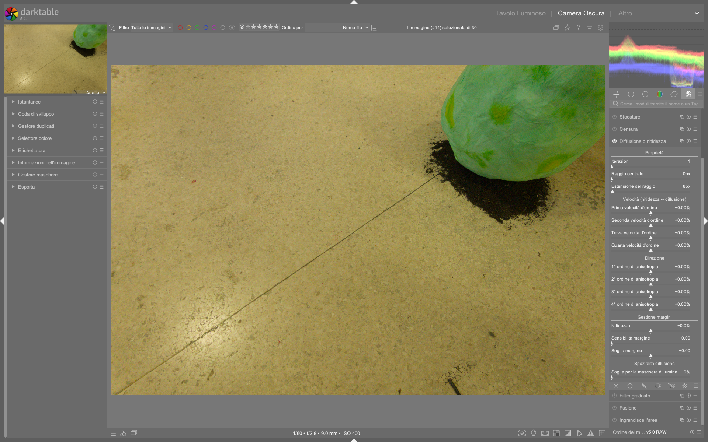

# Diffuse or Sharpen (Diffondi o Nitidezza)

Il modulo **Diffuse or Sharpen** e' uno degli strumenti piu' potenti e complessi di darktable. Implementa un modello fisico generalizzato di diffusione -- un'equazione differenziale parziale anisotropa e multiscala -- per simulare o annullare processi diffusivi reali.[^manual]

A differenza dei tradizionali sharpening che aggiungono aloni artificiosi, questo modulo lavora con le leggi fisiche della diffusione delle particelle, rendendolo adatto sia per recuperare nitidezza ottica perduta sia per creare effetti creativi come bloom, acquerello e inpainting.[^manual]

!!! warning "Risorse computazionali"
    Questo modulo e' **estremamente esigente**. E' un risolutore di equazioni differenziali parziali anisotropo e multiscala. Il tempo di esecuzione cresce con il numero di iterazioni. L'uso di **OpenCL e' fortemente raccomandato**.[^manual]

---

## Cos'e' la diffusione

La diffusione e' un processo fisico attraverso il quale le particelle si muovono e si distribuiscono gradualmente nel tempo, da una sorgente che le genera. Nell'elaborazione delle immagini, la diffusione si verifica principalmente in due contesti:[^manual]

1. **Diffusione dei fotoni** attraverso il vetro delle lenti (sfocatura) o l'aria umida (foschia)
2. **Diffusione dei pigmenti** in inchiostri bagnati o acquerelli

In entrambi i casi, la diffusione rende l'immagine meno nitida facendo "colare" le particelle e livellando le variazioni locali. Il modulo puo' sia **simulare** che **annullare** questi processi.[^manual]

### Cosa si puo' rimuovere (annullare la diffusione)

| Problema | Preset consigliato |
|----------|-------------------|
| Filtro anti-aliasing del sensore / sfocatura del demosaicing | _Sharpen demosaicing_ |
| Sfocatura statica dell'obiettivo | _Lens deblur_ |
| Foschia atmosferica | _Dehaze_ |
| Mancanza di contrasto locale | _Local contrast_ |

### Cosa si puo' aggiungere (simulare la diffusione)

| Effetto | Preset consigliato |
|---------|-------------------|
| Bloom / effetto Orton | _Bloom_ |
| Inpainting di aree danneggiate | _Inpaint highlights_ |
| Denoising edge-preserving | _Denoise_ |
| Surface blur | _Surface blur_ |
| Simulazione acquerello / disegno a linea | _Simulate watercolor / line drawing_ |

!!! note "Sfocatura di movimento"
    Le sfocature da movimento **non** possono essere annullate con questo modulo, perche' non sono di natura diffusiva.[^manual]

---

## Concetti fondamentali

### Tempo (iterazioni)

La diffusione e' un processo dipendente dal tempo: piu' tempo ha, piu' le particelle possono diffondersi. Questa implementazione simula il tempo tramite il **numero di iterazioni**, ovvero quante volte l'algoritmo viene eseguito su se stesso.[^manual]

- Piu' iterazioni = ricostruzione piu' accurata (deblurring, denoising, dehazing)
- Troppe iterazioni con parametri scorretti = degenerazione della soluzione
- Le iterazioni sono il fattore che piu' impatta sulle prestazioni

### Direzione

La diffusione naturale avviene dai punti ad alto potenziale (pixel luminosi) verso quelli a basso potenziale (pixel scuri). Questa implementazione offre tre modalita:[^manual]

| Direzione | Comportamento |
|-----------|--------------|
| **Isotropa** (anisotropia = 0) | Tutte le direzioni hanno lo stesso peso, come la diffusione del calore |
| **Parallela al gradiente** (anisotropia positiva) | Diffusione attraverso i bordi degli oggetti, crea bordi fantasma |
| **Perpendicolare al gradiente / isofota** (anisotropia negativa) | Diffusione contenuta dentro i bordi, come una goccia d'acquerello |

### Velocita'

La velocita' di diffusione determina quanto rapidamente le particelle si muovono. Per la ricostruzione (deblurring, denoising, dehazing) e' consigliabile usare **velocita' ridotte** per evitare overshoot numerici.[^manual]

Tutte le velocita' si sommano. Le somme `1° ordine + 2° ordine` e `3° ordine + 4° ordine` **non dovrebbero mai superare +/-100%**, a meno che non si voglia produrre [glitch art](https://en.wikipedia.org/wiki/Glitch_art).[^manual]

### Scala

La diffusione naturale coinvolge solo i 9 pixel vicini. Questa implementazione usa lo schema wavelet multiscala del _Contrast Equalizer_ per diffondere a diverse scale, definite da `central_radius` e `radius_span`.[^manual]

---

## Controlli del modulo

### Proprieta'

| Parametro | Descrizione |
|-----------|-------------|
| **iterations** | Numero di esecuzioni dell'algoritmo. Valori alti rallentano il modulo ma permettono ricostruzioni piu' accurate (se le velocita' sono sufficientemente basse). Default: `1`. Range: `1–100`[^reference] |
| **central_radius** | Scala principale della diffusione. Zero = agisce sui dettagli fini (deblurring, denoising). Valori non-zero = dimensione dei dettagli da diffondere (contrasto locale). Default: `0 px`. Range: `0–1024 px`[^reference] |
| **radius_span** | Banda di dettagli su cui agire, attorno al raggio centrale. Per il deblur: circa la larghezza della sfocatura dell'obiettivo. Per il contrasto locale: 3/4 del raggio centrale massimo. Default: `8 px`. Range: `0–512 px`[^reference] |

!!! info "Nota tecnica"
    I raggi sono espressi in pixel dell'immagine a piena risoluzione. Copiare+incollare le impostazioni tra immagini di diversa risoluzione puo' produrre risultati leggermente diversi, eccetto per la nitidezza a livello di pixel.[^manual]

Per gli ingegneri elettrici: quanto si configura qui e' un **filtro passa-banda nello spazio wavelet**, usando una finestra frequenziale gaussiana centrata su `central_radius` con decadimento (`radius_span`).[^manual]

### Velocita' (Sharpen ↔ Diffuse)

Valori **positivi** = applicano diffusione (sfocano). Valori **negativi** = annullano la diffusione (nitidezza). Zero = nessun effetto.[^manual]

| Parametro | Agisce su | Direzione |
|-----------|-----------|-----------|
| **1st order speed (gradient)** | Basse frequenze wavelet | Definita da 1st order anisotropy |
| **2nd order speed (laplacian)** | Basse frequenze wavelet | Definita da 2nd order anisotropy |
| **3rd order speed (gradient of laplacian)** | Alte frequenze wavelet | Definita da 3rd order anisotropy |
| **4th order speed (laplacian of laplacian)** | Alte frequenze wavelet | Definita da 4th order anisotropy |

### Direzione (Anisotropia)

Valori **positivi** = la diffusione evita i bordi (isofote). Valori **negativi** = la diffusione segue i gradienti. Zero = isotropa (entrambe le direzioni uguali).[^manual]

| Parametro | Direzione relativa a |
|-----------|---------------------|
| **1st order anisotropy** | Gradiente delle basse frequenze |
| **2nd order anisotropy** | Gradiente delle alte frequenze |
| **3rd order anisotropy** | Gradiente delle basse frequenze |
| **4th order anisotropy** | Gradiente delle alte frequenze |

### Gestione dei bordi

| Parametro | Descrizione |
|-----------|-------------|
| **sharpness** | Guadagno sui dettagli wavelet indipendentemente dagli altri parametri. Utile come variabile di regolazione durante il bloom per mantenere nitidezza. **Sconsigliato per il solo sharpening** (causa aloni e frange). Default: `0.00 %`. Range: `-100%–+100%`[^reference] |
| **edge sensitivity** | Penalizza le velocita' di diffusione dove vengono rilevati bordi (varianza locale). Zero = disabilitata. Valori piu' alti = penalizzazione piu' forte. Aumentare se si notano artefact come frange e aloni. Default: `0.00`. Range: `0.0–5.0`[^reference] |
| **edge threshold** | Soglia di varianza che influenza soprattutto le aree a bassa varianza (scure, sfocate o piatte). Positivo = piu' penalita' per aree basse (buono per sharpening/contrasto locale senza schiacciare i neri). Negativo = meno penalita' (buono per denoising/blur). Default: `+0.00`. Range: `-1.0–+1.0`[^reference] |

### Spazialita' della diffusione

| Parametro | Descrizione |
|-----------|-------------|
| **luminance masking threshold** | Sopra lo 0%, la diffusione avviene solo nelle regioni con luminanza superiore a questo valore. Utile per l'inpainting degli highlights (viene aggiunto rumore gaussiano per simulare le particelle). Default: `0.00 %`. Range: `0%–100%`[^reference] |

---

## Preset spiegati

### Sharpen sensor demosaicing

**Scopo:** Compensare la perdita di nitidezza causata dal filtro anti-aliasing (LPF) del sensore e dagli algoritmi di demosaicing.[^manual]

**Posizionamento nella pipeline:** Spostare questo modulo **prima** del modulo _input color profile_ nella pixelpipe.[^manual]

**Caratteristiche tipiche:**
- `central_radius` = 0 px (agisce a livello di pixel)
- `radius_span` = ridotto
- Velocita' negative (annullano la diffusione)
- Anisotropia elevata per preservare i bordi

!!! tip "Capture sharpening alternativo"
    Per la nitidezza di cattura, attivare anche il modulo **Demosaic** con _capture sharpening_ all'inizio della pipeline. Regolare la _contrast sensitivity_ per non accentuare il rumore.[^denoise]

### Lens deblur

**Scopo:** Recuperare una messa a fuoco leggermente morbida causata da sfocatura statica dell'obiettivo.[^manual]

**Parametri chiave:**
- `radius_span` ≈ larghezza della sfocatura dell'obiettivo
- `central_radius` = 0 px
- Piu' iterazioni per sfocature ampie
- Velocita' moderate per evitare degenerazione

!!! tip "Regolazione dell'effetto"
    Se l'effetto sembra troppo forte, diminuire le iterazioni. Se compaiono artefact ai bordi, aumentare la edge sensitivity. Se il deblur influenza aree sfocate valide (bokeh), ridurre il raggio.[^manual]

### Local contrast

**Scopo:** Aumentare il contrasto locale con un approccio fisico, simile al Contrast Equalizer ma nello spazio RGB scene-referred.[^manual]

**Caratteristiche tipiche:**
- `central_radius` non-zero (definisce la scala del contrasto locale)
- `radius_span` = 3/4 del raggio centrale massimo
- Velocita' negative per accentuare i dettagli
- Anisotropia elevata (es. +200% al 1° e 3° ordine) per guidare la diffusione lungo le direzioni legittime dei bordi reali

!!! tip "Preservare i neri"
    Quando il contrasto locale "mangia" i neri, usare `edge_threshold` positivo e una **maschera parametrica** per escludere le zone molto scure. Nel workflow B/N di street photography, il narratore usa una maschera parametrica su Jz con `emphasize mask` per proteggere le ombre profonde.[^street-bw]

### Dehaze

**Scopo:** Rimuovere foschia e nebbia atmosferica.[^manual]

**Parametri tipici dal workflow reale:**
- `iterations` = 1 (minimo sufficiente)
- `central_radius` = 0 px
- `radius_span` = 4 px (ridotto, agisce sui dettagli fini)
- Velocita' = -25% su tutti gli ordini
- Anisotropia = +100% su tutti gli ordini (diffusione contenuta nei bordi)
- `edge_sensitivity` = 1.0

!!! tip "Dehaze al posto dell'high-pass"
    Usare il preset _dehaze_ in Diffuse or Sharpen invece del tradizionale filtro high-pass. Offre nitidezza piu' pulita ed evita i bordi neri indesiderati tipici dell'approccio high-pass.[^dragan]

### Bloom

**Scopo:** Creare un bagliore morbido sulle alte luci, simile all'effetto Orton.[^manual]

**Parametri tipici dal workflow reale:**
- `iterations` = 1
- `central_radius` = 0 px
- `radius_span` = 32 px
- Velocita' = +50% su tutti gli ordini (valori positivi = diffusione, non sharpening)
- Anisotropia = 0% (isotropa, tutte le direzioni uguali)

!!! example "Esempio pratico: ammorbidire il cielo"
    Nel tutorial di street photography B/N, il narratore applica il bloom al cielo usando una **maschera disegnata a mano** per delimitare l'area. Le speed positive (+50%) creano una diffusione morbida che attenua i contorni del cielo, riducendo la distrazione visiva.[^street-bw]

!!! warning "Attenzione ai preset"
    Applicare un preset sovrascrive le impostazioni ma puo' causare la **perdita delle maschere** precedentemente create. Ricrearle dopo l'applicazione del preset.[^street-bw]

---

## Quando usare Diffuse or Sharpen vs altri moduli

| Esigenza | Modulo consigliato | Perche' |
|----------|-------------------|---------|
| Nitidezza di cattura (demosaicing) | **Demosaic** (capture sharpening) | Piu' leggero, integrato nel demosaicing[^denoise] |
| Nitidezza per scale wavelet | **Contrast Equalizer** | Stesso approccio wavelet, interfaccia piu' intuitiva[^manual] |
| Contrasto locale rapido | **Local Contrast** | Piu' veloce, anche se piu' sottile -- ideale nel workflow lowlight[^lowlight] |
| Nitidezza fisica multiscala / Dehaze / Bloom | **Diffuse or Sharpen** | Unico con modello fisico, adatto a tutti questi usi[^manual] |
| Nitidezza semplice e veloce | **Sharpen** (modulo base) | Leggero, ma senza controllo multiscala o edge-aware[^manual] |

!!! info "Alternativa veloce"
    Il modulo **Local Contrast** e' piu' veloce di Diffuse or Sharpen, anche se piu' sottile. Preferirlo nel workflow lowlight quando le prestazioni sono priorita'.[^lowlight]

---

## Workflow consigliato

### Ordine delle istanze multiple

Quando piu' problemi ottici affliggono la stessa immagine, usare **istanze multiple** del modulo, ordinate dalla scala piu' grande alla piu' piccola:[^manual]

1. **Denoise** (sempre prima di tutto)
2. **Miglioramento del contrasto locale**
3. **Dehaze**
4. **Correzione sfocatura obiettivo**
5. **Correzione sensore e demosaicing**

Partire dalle ricostruzioni a scala piu' grande riduce la probabilita' di introdurre o amplificare il rumore durante le ricostruzioni a scala piu' fine. Questo e' controintuitivo perche' questi processi non avvengono in questo ordine durante la formazione dell'immagine.[^manual]

!!! tip "Regola d'oro"
    Il denoising deve **sempre** avvenire prima di qualsiasi tentativo di sharpening o aumento dell'acutanza.[^manual]

### Procedura operativa da zero

I parametri predefiniti del modulo sono completamente neutri e non fanno nulla all'immagine. Lo spirito del modulo e' che ogni ordine influenza la texture in modo specifico:[^manual]

1. **Regolare il 1° ordine** (speed e anisotropia) per ottenere una base iniziale. Poi aggiustare il raggio. Questo influenza le texture piu' grossolane
2. **Regolare il 2° ordine** (speed e anisotropy). Agisce sulle basse frequenze ma segue il gradiente delle _alte_ frequenze (nitidezza o rumore). Utile per ridurre il rumore quando si usa il 1° ordine in modalita' sharpening
3. **Regolare la edge sensitivity** per eliminare artefact ai bordi. La diffusione in direzione isofota non e' sufficiente quando sono presenti spigoli e forme convesse acute
4. **Aumentare le iterazioni** per compensare l'ammorbidimento risultante. Se non si puo', aumentare la velocita' di diffusione
5. **Regolare il 3° e 4° ordine** per le alte frequenze. Essere molto piu' delicati: possono far esplodere il rumore rapidamente
6. **Fine-tuning dello sharpness** per il gusto personale

!!! tip "Partire dai preset"
    L'approccio piu' semplice e' partire dai preset del developer e poi modificarli: diminuire le iterazioni se l'effetto e' troppo forte, aumentare la edge sensitivity se compaiono artefact.[^manual]

### Esempio: contrasto locale con maschera parametrica

Dal workflow di street photography B/N analizzato nei video:[^street-bw]

1. Applicare il preset **local contrast** (high frequency)
2. Impostare: `iterations` = 15, `central_radius` = 0, `radius_span` = 512
3. Velocita': 1st = -20%, 2nd = +10%, 3rd = -20%, 4th = +20%
4. Anisotropia: 1st = +210%, 3rd = +250%, 2nd e 4th = 0%
5. `edge_sensitivity` = 1.0, `edge_threshold` = +0.30
6. Aggiungere una **maschera parametrica** su luminanza (Jz) per escludere i neri profondi
7. Usare `emphasize mask` nella maschera parametrica per proteggere le ombre

---

## Consigli pratici dai video tutorial

### Street photography B/N

Nel tutorial completo di street photography in bianco e nero, il modulo viene usato in tre modi distinti:[^street-bw]

- **Dehaze** per aggiungere texture e contrasto locale al cappotto del soggetto (`central_radius` = 0, `radius_span` = 4, speed = -25%, anisotropia = +100%)
- **Bloom** sul cielo per ammorbidire e ridurre la distrazione visiva, con maschera disegnata a mano (speed = +50%, isotropo)
- **Local contrast** ad alta frequenza con maschera parametrica per escludere i neri (`radius_span` = 512, 15 iterazioni, anisotropia elevata)

!!! warning "Limitazioni delle maschere colore"
    Non e' possibile creare una maschera basata sul colore quando il modulo `Diffuse or Sharpen` si trova **sopra** il modulo `black and white` nella pipeline -- il colore non e' ancora disponibile in quella posizione.[^street-bw]

### Fotografia infrarossa

Nel workflow per infrarosso a falsi colori, il modulo viene utilizzato per recuperare dettagli dopo la conversione cromatica, in combinazione con `Tone Equalizer Sky` e maschere raster.[^ir-photo]

### Precauzioni generali

!!! tip "Correggere prima le aberrazioni cromatiche"
    Se si intende deblurrare l'immagine, correggere **prima** le aberrazioni cromatiche e il rumore, perche' il deblurring puo' magnificare questi artefact. Assicurarsi di non avere pixel neri clippati (correggere con _black level correction_ nel modulo Exposure).[^manual]

!!! tip "Posizionamento nella pipeline"
    Poiche' lavora su canali RGB separati, e' meglio applicare questo modulo **dopo** _Color Calibration_, partendo da un'immagine completamente neutra e con bilanciamento del bianco corretto.[^manual]

!!! info "Sharpness percepita vs ottica"
    Il contrasto globale (curve tonali, livelli nero/bianco) influenza la percezione della nitidezza, che e' diversa dalla nitidezza ottica (risoluzione). L'occhio umano e' sensibile solo al contrasto locale. Se un tone mapping aumenta il contrasto, l'immagine apparira' piu' nitida -- ma i bordi reali non sono cambiati.[^manual]

---

## Note sul giudizio della nitidezza

!!! warning "Non valutare a zoom 1:1"
    Valutare la nitidezza a zoom 1:1 (100%) o superiore e' un esercizio inutile. Nei musei, nelle mostre e persino a schermo, il pubblico guarda le immagini nel loro insieme, non con una lente d'ingrandimento. Nella maggior parte degli usi pratici, le fotografie raramente superano 3000x2000 pixel (circa 300 DPI in formato A4/Letter), che per sensori da 24 megapixel significa un downscaling di 4x. Esaminando un file da 24 MP a 1:1, si sta guardando un'immagine che **non esistera' mai**.[^manual]

!!! tip "Plausibile vs piacevole"
    Con l'invecchiamento si perde la capacita' visiva. La quantita' di sharpening che piace a chi ha 50 anni puo' essere diversa da chi ne ha 20. Considerare una nitidezza **plausibile** (che corrisponde alla percezione quotidiana) piuttosto che **piacevole** (che puo' sembrare buona solo a chi ha la stessa vista).[^manual]

!!! info "Soft focus e poetica della morbidezza"
    Molte delle piu' grandi immagini della storia della fotografia sono state scattate con obiettivi lontani dall'essere nitidi come quelli odierni. La messa a fuoco morbida e un po' di sfocatura hanno meriti poetici che le immagini igienizzate in HD potrebbero non trasmettere.[^manual]

---

## Riepilogo parametri per preset

| Parametro | Sharpen demosaic | Lens deblur | Local contrast | Dehaze | Bloom |
|-----------|:-:|:-:|:-:|:-:|:-:|
| **iterations** | variabili | medio-alte | 10-15 | 1 | 1 |
| **central_radius** | 0 px | 0 px | 0 px | 0 px | 0 px |
| **radius_span** | ridotto | ≈ blur lente | 512 px | 4 px | 32 px |
| **1st/2nd/3rd/4th speed** | negativi | negativi | -20%/+10%/-20%/+20% | -25% tutti | +50% tutti |
| **1st/3rd anisotropy** | elevata | elevata | +210%/+250% | +100% tutti | 0% (isotropo) |
| **edge_sensitivity** | medio-alta | medio-alta | 1.0-2.5 | 1.0 | 0.0 |
| **edge_threshold** | leggero positivo | positivo | +0.30 | 0.0 | 0.0 |

> I valori sono indicativi e variano in base all'immagine. Partire sempre dai preset inclusi e regolare di conseguenza.[^manual]

---

## Walkthrough da video tutorial

### Esempio: Nitidezza mirata su tessuto (scarpa)
*Da [ENG] darktable diffuse and sharpen (shorter version) (05:50–10:00)*  
1. Aprire l'immagine di una scarpa nera e zoomare a **400%** per osservare dettagli microscopici  
2. Impostare `iterations = 5`, `central_radius = 0 px`, `radius_span = 8 px`  
3. Attivare `1st order anisotropy = +10.83%` e `3rd order anisotropy = +3.61%` per preservare i bordi  
4. Applicare `4th order speed = −25.00%` per affilare i dettagli più fini (filamenti del tessuto)  
5. Aumentare `edge_sensitivity = 1.0` per eliminare frange ai bordi del tacco  
6. Verificare l’effetto con confronto prima/dopo usando `snapshots`[^DV8eey79ukc]

### Esempio: Controllo del rumore combinato a nitidezza
*Da [ENG] darktable diffuse and sharpen (shorter version) (05:50–10:00)*  
1. Usare `2nd order speed = +100%` mentre gli altri ordini sono a `0%`  
2. Questo attiva una diffusione *lungo i gradienti*, utile per smorzare il rumore senza appiattire i bordi  
3. Combinare con `1st order speed = −15%` per un affilamento conservativo  
4. Regolare `edge_threshold = +0.15` per proteggere le ombre profonde  
5. Confermare con l’istogramma: la distribuzione dei pixel deve mostrare un picco più stretto nelle medie tonalità  
6. Evitare valori superiori a `+120%` sulla somma `1st + 2nd order` per prevenire artefact[^DV8eey79ukc]

### Esempio: Mascheratura per bloom sul cielo
*Da [ENG] Full b&w edits in darktable for street photography (13:00–15:20)*  
1. Creare una **maschera disegnata a mano** (drawn mask) che copra esclusivamente il cielo  
2. Applicare il preset **bloom**, quindi modificare `speed = +50%` su tutti gli ordini  
3. Impostare `iterations = 1`, `central_radius = 0 px`, `radius_span = 32 px`  
4. Attivare `emphasize mask` nella maschera per garantire che l’effetto sia confinato  
5. Regolare `luminance masking threshold = +25%` per evitare che la diffusione interessi le nuvole scure  
6. Verificare che il cielo non perda definizione: usare `zoom 1:1` solo sul bordo inferiore del cielo[^f9szYMJ9wYo]

---

## Domande frequenti

### Problema: Prestazioni estreme con OpenCL disabilitato
Alcuni utenti riportano tempi di elaborazione >30 secondi su immagini 24MP con OpenCL disabilitato. La causa è l’uso forzato della CPU per l’intero calcolo PDE. La soluzione è abilitare OpenCL nelle preferenze (`Processing → OpenCL`) e selezionare il dispositivo GPU corretto. Se la GPU ha <2GB VRAM, impostare `OpenCL memory fraction = 700` nel file `darktablerc` per evitare fallback a CPU[^mem-perf].

### Problema: Artefact “ghost edges” con anisotropia positiva
Questo comportamento si verifica quando `1st order anisotropy > +200%` in combinazione con `iterations > 10`. La soluzione è ridurre l’anisotropia a `+150%` e aumentare `edge_sensitivity` a `2.0`. In alternativa, sostituire `1st order speed` con `3rd order speed` per gestire i bordi a scala più fine[^jHlPh7gt3Y0].

### Problema: Clipping nero dopo deblur
Il deblur può amplificare il clipping nei neri se il livello nero non è stato corretto. Prima di applicare `Lens deblur`, verificare che il modulo `Exposure` abbia `black level correction` impostato a un valore negativo (es. `−0.0002`) per ripristinare i dettagli nelle ombre. Se persiste, usare `edge_threshold = +0.20` per limitare la diffusione nelle aree scure[^DzdGL30lYjU].

---

## Riferimenti visuali

*Il modulo «diffuse or sharpen» (Diffusione o nitidezza) nell'interfaccia di darktable (vista darkroom).*

## Fonti

[^manual]: *darktable User Manual -- Diffuse or Sharpen*, [docs.darktable.org](https://docs.darktable.org/usermanual/development/en/module-reference/processing-modules/diffuse/) | Copia locale: `processed/darktable-usermanual-en/usermanual-48-en-module-reference-processing-modules-diffuse.md`
[^street-bw]: *[Full B&W edits in darktable for street photography](https://www.youtube.com/watch?v=f9szYMJ9wYo)* -- A Dabble in Photography
[^ir-photo]: *[Develop infrared photos with darktable](https://www.youtube.com/watch?v=PKK2QTPKsjY)* -- A Dabble in Photography
[^denoise]: *[darktable pipeline for beginners](https://www.youtube.com/watch?v=1nPW6WPhhTo)* -- A Dabble in Photography
[^lowlight]: *[Lowlight photos in darktable](https://www.youtube.com/watch?v=O7wXgmQZqiU)* -- A Dabble in Photography
[^dragan]: *[The Dragan effect in darktable](https://www.youtube.com/watch?v=EuvG0lh8OB8)* -- A Dabble in Photography
[^reference]: *darktable user manual - diffuse or sharpen*, [docs.darktable.org](https://docs.darktable.org/usermanual/development/en/module-reference/processing-modules/diffuse/) | `processed/darktable-usermanual-en/usermanual-48-en-module-reference-processing-modules-diffuse.md`
[^DV8eey79ukc]: *[ENG] darktable diffuse and sharpen (shorter version)*, [YouTube](https://www.youtube.com/watch?v=DV8eey79ukc) | Timestamp 05:50–10:00
[^jHlPh7gt3Y0]: *[ENG] The diffuse and sharpen module*, [YouTube](https://www.youtube.com/watch?v=jHlPh7gt3Y0) | Timestamp 00:00–03:00
[^f9szYMJ9wYo]: *[ENG] Full b&w edits in darktable for street photography*, [YouTube](https://www.youtube.com/watch?v=f9szYMJ9wYo) | Timestamp 13:00–15:20
[^DzdGL30lYjU]: *[ENG] darktable Full edit #1*, [YouTube](https://www.youtube.com/watch?v=DzdGL30lYjU) | Timestamp 00:00–02:00
[^mem-perf]: *darktable user manual - memory & performance tuning*, [docs.darktable.org](https://docs.darktable.org/usermanual/development/en/special-topics/mem-performance/) | `processed/darktable-usermanual-en/usermanual-48-en-special-topics-mem-performance.md`
