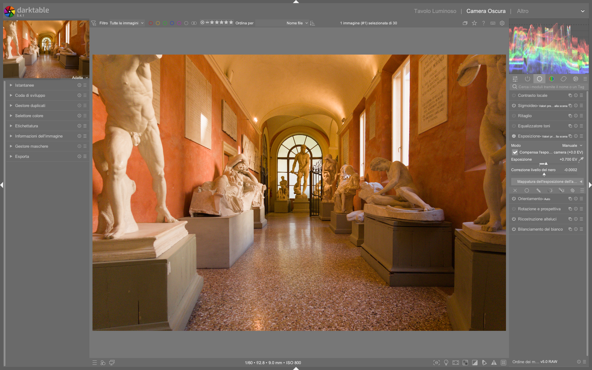

# Exposure

Il modulo **Exposure** controlla la luminosità globale dell’immagine nel dominio lineare, operando *prima* dell’applicazione del profilo colore di input — quindi in uno spazio **scene-referred**, **camera RGB** e **non compresso**[^manual]. Questa posizione nella pipeline è fondamentale: permette di regolare l’esposizione senza introdurre artefatti cromatici o distorsioni di gamma[^dt54]. A differenza di Lightroom, dove l’«esposizione» agisce su un segnale già elaborato (con white balance applicato e curve tonali predefinite), in darktable il modulo `exposure` opera sul segnale grezzo proveniente dal sensore, rendendolo il punto di partenza obbligato per ogni correzione tonale corretta[^firststeps].

!!! tip "Perché non usare 'Basic Adjustments'?"
    Il modulo deprecato `basic adjustments` (rimosso da darktable 3.6) combinava esposizione, ricostruzione luci e bilanciamento colore in un’unica operazione fuori posto nella pipeline. Questo causava conflitti con moduli successivi come `filmic rgb` o `tone curve`. Usare `exposure` separatamente garantisce che la regolazione avvenga *prima* del profilo colore, rispettando il flusso scene-referred[^deprecated].

## Parametri

| Parametro | Range | Default | Descrizione |
|-----------|-------|---------|-------------|
| **Mode** | Manual / Automatic | Manual | In modalità *Automatic*, darktable analizza l’istogramma RAW per impostare l’esposizione in modo che un dato percentile (es. 50%) raggiunga un *target level* specificato in EV rispetto al punto bianco della fotocamera[^manual]. Disponibile solo su immagini RAW. |
| **Exposure** | -18.0 ... +18.0 EV | 0.0 EV | Compensazione espositiva globale. Il valore massimo esteso a ±18 EV (accessibile con click destro sullo slider) consente correzioni estreme per immagini molto sottoesposte o sovraesposte[^manual]. Valori tipici per correzioni standard: da -1.5 a +2.0 EV. |
| **Black level correction** | -0.1 ... +0.1 | 0.0 | Regolazione fine del punto nero. Un valore positivo solleva leggermente i neri, riducendo il clipping negativo; un valore negativo li abbassa. **Attenzione**: non usare per aggiungere densità ai neri, perché può generare valori RGB negativi fuori gamut[^manual]. Per questo, preferire `filmic rgb` (scheda *scene*) o `base curve`. |
| **Compensate camera exposure** | On / Off | Off | Rimuove automaticamente la compensazione espositiva registrata nei metadati EXIF (es. se la fotocamera era impostata su +0.7 EV). Utile per uniformare serie di immagini scattate con diverse impostazioni di esposizione manuale[^manual]. |
| **Clipping threshold** | 0.001% ... 10.0% | 0.010% | Soglia di rilevamento del clipping per i canali RGB. Determina quali pixel vengono considerati «clippati» durante le operazioni automatiche (es. auto-exposure). Valori più bassi sono più sensibili al clipping[^manual]. |

### Area exposure mapping (nuovo in darktable 4.0+)

Introdotta in darktable 4.0, questa funzionalità avanzata permette di **misurare e replicare l’esposizione di una regione specifica** tra immagini diverse[^eo]. È particolarmente utile per:
- Deflickering di time-lapse
- Batch editing di serie fotografiche con illuminazione variabile (es. nuvole che passano)
- Allineamento espositivo di immagini bracketed prima della fusione HDR

| Parametro | Range | Descrizione |
|-----------|-------|-------------|
| **Area mode** | Measure / Correction | In *Measure*, si seleziona un’area (es. grigio medio, carta da parati, logo) e si registra la sua luminosità L\* (CIE Lab). In *Correction*, si applica la stessa misura a un’altra immagine per calcolare automaticamente l’esposizione necessaria[^manual]. |
| **Lightness (L\*)** | 0.0 ... 100.0 % | Valore di luminosità CIE Lab misurato nell’area selezionata. Il valore predefinito è 50.0% (grigio medio)[^manual]. |
| **Target lightness** | 0.0 ... 100.0 % | Luminosità obiettivo per l’area. darktable calcola l’esposizione richiesta per far sì che l’area raggiunga questo valore[^manual]. |

> **Nota tecnica**: L’area mapping richiede che il modulo `exposure` sia posizionato *prima* di `input color profile` nella pipeline, poiché la conversione da RGB camera a Lab dipende dal profilo colore. Su JPEG/PNG, spostare `exposure` dopo `input color profile` o usare il preset *v3.0 for JPEG/non-RAW input*[^manual].

## Uso nel flusso scene-referred

L’obiettivo primario non è «centrare l’istogramma», ma **posizionare il grigio medio della scena (18.45% reflectance) a un livello di luminosità coerente con la percezione umana**[^manual]. Questo valore corrisponde approssimativamente a L\* = 50.0 nel colore CIE Lab, ed è il riferimento standard per la misurazione espositiva.

1. Attivare la valutazione colore (**++cmd+b++**) per visualizzare il bordo bianco di riferimento e verificare la linearità dei toni medi[^firststeps].
2. Selezionare un’area neutra ben illuminata (es. parete chiara, superficie opaca) e usare lo strumento di misurazione (`color picker` accanto allo slider `exposure`) per ottenere una lettura L\*.
3. Regolare `exposure` finché il valore L\* letto nell’area target si avvicina a **50.0%**, ignorando ombre profonde e alte luci (gestite successivamente da `filmic rgb`, `tone curve` o `highlight reconstruction`)[^manual].
4. Verificare che nessun canale RGB sia clippato: abilitare `clipping indicators` (**++ctrl+o++**) e controllare che non compaiano aree rosse (rosso = clipping canale R), verdi (G) o blu (B).

!!! warning "Evitare il black level correction per i neri"
    Non usare `black level correction` per aumentare la densità dei neri: genera valori RGB negativi che possono causare artefatti cromatici in moduli successivi (es. `color calibration`, `filmic rgb`). Per aggiungere densità ai neri, usare invece:
    - Il parametro *relative black exposure* nella scheda *scene* di `filmic rgb` [^manual]
    - Una curva tonale con *toe* accentuato in `base curve` o `tone curve` [^manual]

## Uso come contenitore maschera

Un pattern avanzato e documentato nei workflow professionali: **duplicare il modulo `exposure` e usarne la prima istanza esclusivamente per definire una maschera**, senza applicare alcuna modifica all’esposizione[^landscape][^nightsky]. Questa maschera può poi essere riutilizzata come **raster mask** in tutti i moduli a valle (es. `color balance rgb`, `tone equalizer`, `sharpen`).

### Procedura passo-passo

1. Aggiungere un modulo `exposure` (istanza #1) e disattivare la modifica: impostare `exposure = 0.0`, `black level correction = 0.0`.
2. Creare una maschera geometrica (cerchio, ellisse, gradiente) o disegnata (path) sull’area di interesse.
3. Nel pannello *mask manager*, rinominare la maschera (es. `sky_mask`, `subject_mask`) per identificarla facilmente[^wUrhoiU1bTM].
4. Aggiungere un secondo modulo `exposure` (istanza #2) o qualsiasi altro modulo (es. `color balance rgb`).
5. Nella sezione *mask* del modulo #2, cliccare su *raster mask* → *select from history* → scegliere la maschera creata nell’istanza #1.

> Questo approccio è più efficiente che ricreare la stessa maschera in ogni modulo, soprattutto quando si lavora con immagini ad alta risoluzione o su hardware limitato. La maschera viene memorizzata una volta sola nella pipeline e riutilizzata come texture raster[^dt54].

## Consigli operativi avanzati

### 1. Esposizione per la fusione HDR/EXR
Quando si preparano immagini per la fusione (HDR, enfuse, PhotoFlow), l’esposizione deve essere ottimizzata per **massimizzare la copertura dinamica senza clipping**:
- Per l’immagine *più chiara*: impostare `exposure` in modo che i canali più brillanti (es. cielo, luci artificiali) siano appena sotto il clipping (L\* ≈ 98–99%). Usare `clipping indicators` per verificare.
- Per l’immagine *più scura*: impostare `exposure` in modo che i dettagli nelle ombre più profonde siano visibili (L\* ≥ 2–3%), evitando rumore eccessivo[^pixls-hdr].

### 2. Maschere parametriche con esposizione
Le maschere parametriche (basate su luminosità, colore, frequenza) possono essere combinate con `exposure` per effetti locali precisi:
- **Selezione basata sulla luminosità**: creare una maschera parametrica con `luminance` tra 0.3 e 0.7 (30–70% di luminosità) per applicare un aumento di esposizione solo ai toni medi.
- **Selezione basata sulla frequenza**: usare `frequency` > 0.5 per isolare i dettagli fini (es. piume, peli) e applicare un leggero chiarimento locale senza alterare i toni generali[^P1W1tmk8HLk].

### 3. Scorciatoie da tastiera
- **++e++ + rotella mouse**: regolazione rapida di `exposure`[^lowlight]
- **++shift+e++**: attiva/disattiva il modulo `exposure`
- **++ctrl+click++ sullo slider `exposure`**: inserimento manuale del valore (fino a ±18 EV)[^manual]
- **++alt+click++ sullo slider `black level correction`**: reset al valore predefinito (0.0)

### 4. Workflow per paesaggi con ampio DR
Per immagini con cielo sovraesposto e primo piano sottoesposto:
1. Usare `exposure` per bilanciare il primo piano (es. +0.8 EV), accettando il clipping del cielo.
2. Applicare `highlight reconstruction` con metodo *guided laplacians* per recuperare il cielo[^eo].
3. Usare una **maschera graduale** (gradiente verticale) su un secondo modulo `exposure` per ridurre l’esposizione solo nella parte superiore dell’immagine (-0.6 EV).
4. Affinare con `filmic rgb`: impostare `white relative exposure` a +2.4 EV e `black relative exposure` a -6.2 EV per espandere il range tonale finale[^iaZ2QvOHyA].

### 5. Esempio pratico: correzione automatica per time-lapse
*Da [What is new in darktable 4.0?](https://www.youtube.com/watch?v=_EOGBmksHDw) (timestamp 8:22)*  
Per deflickering di una sequenza di 120 immagini con variazioni di luce dovute a nuvole:
1. Aprire la prima immagine e attivare `area exposure mapping` → `mode = Measure`.
2. Con il color picker, selezionare un’area neutra stabile (es. muro in ombra, L\* = 32.4%).
3. Passare alla seconda immagine: `mode` passa automaticamente a *Correction*.
4. Selezionare la stessa area: darktable calcola `exposure = -0.17 EV`.
5. Ripetere per tutte le immagini della sequenza usando il tasto **++ctrl+c++** per copiare la misura e **++ctrl+v++** per incollarla[^eo].

### 6. Esempio pratico: esposizione per stampa su carta opaca
*Da [darktable first steps ep01](https://www.youtube.com/watch?v=P4cL61ZHqFw) (timestamp 12:45)*  
Per preparare un ritratto destinato alla stampa su carta FSC-certificata con riflettanza 85%:
1. Attivare `color assessment` (**++ctrl+b++**) per avere il contesto neutro.
2. Misurare con il color picker la luminosità di una zona neutra (es. collo): L\* = 48.2%.
3. Regolare `exposure` fino a portare L\* a **52.0%**, leggermente più alto del grigio medio per compensare la minore brillantezza della carta.
4. Verificare che il bianco del colletto rimanga sotto L\* = 95% per evitare perdita di dettaglio in stampa[^firststeps].

## Domande frequenti

### Problema: L’area mapping non funziona su JPEG importati
Il modulo `exposure` in modalità *area mapping* richiede un segnale lineare RAW per convertire correttamente da RGB camera a CIE Lab. Su JPEG, il segnale è già compresso con una gamma non lineare (es. sRGB gamma 2.2), rendendo impossibile la misura affidabile di L\*. Soluzione: spostare `exposure` **dopo** `input color profile` nella pipeline o usare il preset *v3.0 for JPEG/non-RAW input*[^manual].

### Problema: Dopo aver applicato `exposure`, il modulo `color calibration` mostra artefatti cromatici
Questo accade quando `black level correction` genera valori RGB negativi, che interferiscono con gli algoritmi di adattamento cromatico CAT16. La soluzione è evitare `black level correction` e usare invece `filmic rgb` → *scene tab* → `black relative exposure` per gestire i neri, oppure `base curve` con un toe pronunciato[^manual].

### Problema: Il cursore `exposure` non risponde a valori oltre ±1.0 EV
Il limite visivo dello slider è ±1.0 EV per default, ma il modulo supporta valori fino a ±18.0 EV. Per inserire valori estremi, fare **++ctrl+click++** sullo slider e digitare manualmente il valore (es. `-3.42`)[^manual].

### Problema: L’auto-esposizione imposta un valore troppo alto su immagini con grandi zone scure
L’algoritmo automatico usa il percentile definito (default 50%) e può essere influenzato da ombre profonde. Soluzione: impostare `percentile = 65%` e `target level = 0.0 EV` per privilegiare i toni medi-alti, oppure usare `area exposure mapping` su una zona neutra ben illuminata[^manual].

## Preset integrati

| Preset | Quando usarlo | Note |
|---|---|---|
| **Auto-exposure (50%)** | Editing batch rapido di immagini con illuminazione costante | Usa il 50° percentile come riferimento per il grigio medio. Non adatto a immagini high-key o low-key[^manual]. |
| **Expose to the right (ETTR)** | Preparazione per `filmic rgb` o `AgX` con massima qualità tonale | Imposta `exposure` in modo che il picco dell’istogramma RAW tocchi il bordo destro senza superarlo[^process]. |
| **Deflicker base** | Time-lapse con variazioni di luce moderate | Configurato con `area mode = Measure`, `target lightness = 50.0%`, `clipping threshold = 0.005%`[^eo]. |

## Riferimenti visuali

*Il modulo «exposure» (Esposizione) nell'interfaccia di darktable (vista darkroom).*

## Risorse

- [darktable User Manual — Exposure](https://docs.darktable.org/usermanual/development/en/module-reference/processing-modules/exposure/)  
- [PIXLS.US — Simple Exposure Mapping in GIMP](https://pixls.us/articles/simple-exposure-mapping-in-gimp/)  
- [PIXLS.US — Aligning Images with Hugin](https://pixls.us/articles/aligning-images-with-hugin/)  
- [A Dabble in Photography — darktable masking Episode 3](https://www.youtube.com/watch?v=wUrhoiU1bTM)  
- [A Dabble in Photography — What is new in darktable 4.0?](https://www.youtube.com/watch?v=_EOGBmksHDw)  

## Fonti

[^manual]: *darktable User Manual -- Exposure*, [docs.darktable.org](https://docs.darktable.org/usermanual/development/en/module-reference/processing-modules/exposure/) | `processed/darktable-usermanual-en/usermanual-48-en-module-reference-processing-modules-exposure.md`
[^firststeps]: *[darktable first steps ep01](https://www.youtube.com/watch?v=P4cL61ZHqFw)* — A Dabble in Photography
[^lowlight]: *[Lowlight photos](https://www.youtube.com/watch?v=O7wXgmQZqiU)* — A Dabble in Photography
[^landscape]: *[Landscape edit with AI](https://www.youtube.com/watch?v=OERXOFz9lEo)* — A Dabble in Photography
[^nightsky]: *[Night Sky Full Edit](https://www.youtube.com/watch?v=5P0Yj_vqy5w)* — A Dabble in Photography
[^dt54]: *[darktable 5.4 UPDATE](https://www.youtube.com/watch?v=yiTqUgoWg6Q)* — A Dabble in Photography
[^deprecated]: *darktable user manual — (deprecated) basic adjustments*, [docs.darktable.org](https://docs.darktable.org/usermanual/development/en/module-reference/processing-modules/basic-adjustments/)
[^eo]: *[What is new in darktable 4.0?](https://www.youtube.com/watch?v=_EOGBmksHDw)* — A Dabble in Photography
[^wUrhoiU1bTM]: *[darktable masking Episode 3](https://www.youtube.com/watch?v=wUrhoiU1bTM)* — A Dabble in Photography
[^P1W1tmk8HLk]: *[darktable masking episode 2](https://www.youtube.com/watch?v=P1W1tmk8HLk)* — A Dabble in Photography
[^iaZ2QvOHyA]: *[A guide to AgX in darktable](https://www.youtube.com/watch?v=iaZ2-QvOHyA)* — A Dabble in Photography
[^pixls-hdr]: *PIXLS.US — HDR Photography with Free Software*, [pixls.us/articles/hdr-photography-with-free-software-luminancehdr/](https://pixls.us/articles/hdr-photography-with-free-software-luminancehdr/)
[^process]: *darktable user manual — process*, [docs.darktable.org](https://docs.darktable.org/usermanual/development/en/overview/workflow/process/) | `processed/darktable-usermanual-en/usermanual-48-en-overview-workflow-process.md`
