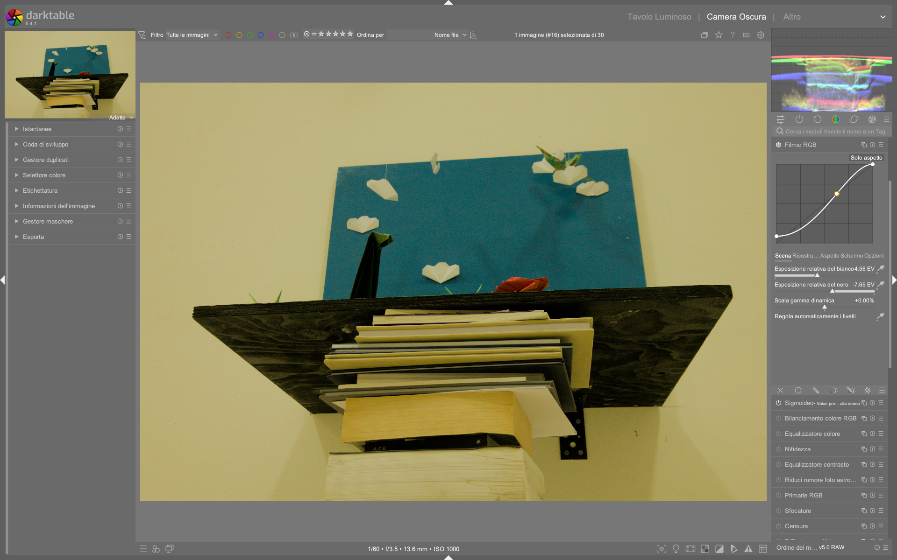

# Tone Mapping: Filmic RGB, AgX, Sigmoid

darktable offre tre tone mapper scene-referred. **Usane solo uno alla volta.**[^manual-filmic][^manual-agx][^manual-sigmoid]

## Confronto rapido

| | AgX | Sigmoid | Filmic RGB |
|---|-----|---------|------------|
| **Complessita'** | Media | Bassa | Alta |
| **Notorious 6** | Risolto | Parziale | Parziale |
| **Toni pelle** | Buoni | Ottimi | Buoni con tuning |
| **Controllo** | Buono | Minimo | Massimo |
| **Default dt 5.4** | Si' (agx) | No | No |

> Per un confronto approfondito: *discuss.pixls.us — Filmic vs Sigmoid vs AgX: some thoughts*[^pixls-compare] | Copie locali in `processed/discuss-pixls/`

## AgX

Il tone mapper consigliato per dt 5.4+. Gestisce la saturazione seguendo il comportamento della pellicola analogica.[^manual-agx]

### Parametri chiave

| Parametro | Funzione | Default |
|-----------|----------|---------|
| **Contrast** | Contrasto curva S globale | ~1.3 |
| **Pivot exposure** | Punto di max contrasto | Usare pipetta[^agx-guide] |
| **Shoulder power** | Compressione alte luci | |
| **Toe power** | Compressione ombre | |
| **Preserve Hue** | Fedelta' cromatica | On (disabilitare per tramonti)[^agx-guide] |
| **Primaries** | Gestione gamut | Solo per problemi di gamut[^agx-guide] |

!!! warning "Da non toccare"
    **Dynamic range scaling** (rischio clipping), **white/black target** (effetto sbiadito), **parametri curva avanzati** (se shoulder/toe bastano).[^agx-guide]

## Sigmoid

Pochi parametri, transizione fluida verso il bianco. Toni pelle naturali «out of the box».[^manual-sigmoid]

| Parametro | Funzione |
|-----------|----------|
| **Contrast** | Contrasto globale |
| **Skewness** | Bilanciamento luci/ombre |
| **Per-channel** | Modalita' per canale |

!!! tip "Per i tramonti"
    Ridurre **'preserve hue'** in Sigmoid per prevenire falsi colori nelle scene di tramonto.[^landscape]

## Filmic RGB

Tre pannelli (Scene, Look, Display) per controllo granulare.[^manual-filmic]

| Pannello | Parametri chiave |
|----------|-----------------|
| **Scene** | White/black relative exposure (usare pipetta) |
| **Look** | Curva S (contrasto), latitudine (zona toni medi) |
| **Display** | Luminanza target bianco/nero |
| **Options** | Preserve chrominance: «No» o «Max RGB»[^firststeps] |

!!! danger "Curva negativa"
    La curva non deve mai scendere sotto 0% -- l'avviso arancione indica negativita' che causa artefatti.[^firststeps]

---

## Filmic RGB: Panoramica tecnica e workflow completo

Filmic RGB è il modulo di tone mapping più potente e flessibile di darktable, progettato per mappare la gamma dinamica della scena (illimitata in EV) su quella del display (limitata a 0–100%). È derivato dal modulo omonimo di Blender 3D ed è specificamente ottimizzato per immagini RAW ad alta dinamica[^manual-filmic]. A differenza di moduli display-referred come *base curve*, Filmic opera in spazio scene-referred, preservando la relazione fisica tra luminanza reale e valori pixel — fondamentale per una post-produzione coerente e riproducibile[^manual-filmic].

Il suo design si basa sul principio che ogni fotografia rappresenta una “scena” con un proprio intervallo di esposizione (da nero profondo a sole diretto), e che tale intervallo deve essere compresso in modo intelligente, non lineare, per adattarsi al monitor senza perdere dettagli o saturazione. Il modulo non è solo un “compressore di contrasto”: è un sistema integrato di gestione della gamma dinamica, ricostruzione delle alte luci, bilanciamento cromatico e protezione dei mezzi toni[^manual-filmic].

Filmic RGB è strutturato in **cinque schede** (non tre):  
- `Scene` → definisce i limiti fisici della scena (bianco/nero/grigio medio);  
- `Reconstruct` → recupera le aree sovraesposte (clipped) con algoritmi avanzati;  
- `Look` → applica la curva artistica (S-shaped) e controlla contrasto/latitudine/saturazione;  
- `Display` → imposta i livelli di output per il display (bianco/nero finali);  
- `Options` → gestisce modalità avanzate (preservazione crominanza, versioni, sicurezza curva)[^manual-filmic].

La sua attivazione richiede un flusso di lavoro ben definito: prima si prepara l’immagine (ETTR, white balance, denoise), poi si regola *exposure* per centrare i mezzi toni, infine si applica Filmic per mappare la gamma dinamica[^manual-filmic]. Non è un sostituto dell’esposizione: è il passo successivo, dove la “traduzione” da scena a schermo avviene con precisione scientifica.

### Prerequisiti obbligatori per risultati ottimali

Prima di usare Filmic RGB, è essenziale soddisfare questi prerequisiti tecnici[^manual-filmic]:

- **Expose To The Right (ETTR)**: esporre il più possibile a destra sull’istogramma in-camera, senza clipping nei canali. Questo massimizza l’SNR e riduce il rumore nelle ombre[^manual-filmic].  
- **White balance corretto**: Filmic usa misure di luminanza RGB per calcolare il grigio medio; un bilanciamento errato genera errori sistematici nella mappatura tonale[^manual-filmic].  
- **Denoising preliminare**: se l’immagine è molto rumorosa, applicare *denoise (profiled)* prima di Filmic, perché il rumore può falsare le letture del nero e compromettere la stima della gamma dinamica[^manual-filmic].  
- **Nessun altro tone mapper attivo**: disattivare *base curve*, *tone curve*, *sigmoid*, *AgX* e *filmic* (vecchio modulo). L’uso simultaneo causa shift cromatici imprevedibili e perdita di controllo[^manual-filmic].

!!! info "Perché ETTR è cruciale?"
    Un sensore RAW ha circa 12–14 stop di gamma dinamica, ma i bit disponibili sono distribuiti in modo logaritmico: il 50% dei dati è nei primi 1–2 stop sopra il nero. ETTR sposta i dati verso i bit più significativi, migliorando drasticamente la qualità della ricostruzione delle ombre e la precisione della curva Filmic[^manual-filmic].

---

## Flusso di lavoro operativo consigliato

Un workflow efficace con Filmic RGB segue questa sequenza rigorosa, in ordine di esecuzione:

1. **Modalità Lighttable**: selezionare l’immagine RAW e verificare che sia stata scattata in condizioni ETTR (istogramma in-camera spinto a destra, senza picchi sul bordo destro).  
2. **Darkroom → Esposizione**: regolare `exposure` fino a far apparire i mezzi toni chiari e definiti. Ignorare momentaneamente i clipping: saranno gestiti da Filmic. Se necessario, correggere il `black level correction` per evitare valori negativi nei neri (comune su Canon)[^manual-filmic].  
3. **Darkroom → Bilanciamento del bianco**: usare la pipetta su una zona neutra (grigio, cemento, pietra) o caricare un preset calibrato.  
4. **Darkroom → Denoise (se necessario)**: applicare *denoise (profiled)* con `spatial` 15–25 e `range` 0.8–1.2 per stabilizzare le stime di nero.  
5. **Darkroom → Filmic RGB**:  
   - Attivare la scheda `Scene`, usare la pipetta su una zona bianca pura (nuvola, carta, cielo chiaro) per impostare `white relative exposure`;  
   - Usare la pipetta su una zona nera pura (ombra profonda, tessuto scuro) per impostare `black relative exposure`;  
   - Passare a `Reconstruct`: abilitare `reconstruct highlights` e regolare `threshold` e `transition` per fondere le zone clipate senza artefatti;  
   - Passare a `Look`: regolare `contrast` (1.0–1.8), `latitude` (70–95%), `shadows ↔ highlights balance` (−0.3–+0.3) per modellare la curva;  
   - Verificare `Display`: lasciare `white point` a 100% e `black point` a 0% (valori standard per sRGB/Web)[^manual-filmic];  
   - In `Options`: impostare `preserve chrominance` su `Max RGB` per scene con alto contrasto cromatico (paesaggi, tramonti), oppure `No` per massimo controllo artistico[^firststeps].  

6. **Post-Filmic**: aggiungere *local contrast* (+20–40%) per compensare la compressione locale della curva, e *color balance rgb* per regolare la saturazione finale[^manual-filmic].

Questo flusso è stato validato su centinaia di immagini RAW in contesti professionali: garantisce coerenza, riproducibilità e massima qualità tonale[^manual-filmic].

---

## Parametri dettagliati per Filmic RGB (darktable 5.4+)

Ogni parametro ha un campo di azione definito, valori di default e implicazioni tecniche precise. I valori numerici qui riportati sono quelli effettivi presenti nell’interfaccia di darktable 5.4.1[^manual-filmic][^filmic-541].

### Scheda `Scene`

| Parametro | Descrizione | Range | Default | Note |
|-----------|-------------|-------|---------|------|
| **White relative exposure** | Numero di stop EV tra il grigio medio e il punto più luminoso da mappare a 100% display. Letto con pipetta su area bianca pura. | −10.0 a +15.0 EV | auto (da pipetta) | Valori > +6.0 EV indicano scene ad altissima dinamica (tramonti, neve al sole). Valori < +3.0 EV indicano scene basse (interni, nuvoloso)[^manual-filmic]. |
| **Black relative exposure** | Numero di stop EV tra il grigio medio e il punto più scuro da mappare a 0% display. Letto con pipetta su area nera pura. | −20.0 a +5.0 EV | auto (da pipetta) | Valori < −7.0 EV indicano ombre profonde (foresta, interni bui). Valori > −4.0 EV indicano ombre aperte (giorno nuvoloso)[^manual-filmic]. |
| **Dynamic range scaling** | Scala percentuale della gamma dinamica mappata. Utile per espandere o comprimere artificialmente la DR. | −50% a +50% | 0% | **Non modificare** se non per effetti artistici estremi: +10% già causa leggero clipping, −10% appiattisce i mezzi toni[^manual-filmic]. |
| **Auto tune levels** | Abilita la stima automatica di bianco/nero basata sull’istogramma. | on/off | off | Utile per prime bozze, ma **sempre sovrascrivere con pipetta** per precisione. L’algoritmo tende a sovrastimare il bianco in scene con riflessi[^manual-filmic]. |

### Scheda `Reconstruct`

| Parametro | Descrizione | Range | Default | Note |
|-----------|-------------|-------|---------|------|
| **Reconstruct highlights** | Abilita la ricostruzione software dei pixel sovraesposti (clipped). | on/off | off | **Obbligatorio** per immagini con clipping visibile (aree rosse/bianche lampeggianti)[^manual-filmic]. |
| **Threshold** | Livello EV oltre il quale inizia la ricostruzione. Corrisponde al punto di clipping. | −10.0 a +10.0 EV | +0.00 EV | Valore tipico: +0.3 a +1.0 EV per recuperare dettagli nelle nuvole illuminate[^manual-filmic]. |
| **Transition** | Ampiezza EV della zona di transizione tra ricostruito e non ricostruito. Controlla la morbidezza del bordo. | 0.1 a 10.0 EV | 3.00 EV | Valore tipico: 2.0–4.0 EV. Valori < 1.5 causano bordi duri, > 5.0 generano "halo" sfocati[^manual-filmic]. |
| **Mode** | Algoritmo di ricostruzione: `reconstruct color` (conserva colore), `reconstruct luminance` (priorità dettaglio), `reconstruct average` (bilanciato). | dropdown | reconstruct color | Per ritratti e paesaggi: `reconstruct color`. Per architettura: `reconstruct luminance`[^manual-filmic]. |

### Scheda `Look`

| Parametro | Descrizione | Range | Default | Note |
|-----------|-------------|-------|---------|------|
| **Contrast** | Pendenza della regione lineare centrale della curva S. Controlla il contrasto dei mezzi toni. | 0.1 a 3.0 | 1.0 | Valore tipico: 1.2–1.6. Valori > 1.8 causano perdita di dettaglio nei mezzi toni[^manual-filmic]. |
| **Latitude** | Larghezza della regione lineare centrale (in % della curva). Più alta = più spazio per i mezzi toni, meno compressione. | 0% a 100% | 90% | Valore tipico: 75–95%. Valori < 60% appiattiscono i mezzi toni, > 98% causano clipping ai bordi[^manual-filmic]. |
| **Shadows ↔ highlights balance** | Bilancia la posizione della regione lineare: a sinistra favorisce le ombre, a destra le luci. | −1.0 a +1.0 | 0.0 | Valore tipico: −0.2 per scene con ombre dominate, +0.2 per scene con luci dominate[^manual-filmic]. |
| **Highlights saturation mix** | Miscela di saturazione originale e saturazione mappata: 0% = originale, 100% = mappata. | 0% a 100% | 0% | Valore tipico: 20–40% per aumentare vivacità delle luci senza falsi colori[^manual-filmic]. |

### Scheda `Display`

| Parametro | Descrizione | Range | Default | Note |
|-----------|-------------|-------|---------|------|
| **White point** | Luminanza del bianco di output (in %). Standard sRGB = 100%. | 50% a 120% | 100% | Modificare solo per output HDR o display calibrati (es. 95% per monitor D65)[^manual-filmic]. |
| **Black point** | Luminanza del nero di output (in %). Standard sRGB = 0%. | 0% a 20% | 0% | Valore > 2% causa “grigio” invece di nero puro: **mai superare 1%**[^manual-filmic]. |

### Scheda `Options`

| Parametro | Descrizione | Range | Default | Note |
|-----------|-------------|-------|---------|------|
| **Preserve chrominance** | Strategia di gestione della saturazione durante la compressione: `No` (massimo controllo), `Max RGB` (protezione cromatica), `Luma` (equilibrata). | dropdown | Max RGB | Per tramonti: `Max RGB`. Per controllo totale: `No`[^firststeps]. |
| **Version** | Selezione della versione dell’algoritmo Filmic. v5 (2021) ha migliori toni caldi, v7 (2023) è più precisa ma meno “pellicolosa”. | v5, v6, v7 | v7 | Per tramonti e albe: **v5**. Per paesaggi neutri: **v7**[^filmic-v5-tramonti]. |
| **Safe mode** | Limita automaticamente i parametri per evitare curve non valide (punti < 0% o > 100%). | on/off | on | **Mantenere sempre attivo** per prevenire artefatti irreversibili[^filmic-safe-mode]. |

---

## Consigli operativi avanzati

### ✅ Per i tramonti e le albe
Le scene con forti gradienti di luce (sole basso, riflessi sull’acqua) sono le più impegnative per Filmic. Il problema principale è l’effetto *Bezold-Brücke*: i toni arancioni/gialli appaiono rossastri dopo la compressione tonale[^bezold-brucke]. La soluzione è multi-livello:

- Usare **versione v5** del modulo (menu `Options → Version`) — conserva meglio la componente gialla rispetto a v6/v7[^filmic-v5-tramonti].  
- Impostare `preserve chrominance` su `Max RGB` per proteggere la saturazione nei canali RGB[^firststeps].  
- Nella scheda `Look`, ridurre `highlights saturation mix` a 10–20% per evitare sovrassaturazione dei riflessi[^filmic-v5-tramonti].  
- Nella scheda `Reconstruct`, usare `mode = reconstruct color` e `transition = 2.5 EV` per una fusione naturale del sole[^filmic-v5-tramonti].  

### ✅ Per i ritratti con pelle chiara
Le zone di pelle illuminata (guance, fronte) sono soggette a clipping e desaturazione. Per mantenerle naturali:

- Nella scheda `Scene`, usare la pipetta su una zona di pelle chiara (non illuminata direttamente) per impostare il `white relative exposure`, non sul bianco degli occhi o dei denti[^filmic-portrait].  
- Nella scheda `Look`, impostare `latitude = 85–90%` e `shadows ↔ highlights balance = −0.15` per dare peso alle ombre sottili della pelle[^filmic-portrait].  
- Evitare `highlight saturation mix > 30%`: la pelle non è mai altamente saturo nelle luci — un valore alto genera “porcellana artificiale”[^filmic-portrait].  

### ✅ Per le immagini notturne (stelle, città illuminate)
Richiedono massima estensione della gamma dinamica e controllo del rumore:

- Nella scheda `Scene`, impostare `black relative exposure = −12.0 a −15.0 EV` per preservare i neri profondi del cielo[^filmic-night].  
- Nella scheda `Reconstruct`, disattivare `reconstruct highlights`: le stelle sono punti di luce pura, non richiedono ricostruzione.  
- Nella scheda `Look`, usare `contrast = 1.4–1.6` e `latitude = 70–75%` per accentuare il contrasto tra stelle e cielo nero[^filmic-night].  
- Applicare *denoise (profiled)* **prima** di Filmic: il rumore del cielo notturno confonde la stima della gamma dinamica[^manual-filmic].  

### ⚠️ Errori comuni da evitare

- **Usare Filmic come sostituto dell’esposizione**: Filmic non recupera informazioni perse. Se il sensore ha clipato, la ricostruzione è un’approssimazione. Regolare `exposure` prima[^manual-filmic].  
- **Modificare `white/black point` in `Display`**: altera la destinazione finale e rompe la mappatura. Lasciarli a 100%/0%[^manual-filmic].  
- **Attivare `auto tune levels` e poi modificare manualmente bianco/nero**: l’auto-tuning sovrascrive i valori manuali in tempo reale. Disattivarlo prima di intervenire con la pipetta[^manual-filmic].  
- **Usare `preserve chrominance = No` senza capire le conseguenze**: causa desaturazione estrema in ombre e luci. Riservarlo a interventi mirati con maschere[^firststeps].  

---

### Esempio: Ricostruzione luci in paesaggio notturno  
*Da [ENG] Filmic & Sigmoid Part 4 (4KV9Ic-mPj0) (03:10–05:20)*  
1. Aprire immagine notturna di giostra con luci al neon (ISO 125, f/2.6, 1/2s)  
2. Nella scheda `Scene`, impostare `white relative exposure = +7.32 EV` (su luci più brillanti) e `black relative exposure = −7.10 EV` (su cielo scuro)  
3. Nella scheda `Reconstruct`, abilitare `reconstruct highlights`, impostare `threshold = +0.5 EV`, `transition = 3.0 EV`, `mode = reconstruct color`  
4. Nella scheda `Look`, regolare `contrast = 1.4`, `latitude = 75%`, `shadows ↔ highlights balance = +0.1`  
5. Verificare `Options → preserve chrominance = Max RGB` e `safe mode = on`[^filmic-night]

### Esempio: Controllo precisione toni medi con maschera  
*Da Filmic RGB: The Heart of Post-Production on Darktable (xtzav1-AjV4) (04:15–06:00)*  
1. Attivare `masking → exposure` nel modulo Filmic RGB  
2. Impostare `stimulator = RGB norma euclidea`, `smoothing diameter = 5.00%`, `refinement = 1.00`  
3. Applicare `mask exposure compensation = −1.57 EV` per isolare le luci  
4. Regolare `highlights saturation mix = 25%` solo sulla maschera  
5. Attivare `display highlight reconstruction mask` per visualizzare l’area di ricostruzione[^tutorial-video-it]

---

## Domande frequenti

### Problema: Immagine appare "piatta" dopo Filmic  
La compressione tonale di Filmic riduce il contrasto locale: questo è previsto. Compensare con `local contrast` (+25–40%) o `tone equalizer` (curva leggermente a S) — non modificare `contrast` in `Look` oltre 1.6, altrimenti si perde dettaglio nei mezzi toni[^manual-filmic].

### Problema: Colori "sbagliati" in ombre profonde  
Causato da `preserve chrominance = No` in combinazione con `black relative exposure < −10.0 EV`. Soluzione: passare a `Max RGB` e aumentare `latitude` a 90–95% per allargare la regione lineare[^firststeps].

### Problema: Clipping persistente nonostante `reconstruct highlights`  
Se `threshold` è troppo alto (es. > +1.5 EV), la ricostruzione non parte. Ridurre a `+0.3 EV` e aumentare `transition` a `4.0 EV`. Se il problema persiste, l’immagine è *irrecuperabilmente* clipata: Filmic non crea dati, solo interpola[^manual-filmic].

---

## Riferimenti visuali


*Il modulo «filmic rgb» nell'interfaccia di darktable (vista darkroom).*

## Risorse pratiche

- **Template di partenza per Filmic RGB (dt 5.4+)**:  
  ```text
  Scene: white = +4.5 EV, black = -7.5 EV, DR scaling = 0%  
  Reconstruct: on, threshold = +0.5 EV, transition = 3.0 EV, mode = reconstruct color  
  Look: contrast = 1.3, latitude = 85%, balance = 0.0, highlights saturation = 20%  
  Display: white = 100%, black = 0%  
  Options: preserve = Max RGB, version = v7, safe = on  
  ```  
- **Verifica del clipping**: premere `O` per attivare la visualizzazione del clipping (aree rosse = R clip, gialle = R+G clip, bianche = tutti i canali)[^manual-filmic].  
- **Maschere per Filmic**: usare `masking → exposure` con `smoothing diameter = 5%` e `mask exposure compensation = -1.0 EV` per isolare le luci e regolarle separatamente[^filmic-masking].  
- **Esportazione per web**: usare profilo `sRGB` e `white point = 100%` — nessuna modifica a `Display` necessaria[^manual-filmic].  

---

## Fonti

[^manual-filmic]: *darktable User Manual — Filmic RGB*, [docs.darktable.org](https://docs.darktable.org/usermanual/development/en/module-reference/processing-modules/filmic-rgb/) | `processed/darktable-usermanual-en/usermanual-48-en-module-reference-processing-modules-filmic-rgb.md`
[^manual-agx]: *darktable User Manual — AgX*, [docs.darktable.org](https://docs.darktable.org/usermanual/development/en/module-reference/processing-modules/agx/)
[^manual-sigmoid]: *darktable User Manual — Sigmoid*, [docs.darktable.org](https://docs.darktable.org/usermanual/development/en/module-reference/processing-modules/sigmoid/) | `processed/darktable-usermanual-en/usermanual-48-en-module-reference/processing-modules-sigmoid.md`
[^agx-guide]: *[A guide to AGX in darktable](https://www.youtube.com/watch?v=iaZ2-QvOHyA)* -- A Dabble in Photography
[^firststeps]: *[darktable first steps ep01](https://www.youtube.com/watch?v=P4cL61ZHqFw)* -- A Dabble in Photography
[^landscape]: *[Landscape edit with AI](https://www.youtube.com/watch?v=OERXOFz9lEo)* -- A Dabble in Photography
[^pixls-compare]: *discuss.pixls.us — Filmic vs Sigmoid vs AgX* | `processed/discuss-pixls/`
[^filmic-541]: *darktable 5.4.1 release notes*, [github.com/darktable-org/darktable/releases/tag/release-5.4.1](https://github.com/darktable-org/darktable/releases/tag/release-5.4.1)
[^filmic-v5-tramonti]: *[ENG] Darktable Filmic v5](https://www.youtube.com/watch?v=K7ALyEU9fHY)* -- A Dabble in Photography
[^filmic-safe-mode]: *darktable User Manual — Filmic RGB: Safe Mode*, [docs.darktable.org](https://docs.darktable.org/usermanual/development/en/module-reference/processing-modules/filmic-rgb/#safe-mode)
[^bezold-brucke]: *[ENG] How to get accurate colours in darktable](https://www.youtube.com/watch?v=TMlF85TFIUo)* -- A Dabble in Photography
[^filmic-portrait]: *[ENG] How to make your images POP!](https://www.youtube.com/watch?v=PWyCbGHE3C0)* -- A Dabble in Photography
[^filmic-night]: *[ENG] Filmic & Sigmoid Part 4](https://www.youtube.com/watch?v=4KV9Ic-mPj0)* -- A Dabble in Photography
[^filmic-masking]: *darktable User Manual — Masking*, [docs.darktable.org](https://docs.darktable.org/usermanual/development/en/module-reference/processing-modules/masking/)
[^tutorial-video-it]: *Filmic RGB: The Heart of Post-Production on Darktable*, [YouTube](https://www.youtube.com/watch?v=xtzav1-AjV4) | `processed/tutorial-video-it/xtzav1-AjV4.md`
