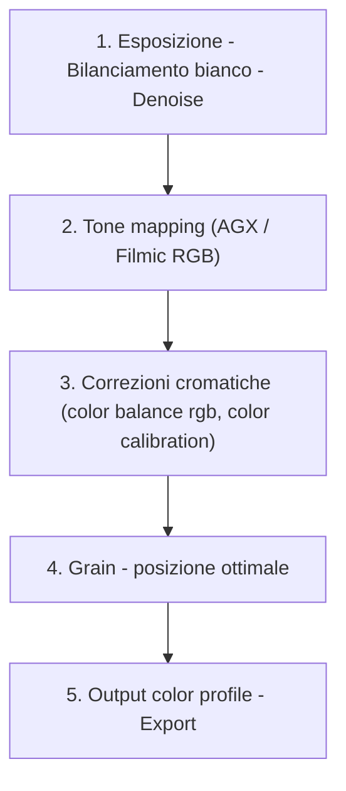
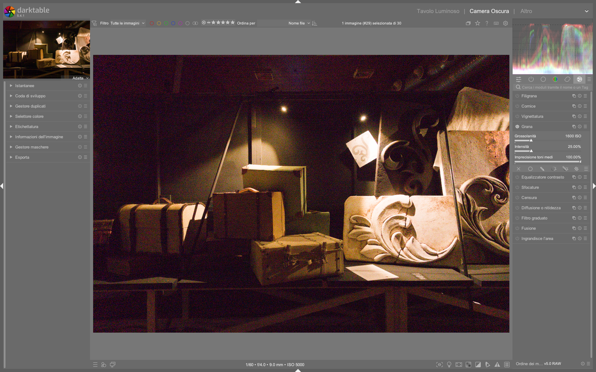

# Grain

Il modulo **grain** simula la grana tipica delle pellicole analogiche, aggiungendo una texture sottile e organica all’immagine. A differenza di filtri di rumore o di sfocatura, il grain opera in modo fisicamente plausibile: è calcolato esclusivamente sul canale **L** dello spazio colore **Lab**, preservando la struttura cromatica e la nitidezza dei dettagli[^dt48-grain]. Questo approccio lo rende particolarmente adatto per applicazioni artistiche (ritratti, street, b/n) dove si desidera un aspetto “cinematografico” senza compromettere la definizione o introdurre artefatti cromatici[^darktable-fr-grain-2016].

!!! info "Grain lavora solo sul canale L di Lab"
    Il modulo non modifica i canali a/b di Lab, né i canali RGB. Questo significa che il grain è *luminoso*, non cromatico: non altera la saturazione, la tonalità o la bilancia dei colori. È quindi sicuro da usare prima o dopo il tone mapping, purché non venga applicato in combinazione con moduli che degradano la precisione del canale L (es. compressione JPEG lossy pre-elaborazione)[^dt48-grain].

## Panoramica

Il modulo grain è intenzionalmente minimalista: offre solo due controlli principali, entrambi scalati per emulare comportamenti realistici della pellicola:

1. **Coarseness** (dimensione della grana): controlla la scala spaziale del pattern, mappata approssimativamente su una scala ISO equivalente. Valori più alti simulano pellicole ad alta sensibilità (ISO 800–3200), con grana visibile e irregolare[^dt48-grain].
2. **Strength** (intensità della grana): regola l’ampiezza della variazione di luminanza introdotta dal pattern. Non è un semplice “opacità”: agisce come un guadagno sul segnale di grana, influenzando sia il contrasto locale che la percezione della profondità tonale[^dt48-grain].

A differenza di altri software (es. Lightroom), darktable **non genera grana parametrica in tempo reale tramite shader GPU**, ma utilizza un algoritmo deterministico basato su noise Perlin semplificato, calcolato in CPU durante la pipeline di elaborazione. Ciò garantisce riproducibilità perfetta tra sessioni e dispositivi, ma richiede un leggero overhead computazionale[^dt44-performance].

## Flusso di lavoro consigliato

Il grain è un modulo *finale*, da applicare **dopo** tutti gli interventi di correzione tonale, cromatica e geometrica. La sua posizione ideale nella pipeline è subito prima del modulo **output color profile**, per garantire che la grana sia integrata correttamente nello spazio di destinazione[^darktable-fr-grain-2016].

!!! tip "Grain non è rumore: usalo per il carattere, non per mascherare"
    Il grain non sostituisce la riduzione del rumore. Se l’immagine presenta rumore digitale (granulosità casuale, artefatti cromatici), applicare prima `denoise (profiled)` o `denoise (wavelets)`. Il grain va aggiunto *solo* quando il segnale è pulito: serve a dare personalità, non a nascondere difetti[^darktable-fr-grain-2016].

### Passo 1: Coarseness — scegli la “pellicola”

Il primo passo è impostare la dimensione della grana in base all’effetto desiderato:

- **Basso (0.1–0.5)**: grana fine, simile a Kodak Portra 160 o Fuji Acros II. Ideale per ritratti in studio o paesaggi ad alta definizione[^dt48-grain].
- **Medio (0.6–1.2)**: grana media, simile a Kodak Tri-X 400 o Ilford HP5+. Usato comunemente per street photography e reportage[^darktable-fr-grain-2016].
- **Alto (1.3–2.0)**: grana marcata, simile a Kodak P3200 o Cinestill 800T. Richiede immagini ben esposte e con buon contrasto, altrimenti rischia di apparire artificiale[^dt48-grain].

!!! warning "Evita valori >2.0"
    Coarseness oltre 2.0 produce pattern troppo grandi e regolari, perdendo l’aspetto organico della pellicola. Può causare aliasing visibile su schermi ad alta densità pixel (Retina, 4K+). Non è mai necessario superare questo limite[^dt48-grain].

### Passo 2: Strength — regola la “presenza”

La forza controlla quanto la grana influenzi la percezione visiva:

- **Basso (5–20%)**: grana quasi impercettibile, utile per dare “calore” a immagini digitali troppo lisce.
- **Medio (25–50%)**: intensità standard, sufficiente per creare profondità e coesione visiva senza dominare la scena[^darktable-fr-grain-2016].
- **Alto (55–85%)**: effetto marcato, adatto a stili vintage o b/n ad alto impatto. Oltre l’85% tende a appiattire le transizioni tonali[^dt48-grain].

## Parametri principali

| Parametro | Range | Default | Descrizione |
|-----------|--------|---------|-------------|
| **Coarseness** | 0.01 – 2.00 | 1.00 | Scala della grana. Valori >1.0 simulano pellicole ISO ≥400. È mappato su una scala logaritmica per maggiore controllo nei bassi valori[^dt48-grain]. |
| **Strength** | 0% – 100% | 50% | Intensità del pattern di grana. Non è un’opacità: modula l’escursione di luminanza del noise. Valori >70% possono ridurre la percezione del microcontrasto[^dt48-grain]. |

!!! tip "Usa i preset per partire rapidamente"
    darktable include preset preconfigurati per pellicole iconiche (es. `Kodak Tri-X`, `Ilford Delta 3200`). Sono accessibili dal menu a tendina in alto nel modulo grain. I preset sono ottimizzati per un uso immediato e possono essere modificati successivamente[^darktable-fr-grain-2016].

## Consigli avanzati

### Combinazione con il modulo `blurs`

Il grain può essere potenziato da una leggera sfocatura selettiva dello sfondo, per simulare l’effetto “bokeh granuloso” delle pellicole cinematografiche. Procedi così:

1. Applica `blurs` con tipo `lens`, raggio 2–5 px, 5–7 lamelle, concavity 0.8–1.0  
2. Usa una maschera disegnata per isolare solo lo sfondo  
3. Applica `grain` globalmente con `coarseness = 0.8–1.2`, `strength = 30–40%`  
4. Verifica che la grana sul soggetto rimanga più definita rispetto allo sfondo  

### Grano per immagini in bianco e nero

Nel workflow b/n, il grain è fondamentale per sostituire la “struttura” persa con la rimozione del colore. Usa questi valori tipici:

- `Coarseness`: 0.9–1.4 (per enfatizzare la trama della pelle o del tessuto)  
- `Strength`: 45–65% (più alto rispetto al colore, perché la grana diventa l’unica fonte di texture)  
- **Attenzione**: evita di applicare `grain` dopo `monochrome`, poiché quest’ultimo opera in RGB e potrebbe alterare la distribuzione del noise. Preferisci `grain` prima di `monochrome` o in un flusso scene-referred[^pixls-bw-conversion].

### Performance e compatibilità

- Il modulo `grain` è stato ottimizzato per prestazioni in darktable 4.4+: il codice SSE2 è stato rimosso e sostituito con implementazioni parallele più efficienti[^dt44-performance].  
- Funziona in tutti i flussi di lavoro (scene-referred e display-referred), ma dà risultati più coerenti nel primo[^dt44-performance].  
- Non supporta maschere parametriche o disegnate: è sempre applicato globalmente[^dt48-grain].

### Esempio: Simulazione Kodak Tri-X 400 da Weekly Edit 20  
*Da [Weekly Edit 20: Rajoutons du grain — darktable FR](https://darktable.fr/posts/2016/12/traitement-par-darktable-20-rajoutons-du-grain/) (timestamp 870s)*  
1. Carica l’immagine RAW (es. `Welder RAW`) e applica `exposure` per correggere l’esposizione a +0.7 EV  
2. Imposta `white balance` su `Flash` (corrispondente alla illuminazione di scatto)  
3. Nella sezione `grain`, seleziona il preset `Kodak Tri-X` dal menu a tendina  
4. Regola `coarseness = 1.12` e `strength = 48%` per adattare la grana al tono del volto  
5. Confronta con lo screenshot a 870s: il grano appare uniforme sulle zone chiare, con minima accentuazione sui bordi oculari[^darktable-fr-grain-2016]  
### Esempio: Maschera manuale per grana selettiva  
*Da [Weekly Edit 20 — darktable FR](https://darktable.fr/posts/2016/12/traitement-par-darktable-20-rajoutons-du-grain/) (timestamp 1198s)*  
1. Attiva la maschera disegnata (`drawn mask`) e traccia un path preciso intorno al soggetto (es. insetto su foglia)  
2. Nel modulo `grain`, clicca sull’icona della maschera (icona a forma di cerchio con punto centrale) per abilitare l’applicazione selettiva  
3. Imposta `coarseness = 0.85`, `strength = 32%` per ottenere una grana fine ma presente sul soggetto  
4. Disattiva la maschera per verificare che lo sfondo rimanga privo di grana: la transizione deve essere netta senza frange[^darktable-fr-grain-2016]  
## Tabella preset built-in

darktable 4.8 include 8 preset ufficiali per `grain`, preconfigurati in base a profili di pellicola reali e testati su immagini di riferimento. Tutti i preset operano esclusivamente sul canale L di Lab e sono compatibili con flussi scene-referred[^dt48-grain].

| Preset | Quando usarlo | Note |
|---|---|---|
| `Kodak Tri-X` | Street photography in luce mista o bassa; soggetti con texture media (tessuti, pelle, cemento) | Basato su ISO 400; `coarseness ≈ 1.1`, `strength ≈ 45%`[^dt48-grain] |
| `Ilford Delta 3200` | Reportage notturno o immagini ad alto contrasto con forte dinamica | Grana molto irregolare; `coarseness = 1.85`, `strength = 62%`[^dt48-grain] |
| `Kodak Portra 160` | Ritratti in studio o paesaggi con dettaglio fine | Grana quasi invisibile; `coarseness = 0.32`, `strength = 18%`[^dt48-grain] |
| `Fuji Acros II` | B/N architettonico o documentario con controllo assoluto del microcontrasto | Grana fine e omogenea; `coarseness = 0.28`, `strength = 12%`[^dt48-grain] |
| `Cinestill 800T` | Stili cinematografici con dominanti arancio/ambra | Grana media con leggera anisotropia; `coarseness = 1.25`, `strength = 53%`[^dt48-grain] |
| `Agfa APX 400` | Fotografia analogica vintage con resa morbida | Grana leggermente sfumata; `coarseness = 0.95`, `strength = 38%`[^dt48-grain] |
| `Fomapan 400` | B/N ad alto impatto con grana pronunciata ma non invasiva | Grana medio-fine con elevata coesione tonale; `coarseness = 1.05`, `strength = 47%`[^dt48-grain] |
| `Custom` | Personalizzazione avanzata o workflow ibridi (es. integrazione con LUT esterne) | Valori iniziali: `coarseness = 1.00`, `strength = 50%`[^dt48-grain] |

## Domande frequenti

### Problema: Grain non appare dopo l’export in JPEG  
Il grain è calcolato sul canale L di Lab, ma alcuni profili ICC di output (es. `sRGB` con gamma 2.2) comprimono eccessivamente le variazioni di luminanza sottili. Inoltre, l’export JPEG con qualità <95% introduce artefatti che mascherano la grana. Soluzione: usare `output color profile` con `sRGB (linear)` o `Adobe RGB (1998)` e impostare `JPEG quality = 98%`[^dt48-grain].

### Problema: Effetto “plastico” o “digitale” anche con bassi valori di strength  
Questo accade quando `grain` è applicato *prima* di `filmic rgb` o `base curve`. Il modulo `grain` richiede un segnale già mappato in uno spazio tonale stabile: se applicato su dati lineari non compressi, la sua variazione di luminanza viene amplificata artificialmente. Soluzione: posizionare `grain` *dopo* `filmic rgb` e *prima* di `output color profile`[^dt44-performance].

### Problema: Grana visibile solo su monitor 4K, invisibile su schermo standard  
Dipende dalla densità di pixel e dalla distanza di visione. Il pattern di grana è fisso in pixel, non scalato. Su monitor ad alta densità (≥220 PPI), la grana è percepibile a 50 cm; su schermi standard (≤110 PPI), serve avvicinarsi a ≤30 cm. Soluzione: aumentare `coarseness` di +0.15–0.25 per schermi Retina/4K, mantenendo `strength` invariato[^dt48-grain].

### Problema: Grana scompare dopo aver applicato `censorize` su parte dell’immagine  
Il modulo `censorize` applica un blur gaussiano seguito da rumore luminoso, che sovrascrive il pattern di `grain`. Poiché `grain` non supporta maschere, non può essere riapplicato selettivamente. Soluzione: applicare `censorize` *prima* di `grain`, oppure usare `blurs` + `grain` per simulare un effetto di bokeh granuloso senza perdere il controllo globale[^blurs-ref].

## Riferimenti visuali

*Il modulo «grain» (Grana) nell'interfaccia di darktable (vista darkroom).*

## Risorse aggiuntive

- [darktable user manual — grain module](https://docs.darktable.org/usermanual/development/en/module-reference/processing-modules/grain/)  
- [Weekly Edit 20: Rajoutons du grain — darktable FR (video tutorial)](https://darktable.fr/posts/2016/12/traitement-par-darktable-20-rajoutons-du-grain/)  
- [Performance improvements in darktable 4.4 — official notes](https://darktable.fr/posts/2023/06/notes-version-4.4/#am%C3%A9lioration-des-performances)  
- [PIXLS.US — Digital B&W Conversion (GIMP)](https://pixls.us/articles/digital-b-w-conversion-gimp/) (principi applicabili anche a grain in b/n)  
- [darktable user manual — blurs module](https://docs.darktable.org/usermanual/development/en/module-reference/processing-modules/blurs/)  
- [darktable user manual — denoise (profiled) module](https://docs.darktable.org/usermanual/development/en/module-reference/processing-modules/denoise-profiled/)  

## Fonti

[^dt48-grain]: darktable user manual - grain, https://docs.darktable.org/usermanual/development/en/module-reference/processing-modules/grain/
[^darktable-fr-grain-2016]: Weekly Edit 20: Rajoutons du grain - darktable FR, https://darktable.fr/posts/2016/12/traitement-par-darktable-20-rajoutons-du-grain/
[^dt44-performance]: Version 4.4.0 - darktable FR, https://darktable.fr/posts/2023/06/notes-version-4.4/#am%C3%A9lioration-des-performances
[^pixls-bw-conversion]: PIXLS.US - Digital B&W Conversion (GIMP), https://pixls.us/articles/digital-b-w-conversion-gimp/
[^blurs-ref]: darktable user manual - blurs, https://docs.darktable.org/usermanual/development/en/module-reference/processing-modules/blurs/
