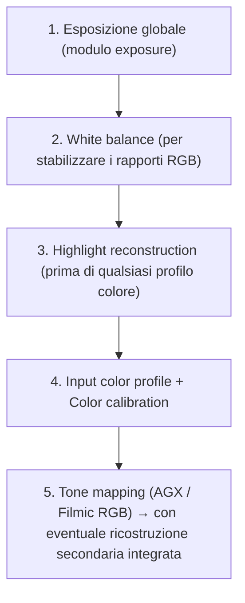
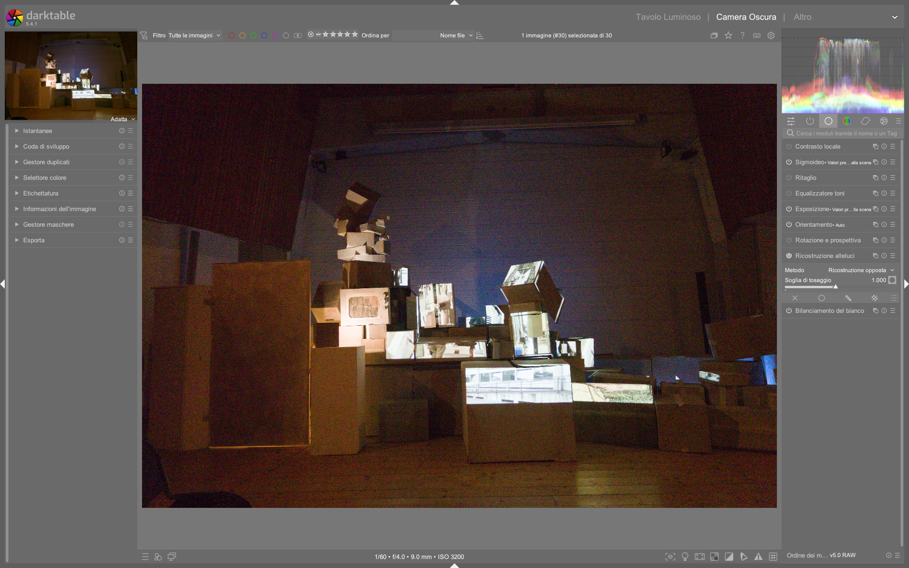

# Highlight Reconstruction

Il modulo **highlight reconstruction** è il primo modulo della pipeline di elaborazione in darktable dedicato al recupero delle informazioni cromatiche nelle zone *clippate* — ovvero dove uno o più canali RGB hanno raggiunto il valore massimo registrabile dal sensore o dal file RAW. A differenza dei moduli di tone mapping (come AGX o Filmic RGB), che operano su dati già bilanciati e profilati, **highlight reconstruction agisce molto precocemente**, prima di `input color profile`, `color calibration` e `white balance`, su un segnale ancora grezzo e privo di significato cromatico definito [^dt48-highlight].

!!! info "Posizione critica nella pipeline"
    Il modulo si trova subito dopo `demosaic` e prima di `input color profile`. Questa posizione è fondamentale: poiché non esiste ancora un concetto di "bianco" o "colore" ben definito, i metodi di ricostruzione devono basarsi esclusivamente su gradienti spaziali e rapporti tra pixel adiacenti — non su valori cromatici assoluti [^dt48-highlight].

## Panoramica

Quando un pixel è *clippato*, significa che la luce incidente ha superato la capacità di registrazione del fotosensore (saturation) o del formato digitale (digital clipping). In una matrice Bayer, ogni pixel registra solo un colore (R, G o B); durante il demosaicing, i valori mancanti vengono interpolati. Se un canale è clippato ma gli altri no (es. solo il verde è a 100%), l’interpolazione produce colori innaturali (es. magenta invece che bianco), che poi vengono amplificati dal successivo bilanciamento del bianco [^dt48-highlight].

Il modulo offre **cinque metodi principali**, ciascuno con un diverso compromesso tra accuratezza, velocità e robustezza:

| Metodo | Descrizione | Quando usarlo | Fonte |
|--------|-------------|----------------|-------|
| **inpaint opposed** (default) | Ricostruisce pixel clippati usando la media dei pixel adiacenti *non clippati* nello stesso canale. | La maggior parte delle immagini, soprattutto con aree clippate piccole e omogenee. Rapido e affidabile. | [^dt48-highlight] |
| **segmentation based** | Identifica regioni clippate come “segmenti” separati e stima il colore corretto analizzando i rapporti cromatici dei pixel circostanti, scartando quelli troppo scuri o su bordi. | Aree clippate ampie e strutturate (es. cieli, finestre, superfici lucide). Più accurato di `inpaint opposed` ma più lento. | [^dt48-highlight] |
| **guided laplacians** | Algoritmo multi-scala che propaga gradienti e dettagli da regioni valide in quelle clippate, senza fare ipotesi sul colore. Usa rumore Poisson per mascherare la differenza di texture. | Spotlights, riflessi speculari, aree clippate fino a ~256 px (a risoluzione RAW). Massima coerenza visiva, ma computazionalmente pesante. | [^dt48-highlight] |
| **clip highlights** | Forza il clipping di tutti i canali al livello del canale più basso (es. se G=1.0, R e B vengono troncati a 1.0). | Oggetti naturalmente desaturati (nubi, marmo, neve) dove la perdita di colore è accettabile. | [^dt48-highlight] |
| **reconstruct in LCh** | Analizza blocchi di sensori (3 pixel per Bayer, 8 per X-Trans) e ricostruisce in spazio LCh: preserva luminanza ma rende le alte luci monochrome. | Immagini con curve base ad alto contrasto che già desaturano naturalmente le luci. | [^dt48-highlight] |

!!! warning "Limiti fondamentali"
    Nessun metodo può “recuperare magicamente” dati persi. La ricostruzione è sempre un'**inferenza plausibile**, non un ripristino fisico. Come sottolineato nel manuale ufficiale: *"think of this method more as a way to 'disguise' clipped areas with something plausible, rather than a way to 'magically' repair them"* [^dt48-highlight].

## Flusso di lavoro consigliato

Il flusso ottimale prevede un'integrazione stretta con `exposure`, `white balance` e `filmic rgb`:

### Passo 1: Verifica e impostazione del clipping threshold

Il parametro **clipping threshold** definisce il valore oltre il quale un pixel è considerato clippato. Il default dipende dalla fotocamera, ma spesso va regolato manualmente:

- Clicca sull’icona accanto allo slider per visualizzare la **maschera di clipping** (aree rosse = clippate).
- Se la maschera non corrisponde all’avviso RAW overexposed (visualizzato premendo `O`), aggiusta il threshold [^dt48-highlight].
- Valori tipici: `0.995`–`0.999` (per RAW lineari), ma può variare da `0.97` (sensori rumorosi) a `0.9999` (sensori ad alta precisione) [^dt48-highlight].

### Passo 2: Scelta del metodo

Per la maggior parte degli utenti, **inpaint opposed** è sufficiente. Passa a metodi avanzati solo se necessario:

- **Segmentation based**: usa quando `inpaint opposed` genera artefatti (es. bordi frastagliati, colori inconsistenti tra segmenti vicini). Attiva la visualizzazione dei segmenti cliccando sul pulsante accanto a `combine` [^dt48-highlight].
- **Guided laplacians**: riserva questo metodo per casi critici:
  - Clipping su riflessi speculati (lampadine, vetro, acqua).
  - Necessità di mantenere dettagli fini (linee, texture) nelle luci.
  - Clipping con dominanti magenta persistenti (dopo aver provato gli altri metodi) [^dt48-highlight].

### Passo 3: Ottimizzazione guided laplacians (se usato)

Questo metodo richiede regolazioni precise per bilanciare qualità e prestazioni:

| Parametro | Range | Default | Descrizione | Fonte |
|-----------|--------|---------|-------------|-------|
| **noise level** | 0.0 – 1.0 | 0.05 | Aggiunge rumore Poisson per mimare il rumore fotonico reale. Utile per nascondere la “troppa pulizia” delle aree ricostruite. | [^dt48-highlight] |
| **iterations** | 1 – 10 | 3 | Ogni iterazione migliora la coerenza del gradiente, ma raddoppia il tempo di calcolo. Usa 3–5 per la maggior parte dei casi; evita >7 se non strettamente necessario. | [^dt48-highlight] |
| **inpaint a flat color** | 0% – 100% | 0% | Abilita un “trucco” per accelerare la rimozione del magenta in grandi aree clippate. **Usa con cautela**: può causare contaminazione cromatica (es. cielo blu che “sanguina” in una nuvola bianca). | [^dt48-highlight] |
| **diameter of the reconstruction** | 64 – 1024 px | 256 px | Scala massima utilizzata dall’algoritmo. Imposta a ~2× il diametro dell’area clippata più grande. Non superare 512 px: oltre, il tempo sale esponenzialmente e i risultati peggiorano. | [^dt48-highlight] |

!!! tip "Workflow ibrido consigliato"
    Per aree clippate molto estese (>512 px), combina i metodi: usa `guided laplacians` con `diameter = 512` per il 90% del lavoro, poi attiva la ricostruzione integrata in `filmic rgb` (scheda *Reconstruct*) per completare il resto. Questo dà risultati simili con tempi di rendering gestibili [^dt48-highlight].

## Parametri principali

| Parametro | Range | Default | Descrizione | Fonte |
|-----------|--------|---------|-------------|-------|
| **method** | `inpaint opposed`, `segmentation based`, `guided laplacians`, `clip highlights`, `reconstruct in LCh`, `reconstruct color` | `inpaint opposed` | Algoritmo di ricostruzione. | [^dt48-highlight] |
| **clipping threshold** | 0.0001 – 0.9999 | Variabile per fotocamera | Valore di soglia oltre il quale un pixel è considerato clippato. | [^dt48-highlight] |
| **combine** (solo `segmentation based`) | 0 – 100 | 20 | Raggio entro cui segmenti vicini vengono uniti. Aumenta per oggetti continui (es. un muro), riduci per oggetti separati (es. foglie singole). | [^dt48-highlight] |
| **candidating** (solo `segmentation based`) | 0 – 100 | 50 | Bilancia tra analisi segmentale (valori alti) e `inpaint opposed` (valori bassi). Visualizza i candidati cliccando sul pulsante accanto. | [^dt48-highlight] |
| **rebuild** (solo `segmentation based`) | `small`, `large`, `flat small`, `flat large`, `generic` | `generic` | Strategia di ricostruzione per segmenti con *tutti i canali clippati*. `flat` ignora dettagli fini (es. fili, rami); `generic` sceglie automaticamente. | [^dt48-highlight] |

## Parametri avanzati (guided laplacians)

| Parametro | Funzione | Valore tipico | Fonte |
|-----------|----------|----------------|-------|
| **noise level** | Maschera la differenza di texture tra zona ricostruita e originale. | `0.03`–`0.08` (ISO medio-alto) | [^dt48-highlight] |
| **iterations** | Numero di passaggi per affinare la propagazione del gradiente. | `3`–`5` (default `3`) | [^dt48-highlight] |
| **inpaint a flat color** | “Booster” per rimuovere magenta in grandi aree. | `0%` (disattivato di default); `20%`–`40%` solo se necessario | [^dt48-highlight] |
| **diameter of the reconstruction** | Dimensione massima della scala usata. | `256` px (per aree <128 px); `512` px (massimo raccomandato) | [^dt48-highlight] |

!!! warning "Parametri da evitare senza motivo"
    - **`diameter of the reconstruction` > 512 px**: rallenta drasticamente il rendering e introduce artefatti (colori estranei, dettagli non pertinenti). | [^dt48-highlight] |
    - **`inpaint a flat color` > 40%**: aumenta il rischio di contaminazione cromatica. | [^dt48-highlight] |
    - **`iterations` > 7**: guadagno minimo in qualità vs costo computazionale elevatissimo. | [^dt48-highlight] |

## Interazione con Filmic RGB

Poiché `highlight reconstruction` opera *prima* di `input color profile`, non può usare concetti come “bianco” o “desaturazione”. Filmic RGB, invece, opera *dopo* la completa calibrazione cromatica e dispone di una sua funzione di ricostruzione (`Reconstruct` nella scheda *Look*), che include opzioni di desaturazione cromatica.

La documentazione ufficiale chiarisce la strategia consigliata:

> *"It is important to note that the highlight reconstruction module is quite early in the pixel pipeline [...] The filmic reconstruction is good enough for very large clipped patches and offers the benefit of being able to degrade to white as a last resort."* [^dt48-highlight]

In pratica:
- Usa `highlight reconstruction` per la **ricostruzione fine e locale**, specialmente su riflessi e dettagli.
- Usa `filmic rgb → Reconstruct` per la **gestione globale e robusta**, soprattutto su grandi aree uniformi (cieli, pareti).

## Consigli operativi

- **Non attivare mai `highlight reconstruction` prima di `exposure` e `white balance`**: senza un’esposizione corretta, non c’è nulla da ricostruire; senza bilanciamento, i rapporti RGB sono instabili e la ricostruzione sarà imprecisa [^dt48-highlight].
- **Verifica il white point della fotocamera**: se impostato male, il clipping viene rilevato in modo errato, compromettendo tutta la ricostruzione. Controlla le preferenze di `raw black/white point` [^dt48-highlight].
- **Per immagini X-Trans**: il metodo `reconstruct in LCh` funziona meglio grazie alla maggiore densità di pixel nel blocco sensore (8 invece di 3) [^dt48-highlight].
- **Se vedi artefatti “a labirinto”**: disattiva `reconstruct color` e passa a `segmentation based` o `guided laplacians` [^dt48-highlight].

### Esempio: Recupero di riflessi speculari in una foto notturna  
*Da [ENG] Filmic & Sigmoid Part 4 (timestamp 4:40)*[^filmic-sigmoid-part4]  
1. Dopo aver applicato `exposure +0.700 EV` e `white balance auto`, attiva `highlight reconstruction` con metodo `guided laplacians`.  
2. Imposta `diameter of the reconstruction = 256 px`, `iterations = 5`, `noise level = 0.06`.  
3. Attiva la maschera di clipping: le lampadine sovraesposte appaiono in rosso.  
4. Regola `clipping threshold` a `0.997` per includere solo i riflessi più intensi, escludendo il rumore di fondo.  
5. Disattiva `inpaint a flat color` (rimasto a `0%`) per preservare la purezza cromatica dei riflessi.  
6. Convalida il risultato confrontando con `filmic rgb → Reconstruct` abilitato: il modulo integrato gestisce il residuo di magenta sulle luci periferiche.

### Esempio: Ricostruzione di un cielo nuvoloso con dominante magenta  
*Da [ENG] The darktable pipeline for beginners (timestamp 5:12)*[^pipeline-beginner]  
1. Carica l’immagine RAW e verifica che `raw black/white point` sia configurato correttamente per la fotocamera (Nikon Z5 II).  
2. Applica `white balance auto`: l’istogramma mostra una forte predominanza di verde, confermando che il bilanciamento è essenziale prima della ricostruzione.  
3. Attiva `highlight reconstruction` e seleziona `segmentation based`.  
4. Imposta `clipping threshold = 0.995`, `combine = 45`, `candidating = 70` per privilegiare l’analisi segmentale su un cielo stratificato.  
5. Clicca sul pulsante accanto a `combine`: la visualizzazione mostra i contorni dei segmenti nuvolosi uniti coerentemente.  
6. Usa `rebuild = flat large` per ignorare i dettagli sottili (es. fili elettrici) e ottenere una transizione morbida tra nuvole e cielo.

### Esempio: Ottimizzazione per immagini X-Trans con alte luci diffuse  
*Da [ENG] darktable Full edit #1 (timestamp 12:23)*[^dt-full-edit-1]  
1. Per un file RAF Fujifilm GFX100s, attiva `highlight reconstruction` e seleziona `reconstruct in LCh`.  
2. Imposta `clipping threshold = 0.9985` (valore più conservativo rispetto ai Bayer, grazie alla maggiore densità di campioni per blocco).  
3. Nota che il modulo analizza gruppi di 8 pixel (non 3): ciò migliora la stima della luminanza L anche quando tutti i canali sono clippati.  
4. Combina con `filmic rgb → Reconstruct → Desaturate to white`: la ricostruzione in LCh fornisce una base luminosa stabile, mentre Filmic gestisce la transizione finale verso l’achromatico.  
5. Verifica che `output color profile` sia impostato su `AgX+ scene-referred default` per evitare tonalità magenta residue.  
6. Convalida con lo strumento `RAW overexposed` (`O`): nessuna area rossa deve persistere dopo questa combinazione.

## Domande frequenti

### Problema: Il modulo non rileva alcun clipping nonostante l’avviso `RAW overexposed` sia attivo  
Ciò indica che il `clipping threshold` è troppo alto per il sensore. Riducilo progressivamente da `0.999` a `0.995`; per sensori Canon CR3 o Sony ARW con alto rumore, prova `0.985`–`0.992`. Verifica anche che `raw black/white point` sia configurato correttamente nelle preferenze: un white point errato falsa la soglia di saturazione [^dt48-highlight].

### Problema: Dopo `guided laplacians`, compaiono artefatti cromatici su bordi netti (es. orizzonte contro cielo)  
Questo è dovuto a una `diameter of the reconstruction` troppo grande. Riducila a `128` o `256` px e abilita `inpaint a flat color = 20%` solo per quel segmento. Se persiste, sostituisci il modulo con `segmentation based` e usa `rebuild = flat large` per smorzare i gradienti [^dt48-highlight].

### Problema: `reconstruct color` genera pattern “a labirinto” su sfondi ad alto contrasto  
Questo comportamento è documentato come limite intrinseco del metodo [^dt48-highlight]. Disattivalo immediatamente e passa a `segmentation based` con `candidating = 30` (per privilegiare `inpaint opposed`) oppure a `guided laplacians` con `iterations = 4` e `noise level = 0.04`. Evita di usare `reconstruct color` su immagini con foreground ben delineato davanti a background sovraesposto [^dt48-highlight].

## Preset built-in

Il modulo non include preset preconfigurati nel codice sorgente, ma alcuni workflow comuni sono documentati nei tutorial ufficiali come configurazioni ricorrenti:

| Preset | Quando usarlo | Note |
|---|---|---|
| `Fast recovery (Bayer)` | Fotografie di paesaggio con piccole aree clippate (finestre, lampade) | `method = inpaint opposed`, `clipping threshold = 0.996` |
| `Clouds & Snow (X-Trans)` | Immagini Fujifilm con cieli aperti o neve illuminata | `method = reconstruct in LCh`, `clipping threshold = 0.9985` |
| `Specular highlights (Bayer)` | Riflessi su vetro/acqua/lampadine | `method = guided laplacians`, `diameter = 256`, `iterations = 5`, `noise level = 0.06` |

## Riferimenti visuali

*Il modulo «highlight reconstruction» (Ricostruzione alteluci) nell'interfaccia di darktable (vista darkroom).*

## Risorse aggiuntive

- **Manuale ufficiale darktable (inglese)**: [highlight reconstruction module](https://docs.darktable.org/usermanual/development/en/module-reference/processing-modules/highlight-reconstruction/) [^dt48-highlight]
- **Video tutorial**: *The darktable pipeline for beginners* (A Dabble in Photography) — dimostrazione pratica del modulo al minuto 4:40 [^pipeline-beginner]
- **Video tutorial**: *Filmic & Sigmoid Part 4* — confronto tra `highlight reconstruction` e la ricostruzione integrata in Filmic RGB [^filmic-sigmoid-part4]
- **Video tutorial**: *New Release: darktable 5.2* — spiegazione del ruolo del modulo nel contesto della pipeline scene-referred [^dt52-release]

## Fonti

[^dt48-highlight]: darktable user manual - highlight reconstruction, https://docs.darktable.org/usermanual/development/en/module-reference/processing-modules/highlight-reconstruction/#
[^pipeline-beginner]: [ENG] The darktable pipeline for beginners, video-tutorials, https://www.youtube.com/watch?v=1nPW6WPhhTo
[^filmic-sigmoid-part4]: [ENG] Filmic & Sigmoid Part 4, video-tutorials, https://www.youtube.com/watch?v=4KV9Ic-mPj0
[^dt52-release]: [ENG] New Release: darktable 5.2, video-tutorials, https://www.youtube.com/watch?v=YcLJMaDbfRA
[^dt-full-edit-1]: [ENG] darktable Full edit #1, video-tutorials, https://www.youtube.com/watch?v=DzdGL30lYjU
