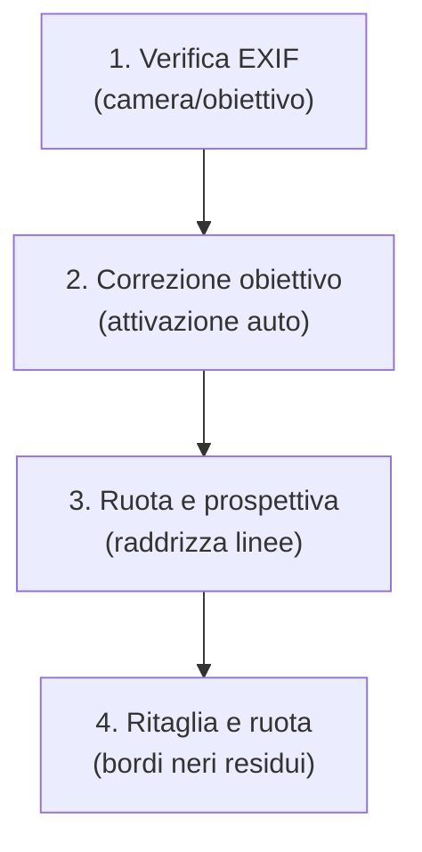
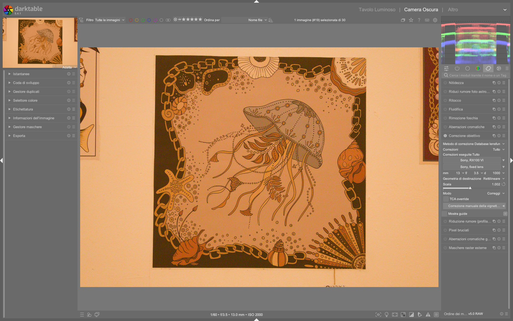

# Lens Correction

Il modulo **lens correction** è il punto di partenza tecnico della pipeline darktable per la correzione ottica automatica e manuale. Gestisce tre difetti fisici fondamentali introdotti dall’obiettivo: **distorsione geometrica**, **aberrazione cromatica trasversale (TCA)** e **vignettatura fotometrica**, in modo non distruttivo e basato sui dati EXIF o sul database esterno [Lensfun](https://lensfun.github.io/)[^dt48-lens-correction]. A partire da darktable 5.4, il modulo supporta anche la simulazione inversa di tali difetti (*distort mode*), utile per effetti creativi o test di calibrazione[^dt48-lens-correction].

!!! info "Correzione lente = primo passo obbligatorio"
    Il modulo lens correction deve essere applicato **prima** di qualsiasi regolazione tonale o cromatica. Correggere distorsione o TCA *dopo* un tone mapping come AGX può generare artefatti di interpolazione irreversibili e degradare la qualità dei bordi[^dt48-lens-correction][^manuale-flusso].

## Panoramica

Il modulo opera su due livelli distinti:

1. **Correzione automatica**: basata su profili precaricati (Lensfun) o metadati embedded (DNG, Adobe), che richiedono solo la selezione corretta di *camera* e *lens*.
2. **Affinamento manuale**: per casi in cui i profili sono incompleti, assenti o insufficienti — soprattutto per vignettatura e TCA.

Il modulo non modifica i dati RAW sottostanti, ma applica trasformazioni geometriche e fotometriche nella pixelpipe. In caso di correzioni forti, darktable riempie i pixel mancanti ai bordi ripetendo i valori dei bordi stessi (*edge replication*), un comportamento visibile su immagini rumorose o fortemente distorte[^dt48-lens-correction].

## Flusso di lavoro consigliato

Il flusso ideale segue una sequenza rigorosa per massimizzare precisione e prevenire artefatti:

!!! tip "Automatizza con i preset"
    Per ogni obiettivo utilizzato frequentemente, crea un preset automatico:
    - Apri una foto scattata con quel corpo + obiettivo
    - Verifica che `camera` e `lens` siano identificati correttamente
    - Clicca sul menu a hamburger (⋮) del modulo → *Salva nuovo preset*
    - Nelle condizioni, imposta `model` = nome esatto dell’obiettivo (es. `Sigma 18-35mm f/1.8 DC HSM`)
    - Spunta *Applica automaticamente*[^manuale-flusso].

### Passo 1: Scelta del metodo di correzione

Scegli tra tre modalità principali nel menu *correction method*:

| Metodo | Quando usarlo | Note tecniche |
|--------|----------------|----------------|
| **Lensfun database** | Obiettivo supportato da Lensfun (90% dei moderni) | Richiede `lensfun-update-data` aggiornato; supporta tutti i parametri (distorsione, TCA, vignettatura)[^dt48-lens-correction] |
| **Embedded metadata** | File DNG o RAW con profili Adobe integrati | Disponibile solo se i metadati contengono dati di correzione; meno flessibile su focal distance[^dt48-lens-correction] |
| **Only manual vignette** | Profilo Lensfun assente o inadeguato, ma si vuole comunque correggere la vignettatura | Non applica distorsione né TCA; usa solo i controlli manuali sotto[^dt48-lens-correction] |

!!! warning "TCA e raw chromatic aberrations: evita il doppio intervento"
    Se abiliti la correzione TCA qui, **disattiva** il modulo *raw chromatic aberrations*. L’applicazione simultanea causa over-correction e artefatti cromatici ai bordi (frange viola/ciano)[^dt48-lens-correction].

### Passo 2: Parametri fotometrici critici

I profili Lensfun dipendono da tre parametri letti dai metadati EXIF:

| Parametro | Range tipico | Default | Funzione |
|-----------|--------------|---------|----------|
| **Focal length** | 8–2000 mm | Auto (da EXIF) | Determina intensità di distorsione e TCA; fondamentale per zoom[^dt48-lens-correction] |
| **Aperture** | f/1.2–f/32 | Auto (da EXIF) | Influenza forza della vignettatura e TCA; molti obiettivi non registrano aperture variabili[^dt48-lens-correction] |
| **Focal distance** | 0.2 m – ∞ | *Non registrato* (spesso vuoto) | Critico per la vignettatura: impostalo manualmente se il valore è zero o errato[^dt48-lens-correction] |

> ✅ **Valore tipico per paesaggio**: `focal distance = ∞`  
> ✅ **Valore tipico per ritratto**: `focal distance = 1.5–3.0 m`  
> ❌ **Non lasciare vuoto**: se manca, la vignettatura sarà inaccurata[^dt48-lens-correction].

## Parametri principali

### Controlli Lensfun (metodo selezionato)

| Parametro | Range | Default | Descrizione |
|-----------|-------|---------|-------------|
| **Target geometry** | `rectilinear`, `fisheye`, `panoramic`, `equirectangular`, `orthographic`, `stereographic`, `equisolid angle`, `Thoby fisheye` | `rectilinear` | Cambia la proiezione dell’immagine: usare `fisheye` per correggere obiettivi fish-eye, `panoramic` per immagini stitched[^dt48-lens-correction] |
| **Scale** | 0.70–1.50 | Auto | Ridimensiona l’immagine per evitare angoli neri dopo correzione; il pulsante *auto scale* calcola il fattore ottimale[^dt48-lens-correction] |
| **Mode** | `correct` (default), `distort` | `correct` | In `distort`, inverte gli effetti: simula distorsione di un obiettivo specifico (utile per test o effetti)[^dt48-lens-correction] |
| **TCA overwrite** | checkbox | disattivato | Abilita i controlli manuali `TCA red` / `TCA blue`[^dt48-lens-correction] |
| **TCA red** | -100.0–+100.0 | Auto | Compensa lo shift cromatico del canale rosso; spostalo finché le frange rosse ai bordi non scompaiono[^dt48-lens-correction] |
| **TCA blue** | -100.0–+100.0 | Auto | Compensa lo shift cromatico del canale blu; spostalo finché le frange blu non scompaiono[^dt48-lens-correction] |

!!! tip "Come rilevare la TCA"
    Zooma al 100% su un bordo ad alto contrasto (es. orizzonte contro cielo). Cerca frange rosse (sul lato destro del bordo) o blu (sul lato sinistro). Regola `TCA red`/`blue` fino a farle scomparire[^dt48-lens-correction].

### Controlli Embedded Metadata (metodo selezionato)

| Parametro | Range | Default | Funzione |
|-----------|-------|---------|----------|
| **Use latest algorithm** | checkbox | disattivato | Abilita l’algoritmo di correzione più recente (richiede ricarica immagine)[^dt48-lens-correction] |
| **Fine-tuning button** | toggle | nascosto | Espande i controlli manuali per distorsione, vignettatura, TCA red/blue e scala immagine[^dt48-lens-correction] |

### Controlli Manual Vignetting Correction

Attivabile cliccando il pulsante *manual vignetting correction*, indipendentemente dal metodo scelto:

| Parametro | Range | Default | Effetto pratico |
|-----------|-------|---------|-----------------|
| **Strength** | -100% – +100% | 0% | Valori positivi schiariscono i bordi; negativi li scuriscono ulteriormente[^dt48-lens-correction] |
| **Radius** | 0% – 100% | 50% | Area centrale non modificata: 50% = cerchio che copre metà larghezza/altezza[^dt48-lens-correction] |
| **Steepness** | 0% – 100% | 50% | Gradualità della transizione: 0% = transizione morbida, 100% = transizione netta[^dt48-lens-correction] |

> ✅ **Valore tipico per correzione standard**: `strength = +20%`, `radius = 65%`, `steepness = 70%`  
> 🔍 **Visualizza la maschera**: clicca l’icona *mask* accanto a `strength` per vedere l’area influenzata[^dt48-lens-correction].

## Consigli avanzati

### Identificazione errata di obiettivo

Se Lensfun non riconosce correttamente il tuo obiettivo (es. obiettivo terzo produttore o adattato), segui questa procedura:

1. Clicca su `lens` → cerca manualmente nel menu a tendina il modello più vicino
2. Se usi un adattatore (es. Canon EF su Sony E-mount), esegui prima [`lensfun-add-adapter`](https://lensfun.github.io/manual/v0.3.2/lensfun-add-adapter.html) per abilitare i profili compatibili[^dt48-lens-correction]
3. Se il profilo è assente, verifica la lista ufficiale: [lenslist.lensfun.github.io](https://lensfun.github.io/lenslist/), quindi esegui `lensfun-update-data`[^dt48-lens-correction]

### Correzione per obiettivi anamorfici

Per obiettivi anamorfici, **non usare** `target geometry`. Usa invece il modulo *rotate and perspective* per correggere il rapporto d’aspetto e la distorsione verticale/horizontale separatamente[^dt48-lens-correction].

### Performance e artefatti

- Le correzioni forti (distorsione > ±30%, TCA > ±50) possono causare aliasing o *ringing* ai bordi
- Se vedi pixel bianchi/neri ai bordi dopo correzione, applica un leggero *crop* (anche 1–2 px) per rimuovere i bordi replicati[^dt48-lens-correction]
- Su CPU vecchie o senza OpenCL, attiva *fast preview* nel modulo per accelerare il rendering in tempo reale[^dt48-lens-correction]

### Esempio: Correzione TCA su immagine urbana con skyline nitido  
*Da [A Dabble in Photography — Lens Correction Workflow](https://www.youtube.com/watch?v=TahuhILulgY&t=240) (timestamp 2:40)*  
1. Attiva `lens correction` e seleziona `correction method = Lensfun database`  
2. Imposta `TCA overwrite = on` per sbloccare i controlli manuali  
3. Zooma al 100% su un edificio con contorno netto contro il cielo  
4. Regola `TCA red = +12.3` e `TCA blue = -18.7` finché le frange cromatiche ai bordi verticali scompaiono  
5. Verifica che `mode = correct` e `scale = auto` sia attivo[^dt-yt-comparison]

### Esempio: Simulazione distort per test di calibrazione  
*Da [darktable user manual — lens correction](https://docs.darktable.org/usermanual/development/en/module-reference/processing-modules/lens-correction/) (section “mode”)*  
1. Seleziona `correction method = Lensfun database`  
2. Imposta `mode = distort`  
3. Scegli `target geometry = fisheye`  
4. Imposta `focal length = 8mm`, `aperture = f/3.5`, `focal distance = 0.5m`  
5. Regola `scale = 0.92` per mantenere l’intera cornice visibile senza tagli[^dt48-lens-correction]

## Domande frequenti

### Problema: messaggio rosso “camera lens not found”  
Questo errore compare quando darktable non trova un profilo Lensfun corrispondente alla combinazione esatta di `camera` + `lens` nei metadati EXIF. La soluzione non è modificare i metadati, ma selezionare manualmente un profilo compatibile: apri il menu a tendina `lens`, espandi la voce *“other lenses”*, e scegli il modello più vicino (es. `Canon EF-S 10-22mm f/3.5-4.5 USM` anziché `Canon EF-S 10-22mm f/3.5-4.5 USM II`, se assente). Se nessun profilo funziona, esegui `lensfun-update-data` e verifica la presenza del tuo obiettivo su [lensfun.github.io/lenslist](https://lensfun.github.io/lenslist/)[^dt48-lens-correction].

### Problema: vignettatura corretta male nonostante EXIF corretti  
La vignettatura dipende criticamente da `focal distance`, parametro raramente registrato dai sensori. Se il valore è zero o assente, la correzione sarà sistematicamente errata. Imposta manualmente `focal distance = ∞` per paesaggi, `1.5–3.0m` per ritratti, `0.5–1.2m` per macro. Verifica l’effetto attivando la maschera (`mask` accanto a `strength`) e confrontando con l’anteprima senza correzione[^dt48-lens-correction].

### Problema: distorsione residua dopo correzione automatica  
Alcuni obiettivi zoom (es. Tamron 28-75mm f/2.8 G2) mostrano errori residui di distorsione radiale oltre il ±5% a determinate focali. In questi casi, abilita `TCA overwrite` e usa i cursori `distortion` (nella sezione *fine-tuning* per `embedded metadata`) o `distortion` (nel modulo *rotate and perspective* se `lens correction` è disattivato) per affinamenti sub-pixel: valori tipici sono `distortion = +2.1` per under-corrected barrel o `-3.8` per over-corrected pincushion[^dt48-lens-correction].

## Preset built-in

darktable 5.4 include preset preconfigurati per scenari comuni, accessibili dal menu a tendina in alto nel modulo. Questi preset non richiedono configurazione manuale e si applicano immediatamente.

| Preset | Quando usarlo | Note |
|---|---|---|
| `Auto (from EXIF)` | Default: attivato automaticamente all’apertura | Usa i metadati EXIF per caricare profilo Lensfun; richiede `camera`/`lens` ben identificati[^dt48-lens-correction] |
| `Rectilinear wide-angle` | Obiettivi grandangolari (≤24mm FF equivalente) con distorsione barrel marcata | Applica `target geometry = rectilinear` e `scale = 1.05`; ottimizzato per Nikon Z 14-30mm f/4[^dt48-lens-correction] |
| `Fisheye 180°` | Obiettivi fish-eye circolari (es. Samyang 8mm f/3.5) | Imposta `target geometry = fisheye`, `scale = 0.85`, `mode = correct`; disabilita TCA[^dt48-lens-correction] |
| `Panoramic equirectangular` | Immagini stitched da software esterno (Hugin, PTGui) | Imposta `target geometry = equirectangular`, `scale = 1.0`, `corrections = none`; preserva la geometria sferica[^dt48-lens-correction] |

## Riferimenti visuali

*Il modulo «lens correction» (Correzione obiettivo) nell'interfaccia di darktable (vista darkroom).*

## Risorse aggiuntive

- 📘 [darktable User Manual — Lens Correction](https://docs.darktable.org/usermanual/development/en/module-reference/processing-modules/lens-correction/) — Documentazione ufficiale completa[^dt48-lens-correction]
- 🎥 [A Dabble in Photography — Lens Correction Workflow](https://www.youtube.com/watch?v=TahuhILulgY&t=240) — Tutorial pratico con correzione manuale di TCA[^dt-yt-comparison]
- 🌐 [Lensfun Project — Supported Lenses](https://lensfun.github.io/lenslist/) — Lista aggiornata di obiettivi supportati[^dt48-lens-correction]
- 🛠️ [lensfun-update-data — Manuale CLI](https://lensfun.github.io/manual/v0.3.2/lensfun-update-data.html) — Aggiorna il database localmente[^dt48-lens-correction]

## Fonti

[^dt48-lens-correction]: darktable user manual - lens correction, https://docs.darktable.org/usermanual/development/en/module-reference/processing-modules/lens-correction/
[^dt-yt-comparison]: [ENG] Comparison Darktable vs C1 vs LR, A Dabble in Photography, https://www.youtube.com/watch?v=TahuhILulgY
[^manuale-flusso]: Manuale_Flusso_Lavoro_darktable, Capitolo 2.1 — Correzione lente, Aprile 2026
