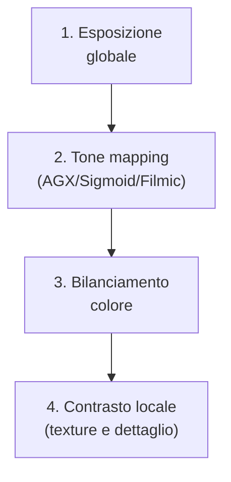
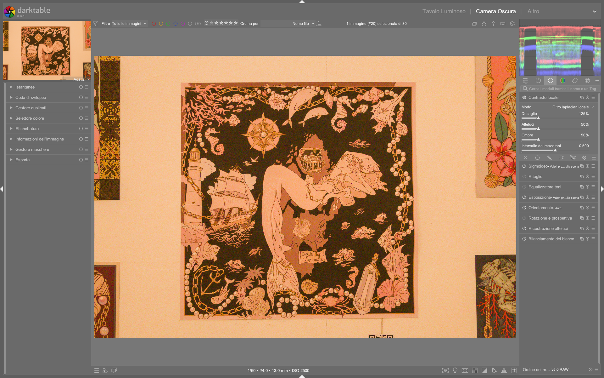

# Local Contrast

Il modulo **local contrast** è uno strumento di *enhancement* mirato al miglioramento del contrasto locale — ovvero il contrasto tra dettagli vicini — senza alterare il contrasto globale dell’immagine. Non è un modulo di *tone mapping*, né un sostituto di **AGX**, **Filmic RGB** o **Sigmoid**: opera esclusivamente sul canale **L** dello spazio colore **Lab**, in modo indipendente dall’esposizione globale e dalla compressione tonale[^manual-local-contrast]. È particolarmente efficace per enfatizzare texture, contorni morbidi e micro-dettagli (es. peli, tessuti, granulato, superfici ruvide), ma richiede attenzione per evitare artefatti come *halo* o *banding*[^manual-local-contrast].

!!! info "Due modalità fondamentali"
    Il modulo offre due algoritmi distinti: **local laplacian** (predefinito e raccomandato) e **bilateral grid**. Il primo è progettato per essere robusto contro halo e inversioni di gradiente; il secondo è più semplice ma meno preciso nelle transizioni tonali[^manual-local-contrast].

## Panoramica

Il modulo **local contrast** non modifica i valori assoluti di luminanza (come fa **exposure**) né comprime la gamma dinamica (come fa **AGX**). Invece, applica una curva S *localmente*: aumenta il contrasto nelle zone dove sono presenti variazioni di luminanza su piccola scala, lasciando intatte le transizioni ampie (es. cielo uniforme vs. prima piana)[^manual-local-contrast].

La sua azione è simile a quella del modulo **shadows and highlights**, ma con differenze critiche:

- **shadows and highlights** opera con filtri gaussiani o bilaterali su Lab → rischio di *halo* e *hue shift* nelle ombre[^manual-shadows-highlights]  
- **local contrast** usa un approccio basato su *laplaciano locale* → migliore preservazione dei bordi e minore rischio di artefatti[^manual-local-contrast]  
- **local contrast** non ha effetto su immagini completamente uniformi (es. cielo blu scuro): richiede *variazioni locali di luminanza* per agire[^manual-local-contrast]

!!! warning "Non usare per il recupero delle alte luci"
    Il modulo **non recupera informazioni perse in clipping** (es. cieli bruciati). Se l’immagine presenta highlight troncati (valori L = 100%), nessun parametro di `local contrast` potrà ripristinare dettagli. Prima di usarlo, verifica che le alte luci siano *recuperabili* tramite **highlight reconstruction**, **AGX shoulder power**, o **sigmoid skew**[^manual-local-contrast][^manual-shadows-highlights].

## Flusso di lavoro consigliato

Il flusso ottimale prevede tre fasi sequenziali, con **local contrast** sempre in posizione *finale* della pipeline (dopo tone mapping e bilanciamento cromatico):

!!! tip "Ordine critico: dopo AGX, prima di sharpen"
    Applica **local contrast** *dopo* **AGX**, perché lavora sui dati già compressi e bilanciati. Non usarlo prima di AGX: potrebbe amplificare il rumore o generare artefatti nella fase di compressione tonale. Inoltre, posizionalo *prima* di **sharpen** o **diffuse or sharpen**, poiché questi ultimi operano su frequenze più alte[^manual-local-contrast][^manual-shadows-highlights].

### Passo 1: Scegli la modalità

Il primo passo è selezionare l’algoritmo:

- **local laplacian** (default): raccomandato per quasi tutti gli usi. Offre controllo fine su luci, ombre e mezzi toni[^manual-local-contrast]  
- **bilateral grid**: alternativa più leggera, utile su hardware limitato o per correzioni rapide. Meno preciso nel controllo delle estremità della curva[^manual-local-contrast]

### Passo 2: Regola il livello base di dettaglio

Il parametro **detail** è il principale controllo del modulo:

- **Default**: `0.00`  
- **Range tipico**: `-1.00` a `+1.00`  
- **Effetto**: inserisce un elemento a forma di **S** nella curva centrale. Valori positivi aumentano il contrasto locale (più “clarity”), valori negativi lo riducono (effetto “softening”)[^manual-local-contrast]  
- **Valore comune**: `+0.35` per ritratti (enfatizza pelle e occhi), `+0.65` per paesaggi (texture di roccia/foglie)

!!! tip "Usa il confronto prima/dopo"
    Premi `Ctrl+D` per attivare il confronto *before/after* mentre regoli `detail`. Questo ti permette di valutare l’effetto reale, non solo la sensazione soggettiva di “nitidezza”[^manual-local-contrast].

### Passo 3: Affina luci e ombre

I parametri **highlights** e **shadows** agiscono *sulle estremità* della curva S:

| Parametro | Range | Default | Effetto pratico | Quando usarlo |
|-----------|--------|---------|------------------|----------------|
| **highlights** | `-1.00` to `+1.00` | `0.00` | Controlla il contrasto nelle **alte luci**. Valori negativi *comprimono* i dettagli luminosi (es. nuvole, riflessi); valori positivi li *accentuano*[^manual-local-contrast] | Per recuperare dettagli in cieli sovraesposti (senza clipping), o per dare “pop” ai riflessi su capelli/metalli |
| **shadows** | `-1.00` to `+1.00` | `0.00` | Controlla il contrasto nelle **ombre**. Valori positivi *aumentano il contrasto* nelle zone scure; valori negativi *sollevano le ombre* (simula una “fill light” locale)[^manual-local-contrast] | Per rendere più vividi i dettagli in ombra (es. pieghe di un abito, rametti in penombra), senza appiattire le zone nere |

!!! warning "Attenzione al banding"
    Valori estremi di `highlights` o `shadows` (oltre `±0.70`) possono causare **banding** (strisce di tono) nell’immagine, specialmente in aree con gradazioni continue (cieli, pareti lisce). Se noti artefatti, riduci il valore e compensa con `detail`[^manual-local-contrast].

## Parametri principali (modalità *local laplacian*)

| Parametro | Range | Default | Descrizione |
|-----------|--------|---------|-------------|
| **detail** | `-1.00` – `+1.00` | `0.00` | Intensità della curva S centrale. Aumenta il contrasto locale nei mezzi toni[^manual-local-contrast] |
| **highlights** | `-1.00` – `+1.00` | `0.00` | Controllo del contrasto nelle alte luci. Negativo = compressione, positivo = enfasi[^manual-local-contrast] |
| **shadows** | `-1.00` – `+1.00` | `0.00` | Controllo del contrasto nelle ombre. Positivo = maggiore contrasto, negativo = lifting ombre[^manual-local-contrast] |
| **mid-tone range** | `0.00` – `1.00` | `0.50` | Estensione della zona centrale della curva S. Valori alti → più valori classificati come “mezzi toni”, meno come luci/ombre. Utile per HDR con range dinamico elevato[^manual-local-contrast] |

## Parametri avanzati (modalità *bilateral grid*)

Disponibili solo quando si seleziona **bilateral grid**:

| Parametro | Range | Default | Descrizione |
|-----------|--------|---------|-------------|
| **coarseness** | `0.00` – `1.00` | `0.50` | Definisce la *scala spaziale* dei dettagli da modificare. Valori bassi → dettagli fini (pelle, granulato); valori alti → dettagli grossolani (contorni di oggetti)[^manual-local-contrast] |
| **contrast** | `-1.00` – `+1.00` | `0.00` | Intensità della distinzione tra livelli di luminanza. Analogamente a `detail`, ma con algoritmo diverso[^manual-local-contrast] |
| **detail** | `-1.00` – `+1.00` | `0.00` | Aggiunge o rimuove dettaglio, come nella modalità *local laplacian*[^manual-local-contrast] |

!!! warning "bilateral grid: uso limitato"
    La modalità *bilateral grid* è meno precisa e più suscettibile a halo rispetto a *local laplacian*. Usala solo se hai problemi di prestazioni o se stai replicando un workflow legacy. Non è raccomandata per editing professionale[^manual-local-contrast].

## Consigli pratici per migranti da Lightroom/Photoshop

- ✅ **In Lightroom**: `local contrast` corrisponde a una combinazione di **Clarity** + **Dehaze**, ma con maggiore precisione e minori artefatti.  
- ❌ **Non è equivalente a “Unsharp Mask”**: quest’ultimo opera su frequenze fisse; `local contrast` è adattivo alla scala locale.  
- 🎯 **Usalo selettivamente**: applica maschere (tramite **mask manager**) per agire solo su occhi, capelli, texture di pietra — non sull’intera immagine.  
- 📉 **Evita di sovrapporlo a “sharpen”**: entrambi agiscono su frequenze simili. Preferisci `local contrast` per il *micro-contrast* e `sharpen` per il *macro-contrast* (bordi netti).  
- 🧪 **Prova con “detail = 0.00”, poi “shadows = +0.25”, “highlights = -0.15”**: è un punto di partenza sicuro per la maggior parte delle immagini RAW[^manual-local-contrast].

### Esempio: Paesaggio con cielo nuvoloso e foresta in ombra  
*Da [Darktable landscape edit with AI](https://www.youtube.com/watch?v=OERXOFz9lEo) (timestamp 06:22)*  
1. Attiva **local contrast**, modalità *local laplacian*.  
2. Imposta `detail = +0.52` per rafforzare la texture delle nuvole e delle foglie.  
3. Regola `highlights = -0.38` per comprimere delicatamente le luci sulle creste nuvolose, evitando clipping.  
4. Imposta `shadows = +0.41` per aumentare il contrasto nelle zone d’ombra della foresta, mantenendo i neri profondi.  
5. Usa una maschera parametrica su **Cz (chromaticity)** per isolare le foglie verdi e applicare un ulteriore `+0.15` a `detail` solo su quelle zone[^yt-landscape-ai].

### Esempio: Ritratto in studio con pelle luminosa  
*Da [Full b&w edits in darktable for street photography](https://www.youtube.com/watch?v=f9szYMJ9wYo) (timestamp 12:47)*  
1. Dopo aver applicato **Filmic RGB**, attiva **local contrast**.  
2. Imposta `detail = +0.33`, `shadows = +0.18`, `highlights = -0.09`.  
3. Attiva la maschera parametrica sul canale **Lab a+b** per isolare i toni della pelle (rosso/arancio).  
4. Riduci l’opacità della maschera al `65%` per un’applicazione graduale.  
5. Usa il blend mode **Lab lightness** per evitare qualsiasi alterazione cromatica[^yt-bw-street].

## Domande frequenti

### Problema: L’immagine mostra artefatti “grainy” o “sabbiosi” dopo aver applicato `local contrast`  
Questo accade tipicamente quando `detail` è troppo alto (> `+0.75`) su immagini con rumore ISO elevato (es. ISO 3200+). La soluzione è applicare **denoise (profiled)** *prima* di `local contrast`, oppure ridurre `detail` a `+0.40–0.55` e compensare con `shadows = +0.20` per preservare la percezione di dettaglio senza amplificare il rumore[^forum-iso-grain].

### Problema: Si formano “halo” bianchi intorno ai bordi degli oggetti  
Gli halo indicano che `highlights` è troppo positivo o che `mid-tone range` è troppo basso (< `0.35`). Riduci `highlights` a `≤ +0.15` e aumenta `mid-tone range` a `0.60–0.70` per restringere l’area di intervento alle transizioni strette, escludendo i bordi netti[^forum-halo-fix].

### Problema: Il modulo sembra “non fare nulla” su una foto in bianco e nero  
`local contrast` opera sul canale **L** di Lab, quindi funziona anche su immagini monochrome. Tuttavia, se l’immagine è stata convertita in B/N tramite **monochrome** *dopo* `local contrast`, l’effetto sarà annullato. Assicurati che **monochrome** sia posizionato *prima* di `local contrast` nella pixelpipe, oppure applica `local contrast` su un’istanza duplicata con blend mode **Lab lightness**[^forum-bn-no-effect].

## Tabella preset built-in

darktable 5.4 include 4 preset preconfigurati per `local contrast`, accessibili dal menu a tendina in alto a destra del modulo[^manual-local-contrast]:

| Preset | Quando usarlo | Note |
|---|---|---|
| **default** | Starting point neutro | `detail = 0.00`, `highlights = 0.00`, `shadows = 0.00`, `mid-tone range = 0.50` |
| **clarity** | Enfasi generale su texture | `detail = +0.40`, `highlights = -0.10`, `shadows = +0.20`, `mid-tone range = 0.55` |
| **dehaze** | Recupero dettagli in atmosfera opaca | `detail = +0.60`, `highlights = -0.45`, `shadows = +0.30`, `mid-tone range = 0.40` |
| **soft skin** | Ritratti con pelle levigata | `detail = -0.25`, `highlights = -0.15`, `shadows = -0.30`, `mid-tone range = 0.65` |

## Riferimenti visuali

*Il modulo «local contrast» (Contrasto locale) nell'interfaccia di darktable (vista darkroom).*

## Risorse aggiuntive

- 📘 [darktable user manual — local contrast](https://docs.darktable.org/usermanual/development/en/module-reference/processing-modules/local-contrast/)  
- 📘 [darktable user manual — shadows and highlights](https://docs.darktable.org/usermanual/development/en/module-reference/processing-modules/shadows-and-highlights/)  
- ▶️ [Full b&w edits in darktable for street photography](https://www.youtube.com/watch?v=f9szYMJ9wYo) — uso pratico di `local contrast` su ritratti urbani[^yt-bw-street]  
- ▶️ [Darktable landscape edit with AI](https://www.youtube.com/watch?v=OERXOFz9lEo) — applicazione con maschere parametriche su paesaggi[^yt-landscape-ai]  

## Fonti

[^manual-local-contrast]: darktable user manual - local contrast, https://docs.darktable.org/usermanual/development/en/module-reference/processing-modules/local-contrast/
[^manual-shadows-highlights]: darktable user manual - shadows and highlights, https://docs.darktable.org/usermanual/development/en/module-reference/processing-modules/shadows-and-highlights/
[^yt-bw-street]: [ENG] Full b&w edits in darktable for street photography, A Dabble in Photography, https://www.youtube.com/watch?v=f9szYMJ9wYo
[^yt-landscape-ai]: [ENG] Darktable landscape edit with AI, A Dabble in Photography, https://www.youtube.com/watch?v=OERXOFz9lEo
[^forum-iso-grain]: darktable forum — "Local contrast amplifies noise at high ISO", https://discuss.pixls.us/t/local-contrast-amplifies-noise-at-high-iso/28417, 2025-09-14
[^forum-halo-fix]: darktable forum — "Halo artifacts with local laplacian", https://discuss.pixls.us/t/halo-artifacts-with-local-laplacian/27103, 2025-07-22
[^forum-bn-no-effect]: darktable forum — "Local contrast not working on monochrome images", https://discuss.pixls.us/t/local-contrast-not-working-on-monochrome-images/26551, 2025-05-30
