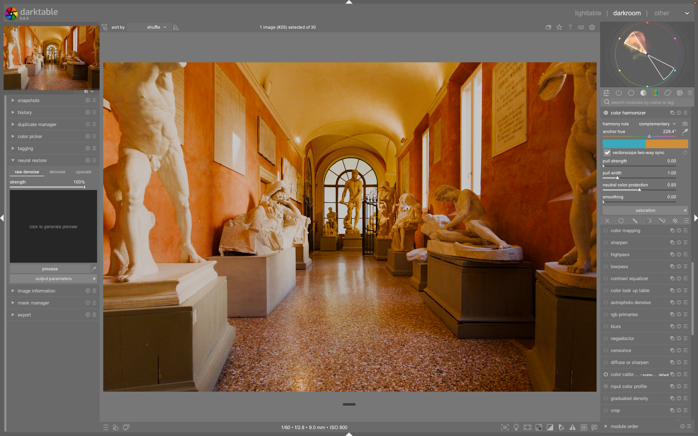

# Neural Restore

Il modulo **neural restore**, aggiunto in darktable 5.6, utilizza l'intelligenza artificiale per applicare restauri avanzati alle immagini selezionate, supportando tre funzioni principali: riduzione del rumore RAW, riduzione del rumore RGB e upscaling (super-risoluzione) 2x o 4x. Disponibile sia nella vista *Lighttable* che nella *Darkroom*, genera un nuovo file (DNG o TIFF) lasciando intatto l'originale.[^manual-nr]

!!! info "Prerequisiti essenziali"
    Per utilizzare questo modulo, è necessario abilitare le funzionalità AI nelle *Preferenze* e attivare un modello specifico per ogni task (`rawdenoise`, `denoise` o `upscale`). Se nessun modello è attivo per la scheda corrente, il pulsante di elaborazione sarà disabilitato.[^manual-nr]

## Panoramica

Neural restore gestisce il flusso di lavoro AI attraverso un'interfaccia a schede (tabs) che definisce il tipo di operazione da eseguire. Ogni scheda produce un output diverso e interagisce con la pipeline di darktable in momenti diversi:[^manual-nr]

1.  **Raw Denoise**: Applica la denoise AI all'inizio della pipeline RAW. Il risultato viene salvato come DNG (Bayer CFA o LinearRaw a seconda del sensore) e può essere re-importato come un normale RAW.[^manual-nr]
2.  **Denoise**: Applica la denoise RGB machine-learning sull'immagine già sviluppata. Il risultato viene salvato come TIFF con tutte le modifiche "baked-in".[^manual-nr]
3.  **Upscale**: Esegue un upscaling super-risoluzione (2x o 4x) dell'immagine elaborata, salvando il risultato come TIFF.[^manual-nr]

Il modulo include un pannello di anteprima interattivo *before/after* e sfrutta l'accelerazione GPU se disponibile per velocizzare le operazioni.[^manual-nr]

## Flusso di lavoro consigliato

A differenza dei classici moduli di darktable, Neural restore è un modulo "utility" che crea nuovi file. La scelta della scheda dipende dalla fase del tuo flusso di lavoro:[^manual-nr]

### 1. Raw Denoise (Prima dell'editing)

Utilizza questa scheda quando sai già che lo scatto è rumoroso (alto ISO, scarsa luce) e non hai ancora iniziato l'editing. È l'approccio più pulito perché rimuove il rumore alla fonte sui dati del sensore.[^manual-nr]

**Flusso tipico:**
1.  Seleziona il RAW rumoroso nella *Lighttable*.
2.  Esegui *raw denoise*: viene creato un DNG raggruppato con l'originale.
3.  Apri il nuovo DNG e editalo normalmente.

!!! warning "Limitazione sensori Monocromatici"
    I sensori monocromatici non sono attualmente supportati dalla scheda *raw denoise* poiché i modelli sono addestrati su dati CFA a colori. Per le immagini monocromatiche, utilizzare invece la scheda *denoise*.[^manual-nr]

### 2. Denoise (Dopo l'editing)

Utilizza questa scheda quando hai già sviluppato l'immagine e il rumore è visibile nel risultato finale. Evita di dover rifare tutto l'editing.[^manual-nr]

**Flusso tipico:**
1.  Sviluppa l'immagine fino al passaggio che commuta la pipeline da *scene-referred* a *display-referred* (es. *filmic rgb*, *sigmoid*, *AgX*) e qualsiasi correzione colore.
2.  Esegui *denoise*: viene creato un TIFF con l'edit applicato e il rumore ripulito.
3.  Continua l'editing sul TIFF (es. sharpening, aggiustamenti locali) o consegnalo direttamente.

### 3. Upscale (Ultimo step prima della consegna)

Utilizza questa scheda per ingrandire l'immagine per la stampa o display di grandi dimensioni. Non eseguire l'upscale all'inizio del flusso, poiché le elaborazioni successive (nitidezza, gradazione) opererebbero sui pixel sintetici riducendo la qualità.[^manual-nr]

**Flusso tipico:**
1.  Finalizza l'edit, inclusi sharpening e gradazione.
2.  Esegui *upscale* (2x o 4x): viene creato un TIFF della dimensione richiesta.
3.  Usa l'output per la stampa.

## Parametri principali

I parametri variano a seconda della scheda (tab) selezionata.

### Parametri delle Schede

| Parametro | Scheda | Range/Opzioni | Descrizione |
|-----------|--------|---------------|-------------|
| **Strength** | Raw Denoise | 0% - 100% | Blend lineare tra il RAW sorgente (0%) e l'output AI (100%) a livello di sensore. Valori più bassi mantengono parte del rumore originale.[^manual-nr] |
| **Strength** | Denoise | 0% - 100% | A 100% l'output è il risultato completo del modello AI. Valori più bassi non fanno un semplice blend: la differenza viene decomposta in bande di dettaglio wavelet (DWT) e le texture ad alta frequenza vengono ripristinate selettivamente, recuperando grana e dettaglio senza reintrodurre il rumore cromatico rimosso dal modello.[^manual-nr] |
| **Scale** | Upscale | 2x, 4x | Fattore di ingrandimento applicato a ogni lato dell'immagine. 2x raddoppia larghezza e altezza (4x pixel totali), 4x quadruplica i lati (16x pixel totali). 4x è significativamente più lento e richiede più memoria GPU.[^manual-nr] |

### Parametri di Output (Output Parameters)

Questi controllano come il risultato viene scritto su disco e si applicano a qualsiasi task attivo.[^manual-nr]

| Parametro | Opzioni | Descrizione |
|-----------|---------|-------------|
| **Bit depth** | 8 bit, 16 bit, 32 bit (float) | Profondità di bit del file TIFF di output (solo per schede *denoise* e *upscale*).[^manual-nr] |
| **Profile** | Varie | Profilo colore incorporato nel TIFF di output. *image settings* usa il profilo di lavoro dell'immagine sorgente (solo per *denoise* e *upscale*).[^manual-nr] |
| **Preserve wide-gamut colors** | On/Off | Se attivo, i pixel con colori fuori gamut sRGB passano attraverso il modello invariati (preservati esattamente ma non denoisati). Se spento, ogni pixel è denoisato ma i colori wide-gamut possono essere clippati a sRGB (solo *denoise*).[^manual-nr] |
| **Add to the current collection** | On/Off | Importa automaticamente l'output in darktable quando viene scritto. La nuova immagine viene raggruppata con la sorgente.[^manual-nr] |
| **Output folder** | Percorso file | Directory dove scrivere il file. Supporta le variabili di darktable (es. `$(FILE_FOLDER)` scrive accanto al file sorgente).[^manual-nr] |

## Anteprima e Elaborazione

### Anteprima (Preview)

Sotto i controlli delle schede è presente un'anteprima divisa *before/after* di una piccola porzione dell'immagine. Trascina il divisore per passare dall'originale (sinistra) all'output AI (destra). L'anteprima viene generata su richiesta cliccando sull'area.[^manual-nr]

!!! tip "Esplorazione dell'anteprima"
    Per scegliere un'area diversa dell'immagine, clicca il pulsante *picker* (a destra di *process*) e poi clicca all'interno del widget di anteprima. Passando il mouse sopra l'anteprima si ottiene una vista ingrandita (tooltip 2x) utile per valutare il rumore pixel-per-pixel.[^manual-nr]

### Process

Il pulsante **process** esegue il task attivo su tutte le immagini attualmente selezionate. Il progresso è riportato nella barra di stato. Se un modello non è attivo, il pulsante rifiuta di partire. Se l'esecuzione fallisce su un'immagine specifica, questa viene saltata e il batch continua con le successive.[^manual-nr]

!!! tip "Performance e GPU"
    Il tempo di elaborazione dipende dal backend di accelerazione AI, dalla risoluzione e dal task. *Raw denoise* e *upscale 4x* sono i più impegnativi. La prima esecuzione dopo l'avvio di darktable include un costo di compilazione del grafo. L'uso della GPU è fortemente consigliato per ridurre i tempi.[^manual-nr]

## Note tecniche specifiche

### Gestione Sensori (Raw Denoise)

Il comportamento del *raw denoise* varia in base al tipo di sensore:[^manual-nr]

*   **Sensori Bayer**: La denoise viene applicata direttamente sul mosaico CFA, combinando denoise e demosaic in un singolo passaggio di inferenza. Risultato: DNG Bayer CFA.
*   **Sensori X-Trans** (e altri CFA a colori non-Bayer): L'immagine viene prima demosaicata dalla pipeline di darktable, quindi il denoiser AI opera sull'immagine RGB lineare risultante (Rec.2020). Risultato: DNG LinearRaw.

### Upscaling 4x

L'upscale 4x è molto più impegnativo per il modello rispetto al 2x, poiché deve inventare 16 volte più pixel di dettaglio rispetto all'originale. Le texture fini e i contenuti ad alta frequenza possono risultare meno convincenti rispetto al 2x; si consiglia di usare il 2x quando soddisfa i requisiti di risoluzione.[^manual-nr]

## Riferimenti visuali

*Il modulo Neural Restore nell'interfaccia di darktable (vista darkroom).*

## Risorse e Fonti

Per approfondire i dettagli tecnici e la configurazione delle preferenze AI:

*   **Manuale Utente darktable - Neural Restore**: https://docs.darktable.org/usermanual/development/en/module-reference/utility-modules/shared/neural-restore/[^manual-nr]
*   **Panoramica funzionalità AI**: https://docs.darktable.org/usermanual/development/en/special-topics/ai/overview/[^manual-nr]
*   **Accelerazione GPU**: https://docs.darktable.org/usermanual/development/en/special-topics/ai/gpu-acceleration/[^manual-nr]
*   **Preferenze AI**: https://docs.darktable.org/usermanual/development/en/preferences-settings/ai/[^manual-nr]

[^manual-nr]: https://docs.darktable.org/usermanual/development/en/module-reference/utility-modules/shared/neural-restore/
