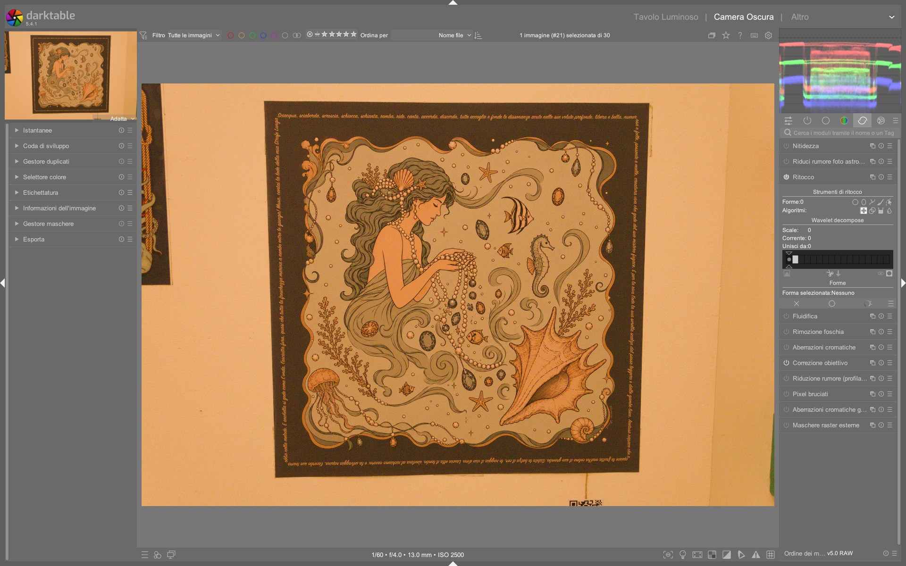

# Modulo Retouch

Il modulo **retouch** è lo strumento centrale per la rimozione selettiva di elementi indesiderati (macchie, fili, sensor dust, riflessi) e per il ritocco avanzato della pelle, del cielo o di altre aree critiche. A partire da darktable 4.8, sostituisce definitivamente il modulo deprecato *spot removal*, integrando clonazione, guarigione (*heal*), riempimento (*fill*) e sfocatura (*blur*) in un’unica interfaccia modulare, con supporto nativo alla **decomposizione wavelet** per un controllo multilivello dei dettagli[^darktable-usermanual-retouch][^pixls-wavelet].

!!! info "Retouch è il modulo di ritocco avanzato predefinito"
    Dal 2019, *retouch* è il modulo ufficiale per tutte le operazioni di rimozione e correzione locale. Il vecchio *spot removal* è stato rimosso dalla pipeline in darktable 4.6+ e non è più disponibile nei nuovi profili di sviluppo[^darktable-usermanual-retouch][^darktable-fr-2023-12].

## Panoramica

Retouch opera su due livelli concettuali distinti ma complementari:

1. **Rimozione geometrica**: tramite forme disegnate (*circle*, *ellipse*, *path*, *brush*) che definiscono l’area da modificare (*target*) e quella da cui attingere dati (*source*).  
2. **Elaborazione multilivello**: grazie alla decomposizione wavelet, permette di applicare gli stessi interventi su scale di dettaglio separate — dai bordi grossolani (livelli 5–6) alle texture fini della pelle (livelli 1–2) — senza alterare i dettagli non coinvolti[^darktable-usermanual-retouch][^pixls-wavelet].

A differenza di Lightroom’s Spot Removal o Photoshop’s Healing Brush, *retouch* non lavora su un singolo layer piatto: ogni livello wavelet è elaborato indipendentemente e poi ricomposto matematicamente, preservando la struttura reale dell’immagine[^pixls-wavelet]. Questo evita l’effetto “plastico” tipico dei metodi a sfocatura globale, come dimostrato nell’articolo PIXLS.US su *Mairi*, dove la pelle mantiene pori e rughe naturali anche dopo una marcata omogeneizzazione tonale[^pixls-wavelet].

## Flusso di lavoro consigliato

Il flusso ottimale per ritocchi professionali si articola in tre fasi sequenziali[^pixls-wavelet][^darktable-usermanual-retouch]:

```
1. Esposizione & bilanciamento colore (exposure, white balance, color calibration)
   |
2. Decomposizione wavelet (modulo retouch → sezione "wavelet decompose")
   |
3. Ritocco selettivo per scala (cloning/healing su livelli 4–6; blur su livelli 1–3)
```

!!! tip "Wavelet prima di tutto"
    Esegui sempre la decomposizione wavelet **prima** di qualsiasi intervento di ritocco. Se applichi *clone* o *heal* direttamente sull’immagine non decomposta, perderai il controllo sulle frequenze e rischierai di appiattire dettagli critici come capelli, barba o trame tessili[^pixls-wavelet][^darktable-usermanual-retouch].

### Passo 1: Configurazione wavelet

La prima azione pratica è impostare il numero di livelli wavelet:

- Clicca sul triangolo sotto la barra grafica *wavelet decompose* e trascinalo verso destra[^darktable-usermanual-retouch]  
- **Valore tipico**: `5` livelli per immagini full-frame (4000×6000 px); `4` per immagini APS-C (3000×4500 px)[^pixls-wavelet]  
- **Default**: `0` (nessuna decomposizione attiva) — **non usare mai questo valore per ritocchi seri**[^darktable-usermanual-retouch]

### Passo 2: Selezione della scala

Dopo aver impostato i livelli, seleziona quello da modificare:

- Clicca su uno dei quadrati grigi nella barra:  
  - **Quadrati a sinistra** = dettagli fini (livelli 1–2, ~1–3 px di raggio)  
  - **Quadrati a destra** = dettagli grossolani (livelli 4–6, ~10–50 px di raggio)[^darktable-usermanual-retouch]  
- Usa *preview single scale* per visualizzare esclusivamente quel livello, con auto-levels abilitato per migliorare la visibilità[^darktable-usermanual-retouch]

!!! warning "Non saltare la preview"
    Senza *preview single scale*, non puoi valutare se un livello contiene effettivamente il difetto da correggere (es. una macchia su livello 5 ma non su livello 2). L’errore più comune è applicare *heal* su una scala sbagliata, generando artefatti invisibili in anteprima ma evidenti in stampa[^pixls-wavelet].

### Passo 3: Algoritmo e forma

Scegli l’algoritmo in base al tipo di difetto:

| Algoritmo | Quando usarlo | Valore tipico |
|-----------|----------------|----------------|
| **Heal** | Macchie di pelle, brufoli, piccoli oggetti su sfondo uniforme | `mask opacity`: 0.7–0.9[^darktable-usermanual-retouch] |
| **Clone** | Oggetti su sfondi strutturati (es. fili su cielo nuvoloso) | `mask opacity`: 1.0[^darktable-usermanual-retouch] |
| **Blur** | Omogeneizzazione di texture (es. pelle su livello 1–2) | `blur radius`: 1.5–4.0 px; `blur type`: *bilateral*[^pixls-wavelet] |
| **Fill** | Rimozione di oggetti su sfondi solidi (es. cavi su parete bianca) | `fill color`: campionato con pipetta; `brightness`: ±0.05[^darktable-usermanual-retouch] |

## Parametri principali

| Parametro | Range | Default | Descrizione |
|-----------|--------|---------|-------------|
| **scales** | `0` – `8` | `0` | Numero totale di livelli wavelet estratti. Ogni livello rappresenta una banda di frequenza distinta[^darktable-usermanual-retouch]. |
| **current** | `0` – `max_scale` | `0` | Livello wavelet attualmente selezionato per l’editing. `0` = immagine completa (senza decomposizione)[^darktable-usermanual-retouch]. |
| **merge from** | `0` – `max_scale` | `0` | Se > `0`, tutti gli interventi su un livello vengono replicati sui livelli inferiori fino a questo valore. Utile per correggere un difetto su più scale con un solo tratto[^darktable-usermanual-retouch]. |
| **mask opacity** | `0.0` – `1.0` | `1.0` | Opacità della maschera applicata. Valori < `1.0` consentono una fusione graduale con il sottostante[^darktable-usermanual-retouch]. |
| **blur radius** | `0.1` – `10.0` px | `1.0` px | Raggio dello sfocatura per l’algoritmo *blur*. Valori > `3.0` richiedono *merge from* per evitare effetti “a macchia”[^pixls-wavelet]. |
| **blur type** | `gaussian`, `bilateral` | `gaussian` | *Bilateral* preserva i bordi; preferito per ritocchi cutanei su livelli fini[^pixls-wavelet]. |
| **fill mode** | `erase`, `color` | `color` | In modalità *erase*, il colore di riempimento è calcolato come media dell’area circostante[^darktable-usermanual-retouch]. |

## Gestione source/target

Per garantire risultati naturali, la posizione di *source* e *target* deve essere controllata con precisione:

- **Source in “relative mode”**: `Shift + click` sul punto di origine → il simbolo `+` si fissa *relativamente* al cursore. Successivi *target* erediteranno lo stesso offset[^darktable-usermanual-retouch].  
- **Source in “absolute mode”**: `Ctrl + Shift + click` → il simbolo `+` si fissa in coordinate assolute, utile per copiare da una zona precisa (es. una porzione di cielo blu uniforme)[^darktable-usermanual-retouch].  
- **Posizionamento simultaneo**: per *circle*/*ellipse*, clicca e trascina dal *target* al *source* in un’unica azione[^darktable-usermanual-retouch].

!!! tip "Regola d’oro per il healing"
    Per un *heal* efficace, la distanza tra *source* e *target* non deve superare i **50 px**. Oltre questo limite, il mismatch di illuminazione e colore genera bordi visibili[^pixls-wavelet].

## Flusso di lavoro per la pelle (caso studio)

Basato sull’approccio *Mairi* di PIXLS.US[^pixls-wavelet]:

1. **Decomponi in 5 livelli** → seleziona *current = 4* (dettagli medi, ~10 px)  
2. **Applica *heal*** su macchie e discromie con `mask opacity = 0.85`  
3. **Passa a *current = 2*** (texture fine) → usa *blur* con `radius = 2.2 px`, `type = bilateral` per ammorbidire pori senza eliminare rughe  
4. **Usa *merge from = 2*** per propagare il *blur* anche su livello 1 (massima finezza)  
5. **Controlla con *preview single scale***: livello 4 mostra la correzione tonale, livello 2 conferma che la texture è preservata[^pixls-wavelet]

## Walkthrough da video tutorial

### Esempio: Skin retouching with wavelet decomposition (Bruce Williams, darktable FR)
*Da [darktable ep 027 - The Retouch module](https://darktable.fr/posts/2019/01/darktable-ep-027-the-retouch-module/) (timestamp 8:12)*  
1. Imposta `scales = 5` e attiva *preview single scale*  
2. Seleziona *current = 5* (livello più grosso) e usa *heal* per rimuovere discromie tonali con `mask opacity = 0.82`  
3. Passa a *current = 3*, imposta `blur radius = 1.8`, `blur type = bilateral`, e applica su zone di transizione tra guance e fronte  
4. Attiva *merge from = 2* e disegna un cerchio su *current = 2* per uniformare pori senza toccare rughe  
5. Disattiva *preview single scale* e verifica il risultato su zoom 100%[^darktable-fr-2019-01]

### Esempio: Retouche beauté avec décomposition en ondelettes (JC Tutos, darktable FR)
*Da [Tuto N° 18 : Le module RETOUCHE . 2éme partie](https://darktable.fr/posts/2019/01/tuto-n-18-le-module-retouche-2eme-partie-decomposition-en-ondelettes-pour-la-retouche/) (timestamp 12:47)*  
1. Per ritoccare occhi rossi: seleziona *current = 6*, usa *heal* con `mask opacity = 0.95`, *source* campionato da sclera vicina  
2. Per ridurre occhiaie: passa a *current = 4*, imposta `blur radius = 2.5`, `blur type = gaussian`, e applica con maschera ellittica verticale  
3. Per preservare ciglia: disattiva *merge from*, quindi applica *clone* su *current = 1* con `mask opacity = 0.35`  
4. Verifica con *display masks* attivo per assicurarsi che nessuna maschera copra le ciglia[^darktable-fr-2019-01-tuto18-2]

### Esempio: Portrait skin smoothing workflow (PIXLS.US Mairi)
*Da [Skin Retouching with Wavelet Decompose](https://pixls.us/articles/skin-retouching-with-wavelet-decompose/) (fig. “Mairi Wavelet Decompose Smooth 5 by Pat David”)*  
1. Decomponi in `5 scales`, seleziona *current = 5*  
2. Applica *blur* con `radius = 3.2`, `type = bilateral`, `mask opacity = 0.88` su guance e fronte  
3. Passa a *current = 2*, usa *heal* con `mask opacity = 0.75` per macchie isolate  
4. Su *current = 0* (immagine completa), applica *fill* con `brightness = +0.03` per uniformare luminosità globale della pelle[^pixls-wavelet]

## Domande frequenti

### Problema: Maschera *heal* lascia un alone scuro intorno al target
Questo accade quando *source* e *target* hanno differenze di esposizione > 0.3 EV. Soluzione: usare *relative mode* con `Shift+click`, quindi spostare il *target* in una zona con luminosità simile prima di applicare l’intervento. Alternativamente, applicare *heal* su *current = 5* (dove le differenze di luminosità sono attenuate) invece che su livello completo[^darktable-usermanual-retouch].

### Problema: Effetto “plastico” persistente anche con wavelet
Spesso causato da *blur radius > 4.0 px* applicato su *current = 1* o *2* senza *merge from*. La soluzione è limitare *blur radius* a ≤ 3.0 px su livelli fini, oppure usare *merge from = 1* solo per interventi molto localizzati[^pixls-wavelet].

### Problema: Forme *path* non si chiudono correttamente su curve complesse
Il modulo *retouch* richiede almeno 4 punti per chiudere un *path* in modo stabile. Se la curva è troppo stretta (< 15° di angolo interno), aggiungere manualmente un punto intermedio con `Ctrl+click` sul segmento. Non utilizzare *path* per bordi con raggi < 5 px: preferire *brush* con `size = 3.0` e *opacity = 0.4`[^darktable-usermanual-retouch].

## Consigli avanzati

- **Per il cielo**: usa *clone* su livello 5–6 con *source* da una zona priva di nubi, quindi applica *blur* leggero (`radius = 1.0`) su livello 3 per fondere i bordi[^darktable-fr-2023-12].  
- **Per i capelli**: evita *heal* o *blur*. Usa *clone* su livello 1 con `mask opacity = 0.3` per un effetto trasparente che preservi i singoli filamenti[^pixls-wavelet].  
- **Per le alte luci**: se un riflesso è presente solo su livelli alti (5–6), correggilo *solo lì*: non propagarlo a livelli più fini, altrimenti distruggeresti dettagli cromatici[^darktable-usermanual-retouch].  
- **Tempi di rendering**: la decomposizione wavelet aumenta il carico CPU. Per immagini ad alta risoluzione (>24 MP), riduci i livelli a `4` o abilita *OpenCL* nelle preferenze[^darktable-fr-2023-12].

!!! warning "Parametri da evitare"
    I seguenti valori compromettono la qualità del risultato:  
    - `merge from > current` — causa duplicazione non controllata degli interventi[^darktable-usermanual-retouch]  
    - `blur radius > 5.0 px` senza *merge from* — genera macchie sfocate isolate[^pixls-wavelet]  
    - `mask opacity < 0.3` per *heal* su pelle — produce effetti “fantasma” difficili da correggere[^pixls-wavelet]

## Preset built-in

Il modulo *retouch* include preset preconfigurati accessibili tramite il pulsante *presets* (icona a tre puntini) nel pannello superiore. I preset ufficiali sono:

| Preset | Quando usarlo | Note |
|---|---|---|
| `skin smoothing` | Ritocco pelle rapido | Imposta `scales = 5`, `current = 4`, `algorithm = heal`, `mask opacity = 0.85`[^darktable-usermanual-retouch] |
| `sky cleanup` | Rimozione fili/nubi su cielo | Imposta `scales = 6`, `current = 6`, `algorithm = clone`, `mask opacity = 1.0`[^darktable-usermanual-retouch] |
| `portrait blemish` | Correzione brufoli/macosce | Imposta `scales = 5`, `current = 5`, `algorithm = heal`, `mask opacity = 0.9`[^darktable-usermanual-retouch] |
| `fine detail preservation` | Capelli, barba, trame tessili | Imposta `scales = 5`, `current = 1`, `algorithm = clone`, `mask opacity = 0.25`[^darktable-usermanual-retouch] |

## Riferimenti visuali


*Il modulo «retouch» (Ritocco) nell'interfaccia di darktable (vista darkroom).*

## Risorse aggiuntive

- 📘 **Manuale ufficiale darktable – retouch**  
  [https://docs.darktable.org/usermanual/development/en/module-reference/processing-modules/retouch/](https://docs.darktable.org/usermanual/development/en/module-reference/processing-modules/retouch/)  
- 📺 **Video tutorial: Skin Retouching with Wavelet Decompose (PIXLS.US)**  
  [https://pixls.us/articles/skin-retouching-with-wavelet-decompose/](https://pixls.us/articles/skin-retouching-with-wavelet-decompose/)  
- 📺 **Tutorial FR: Le module RETOUCHE – décomposition en ondelettes**  
  [https://darktable.fr/posts/2019/01/tuto-n-18-le-module-retouche-2eme-partie-decomposition-en-ondelettes-pour-la-retouche/](https://darktable.fr/posts/2019/01/tuto-n-18-le-module-retouche-2eme-partie-decomposition-en-ondelettes-pour-la-retouche/)  
- 📺 **Video tutorial ENG: The diffuse and sharpen module (A Dabble in Photography)**  
  [https://www.youtube.com/watch?v=jHlPh7gt3Y0](https://www.youtube.com/watch?v=jHlPh7gt3Y0)  

## Fonti

[^darktable-usermanual-retouch]: darktable user manual - retouch, https://docs.darktable.org/usermanual/development/en/module-reference/processing-modules/retouch/#
[^pixls-wavelet]: PIXLS.US - Skin Retouching with Wavelet Decompose, https://pixls.us/articles/skin-retouching-with-wavelet-decompose/
[^darktable-fr-2023-12]: darktable.fr – Nouveautés darktable 4.6 (FR), https://darktable.fr/posts/2023/12/darktable_4.6/
[^darktable-fr-2019-01]: darktable.fr – Tuto N° 18 : Le module RETOUCHE . 2ème partie : DECOMPOSITION EN ONDELETTES, https://darktable.fr/posts/2019/01/tuto-n-18-le-module-retouche-2eme-partie-decomposition-en-ondelettes-pour-la-retouche/  
[^darktable-fr-2019-01-tuto18-2]: darktable.fr – Tuto N° 18 : Le module RETOUCHE . 2ème partie (video timestamp 12:47), https://darktable.fr/posts/2019/01/tuto-n-18-le-module-retouche-2eme-partie-decomposition-en-ondelettes-pour-la-retouche/
