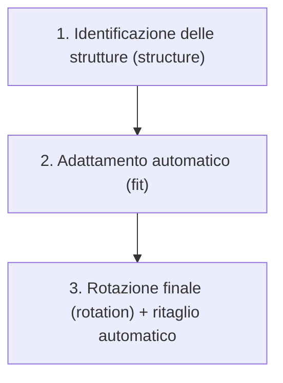
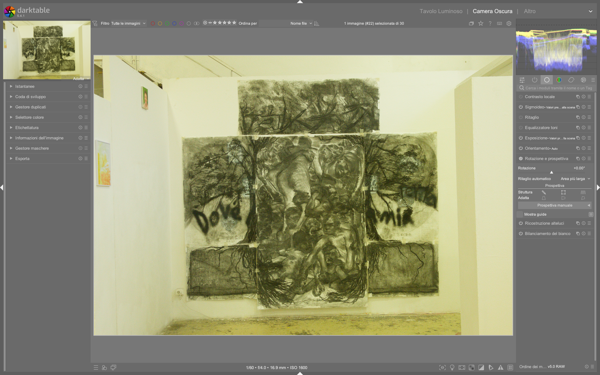

# Rotate and Perspective

Il modulo **rotate and perspective** è lo strumento principale di darktable per la correzione geometrica avanzata: raddrizza orizzonti, corregge linee convergenti (effetto “palazzo che cade”), e applica trasformazioni di tipo *lens shift* ispirate agli obiettivi tilt-shift. Basato sull’algoritmo di Markus Hebel (*ShiftN*), opera in uno spazio scene-referred e supporta sia correzioni automatiche basate su rilevamento strutturale che interventi manuali precisi[^manual-48-rotate].

!!! info "Il modulo è nascosto per default"
    I controlli prospettici sono compressi sotto l’intestazione **perspective**, visibile solo dopo aver cliccato sul titolo del modulo. Questa scelta riflette il fatto che la rotazione è l’uso più comune, mentre la correzione prospettica richiede un workflow più articolato[^manual-48-rotate].

## Panoramica

Il modulo gestisce due tipi di trasformazioni distinte ma correlate:

1. **Rotazione**: correzione angolare intorno al centro dell’immagine, utile per orizzonti inclinati o composizioni non allineate.
2. **Correzione prospettica**: deformazione non lineare per rendere parallele linee che *dovrebbero* esserlo nella realtà (es. facciate di edifici, binari ferroviari). Questa operazione richiede:
   - Identificazione di strutture (linee verticali/orizzontali)
   - Fitting automatico dei parametri di trasformazione
   - Eventuale regolazione manuale dei risultati

A differenza del modulo *crop and rotate*, che opera con una semplice trasformazione affine (rotazione + ritaglio), `rotate and perspective` utilizza una trasformazione proiettiva completa che include *shear*, *lens shift* verticale/orizzontale e compensazione della distorsione geometrica[^manual-48-rotate].

## Flusso di lavoro consigliato

Il workflow ideale segue tre fasi sequenziali, con priorità alla precisione strutturale prima di ogni rotazione finale:

### Passo 1: Definizione delle strutture

Prima di qualsiasi correzione, devi fornire al modulo informazioni sulle linee che definiscono la geometria della scena. Tre metodi sono disponibili:

| Metodo | Come funziona | Quando usarlo | Note tecniche |
|--------|----------------|----------------|----------------|
| **Automatic detection** | Analisi automatica di segmenti lineari nell’immagine tramite edge detection | Scene con chiare linee architettoniche (edifici, finestre, strade) | Usa `Shift+click` per contrast enhancement e `Ctrl+click` per edge enhancement se il rilevamento fallisce[^manual-48-rotate]. Linee verdi = verticali convergenti; blu = orizzontali convergenti. |
| **Draw structure lines** | Disegno manuale di linee con il mouse: trascina per creare segmenti | Strutture parziali o degradate (es. facciate parzialmente oscurate) | Le linee vengono classificate automaticamente come verticali (verdi) o orizzontali (blu). Più linee → migliore fitting[^manual-48-rotate]. |
| **Draw perspective rectangle** | Disegno di un rettangolo con angoli modificabili | Correzioni keystone precise (es. facciate frontali) | Gli angoli del rettangolo definiscono le linee da rendere parallele — analogo al comportamento del modulo *crop and rotate*[^manual-48-rotate]. |

### Passo 2: Adattamento automatico (Fit)

Una volta definite le strutture, clicca uno dei pulsanti **fit** per calcolare i parametri ottimali:

| Pulsante | Azione | Effetto pratico | Note |
|----------|--------|------------------|------|
| **Vertical** | `[icon-vertical]` | Applica solo `lens shift (vertical)` | Corregge linee cadenti (es. edifici fotografati dal basso) senza alterare l’orizzonte[^manual-48-rotate]. |
| **Horizontal** | `[icon-horizontal]` | Applica solo `lens shift (horizontal)` | Corregge linee che si allargano verso l’alto (es. soffitti, pavimenti) — raro ma utile in interni[^manual-48-rotate]. |
| **Both** | `[icon-both]` | Applica `lens shift (vertical)` + `lens shift (horizontal)` + `shear` | Correzione completa per immagini con convergenza su entrambi gli assi. Richiede `shear` per mantenere la coerenza geometrica[^manual-48-rotate]. |

!!! tip "Ctrl+click e Shift+click sui pulsanti fit"
    - `Ctrl+click`: applica **solo la rotazione**, ignorando il lens shift  
    - `Shift+click`: applica **solo il lens shift**, ignorando la rotazione  
    Questo ti permette di separare i due effetti per un controllo fine[^manual-48-rotate].

### Passo 3: Rotazione finale e ritaglio

Dopo il fitting, regola manualmente il parametro **rotation** per affinare l’allineamento (es. orizzonte perfetto). Infine, abilita **automatic cropping** per rimuovere i bordi neri creati dalla deformazione:

| Opzione | Comportamento | Valore tipico | Note |
|---------|----------------|----------------|------|
| **Largest area** | Ritaglia al massimo possibile, sacrificando il rapporto d’aspetto | Default per editing rapido | Produce il maggior numero di pixel utilizzabili[^manual-48-rotate]. |
| **Original format** | Mantiene il rapporto d’aspetto originale, centrando il ritaglio | Consigliato per stampa o pubblicazione | Puoi trascinare manualmente la regione di ritaglio dopo l’applicazione[^manual-48-rotate]. |

!!! warning "Problemi noti con auto-crop"
    Su alcune versioni (5.5.0+), `automatic cropping` può disabilitarsi automaticamente dopo una rotazione con click-drag, mostrando il messaggio *“automatic cropping failed”* nei log[^pixls-auto-crop]. Questo bug è documentato ma non ancora risolto. Soluzione immediata: riattivare manualmente la casella.

## Parametri principali

| Parametro | Range | Default | Descrizione |
|-----------|-------|---------|-------------|
| **rotation** | -180° a +180° | 0.00° | Angolo di rotazione intorno al centro. Il limite soft è ±10°: oltre, richiede click destro per inserimento manuale[^manual-48-rotate]. |
| **lens shift (vertical)** | -1.000 a +1.000 | 0.000 | Correzione verticale: valori positivi spostano le linee verticali verso il centro (corregge “caduta”). Valori >0.9 possono produrre artefatti[^manual-48-rotate]. |
| **lens shift (horizontal)** | -1.000 a +1.000 | 0.000 | Correzione orizzontale: meno usato, utile per soffitti o pavimenti in interni. |
| **shear** | -1.000 a +1.000 | 0.000 | Deformazione diagonale necessaria quando si applicano entrambi i lens shift. Se non impostato, l’immagine appare “stirata”[^manual-48-rotate]. |
| **automatic cropping** | `off` / `largest area` / `original format` | `off` | Abilita il ritaglio automatico post-correzione. Fondamentale per evitare bordi neri[^manual-48-rotate]. |
| **lens model** | `generic` / `specific` | `generic` | Imposta i parametri ottici: `generic` assume 28mm su full-frame. `specific` richiede `focal length` e `crop factor` per maggiore accuratezza[^manual-48-rotate]. |
| **focal length** | 10–200 mm | preso da EXIF | Solo se `lens model = specific`. Valore predefinito estratto dai metadati RAW[^manual-48-rotate]. |
| **crop factor** | 1.0 (full-frame) a 2.7 (micro 4/3) | 1.00 | Solo se `lens model = specific`. Cruciale per calcoli geometrici precisi[^manual-48-rotate]. |
| **aspect adjust** | -1.000 a +1.000 | 0.000 | Regolazione manuale del rapporto d’aspetto. Utile per anamorfici o correzioni estreme[^manual-48-rotate]. |

## Workflow avanzato: correzione manuale e precisione

Per massimizzare il controllo, segui questo approccio iterativo:

1. **Attiva `show guides`**: visualizza griglie sovrapposte (regola dei terzi, spirale aurea) per valutare l’allineamento visivo[^manual-48-rotate].
2. **Usa il click-drag per rotazione**: con il modulo attivo, clic destro + trascina su qualsiasi punto dell’immagine per disegnare una linea orizzontale/verticale. La rotazione viene adattata in tempo reale per renderla parallela al bordo dell’immagine[^manual-48-rotate].
3. **Rifai il fitting dopo modifiche manuali**: se regoli `lens shift` o `shear` manualmente, clicca nuovamente su un pulsante `fit` per ricalcolare i parametri ottimali in base alle tue modifiche.
4. **Verifica con zoom 100%**: le deformazioni prospettiche sono critiche nei dettagli. Controlla sempre bordi, finestre, cornici a ingrandimento massimo.

!!! tip "Perché non usare solo crop and rotate?"
    Il modulo *crop and rotate* esegue una semplice trasformazione affine (rotazione + ritaglio). `rotate and perspective`, invece, applica una trasformazione proiettiva che mantiene le relazioni geometriche reali tra linee parallele. È indispensabile per architettura, interior design e fotografia tecnica dove la precisione geometrica è prioritaria[^manual-48-rotate].

## Esempi pratici da tutorial video

### Esempio: correzione prospettica su edificio curvo (CCTV Tower)
*Da [ENG] darktable Full edit #1 (min. 7:20)*[^yt-full-edit]  
1. Apri l’immagine di un edificio curvo (es. CCTV Tower di Pechino) con evidente convergenza verticale.  
2. Attiva `rotate and perspective`, clicca su **structure** → **draw structure lines**, quindi disegna 6–8 linee verticali lungo i bordi degli edifici.  
3. Clicca il pulsante **Vertical** (icona verde): `lens shift (vertical)` si imposta automaticamente a `+0.317`.  
4. Regola manualmente `rotation` a `+0.14°` per allineare l’orizzonte.  
5. Abilita `automatic cropping` → `original format`, quindi trascina la regione di ritaglio per includere il tetto senza tagliare i dettagli laterali[^yt-full-edit].

### Esempio: correzione di una facciata frontale con rettangolo prospettico
*Da [ENG] darktable 3.8 What is new? (min. 2:15)*[^yt-38]  
1. Attiva `rotate and perspective`, clicca su **structure** → **draw perspective rectangle**.  
2. Disegna un rettangolo che racchiuda la facciata: posiziona i 4 angoli sui bordi superiori/inferiori e sinistri/destri della struttura.  
3. Clicca **Both**: `lens shift (vertical)` = `+0.241`, `lens shift (horizontal)` = `-0.089`, `shear` = `+0.102`.  
4. Attiva `show guides` e seleziona **grid** → **rule of thirds** per allineare visivamente la composizione.  
5. Disattiva `automatic cropping`, verifica i bordi con zoom 100%, quindi riattivalo solo alla fine[^yt-38].

### Esempio: correzione di interni con convergenza orizzontale
*Da [ENG] Lowlight photos in darktable (min. 12:45)*[^yt-lowlight]  
1. Carica un’immagine di un soffitto con linee che divergono verso l’alto (convergenza orizzontale).  
2. Attiva `structure` → **automatic detection**, poi `Ctrl+click` sul pulsante **get structure** per applicare edge enhancement.  
3. Clicca **Horizontal**: `lens shift (horizontal)` = `-0.173` (valore negativo perché le linee divergono verso l’alto).  
4. Aumenta leggermente `shear` a `+0.042` per bilanciare la deformazione e preservare la proporzione delle finestre.  
5. Usa `rotation` a `-0.32°` per correggere un leggero inclinamento residuo dell’asse centrale[^yt-lowlight].

## Domande frequenti

### Problema: `automatic cropping` si disattiva dopo una rotazione con click-drag
Questo comportamento è documentato come bug in darktable 5.5.0+. Il sistema interpreta erroneamente la rotazione interattiva come un’operazione che invalida la regione di ritaglio calcolata. La soluzione è riattivare manualmente la casella `automatic cropping` dopo ogni modifica interattiva[^pixls-auto-crop].

### Problema: il rilevamento automatico non trova linee sufficienti su immagini con poca texture
Applica `Shift+click` sul pulsante **get structure**, che esegue un contrast enhancement preliminare, oppure combina `Shift+click` e `Ctrl+click` per attivare sia contrast che edge enhancement. In casi estremi, passa al disegno manuale con **draw structure lines**, tracciando almeno 5 linee per asse[^manual-48-rotate].

### Problema: artefatti di interpolazione ai bordi dopo correzione con `lens shift > 0.8`
Valori superiori a `±0.8` causano stretching dei pixel e perdita di nitidezza. Riduci `lens shift (vertical)` a `+0.750`, aumenta `shear` a `+0.120` per compensare la deformazione, quindi applica `local contrast` con `clarity = 12` solo sulla zona centrale usando una maschera ellittica[^yt-full-edit].

## Consigli operativi

- **Non esagerare con il lens shift**: valori superiori a `±0.8` producono artefatti di interpolazione (pixel “stirati”) e perdita di dettaglio ai bordi. Se necessario, combina con un leggero `shear` per mitigare l’effetto[^manual-48-rotate].
- **Usa `lens model = specific` per fotografia professionale**: inserisci manualmente lunghezza focale e crop factor (es. `24mm`, `1.5` per APS-C) per migliorare la precisione del fitting, soprattutto con obiettivi grandangolari[^manual-48-rotate].
- **Disattiva `automatic cropping` durante il fitting**: abilitalo solo alla fine, per poter valutare l’intera immagine deformata prima del ritaglio definitivo.
- **Salva preset per scenari ricorrenti**: crea preset con `lens model = specific` + `focal length` preimpostato per il tuo obiettivo fisso (es. “24mm Architectural”).

### Preset built-in del modulo

darktable fornisce preset preconfigurati per semplificare l’uso frequente. Questi sono accessibili dal menu hamburger del modulo:

| Preset | Quando usarlo | Note |
|---|---|---|
| **Architectural (vertical only)** | Fotografia di edifici da basso con caduta verticale marcata | Imposta `lens shift (vertical)` a `+0.500`, `shear = 0.000`, `rotation = 0.00°` |
| **Interior (horizontal only)** | Correzione di soffitti o pavimenti in ambienti chiusi | Imposta `lens shift (horizontal)` a `-0.150`, `shear = 0.000`, `rotation = 0.00°` |
| **Keystone correction** | Immagini frontali di facciate con convergenza su entrambi gli assi | Imposta `lens shift (vertical)` = `+0.300`, `lens shift (horizontal)` = `-0.080`, `shear` = `+0.060` |

## Riferimenti visuali

*Il modulo «rotate and perspective» (Rotazione e prospettiva) nell'interfaccia di darktable (vista darkroom).*

## Risorse aggiuntive

- [darktable User Manual — rotate and perspective](https://docs.darktable.org/usermanual/development/en/module-reference/processing-modules/rotate-perspective/) — Documentazione ufficiale completa[^manual-48-rotate]
- [Auto-crop from 'rotate and perspective' being disabled](https://discuss.pixls.us/t/auto-crop-from-rotate-and-perspective-being-disabled/57031) — Discussione tecnica su bug noti in dt 5.5+[^pixls-auto-crop]
- [ENG] darktable Full edit #1 — Esempio pratico di correzione prospettica su edificio urbano (min. 7:20)[^yt-full-edit]
- [ENG] darktable 3.8 What is new? — Spiegazione della riorganizzazione logica dei moduli *Crop*, *Rotate*, *Perspective*[^yt-38]

## Fonti

[^manual-48-rotate]: darktable user manual - rotate and perspective, https://docs.darktable.org/usermanual/development/en/module-reference/processing-modules/rotate-perspective/#
[^pixls-auto-crop]: Auto-crop from 'rotate and perspective' being disabled - darktable - discuss.pixls.us, https://discuss.pixls.us/t/auto-crop-from-rotate-and-perspective-being-disabled/57031
[^yt-full-edit]: [ENG] darktable Full edit #1, https://www.youtube.com/watch?v=DzdGL30lYjU (min. 7:20)
[^yt-38]: [ENG] darktable 3.8 What is new?, https://www.youtube.com/watch?v=5smugZ5pXN0 (min. 1:00–4:00)
[^yt-lowlight]: [ENG] Lowlight photos in darktable, https://www.youtube.com/watch?v=O7wXgmQZqiU (min. 12:45)
