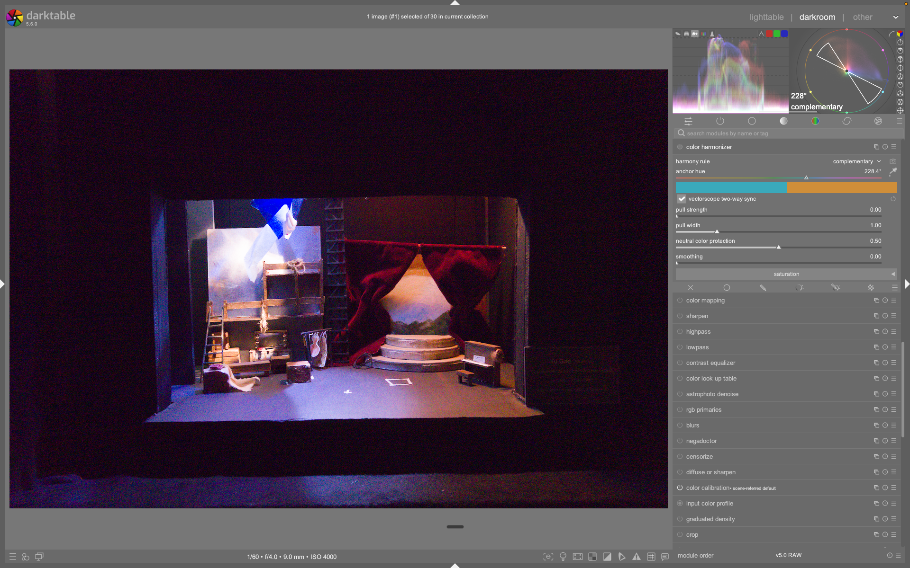

# Scopes

Il modulo **scopes** è un modulo diagnostico e di controllo visivo che fornisce rappresentazioni grafiche della distribuzione luminosa e cromatica dell’immagine in tempo reale[^scopes-manual]. Non modifica i pixel direttamente, ma consente di valutare oggettivamente esposizione, bilanciamento del bianco, saturazione e armonia cromatica. È posizionato nella barra laterale (di default a destra) ed è calcolato sui dati della *preview*, non sull’immagine finale ad alta risoluzione[^scopes-manual].

!!! info "Scopes lavora sulla preview, non sull’immagine finale"
    I dati visualizzati sono derivati dalla preview — una versione ridotta e ottimizzata per prestazioni — e possono differire in dettaglio o precisione rispetto all’immagine sviluppata definitiva[^scopes-manual]. Questo comportamento è intenzionale per garantire fluidità interattiva.

## Panoramica

Il modulo scopes offre **cinque modalità di visualizzazione**, ciascuna con finalità specifiche:

| Modalità | Funzione principale | Contesto d’uso tipico |
|----------|---------------------|------------------------|
| **Histogram** | Distribuzione dei pixel per livello di luminanza (0–100%) nei canali RGB | Valutazione globale dell’esposizione e del contrasto; identificazione di clipping nelle alte luci o nelle ombre[^scopes-manual] |
| **Waveform** | Distribuzione spaziale della luminanza: asse orizzontale = asse x dell’immagine, asse verticale = luminanza | Controllo dell’esposizione locale (es. cielo vs. primo piano); analisi della composizione luminosa[^scopes-manual] |
| **RGB Parade** | Tre waveform separate (R, G, B), allineate orizzontalmente o verticalmente | Confronto diretto dell’intensità relativa dei canali; rilevamento di dominanti cromatiche o squilibri nel bilanciamento del bianco[^scopes-manual] |
| **Vectorscope** | Rappresentazione della *cromaticità* (tonalità + saturazione), indipendentemente dalla luminanza | Analisi della purezza cromatica, valutazione dell’armonia colore, supporto alla correzione selettiva[^scopes-manual] |
| **Split (waveform/vectorscope)** | Visualizzazione affiancata di waveform e vectorscope | Workflow integrato: monitorare contemporaneamente luminanza spaziale e distribuzione cromatica[^scopes-manual] |

Tutte le modalità condividono controlli comuni:  
- Pulsanti a sinistra per selezionare la modalità attiva  
- Pulsanti a destra per abilitare/disabilitare singoli canali (R/G/B) e alternare scala logaritmica/lineare sull’asse Y (istogramma e waveform)[^scopes-manual]  
- Regolazione dell’altezza del modulo tramite trascinamento del bordo inferiore o con `Shift+Alt+scroll`[^scopes-manual]  
- Visibilità toggleabile con scorciatoia predefinita `Ctrl+Shift+H`[^scopes-manual]

## Flusso di lavoro consigliato

Il modulo scopes è usato principalmente in tre fasi distinte del flusso di lavoro:

### Passo 1: Valutazione iniziale (prima di modificare)
- Apri l’immagine in darkroom  
- Attiva il **histogramma** per verificare se ci sono clipping (picchi a 0% o 100%)  
- Passa al **vectorscope** in spazio colore **RYB** per ispezionare la distribuzione cromatica prima di qualsiasi correzione[^scopes-manual]  

### Passo 2: Regolazione diretta dell’esposizione
Il **histogramma**, il **waveform** e il **RGB parade** permettono di regolare *direttamente* i parametri del modulo **exposure** tramite interazione grafica[^scopes-manual]:

| Modalità | Area cliccabile | Azione | Comportamento |
|----------|----------------|--------|----------------|
| **Histogram** | Destra (alto) | Trascina → aumenta esposizione | Modifica `exposure` nel modulo exposure[^scopes-manual] |
| **Histogram** | Sinistra (basso) | Trascina → alza il black point | Modifica `black` nel modulo exposure[^scopes-manual] |
| **Waveform/Parade (orizzontale)** | Parte superiore | Trascina su/giù | Aumenta/diminuisce `exposure`[^scopes-manual] |
| **Waveform/Parade (orizzontale)** | Parte inferiore | Trascina su/giù | Aumenta/diminuisce `black`[^scopes-manual] |
| **Waveform/Parade (verticale)** | Destra | Trascina su/giù | Aumenta/diminuisce `exposure`[^scopes-manual] |
| **Waveform/Parade (verticale)** | Sinistra | Trascina su/giù | Aumenta/diminuisce `black`[^scopes-manual] |

!!! tip "Precisione e override"
    - Usa `Ctrl+click` per regolazione fine  
    - Usa `Ctrl+Shift+click` per ignorare i limiti soft (es. sovraesposizione estrema)  
    - `Doppio click` ripristina il valore originale[^scopes-manual]  

### Passo 3: Armonia cromatica (vectorscope avanzato)
Solo nel **vectorscope** in spazio **RYB**, sono disponibili strumenti aggiuntivi per l’armonia colore[^scopes-manual]:

- **Color harmony overlays**: Triad, tetrad, complementary, analogous, monochromatic — attivabili tramite pulsanti sul bordo destro del modulo[^scopes-manual]  
- **Rotazione degli overlay**: Rotellina del mouse (più lenta con `Ctrl`, più ampia con `Shift`)  
- **Salvataggio automatico**: Il tipo e la rotazione dell’overlay vengono salvati nell’XMP e nel database per ogni immagine[^scopes-manual]  

Per usarli:  
1. Usa il **global color picker** per campionare aree chiave dell’immagine  
2. Abilita la visualizzazione dei campioni sul vectorscope RYB  
3. Seleziona un tipo di armonia e ruotalo finché i campioni cadono *dentro o vicino* alle guide  
4. Correggi i colori con moduli come **color balance rgb**, **color calibration**, o maschere selettive[^scopes-manual]  

!!! warning "Limitazioni importanti"
    - Il cerchio cromatico ("hue ring") **non è un gamut check**: un colore dentro il cerchio può essere fuori gamut se troppo scuro o luminoso[^scopes-manual]  
    - Il vectorscope **non ha una “linea dei toni della pelle”**: questa è una generalizzazione non scientifica[^scopes-manual]  
    - Per calibrazione precisa con chart, usa **color calibration → calibrate with a color checker**, non il vectorscope[^scopes-manual]  

## Parametri principali

I controlli variano a seconda della modalità attiva. I parametri condivisi sono:

| Parametro | Descrizione | Note |
|-----------|-------------|------|
| **Canale R/G/B** | Pulsanti a destra per mostrare/nascondere singoli canali | Disponibile in histogram, waveform, parade, split[^scopes-manual] |
| **Scala logaritmica/lineare** | Primo pulsante a destra: commuta la scala verticale (conteggio pixel) | Migliora la visibilità di valori bassi in presenza di picchi alti[^scopes-manual] |
| **Orientamento waveform/parade** | Pulsante a destra: commuta tra modalità orizzontale e verticale | Utile per immagini in formato ritratto[^scopes-manual] |
| **Spazio colore vectorscope** | Pulsante più a destra: commuta tra **CIELUV**, **JzAzBz**, **RYB** | CIELUV: più veloce; JzAzBz: più percettivamente accurato; RYB: necessario per gli overlay di armonia[^scopes-manual] |
| **Scala cromatica** | Secondo pulsante da destra (vectorscope): lineare/logaritmica | Migliora la leggibilità di bassa saturazione[^scopes-manual] |

## Gestione avanzata

### Posizionamento del modulo
Il modulo scopes può essere spostato da destra a sinistra tramite:  
- **Preferenze → Miscellaneous → position of the scopes module**  
  Valori accettati: `right` (default) o `left`[^scopes-manual][^tethering-layout][^video-organising]  

### Profilo dell’istogramma
I dati sono convertiti nel **histogram profile** prima del calcolo. Questo profilo è influenzato da:  
- Stato del modulo **soft-proof** o **gamut check** (se attivi, lo scope usa quel profilo)  
- Spazio colore del display: profili "non ben comportati" (es. profili dispositivo) possono causare clipping/distorsione[^scopes-manual]  

### Prestazioni e limitazioni
- Calcolato esclusivamente sulla preview → *non sostituisce* la verifica finale sull’immagine ad alta qualità  
- Non supporta maschere: mostra sempre l’intera immagine visibile[^scopes-manual]  
- Non è un modulo di elaborazione: nessun parametro modifica direttamente i dati pixel[^scopes-manual]  

## Riferimenti visuali

*Il modulo Scopes nell'interfaccia di darktable (vista darkroom).*

## Risorse aggiuntive

- [darktable user manual – scopes](https://docs.darktable.org/usermanual/development/en/module-reference/utility-modules/shared/scopes/)  
- [darktable user manual – manage module layouts](https://docs.darktable.org/usermanual/development/en/darkroom/organization/manage-module-layouts/)  
- [darktable user manual – tethering view layout](https://docs.darktable.org/usermanual/development/en/tethering/tethering-view-layout/)  
- [Video tutorial: organising the darkroom](https://www.youtube.com/watch?v=CtVJKLyMMYA)  

## Fonti

[^scopes-manual]: darktable user manual - scopes, URL: https://docs.darktable.org/usermanual/development/en/module-reference/utility-modules/shared/scopes/#
[^tethering-layout]: darktable user manual - tethering view layout, URL: https://docs.darktable.org/usermanual/development/en/tethering/tethering-view-layout/#
[^video-organising]: [ENG] darktable: organising the darkroom, URL: https://www.youtube.com/watch?v=CtVJKLyMMYA
