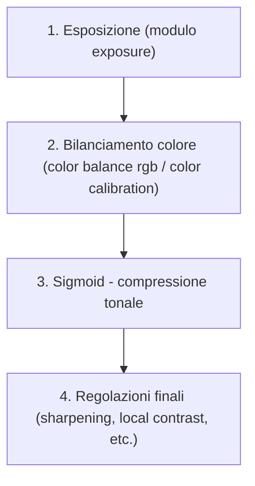
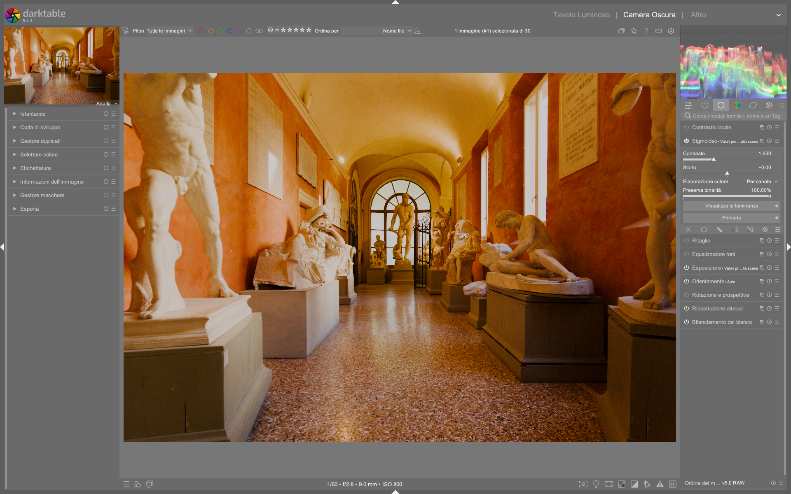

# Tone Mapping: Sigmoid

Il modulo **sigmoid** è un tone mapper basato su una curva log-logistica generalizzata, progettato per mappare la gamma dinamica *scene-referred* (illimitata) nel range limitato del display (0–100%) senza introdurre shift cromatici indesiderati[^sigmoid-manual]. È uno dei tre moduli principali di compressione tonale in darktable — insieme a `filmic rgb` e `agx` — e rimane particolarmente apprezzato per la sua semplicità, prevedibilità e controllo fine sulle transizioni tonali, specialmente in ritratti e immagini con ampie zone di pelle o cielo uniforme[^filmic-sigmoid-p4][^sigmoid-fr].

!!! info "Sigmoid è un modulo *display transform*"
    Sigmoid opera nella fase *display-referred* della pipeline: tutti i moduli posti **prima** di sigmoid lavorano in spazio scene-referred (dati RAW non compressi); tutti quelli **dopo** operano su dati già mappati al display. Non va mai usato insieme a `filmic rgb` o `base curve`[^sigmoid-manual].

## Panoramica

Sigmoid applica una curva S modificata (sigmoidale) per comprimere la luminanza, con due parametri fondamentali che ne definiscono il comportamento:

1. **Contrast**: regola la pendenza centrale della curva, determinando l’impatto visivo del contrasto globale senza spostare i punti di nero/bianco.
2. **Skew**: sposta il baricentro della curva verso le luci (valori positivi) o le ombre (valori negativi), consentendo di trasferire contrasto da una zona all’altra *senza alterare il contrasto al grigio medio*[^sigmoid-manual][^filmic-sigmoid-p3].

A differenza di `filmic rgb`, sigmoid non include controlli nativi per la gestione della saturazione o del gamut: la conservazione del colore avviene principalmente attraverso la scelta della modalità di elaborazione (`per channel` vs `rgb ratio`) e l’opzione `preserve hue`[^sigmoid-manual]. Questo lo rende più “puro” come strumento di mappatura tonale, ma richiede un’integrazione consapevole con moduli successivi come `color balance rgb` o `color calibration` per la gestione cromatica.

## Flusso di lavoro consigliato

Il flusso ottimale con sigmoid segue rigorosamente la gerarchia della pipeline scene-referred[^sigmoid-manual]:

!!! tip "Regola d'oro: esponi prima, mappa dopo"
    Sigmoid non recupera informazioni perse. L’esposizione deve essere corretta *prima* di attivare sigmoid: il modulo presuppone che i dati in ingresso siano già bilanciati e correttamente esposti[^sigmoid-manual][^filmic-sigmoid-p3].

### Passo 1: Impostazione del grigio medio

Prima di toccare sigmoid, usa il modulo `exposure` per portare un’area neutra dell’immagine (es. una superficie grigia al 18%) al valore di luminanza corrispondente. Il metodo più affidabile è:

- Attiva lo strumento `area picker` (icona del rettangolo nel modulo `exposure`)
- Seleziona un’area rappresentativa del grigio medio (non troppo chiara né troppo scura)
- Clicca su “set middle gray” → darktable regolerà automaticamente `exposure` per portare quel punto a ~50% L (LCh) o 18% riflettanza[^filmic-sigmoid-p3].

### Passo 2: Contrasto

Il parametro **Contrast** agisce sulla pendenza della regione lineare centrale della curva sigmoidale[^sigmoid-manual]:

- **Default**: `1.00`
- **Range tipico**: `0.70 – 2.00`
- **Valore comune per paesaggi**: `1.30 – 1.60`
- **Valore comune per ritratti**: `0.90 – 1.20` (evita transizioni troppo marcate sulla pelle)[^sigmoid-manual]

!!! warning "Contrasto > 1.80 richiede attenzione"
    Valori superiori a `1.80` possono causare posterizzazione nelle ombre e perdita di dettaglio nelle luci, specialmente se combinati con skew elevato[^sigmoid-manual].

### Passo 3: Skew

Il parametro **Skew** controlla l’asimmetria della curva: sposta il punto di massimo contrasto lungo l’asse delle esposizioni[^sigmoid-manual][^filmic-sigmoid-p3].

| Valore | Effetto pratico | Uso tipico |
|--------|-----------------|------------|
| `0.00` | Curva simmetrica, massimo contrasto al grigio medio | Default, immagini bilanciate |
| `+0.30` | Contrasto spostato verso le luci; ombre più morbide, luci più incisive | Paesaggi con cieli brillanti o soggetti retroilluminati |
| `-0.25` | Contrasto spostato verso le ombre; luci più dolci, ombre più definite | Ritratti in luce soffusa, interni con dettagli nelle ombre |

!!! warning "Skew > +0.50 o < -0.40 è sconsigliato per ritratti"
    Valori estremi creano transizioni dure nella pelle e possono generare artefatti cromatici (es. viraggio giallo-arancio nei rossi saturi) quando `preserve hue` è disattivato[^sigmoid-manual].

## Parametri principali

| Parametro | Range | Default | Descrizione |
|-----------|-------|---------|-------------|
| **Contrast** | `0.10 – 5.00` | `1.00` | Pendenza della curva nella regione centrale. Aumenta il contrasto globale senza spostare i punti di nero/bianco[^sigmoid-manual]. |
| **Skew** | `-1.00 – +1.00` | `0.00` | Asimmetria della curva. Valori positivi accentuano le luci; valori negativi enfatizzano le ombre[^sigmoid-manual]. |
| **Color processing** | `per channel`, `rgb ratio` | `per channel` | Modalità di applicazione della curva: `per channel` agisce su RGB separatamente (più potente, ma può alterare l’Hue); `rgb ratio` mantiene i rapporti RGB (preserva meglio il colore, ma meno flessibile)[^sigmoid-manual]. |
| **Preserve hue** *(solo in `per channel`)* | `0% – 100%` | `100%` | Livello di conservazione della tonalità spettrale. `100%` ≈ comportamento di `rgb ratio`; `0%` = massima distorsione cromatica (utile per effetti “caldi” in tramonti)[^sigmoid-manual]. |
| **Target black** | `0.00 – 0.10` | `0.00` | Valore minimo di output (nero). Di solito lasciato a `0.00`. Valori > `0.01` producono un effetto “faded”[^sigmoid-manual]. |
| **Target white** | `0.90 – 1.10` | `1.00` | Valore massimo di output (bianco). `1.00` = bianco puro. Valori < `0.98` evitano clipping cromatico in luci intense[^sigmoid-manual]. |

## Parametri avanzati: Primaries

Espandendo la sezione *Primaries*, si accede a controlli specifici per la gestione cromatica *prima* della mappatura tonale — analoghi a quelli presenti in `filmic rgb` e `agx`, ma con finalità più tecniche[^sigmoid-manual].

| Parametro | Funzione | Valore tipico | Fonte |
|-----------|----------|---------------|-------|
| **Red/Green/Blue attenuation** | Riduce la purezza dei canali primari *prima* della curva sigmoidale. Evita clipping cromatico e posterizzazione in aree molto luminose (es. LED blu, luci al neon)[^sigmoid-manual]. | Red: `10–30%`, Green: `0–10%`, Blue: `20–60%` | [^sigmoid-manual] |
| **Red/Green/Blue rotation** | Ruota leggermente la tonalità del canale prima della compressione. Utile per correggere dominanti residue o per affinare il look finale[^sigmoid-manual]. | `±0.5° – ±2.0°` | [^sigmoid-manual] |
| **Recover purity** | Ripristina parzialmente la purezza persa dall’attenuazione. `100%` = ripristino completo; `0%` = nessun ripristino (output garantito entro il gamut delle primaries scelte)[^sigmoid-manual]. | `40% – 80%` | [^sigmoid-manual] |

!!! tip "Perché attenuare *prima* della curva?"
    I colori puri e luminosi tendono a uscire dal gamut del display durante la compressione. Attenuandoli *prima*, li si porta in uno spazio sicuro dove sigmoid può gestirli senza clipping o rotazioni indesiderate dell’Hue[^sigmoid-manual].

## Gestione del colore con Sigmoid

Sigmoid offre due approcci distinti alla conservazione cromatica, selezionabili tramite `Color processing`:

### Modalità `rgb ratio`

- Applica la stessa curva sigmoidale a tutti e tre i canali RGB *in proporzione*, mantenendo costanti i rapporti tra R, G e B.
- Risultato: i colori spettrali (es. un rosso puro) rimangono sulla stessa linea cromatica fino al bianco — desaturazione prevedibile e coerente[^sigmoid-manual].
- Vantaggio: zero hue shift, ideale per immagini tecniche o con colori critici (es. prodotti, architettura).
- Svantaggio: minore flessibilità creativa; luci molto intense possono apparire “lavate”.

### Modalità `per channel` + `preserve hue`

- Applica curve sigmoidali *indipendenti* a ciascun canale RGB.
- Con `preserve hue` a `100%`: simula `rgb ratio` ma con maggiore stabilità numerica.
- Con `preserve hue` a `0–50%`: introduce una distorsione controllata dell’Hue — i rossi diventano arancioni, i blu diventano ciano, i verdi diventano gialli[^sigmoid-manual].  
- Uso tipico: effetti “cinematografici”, tramonti caldi, luci notturne con dominanti artistiche[^sigmoid-fr].

## Consigli operativi

- **Non usare sigmoid insieme ad altri display transforms**: disattiva `filmic rgb` o `base curve` prima di abilitare sigmoid[^sigmoid-manual].
- **Per immagini con alta frequenza cromatica (es. LED, vetrine)**: usa `per channel` + `red/blue attenuation` (20–40%) + `recover purity` (50–70%) per evitare banding e posterizzazione[^sigmoid-manual].
- **Per ritratti**: preferisci `skew = -0.10` a `-0.25` e `contrast = 0.95–1.15`. Evita `skew > +0.15` per non accentuare pori o venature[^sigmoid-manual].
- **Per paesaggi con cieli intensi**: usa `skew = +0.25–+0.40` e `target white = 0.97–0.99` per preservare dettagli senza clipping[^sigmoid-fr].
- **Calibrazione monitor**: sigmoid è sensibile alla gamma del display. Assicurati di usare un profilo ICC corretto e una gamma di riferimento 2.2[^sigmoid-manual].

### Esempio: Calibrazione del grigio medio con area picker  
*Da [Filmic and Sigmoid (Part 3)](https://www.youtube.com/watch?v=LQHFOLAN028) (00:52)*  
1. Apri un’immagine con una superficie neutra ben illuminata (es. carta grigia 18%).  
2. Nel modulo `exposure`, clicca sull’icona del rettangolo (`area picker`).  
3. Disegna un rettangolo di ~100×100 pixel su un’area omogenea e neutra.  
4. Clicca su **“set middle gray”**: darktable imposta automaticamente `exposure` per portare la media LCh a `L ≈ 49.5–50.5`[^filmic-sigmoid-p3].  
5. Verifica con il `color picker` in modalità LCh: il valore `L` dovrebbe essere compreso tra `49.0` e `51.0`[^filmic-sigmoid-p3].

### Esempio: Correzione di luci LED con attenuazione primaria  
*Da [Filmic & Sigmoid Part 4](https://www.youtube.com/watch?v=4KV9Ic-mPj0) (13:15)*  
1. Attiva la sezione *Primaries* in sigmoid e seleziona `per channel`.  
2. Imposta `blue attenuation = 42%`, `red attenuation = 27%`, `green attenuation = 5%`.  
3. Regola `recover purity = 63%` per bilanciare saturazione e gamut.  
4. Usa `blue rotation = +0.8°` per compensare un leggero viraggio ciano nelle luci al neon[^filmic-sigmoid-p4].  
5. Conferma con l’istogramma RGB: i picchi nei canali primari devono essere smorzati, senza tagli netti a destra[^filmic-sigmoid-p4].

### Esempio: Workflow per ritratto in luce soffusa  
*Da [Filmic and Sigmoid (Part 3)](https://www.youtube.com/watch?v=LQHFOLAN028) (10:45)*  
1. Usa `exposure` per impostare il grigio medio della pelle a `L = 52.3` (leggermente chiaro per un look “luminoso”).  
2. Imposta `sigmoid → Contrast = 0.98`, `Skew = -0.18` per preservare i dettagli nelle ombre del viso.  
3. Seleziona `Color processing = per channel` e `Preserve hue = 92%` per minimizzare shift cromatici.  
4. Nella sezione *Primaries*, imposta `red attenuation = 18%`, `blue attenuation = 31%`, `recover purity = 58%` per gestire luci da finestra bluastre[^filmic-sigmoid-p3].  
5. Verifica con il `color picker`: la tonalità della pelle (H in HSL) deve rimanere stabile tra `25°` e `32°` anche nelle zone più illuminate[^filmic-sigmoid-p3].

## Domande frequenti

### Problema: Sigmoid produce banding su cieli uniformi  
Questo fenomeno è tipico quando `Contrast > 1.70` e `Skew > +0.35` sono combinati senza attenuazione. La soluzione è ridurre la pendenza centrale (`Contrast ≤ 1.45`) e applicare `blue attenuation = 35–45%` prima della curva, seguita da `recover purity = 50–60%`[^sigmoid-manual].

### Problema: Le alte luci appaiono “lavate” in modalità `rgb ratio`  
In `rgb ratio`, la desaturazione è forzata lungo linee spettrali, il che può causare una perdita percettiva di “brillantezza”. Per recuperare vivacità, aggiungi un livello di `sharpen` con `radius = 1.2`, `strength = 18%`, e maschera basata su `lightness` con `threshold = 0.75`[^sigmoid-manual].

### Problema: `Preserve hue = 100%` non impedisce shift nei rossi saturi  
Ciò accade perché `preserve hue` opera solo in spazio RGB e non compensa le interazioni cromatiche non lineari alle alte luminanze. La soluzione è attivare `red attenuation = 25%` + `red rotation = -0.6°` nella sezione *Primaries* per stabilizzare la traiettoria cromatica[^sigmoid-manual].

## Preset integrati

darktable 5.4 include preset preconfigurati per sigmoid, accessibili dal menu a tendina in alto a destra del modulo. I preset sono progettati per workflow specifici e funzionano indipendentemente dalla scelta di `Color processing`[^sigmoid-manual].

| Preset | Quando usarlo | Note |
|---|---|---|
| **smooth** | Base per la maggior parte delle immagini (ritratti, paesaggi neutri) | Imposta `Contrast = 1.00`, `Skew = 0.00`, `target white = 1.00`, `target black = 0.00`, e `primaries` ottimizzati per una transizione morbida[^sigmoid-manual]. |
| **high contrast** | Immagini con forte impatto visivo (street photography, reportage) | Imposta `Contrast = 1.65`, `Skew = +0.12`, `target white = 0.985`, `blue attenuation = 33%`[^sigmoid-manual]. |
| **portrait soft** | Ritratti in luce diffusa o studio con fondale neutro | Imposta `Contrast = 0.92`, `Skew = -0.22`, `preserve hue = 95%`, `red attenuation = 15%`[^sigmoid-manual]. |
| **neon lights** | Scene notturne con luci artificiali intense (LED, insegne) | Imposta `Contrast = 1.20`, `Skew = +0.38`, `red attenuation = 28%`, `blue attenuation = 52%`, `recover purity = 45%`[^sigmoid-manual]. |

!!! info "Come applicare un preset"
    Clicca sull'icona a forma di freccia verso il basso (▼) nell’angolo in alto a destra del modulo `sigmoid`. Seleziona il preset desiderato: i parametri verranno caricati immediatamente e applicati in tempo reale[^sigmoid-manual].

## Riferimenti visuali

*Il modulo «sigmoid» (Sigmoideo) nell'interfaccia di darktable (vista darkroom).*

## Risorse aggiuntive

- 📘 **Manuale ufficiale darktable — Sigmoid**  
  [https://docs.darktable.org/usermanual/development/en/module-reference/processing-modules/sigmoid/](https://docs.darktable.org/usermanual/development/en/module-reference/processing-modules/sigmoid/)  
  Documentazione tecnica completa, con descrizioni precise dei parametri e note sulla pipeline[^sigmoid-manual].

- ▶️ **Filmic & Sigmoid Part 4 — Video tutorial (A Dabble in Photography)**  
  [https://www.youtube.com/watch?v=4KV9Ic-mPj0](https://www.youtube.com/watch?v=4KV9Ic-mPj0)  
  Confronto diretto sigmoid vs filmic su immagini reali, con focus su gestione alte luci e curve tonali[^filmic-sigmoid-p4].

- ▶️ **Filmic and Sigmoid (Part 3) — Video tutorial (A Dabble in Photography)**  
  [https://www.youtube.com/watch?v=LQHFOLAN028](https://www.youtube.com/watch?v=LQHFOLAN028)  
  Spiegazione teorica di `contrast` e `skew`, con dimostrazioni pratiche su ritratti e paesaggi[^filmic-sigmoid-p3].

- 🌐 **Comparaison du traitement avec filmique et sigmoid — darktable.fr**  
  [https://darktable.fr/posts/2023/01/comparaison-filmique-v5-sigmoid/](https://darktable.fr/posts/2023/01/comparaison-filmique-v5-sigmoid/)  
  Analisi comparativa in francese, con esempi su 4 immagini RAW diverse[^sigmoid-fr].

## Fonti

[^sigmoid-manual]: darktable user manual - sigmoid, https://docs.darktable.org/usermanual/development/en/module-reference/processing-modules/sigmoid/
[^filmic-sigmoid-p3]: [ENG] Filmic and Sigmoid (Part 3), https://www.youtube.com/watch?v=LQHFOLAN028
[^filmic-sigmoid-p4]: [ENG] Filmic & Sigmoid Part 4, https://www.youtube.com/watch?v=4KV9Ic-mPj0
[^sigmoid-fr]: [EN] Comparaison du traitement avec filmique V5 et sigmoid, https://darktable.fr/posts/2023/01/comparaison-filmique-v5-sigmoid/
