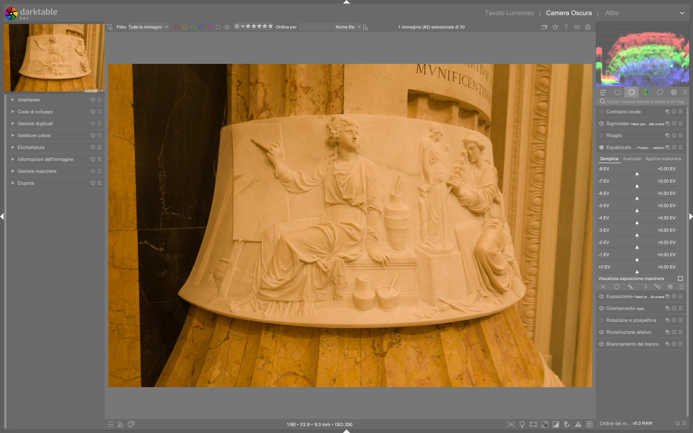

# Tone Equalizer

Il Tone Equalizer opera nel dominio lineare utilizzando una **maschera guidata** che divide l'immagine in zone di luminanza. Il suo cuore è il filtro **EIGF** (Exposure-Independent Guided Filter) che sfuoca la maschera preservando i bordi, evitando aloni[^manual].

## Panoramica

Il Tone Equalizer è un modulo *dodge and burn* avanzato progettato per operare in spazio lineare RGB, sostituendo efficacemente combinazioni di moduli come *shadows and highlights*, *tone curve*, *base curve* e *zone system* (deprecato)[^dt48]. Funziona in sinergia con *filmic rgb*: insieme costituiscono il nucleo della pipeline *scene-referred*, permettendo una compressione dinamica precisa senza appiattire il contrasto locale[^dt48]. A differenza dei classici equalizzatori tonali, non modifica direttamente i pixel, ma agisce tramite una **maschera intermedia** — una versione sfocata e quantizzata dell’immagine stessa — che funge da “mappa di istruzioni” per dove applicare le correzioni di esposizione[^dt48].

Il flusso interno è: *input → guided mask generation → mask post-processing → exposure lookup → output*.

Il modulo è strutturato in tre schede complementari:
- **Simple**: interfaccia a 9 slider (da –8 EV a 0 EV), ideale per regolazioni rapide e intuitive.
- **Advanced**: curva tonale interattiva con 9 punti di controllo, sovrapposta all’istogramma della maschera, per precisione fine.
- **Masking**: controlli dedicati alla creazione, affinamento e bilanciamento della maschera stessa[^dt48].

## Flusso di lavoro

### 1. Preparazione della maschera (passo fondamentale)
Prima di qualsiasi regolazione tonale, è essenziale ottimizzare la maschera guidata. Una maschera mal configurata produce transizioni artificiali o effetti indesiderati (es. "halos" o "banding"). Il flusso consigliato è:

1. Passa alla scheda **«Masking»**
2. Imposta `luminance estimator` su **RGB euclidean norm** (valore predefinito, più robusto per immagini con illuminazione mista)[^dt48]
3. Scegli `preserve details` → **eigf** (default, garantisce uniformità di sfocatura tra ombre e luci)[^dt48]
4. Regola `smoothing diameter`:  
   - Per EIGF: **1–10%** della lunghezza del lato maggiore dell’immagine  
   - Valore tipico: **5%** (equivalente a ~100 px su un’immagine 2000×3000)[^dt48]  
5. Usa i pulsanti bacchetta magica accanto a `mask exposure compensation` e `mask contrast compensation` per centrare e dilatare automaticamente l’istogramma della maschera[^dt54]  
6. Verifica la qualità della maschera cliccando su **«display exposure mask»**: la maschera deve mostrare transizioni morbide tra aree di diversa luminanza, senza granularità eccessiva né perdita di dettaglio nei bordi[^dt48]

!!! info "Perché centrare l’istogramma?"
    L’istogramma della maschera deve coprire il più possibile l’intero range di 9 EV (da –8 a +0 EV) per garantire che tutti i 9 punti di controllo della curva siano attivamente utilizzabili. Se l’istogramma è compresso in una sola zona (es. solo tra –4 e –2 EV), i punti esterni non avranno alcun effetto[^dt48].

### 2. Regolazione interattiva (core workflow)
La funzionalità più potente del Tone Equalizer:

1. Attiva il modulo, vai nel tab **«Avanzato»**
2. Porta il cursore sull'immagine, sopra un'area troppo scura
3. Rotella **verso l'alto** per schiarire, **verso il basso** per scurire
4. La curva si aggiorna automaticamente in tempo reale
5. Ripeti su aree troppo luminose

Durante questa operazione, il cursore mostra informazioni critiche:
- **Croce**: posizione esatta del pixel
- **Cerchio esterno**: intensità della maschera in EV (es. `–3.2 EV`)
- **Cerchio interno**: intensità modificata dopo applicazione della curva (più chiaro = schiarito, più scuro = scurito)
- **Arco sinistro**: entità della modifica (lunghezza proporzionale a ±EV applicati)[^dt48]

### 3. Affinamento manuale e combinazione con altri moduli
Dopo aver impostato le basi con l’interazione mouse:
- Passa alla scheda **«Simple»** per regolazioni globali rapide (es. sollevare tutti i mezzi toni di +0.3 EV)
- Usa **«Advanced»** per correggere transizioni: aumenta `curve smoothing` fino a **0.6** per evitare oscillazioni matematiche[^dt48]
- Combina con *filmic rgb*: se *filmic* comprime le alte luci, usa *tone equalizer* per rilanciare specifiche zone (es. volti in controluce) senza riaprire il clipping[^nightsky]

### 4. Workflow da video tutorial: maschere parametriche e selezione cromatica
*Da [ENG] darktable masks Episode 4 (video-tutorials)*[^4z70D5zRAXw]
1. Attiva la scheda **«Advanced»**, espandi la sezione **«parametric mask»**
2. Seleziona lo spazio colore **JzCzhz**, poi il canale **Cz** (cromaticità) per isolare aree colorate
3. Usa i due triangoli inferiori per definire la *soglia minima* di cromaticità (es. `Cz = 0.25`) e i due superiori per la *massima* (`Cz = 0.75`)
4. Attiva **«toggle polarity»** per invertire la maschera e selezionare l’esterno delle aree colorate
5. Regola `feathering radius` a **8.0 px** per una transizione morbida tra area selezionata e non selezionata
6. Applica `boost factor` a **+0.4 EV** per aumentare la luminanza solo nelle zone con cromaticità compresa tra 0.25 e 0.75[^4z70D5zRAXw]

### 5. Workflow da video tutorial: correzione di sovraesposizione HDR
*Da [ENG] Darktable first steps EP04 (video-tutorials)*[^KABRMukapek]
1. Apri un’immagine con avviso arancione (toni >0 EV sulla maschera): significa che la maschera non copre tutto il range utile
2. Vai nella scheda **«Masking»**, clicca la bacchetta magica su `mask exposure compensation` per centrare l’istogramma
3. Regola manualmente `mask exposure compensation` a **–0.8 EV** per spostare l’istogramma verso sinistra e includere i toni chiari
4. Aumenta `mask contrast compensation` a **+0.35** per dilatare l’istogramma e migliorare la separazione tra cielo e nuvole
5. Nella scheda **«Advanced»**, abbassa il punto a **+0.0 EV** di –0.6 EV per recuperare il cielo, e alza quello a **–2.0 EV** di +0.4 EV per rafforzare i dettagli della lavanda
6. Applica `curve smoothing` a **0.45** per evitare transizioni brusche[^KABRMukapek]

## Parametri

| Parametro | Descrizione | Range / Default | Note |
|-----------|-------------|-----------------|------|
| **Exposure boost** | Compensazione globale di esposizione applicata prima della maschera | –4.00 a +4.00 EV / **0.00 EV** | Utile per correzioni grossolane prima di entrare nel dettaglio tonale[^dt48] |
| **Blacks / Shadows / Midtones / Highlights / Whites / Speculars** | Regolazione per zona (corrisponde ai 6 punti centrali della curva Advanced) | –4.00 a +4.00 EV / **0.00 EV** | Nella scheda Simple, questi sono i 6 slider centrali dei 9 totali (–8, –6, –4, –2, 0, +2 EV)[^dt48] |
| **Mask exposure compensation** | Sposta orizzontalmente l’istogramma della maschera | –4.00 a +4.00 EV / **0.00 EV** | Fondamentale dopo aver usato *exposure*: ricentra la maschera se l’immagine è stata globalmente schiarita/scurita[^dt54] |
| **Mask contrast compensation** | Dilata o comprime l’istogramma della maschera | –1.00 a +1.00 / **0.00** | Valori >0.3 migliorano la separazione tra zone tonali simili (es. cielo e nuvole)[^dt48] |
| **Curve smoothing** | Interpolazione tra i punti di controllo della curva | 0.00 a 1.00 / **0.00** | Valori >0.6 possono causare instabilità matematica (oscillazioni); 0.3–0.5 è il range sicuro per transizioni naturali[^dt48] |
| **Filter diffusion** | Numero di iterazioni del filtro di sfocatura | 1–5 / **1** | Valore 2 = sfocatura 2× più intensa; valori >3 aumentano significativamente i tempi di elaborazione[^dt48] |
| **Edges refinement/feathering** | Precisione nel seguire i bordi ad alto contrasto | 0–10000 / **100** | Valori alti (>1000) migliorano la definizione di contorni netti (es. orizzonte), ma richiedono più RAM[^dt48] |
| **Opacity** | Intensità complessiva dell’effetto | 0–100% / **100%** | Ridurre l’opacità è preferibile a modificare drasticamente la curva, per mantenere la forma della curva integra[^nightsky] |

## Consigli operativi

!!! tip "Opacità vs curva"
    Se l'effetto è troppo intenso, ridurre l'**opacità** invece di modificare drasticamente la curva (che tende ad appiattire il risultato). L’opacità controlla l’intensità complessiva dell’intero effetto, mantenendo la forma della curva integra[^nightsky].

!!! info "Direzione della curva"
    Pendenza verso il basso = piu' contrasto. Pendenza verso l'alto = meno contrasto. Una curva perfettamente orizzontale (tutti i punti a 0.00 EV) annulla ogni effetto[^nightsky].

!!! tip "Monitorare il bilancio globale"
    Quando combini Tone Equalizer e modulo Exposure, monitora costantemente il bilancio globale per evitare esposizioni indesiderate. Un aumento di +1.0 EV in *exposure* seguito da –0.8 EV su *midtones* in *tone equalizer* non equivale a +0.2 EV globale: la maschera può alterare il bilancio cromatico e la distribuzione tonale in modo non lineare[^nightsky].

!!! warning "Non toccare i singoli slider"
    Usa **sempre** l'interazione diretta sull'immagine. È più veloce e produce risultati migliori. I slider manuali sono utili solo per finissimi aggiustamenti post-interazione[^manual].

!!! tip "Evitare modifiche accidentali"
    Clicca sull'intestazione del modulo prima di zoomare per evitare la modifica accidentale dell'esposizione. Tenere premuto il tasto **‘a’** mentre si usa la rotellina del mouse disabilita temporaneamente il controllo tonale e abilita lo zoom/pan[^lowlight].

!!! info "Novità darktable 5.4"
    La compensazione maschera è ora direttamente accessibile dalla schermata principale (non più nascosta nel tab). Clic destro sui cursori tonali per la nuova **ruota tinta visuale** (hue wheel), utile per bilanciare le tonalità durante le regolazioni locali[^dt54].

### Esempi pratici

#### ✅ Correzione di un ritratto in controluce
- Problema: soggetto scuro, sfondo sovraesposto  
- Soluzione:  
  1. Attivare `display exposure mask` per verificare che la maschera distingua bene il volto (–2.5 EV) dal cielo (+0.5 EV)  
  2. Con il mouse sul volto: rotellina **su** per +0.7 EV  
  3. Con il mouse sul cielo: rotellina **giù** per –0.4 EV  
  4. Ridurre `opacity` a **85%** per evitare un effetto "incollato"  
  5. Usare `mask contrast compensation` a **+0.25** per accentuare la separazione volto/cielo[^nightsky]

#### ✅ Paesaggio con finestra soleggiata (HDR)
- Problema: interni bui, finestra bianca  
- Soluzione:  
  1. Nella scheda **Masking**, impostare `smoothing diameter` a **8%**, `edges refinement` a **500**, `filter diffusion` a **2**  
  2. Usare la bacchetta magica su `mask exposure compensation` per centrare l’istogramma  
  3. Nella scheda **Advanced**, abbassare il punto a **–6.0 EV** (interni) di –1.2 EV e alzare il punto a **+0.0 EV** (finestra) di +0.3 EV  
  4. Applicare `curve smoothing` a **0.45** per transizioni fluide[^dt48]

#### ✅ Selezione di fiori viola con maschera parametrica
*Da [ENG] darktable masks Episode 4 (video-tutorials)*[^4z70D5zRAXw]  
- Problema: isolare i fiori viola da uno sfondo verde omogeneo  
- Soluzione:  
  1. Nella scheda **Advanced**, espandere **«parametric mask»**, selezionare spazio colore **JzCzhz**, canale **hZ** (tonalità)  
  2. Impostare il triangolo inferiore sinistro su **hZ = 263** (viola) e quello superiore destro su **hZ = 275**, con ampiezza di 12 unità  
  3. Regolare `mask contrast` a **+0.45** per aumentare la distinzione tra viola e verde  
  4. Attivare `input after blur` per applicare la maschera dopo la sfocatura della maschera, migliorando la coerenza tonale  
  5. Applicare `boost factor` a **+0.6 EV** per schiarire solo i fiori viola, lasciando inalterato lo sfondo[^4z70D5zRAXw]

## Domande frequenti

### Problema: Maschera con artefatti "a grana" o "a blocchi"
Questo indica una `mask quantization` troppo alta o una `smoothing diameter` insufficiente. Riduci `mask quantization` a **0.0** e aumenta `smoothing diameter` a **6–8%**, quindi verifica con `display exposure mask`. Se persiste, passa da `eigf` a `averaged eigf` per mitigare la sfocatura eccessiva[^dt48].

### Problema: Effetto "halo" attorno ai bordi dopo regolazione
È causato da una `curve smoothing` >0.6 o da una `smoothing diameter` troppo grande rispetto alla scala dei dettagli. Riduci `curve smoothing` a **0.35**, imposta `smoothing diameter` a **3–4%**, e usa `edges refinement/feathering` a **1500–2000** per forzare il filtro a seguire meglio i contorni[^dt48].

### Problema: Nessun effetto visibile anche dopo regolazione della curva
Verifica che l’istogramma della maschera copra effettivamente il range EV del punto modificato: se il punto a –4.0 EV è attivo ma l’istogramma della maschera ha picco solo tra –1.0 e +0.5 EV, quel punto non influenzerà nulla. Usa la bacchetta magica su `mask exposure compensation` e `mask contrast compensation` per espanderlo[^dt54].

## Preset integrati

darktable 5.4 include preset preconfigurati per casi comuni, accessibili dal menu hamburger (☰) del modulo[^dt48]:

| Preset | Quando usarlo | Note |
|---|---|---|
| `compress shadows & highlights (eigf)` | Immagini con ampio DR e necessità di compressione senza perdita di contrasto locale | Usa EIGF per uniformità tra ombre e luci; valore predefinito `smoothing diameter = 5%`[^dt48] |
| `compress shadows & highlights (gf)` | Immagini con ombre molto dettagliate e luci semplici (es. ritratti in studio) | Usa guided filter originale: migliore preservazione dettagli ombre, ma sfocatura maggiore nelle luci[^dt48] |
| `lift shadows (eigf)` | Ombre piatte e poco definite, senza clipping | Applica +0.9 EV a –8.0 EV, +0.5 EV a –6.0 EV, con `curve smoothing = 0.4`[^dt48] |
| `recover highlights (eigf)` | Luci sovraesposte ma recuperabili (es. cielo con dettagli nuvolosi) | Applica –0.7 EV a +0.0 EV, –0.3 EV a +2.0 EV, con `mask contrast compensation = +0.3`[^dt48] |

## Riferimenti visuali

*Il modulo «tone equalizer» (Equalizzatore toni) nell'interfaccia di darktable (vista darkroom).*

## Risorse

> *Il Tone Equalizer -- Understanding the Masking Tab* è un articolo tecnico dettagliato disponibile su darktable.info e discusso ampiamente nel forum pixls.us[^pixls-te].  
> La community darktable.fr offre tutorial in francese sul Tone Equalizer con esempi before/after[^dtfr-te].  
> Il video *Full b&w edits in darktable for street photography* dimostra l’uso avanzato del modulo per il controllo locale del contrasto in immagini monocromatiche[^f9sz].

## Fonti

[^manual]: *darktable User Manual -- Tone Equalizer*, [docs.darktable.org](https://docs.darktable.org/usermanual/development/en/module-reference/processing-modules/tone-equalizer/) | `processed/darktable-usermanual-en/usermanual-48-en-module-reference-processing-modules-tone-equalizer.md`
[^dt48]: *darktable user manual - tone equalizer*, [docs.darktable.org](https://docs.darktable.org/usermanual/development/en/module-reference/processing-modules/tone-equalizer/) | `processed/darktable-usermanual-en/usermanual-48-en-module-reference-processing-modules-tone-equalizer.md`
[^dt54]: *[darktable 5.4 UPDATE](https://www.youtube.com/watch?v=yiTqUgoWg6Q)* -- A Dabble in Photography
[^lowlight]: *[Lowlight photos](https://www.youtube.com/watch?v=O7wXgmQZqiU)* -- A Dabble in Photography
[^nightsky]: *[Night Sky Full Edit](https://www.youtube.com/watch?v=5P0Yj_vqy5w)* -- A Dabble in Photography
[^pixls-te]: *discuss.pixls.us -- Tone Equalizer discussions* | Copie locali in `processed/discuss-pixls/`
[^dtfr-te]: *darktable.fr -- Tutorials Tone Equalizer* | Copie locali in `processed/darktable-fr/`
[^f9sz]: *[Full b&w edits in darktable for street photography](https://www.youtube.com/watch?v=f9szYMJ9wYo)* -- A Dabble in Photography
[^4z70D5zRAXw]: *[ENG] darktable masks Episode 4*, [YouTube](https://www.youtube.com/watch?v=4z70D5zRAXw) | `processed/video-tutorials/4z70D5zRAXw.md`
[^KABRMukapek]: *[ENG] Darktable first steps EP04*, [YouTube](https://www.youtube.com/watch?v=KABRMukapek) | `processed/video-tutorials/KABRMukapek.md`
