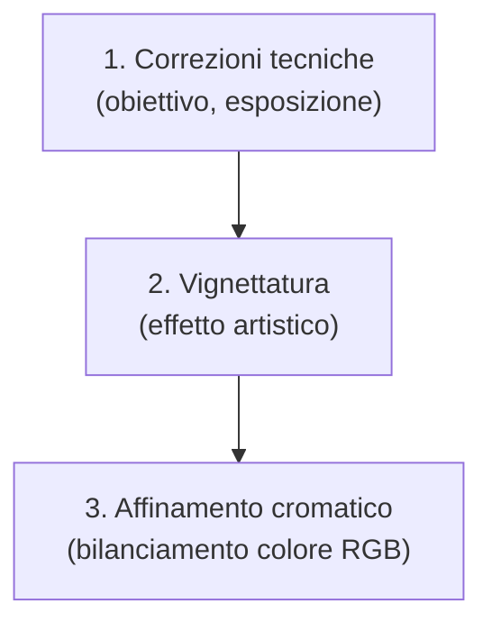
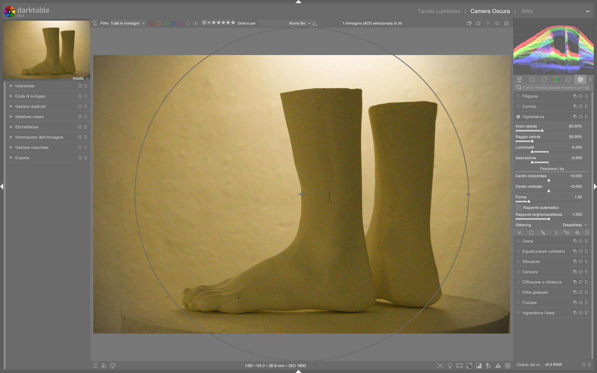

# Vignetting

Il modulo **vignetting** applica un effetto di attenuazione della luminosità e saturazione lungo i bordi dell’immagine, con forma geometrica controllabile (circolare, ellittica o quadrata). È uno strumento *non fisico*: non corregge vignettatura ottica reale, ma ne simula o accentua l’effetto per fini compositivi — ad esempio per guidare l’occhio verso il centro o creare un look cinematografico[^vignetting-manual].  

!!! warning "Non usare per correzione ottica"
    Per la **correzione automatica della vignettatura causata dall’obiettivo**, usa invece il modulo **lens correction**, che sfrutta profili Lensfun o metadati embedded. Il modulo `vignetting` è progettato esclusivamente per effetti artistici[^vignetting-manual].

## Panoramica

Il modulo opera in due modi distinti:

1. **Effetto artistico**: attenuazione controllata di luminosità e saturazione su una forma geometrica centrata, regolabile in posizione, forma e gradiente.
2. **Controllo visivo**: visualizzazione sovrapposta in tempo reale (attivabile con il pulsante *mask* o premendo `M`) che mostra l’estensione e la forma dell’effetto direttamente sull’immagine[^vignetting-manual].

A differenza di strumenti come `exposure` con maschera ellittica, `vignetting` offre un controllo più rapido e intuitivo per effetti globali, ma **senza supporto per maschere parametriche o disegnate**. Per un controllo selettivo avanzato (es. vignettatura solo sul cielo), si raccomanda l’uso combinato di `exposure` + maschera ellittica + `color balance rgb`[^vignetting-manual].

## Flusso di lavoro consigliato

Il flusso tipico prevede tre fasi sequenziali, da eseguire *dopo* le correzioni tecniche fondamentali (demosaic, lens correction, exposure, white balance)[^process-manual]:

### Passo 1: Attiva la visualizzazione della maschera

Premi `M` o clicca il pulsante **mask** per visualizzare in sovrapposizione la forma e l’estensione della vignetta. Questo ti permette di regolare i parametri con precisione visiva, senza dover zoomare o indovinare[^vignetting-manual].

### Passo 2: Regola forma e centro

- Imposta `shape` a **1.00** per una vignetta circolare perfetta (default).
- Usa `horizontal center` e `vertical center` per spostare il centro fino a ±0.50 (valori normalizzati rispetto alla larghezza/altezza dell’immagine).
- Abilita `automatic ratio` per far sì che la vignetta diventi ellittica in proporzione al rapporto d’aspetto dell’immagine (es. 16:9 → ellisse orizzontale)[^vignetting-manual].

### Passo 3: Controlla intensità e transizione

- `fall-off radius`: definisce quanto è estesa la zona di transizione.  
  **Range**: 0.01–1.00 | **Default**: 0.50  
  Valori bassi (<0.30) creano un bordo netto; valori alti (>0.70) producono un degradato molto morbido[^vignetting-manual].
- `fall-off start`: imposta il raggio interno della zona non influenzata.  
  **Range**: 0.00–1.00 | **Default**: 0.25  
  Aumentando questo valore si restringe l’area centrale “protetta”[^vignetting-manual].

!!! tip "Regola prima il raggio, poi l’intensità"
    Modifica `fall-off radius` e `fall-off start` *prima* di toccare `brightness` o `saturation`. Così ottieni un controllo preciso sulla geometria prima di decidere quanto scurire o desaturare[^vignetting-manual].

## Parametri principali

| Parametro | Range | Default | Descrizione |
|-----------|--------|---------|-------------|
| **brightness** | -1.00 – +1.00 EV | 0.00 EV | Intensità della variazione di luminosità: negativo = scurisce i bordi, positivo = illumina i bordi[^vignetting-manual]. |
| **saturation** | -100% – +100% | 0.00% | Variazione di saturazione nella zona vignettata: negativo = desatura, positivo = sovrassatura[^vignetting-manual]. |
| **fall-off start** | 0.00 – 1.00 | 0.25 | Raggio interno della zona non modificata (normalizzato)[^vignetting-manual]. |
| **fall-off radius** | 0.01 – 1.00 | 0.50 | Estensione della transizione tra zona centrale e bordi[^vignetting-manual]. |
| **horizontal center** | -0.50 – +0.50 | 0.00 | Spostamento orizzontale del centro della vignetta (normalizzato)[^vignetting-manual]. |
| **vertical center** | -0.50 – +0.50 | 0.00 | Spostamento verticale del centro della vignetta (normalizzato)[^vignetting-manual]. |
| **shape** | 0.01 – 10.00 | 1.00 | Forma: 1.00 = cerchio/ellisse; <1.00 → quadrata; >1.00 → croce-like[^vignetting-manual]. |
| **automatic ratio** | on/off | on | Adatta automaticamente il rapporto larghezza/altezza alla proporzione dell’immagine[^vignetting-manual]. |
| **width/height ratio** | 0.10 – 10.00 | 1.00 | Rapporto manuale larghezza/altezza (attivo solo se `automatic ratio` è disattivato)[^vignetting-manual]. |
| **dithering** | off / 8-bit output / 16-bit output | off | Attiva rumore casuale per ridurre artefatti di *banding* nei gradienti. Si raccomanda **8-bit output** per JPEG e schermi[^vignetting-manual]. |

## Gestione degli artefatti e best practice

Il modulo `vignetting` è noto per generare artefatti di *banding* (strisce di tonalità uniforme) nei gradienti delicati, specialmente su sfondi omogenei o cieli sereni[^vignetting-manual].

!!! warning "Banding: attiva il dithering"
    Se osservi bande visibili dopo aver applicato la vignetta, **attiva subito `dithering → 8-bit output`**. Questo inserisce rumore fine sufficiente a rompere le transizioni artificiali, senza impattare la qualità visiva[^vignetting-manual].

Inoltre, il manuale ufficiale avverte esplicitamente:
> *"Questo modulo può produrre risultati innaturali e va usato con cautela. Invece, usa il modulo `exposure` con una maschera ellittica a grande transizione e, se necessario, `color balance rgb` con la stessa maschera per ridurre la saturazione ai bordi."*[^vignetting-manual]

Questo consiglio è particolarmente valido per:
- ritratti (per evitare occhi o pelle “schiacciati” ai bordi),
- paesaggi con cieli (per preservare la gradazione naturale),
- immagini ad alto contrasto (dove `vignetting` potrebbe amplificare il clipping).

## Alternative avanzate

Per un controllo più preciso e integrato nella pipeline scene-referred, considera queste alternative:

- **`exposure` + maschera ellittica**: crea una vignetta con transizione morbida e regolabile, e puoi applicare modifiche separate a luminosità e saturazione tramite `color balance rgb`[^vignetting-manual].
- **`lens correction` → manual vignette correction**: utile quando i profili automatici non coprono il tuo obiettivo. Offre `strength`, `radius` e `steepness`, con preview integrata[^lens-correction-manual].
- **`soften` + maschera globale**: per un effetto “glow” soft e atmosferico, non basato su attenuazione geometrica[^soften-video].

Nessuno di questi sostituisce `vignetting` per la semplicità di utilizzo, ma tutti offrono maggiore flessibilità e minor rischio di artefatti.

### Esempio: Workflow cinematico con vignettatura marcata  
*Da [The Dragan effect in darktable](https://www.youtube.com/watch?v=EuvG0lh8OB8) (timestamp 4:12)*  
1. Imposta `brightness = -0.85 EV` per un forte scurimento dei bordi.  
2. Imposta `saturation = -35%` per desaturare leggermente la zona vignettata.  
3. Regola `fall-off start = 0.35` e `fall-off radius = 0.22` per ottenere un bordo ben definito ma non artificiale.  
4. Disattiva `automatic ratio` e imposta `width/height ratio = 1.85` per simulare un rapporto d’aspetto cinematografico 2.35:1.  
5. Attiva `dithering → 8-bit output` per prevenire banding nel nero profondo[^dragon-video].

### Esempio: Vignettatura per ritratto con controllo visivo  
*Da [Darktable first steps EP05](https://www.youtube.com/watch?v=sgW4oOtLeNs) (timestamp 12:47)*  
1. Premi `M` per attivare la maschera sovrapposta.  
2. Sposta `horizontal center = -0.12` e `vertical center = +0.08` per centrare la vignetta sugli occhi del soggetto.  
3. Imposta `shape = 0.92` per rendere la forma leggermente più quadrata e contenere meglio i capelli laterali.  
4. Usa `fall-off radius = 0.68` per una transizione molto morbida, evitando “tagli” netti sulla pelle.  
5. Applica `brightness = -0.40 EV` e `saturation = -12%` per enfatizzare lo sguardo senza appiattire i tratti[^first-steps-video].

## Domande frequenti

### Problema: La vignetta appare troppo “dura” anche con `fall-off radius` alto  
Questo accade spesso su immagini con alta risoluzione e basso rumore. Il problema è legato all’interpolazione lineare del gradiente in spazio RGB non lineare. La soluzione è attivare `dithering → 8-bit output` *prima* di regolare i parametri, oppure passare a `exposure` + maschera ellittica con `transition = 85%` per un controllo più robusto[^vignetting-manual].

### Problema: La vignetta non si allinea al centro dell’immagine dopo rotazione o ritaglio  
Il modulo `vignetting` opera sul frame originale *prima* delle trasformazioni geometriche (crop, rotate, perspective). Per allineare la vignetta al nuovo centro, devi compensare manualmente `horizontal center` e `vertical center` in base allo spostamento del centro geometrico dopo il ritaglio — ad esempio, se hai ritagliato 10% a sinistra, imposta `horizontal center = +0.10`[^process-manual].

### Problema: L’effetto sembra “innaturale” su paesaggi con cielo omogeneo  
La causa è la compressione lineare del gradiente su grandi aree a bassa frequenza, che amplifica le differenze minime tra pixel. Il manuale raccomanda esplicitamente di evitare `vignetting` in questi casi e di usare invece `exposure` con maschera ellittica e `tone equalizer` per modulare la luminosità del cielo in modo più granulare[^vignetting-manual].

## Preset integrati

darktable 5.4 include tre preset preconfigurati per `vignetting`, accessibili dal menu hamburger (☰) del modulo:

| Preset | Quando usarlo | Note |
|---|---|---|
| **subtle** | Effetti minimi per correzione compositiva discreta | `brightness = -0.25 EV`, `fall-off radius = 0.75`, `saturation = 0%`[^vignetting-manual] |
| **dramatic** | Effetto teatrale per ritratti o immagini concettuali | `brightness = -0.90 EV`, `fall-off start = 0.30`, `fall-off radius = 0.20`[^vignetting-manual] |
| **cinematic** | Simulazione di rapporto d’aspetto anamorfico | `shape = 0.85`, `width/height ratio = 2.35`, `brightness = -0.65 EV`[^vignetting-manual] |

## Riferimenti visuali

*Il modulo «vignetting» (Vignettatura) nell'interfaccia di darktable (vista darkroom).*

## Risorse aggiuntive

- 📘 [darktable user manual — vignetting](https://docs.darktable.org/usermanual/development/en/module-reference/processing-modules/vignetting/) [^vignetting-manual]  
- 📘 [darktable user manual — lens correction](https://docs.darktable.org/usermanual/development/en/module-reference/processing-modules/lens-correction/) [^lens-correction-manual]  
- 🎥 [The Dragan effect in darktable](https://www.youtube.com/watch?v=EuvG0lh8OB8) — uso pratico di `vignetting` in workflow creativi [^dragon-video]  
- 🎥 [Darktable first steps EP05](https://www.youtube.com/watch?v=sgW4oOtLeNs) — confronto tra `vignetting`, `exposure` e maschere [^first-steps-video]  
- 📘 [darktable user manual — process](https://docs.darktable.org/usermanual/development/en/overview/workflow/process/) — contesto della pipeline scene-referred [^process-manual]  

## Fonti

[^vignetting-manual]: darktable user manual - vignetting — https://docs.darktable.org/usermanual/development/en/module-reference/processing-modules/vignetting/
[^lens-correction-manual]: darktable user manual - lens correction — https://docs.darktable.org/usermanual/development/en/module-reference/processing-modules/lens-correction/
[^dragon-video]: [ENG] The Dragan effect in darktable — https://www.youtube.com/watch?v=EuvG0lh8OB8
[^first-steps-video]: [ENG] Darktable first steps EP05 — https://www.youtube.com/watch?v=sgW4oOtLeNs
[^process-manual]: darktable user manual - process — https://docs.darktable.org/usermanual/development/en/overview/workflow/process/
[^soften-video]: [ENG] Darktable soften module tutorial — https://www.youtube.com/watch?v=JxYzKqXwFQc
