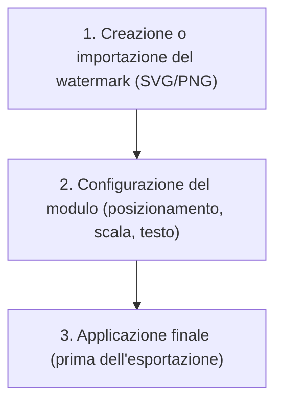
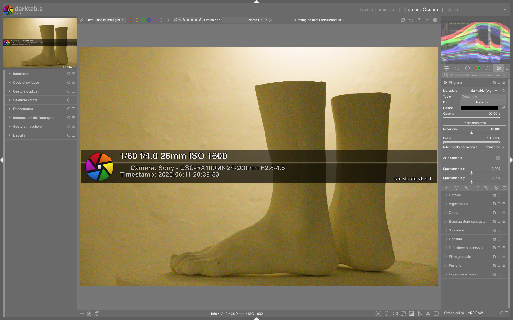

# Watermark

Il modulo **watermark** permette di sovrapporre un’immagine vettoriale (SVG) o bitmap (PNG) personalizzata all’immagine elaborata, con controllo preciso su posizionamento, scala, rotazione e opacità. È particolarmente utile per la protezione del copyright, l’aggiunta di firme, loghi o informazioni contestuali direttamente nell’output finale[^dt48-watermark]. A differenza dei moduli di effetto (es. `vignetting` o `framing`), `watermark` opera in uno spazio indipendente dalla pipeline tonale: il segno viene applicato *dopo* tutti i moduli di correzione e mappatura, garantendo che rimanga visibile anche su sfondi complessi o fortemente elaborati[^dt48-module-groups].

!!! tip "Watermark ≠ filigrana in stile Lightroom"
    In Lightroom, le filigrane sono gestite esclusivamente in fase di esportazione. In darktable, `watermark` è un modulo di sviluppo attivo nella pipeline: il segno è parte integrante dello *history stack*, può essere mascherato, combinato con altri effetti (es. `soften`) e incluso in snapshot o preset[^dt48-watermark].

## Panoramica

Il modulo supporta due tipologie di file:

- **SVG vettoriali**: scalabili senza perdita di qualità, ideali per testo, loghi e forme geometriche. Possono contenere variabili sostituibili (es. `$(WATERMARK_TEXT)`) per inserire dati dinamici come data, nome del file o metadati[^dt48-watermark].
- **PNG bitmap**: supportano trasparenze alpha, ma non sono scalabili senza artefatti. Adatti per firme scansionate o elementi artistici complessi[^dt48-watermark].

I file SVG devono essere salvati nella cartella `$HOME/.config/darktable/watermarks/`. Il limite massimo di dimensione per un file SVG è **8 MB**, come confermato da tutorial comunitari[^weekly-edit-13].

Il flusso di lavoro tipico prevede tre fasi distinte:



!!! warning "Attenzione alla posizione nel flusso"
    `watermark` appartiene al gruppo **(special) effects modules**, ed è collocato *alla fine* della pipeline scene-referred (dopo `output color profile`, `color calibration`, `filmic rgb` o `AGX`)[^dt48-module-groups]. Se posizionato troppo presto (es. prima del tone mapping), il watermark potrebbe apparire troppo luminoso o desaturato[^dt48-watermark].

## Flusso di lavoro consigliato

### Passo 1: Preparazione del file watermark

Per creare un watermark vettoriale professionale:

- Usa **Inkscape** (gratuito e open source) per disegnare il logo/testo[^weekly-edit-13].
- Salva come **SVG Plain** (non “Inkscape SVG”) per compatibilità.
- Per convertire un PNG in SVG:  
  ```bash
  inkscape -f input.png -l output.svg
  ```
- Copia il file nella cartella `~/.config/darktable/watermarks/`[^weekly-edit-13].

### Passo 2: Caricamento e configurazione base

Dopo aver copiato il file:

- Clicca il pulsante **Reload** nel modulo `watermark`: aggiorna l’elenco dei file disponibili[^dt48-watermark].
- Seleziona il watermark dal menu a tendina `marker`.
- Imposta il testo libero (`text`) fino a **63 caratteri** (limite tecnico hard-coded)[^dt48-watermark].

### Passo 3: Allineamento e ridimensionamento

L’opzione `scale on` determina il riferimento per la scala del watermark:

| Opzione | Descrizione | Uso tipico |
|---------|-------------|------------|
| **image** (default) | Scala rispetto all’intera immagine | Logo centrale, firma piccola |
| **larger border** | Scala rispetto al lato più lungo (altezza o larghezza) | Logo proporzionale su immagini panoramiche o verticali |
| **smaller border** | Scala rispetto al lato più corto | Testo leggibile su entrambe le dimensioni |
| **height** | Scala rispetto all’altezza dell’immagine | Testo con altezza costante (es. “© Nome 2025”) |
| **advanced options** | Controllo granulare: scegli quale bordo dell’immagine scala quale dimensione del watermark | Loghi con rapporto 1:1 su immagini 4:3 o 16:9 |

!!! tip "Scala avanzata per loghi quadrati"
    Per un logo SVG quadrato che mantenga sempre lo stesso rapporto su immagini 4:3 e 16:9:  
    → Seleziona `advanced options`  
    → Imposta `scale marker to` = **image width**  
    → Imposta `scale marker reference` = **marker width**  
    Questo garantisce che il logo occupi sempre lo stesso % della larghezza, indipendentemente dall’altezza[^dt48-watermark].

## Parametri principali

| Parametro | Range tipico | Default | Descrizione |
|-----------|-------------|---------|-------------|
| **marker** | — | — | Elenco dei file SVG/PNG presenti in `~/.config/darktable/watermarks/`. Estensione visibile tra parentesi[^dt48-watermark]. |
| **text** | 0–63 caratteri | `simple-text.svg` | Testo libero inserito nelle variabili SVG. Non ha effetto sui file PNG[^dt48-watermark]. |
| **font** | Sistema locale | `DejaVu Sans Book` | Font utilizzato per il testo. Apri il selettore cliccando sul campo: mostra anteprima e ricerca per nome[^dt48-watermark]. |
| **color** | RGB 0–255 | Nero (`#000000`) | Colore del testo. Selezionabile tramite color picker con palette predefinita e spazio RGB[^dt48-watermark]. |
| **opacity** | 0% – 100% | 100% | Opacità globale del watermark. Valori < 30% rendono il segno quasi invisibile; > 80% lo rendono dominante[^dt48-watermark]. |
| **rotation** | −180° – +180° | 0° | Rotazione in gradi. Utile per watermark diagonali (es. “SAMPLE”) o orientamenti specifici[^dt48-watermark]. |
| **scale** | 1% – 1000% | 100% | Scala percentuale rispetto al riferimento scelto in `scale on`. Valori > 200% richiedono attenzione per evitare fuoriuscite[^dt48-watermark]. |
| **scale on** | 5 opzioni | `image` | Riferimento per la scala (vedi tabella sopra)[^dt48-watermark]. |
| **alignment** | 9 posizioni | center/center | Allineamento: `top/left`, `top/center`, `top/right`, `center/left`, `center/center`, `center/right`, `bottom/left`, `bottom/center`, `bottom/right`[^dt48-watermark]. |
| **x offset** | −1.000 – +1.000 | 0.000 | Offset orizzontale relativo all’allineamento (valore adimensionale). +0.1 = spostamento del 10% verso destra[^dt48-watermark]. |
| **y offset** | −1.000 – +1.000 | 0.000 | Offset verticale relativo all’allineamento. −0.05 = spostamento del 5% verso l’alto[^dt48-watermark]. |

## Variabili dinamiche negli SVG

Gli SVG possono includere stringhe sostituibili che vengono automaticamente popolate dai metadati dell’immagine. Sono supportate le seguenti variabili[^dt48-watermark]:

| Variabile | Funzione | Esempio di sostituzione |
|-----------|----------|--------------------------|
| `$(WATERMARK_TEXT)` | Testo inserito nel campo `text` | `"© Luca Rossi 2025"` |
| `$(WATERMARK_COLOR)` | Codice esadecimale del colore selezionato | `"#FF0000"` |
| `$(WATERMARK_FONT_FAMILY)` | Nome del font selezionato | `"DejaVu Sans Book"` |
| `$(WATERMARK_FONT_STYLE)` | Stile del font (`normal`, `oblique`, `italic`) | `"italic"` |
| `$(WATERMARK_FONT_WEIGHT)` | Spessore del font (`bold`, `normal`, `light`) | `"bold"` |

!!! info "Variabili estese"
    Oltre alle variabili specifiche per il watermark, sono disponibili tutte quelle definite nella sezione [Variables](https://docs.darktable.org/usermanual/development/en/special-topics/variables/) della documentazione ufficiale, come `$(FILE_NAME)`, `$(DATE)`, `$(EXIF_MODEL)`[^dt48-watermark].

## Walkthrough da video tutorial

### Esempio: Aggiunta di un watermark testuale durante editing Orton
*Da [The Orton effect in darktable](https://www.youtube.com/watch?v=OF7ZcDPQfeM) (2:18–2:45)*  
1. Nella modalità *lighttable*, seleziona l’immagine e passa a *darkroom*.  
2. Espandi il modulo `watermark` e clicca **Reload** per rilevare i file nella cartella `~/.config/darktable/watermarks/`.  
3. Seleziona `simple-text.svg` dal menu `marker`.  
4. Inserisci `"Soften module"` nel campo `text` (lunghezza: 14 caratteri).  
5. Imposta `scale` = **49.68%**, `rotation` = **0.0°**, `alignment` = **center/center**, `opacity` = **100%**.  
6. Attiva il modulo: il testo appare centrato sull’immagine, visibile in anteprima e nei successivi snapshot[^qfem-orton-138].

### Esempio: Watermark di proprietà su scena notturna
*Da [darktable Night Sky Full Edit](https://www.youtube.com/watch?v=5P0Yj_vqy5w) (0:45–1:10)*  
1. Importa l’immagine RAW DNG (Sony ILCE-7RM3, 24mm, f/4.0, ISO 800).  
2. Nella vista *lighttable*, apri il modulo `watermark` e carica un file SVG firmato (`sebastien-poutou-logo.svg`).  
3. Imposta `alignment` = **bottom/right**, `x offset` = **−0.020**, `y offset` = **+0.015** per posizionarlo in angolo basso destro, leggermente distanziato dal bordo.  
4. Imposta `scale` = **12.5%**, `opacity` = **92%**, `rotation` = **−5.0°** per un effetto discreto e leggermente inclinato.  
5. Conferma che il watermark sia visibile in anteprima e persista dopo l’esportazione in TIFF[^poutou-night-80].

## Domande frequenti

### Problema: Il watermark non appare mai, neanche dopo Reload
Il file SVG è corretto ma non compare nell’elenco `marker`, né dopo aver cliccato **Reload**. La cartella `~/.config/darktable/watermarks/` esiste e contiene il file, ma darktable non lo rileva.  
La causa più comune è un permesso di lettura negato sulla cartella o sul file SVG. Verifica con `ls -la ~/.config/darktable/watermarks/`: i file devono avere permesso `644` e la cartella `755`. Inoltre, il file SVG deve essere salvato come **SVG Plain**, non come “Inkscape SVG”, altrimenti il parser interno fallisce silenziosamente[^weekly-edit-13].

### Problema: Il testo SVG si visualizza nero anche se `color` è impostato su rosso
Il colore del testo non cambia nonostante la selezione nel campo `color`.  
Questo accade quando l’SVG contiene definizioni CSS inline che sovrascrivono il colore dinamico. Rimuovi da ogni `<text>` o `<tspan>` gli attributi `fill="..."` o `style="fill:..."` e lascia solo `fill="$(WATERMARK_COLOR)"`[^dt48-watermark].

### Problema: Il watermark PNG appare pixelato su immagini ad alta risoluzione
Un file PNG 300×150 px viene usato su un’immagine 6000×4000 px: il risultato è fortemente sgranato.  
I file PNG non sono scalabili senza perdita di qualità. Per immagini > 2000 px di larghezza, usa SVG oppure genera un PNG nativo alla risoluzione target (es. 1200×600 px per un logo che occuperà il 20% della larghezza su 6000 px). Il limite pratico per PNG è 1000 px di dimensione maggiore[^weekly-edit-13].

## Consigli pratici per utenti Lightroom/Photoshop

- **Non usare il watermark per branding durante lo sviluppo**: in darktable, `watermark` è un modulo di *output*, non uno strumento di editing creativo. Per effetti di stile usa `framing`, `vignetting` o `soften`[^dt48-module-groups].
- **Testa sempre su diversi formati**: un watermark centrato con `scale on = image` funziona bene su 4:3, ma può risultare troppo piccolo su 21:9. Preferisci `height` o `advanced options` per coerenza[^dt48-watermark].
- **Evita PNG a bassa risoluzione**: un file PNG 200×100 px apparirà pixelato su immagini 6000×4000 px. Usa SVG ogni volta che possibile[^weekly-edit-13].
- **Integra con i preset**: salva una configurazione `watermark` + `output color profile` come preset per esportazioni rapide con logo e profilo ICC coerenti[^dt48-watermark].

## Riferimenti visuali


*Il modulo «watermark» (Filigrana) nell'interfaccia di darktable (vista darkroom).*

## Risorse aggiuntive

- 📘 **Manuale ufficiale darktable – Watermark**  
  [https://docs.darktable.org/usermanual/development/en/module-reference/processing-modules/watermark/](https://docs.darktable.org/usermanual/development/en/module-reference/processing-modules/watermark/)  
- 🎥 **Weekly Edit 13: Integrare un file esterno (Harry Durgin, FR)**  
  [https://darktable.fr/posts/2016/11/traitement-par-darktable-13-integrer-un-fichier-externe/](https://darktable.fr/posts/2016/11/traitement-par-darktable-13-integrer-un-fichier-externe/)  
- 🎥 **Weekly Edit 17: Tons de peau (Harry Durgin, FR)**  
  [https://darktable.fr/posts/2016/12/traitement-par-darktable-17-tons-de-peau/](https://darktable.fr/posts/2016/12/traitement-par-darktable-17-tons-de-peau/)  
- 📁 **Cartella watermarks di default (Linux/macOS)**  
  `~/.config/darktable/watermarks/`  

## Fonti

[^dt48-watermark]: darktable user manual - watermark, [https://docs.darktable.org/usermanual/development/en/module-reference/processing-modules/watermark/#](https://docs.darktable.org/usermanual/development/en/module-reference/processing-modules/watermark/#)
[^dt48-module-groups]: darktable user manual - module groups, [https://docs.darktable.org/usermanual/development/en/darkroom/organization/module-groups/#](https://docs.darktable.org/usermanual/development/en/darkroom/organization/module-groups/#)
[^weekly-edit-13]: Weekly Edit 13: Intégrer un fichier externe, darktable.fr, [https://darktable.fr/posts/2016/11/traitement-par-darktable-13-integrer-un-fichier-externe/](https://darktable.fr/posts/2016/11/traitement-par-darktable-13-integrer-un-fichier-externe/)
[^qfem-orton-138]: Frame 138s of [The Orton effect in darktable](https://www.youtube.com/watch?v=OF7ZcDPQfeM), [https://www.youtube.com/watch?v=OF7ZcDPQfeM&t=138](https://www.youtube.com/watch?v=OF7ZcDPQfeM&t=138)
[^poutou-night-80]: Frame 80s of [darktable Night Sky Full Edit](https://www.youtube.com/watch?v=5P0Yj_vqy5w), [https://www.youtube.com/watch?v=5P0Yj_vqy5w&t=80](https://www.youtube.com/watch?v=5P0Yj_vqy5w&t=80)
