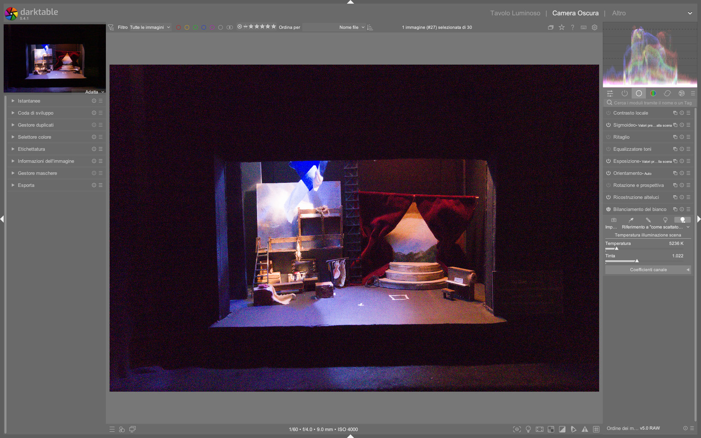

# White Balance

Il modulo **white balance** è il primo modulo tecnico della pipeline di elaborazione RAW in darktable, responsabile della correzione obbligatoria del bilanciamento del bianco prima che i dati possano essere correttamente demosaicati e processati. Il suo scopo non è creativo ma *tecnico*: garantire che i grigi neutri della scena siano resi con valori RGB uguali (R = G = B) nel flusso di lavoro[^wb-manual]. A differenza di Lightroom, dove il bilanciamento del bianco è un singolo strumento flessibile, in darktable esso opera in sinergia con il modulo **color calibration**, che gestisce la successiva adattazione cromatica percepita[^color-calib-manual].

!!! info "White balance è obbligatorio — non opzionale"
    Il modulo `white balance` è attivo per ogni immagine RAW caricata e **non può essere disattivato**. Anche se impostato su “as shot”, i suoi coefficienti RGB vengono comunque calcolati e applicati per permettere al modulo `demosaic` di funzionare correttamente[^wb-manual]. Questo è un requisito tecnico del flusso RAW, non una scelta editoriale.

## Panoramica

Il modulo `white balance` opera esclusivamente sui dati RAW *prima* dell’applicazione del profilo colore d’ingresso (`input color profile`) e del demosaicing. I suoi parametri influenzano direttamente i coefficienti RGB che moltiplicano i canali del sensore, determinando così come verrà interpretata la luce incidente. La sua azione è fondamentale perché:

- Un bilanciamento errato genera dominanti cromatiche che compromettono tutti i moduli successivi (es. `exposure`, `filmic rgb`, `color balance rgb`)
- Senza una correzione accurata, il modulo `demosaic` produce artefatti cromatici e perdita di dettaglio, specialmente nelle zone con transizioni morbide o texture fini[^wb-manual][^pipeline-beginner]

Il modulo fornisce tre modalità di controllo complementari:
1. **Temperature & Tint**: interfaccia intuitiva basata su Kelvin e correzione magenta-verde
2. **Presets**: preimpostazioni derivate dai metadati EXIF della fotocamera (es. “sunny”, “cloudy”, “tungsten”)
3. **Channel coefficients**: controllo diretto e preciso dei moltiplicatori RGB (da 0.000 a 8.000), usato internamente da tutti gli altri metodi[^wb-manual]

!!! warning "Attenzione alla compatibilità tra fotocamere"
    I coefficienti RGB calcolati da temperature/tint dipendono dalle caratteristiche specifiche del sensore e del firmware della fotocamera. Applicare le impostazioni di bilanciamento di una Canon su un file Fujifilm produrrà risultati imprevedibili e spesso errati[^wb-manual]. Per questo motivo, i preset sono generati per modello di fotocamera e non sono trasferibili.

## Flusso di lavoro consigliato

Il flusso ideale per il bilanciamento del bianco segue una sequenza rigorosa, specie nei workflow *scene-referred* (AGX, Filmic RGB):

```mermaid
flowchart TD
    A["1. Verifica iniziale (istogramma RGB + visualizzazione verde)"] --> B["2. Scelta del preset più vicino (\"as shot\" o \"camera reference\")"] --> C["3. Affinamento manuale con pipetta su area neutra o regolazione temperature/tint"] --> D["4. Convalida tramite modulo color calibration (CAT tab) per adattazione percettiva"]
```

### Passo 1: Diagnosi visiva con l’istogramma RGB

Prima di qualsiasi regolazione, osserva l’istogramma RGB nel pannello destro:  
- Se un canale domina nettamente (es. verde molto più alto di rosso/blu), l’immagine appare con una forte dominante cromatica (tipicamente verde, poiché i sensori Bayer hanno il doppio dei pixel verdi)[^wb-manual][^pipeline-beginner]  
- L’immagine apparirà “verde” anche se il bilanciamento è tecnicamente corretto: questo è normale e sarà risolto solo dopo il demosaicing e il profilo colore

### Passo 2: Partenza dal preset “as shot”

Il preset predefinito è **as shot**, che legge direttamente i metadati EXIF della fotocamera. È il punto di partenza più affidabile, soprattutto se la fotocamera era stata impostata correttamente sul campo[^wb-manual].  
- **Non modificare mai** `white balance` prima di aver verificato che `input color profile` sia impostato su “scene-referred default” o “embedded” — un profilo errato invalida ogni regolazione successiva[^color-calib-manual]

### Passo 3: Correzione con la pipetta “from image area”

Per precisione massima, usa la funzione **from image area**:  
- Disegna un rettangolo su una zona *effettivamente neutra* (es. carta grigia, asfalto asciutto, parete bianca non illuminata da luci colorate)  
- Il modulo calcola automaticamente i coefficienti RGB per rendere quella zona con R=G=B  
- **Range tipico dei coefficienti risultanti**:  
  - `red`: 1.200 – 3.500  
  - `green`: 1.000 (valore di riferimento, fissato a 1.000)  
  - `blue`: 1.300 – 4.200  
  *(es. screenshot video: red=2.009, green=1.000, blue=1.450)[^wb-video-1]*

!!! tip "Area neutra ≠ superficie bianca"
    Una superficie bianca sotto luce fluorescente non è neutra: contiene una dominante verde. Cerca aree con riflettanza uniforme e bassa saturazione cromatica. Se non trovi nulla, usa “AI detect from surfaces” in `color calibration` come backup[^color-calib-manual].

## Parametri principali

| Parametro | Range | Default | Descrizione |
|-----------|-------|---------|-------------|
| **temperature** | 2000 K – 15000 K | ~5000–6500 K (dipende dalla fotocamera) | Regola la temperatura cromatica. Valori bassi → tonalità fredde (blu); alti → tonalità calde (giallo/oro). Usato per bilanciare luci da lampade, sole, flash[^wb-manual]. |
| **tint** | 0.10 – 10.00 | 1.00 | Corregge la dominante magenta-verde. <1.00 → più magenta; >1.00 → più verde. Fondamentale per compensare aberrazioni cromatiche e illuminazione artificiale[^wb-manual]. |
| **red channel** | 0.000 – 8.000 | variabile (calcolato) | Coefficiente moltiplicativo per il canale rosso. Aumentarlo schiarisce i rossi; diminuirlo li scurisce. Valore tipico: 1.800–2.500 per scene esterne[^wb-manual]. |
| **green channel** | 0.000 – 8.000 | **1.000** (fisso) | Canale di riferimento. Non modificabile manualmente: tutti gli altri coefficienti sono relativi a questo valore[^wb-manual]. |
| **blue channel** | 0.000 – 8.000 | variabile (calcolato) | Coefficiente moltiplicativo per il canale blu. Tipicamente più alto del rosso in condizioni di luce fredda (es. 2.800–3.600)[^wb-manual]. |

### Modalità di visualizzazione slider

Le barre di regolazione possono essere personalizzate in **Preferences > Darkroom > white balance slider colors**:  
- **no color** (default): slider monocromatici  
- **illuminant color**: il colore dello slider rappresenta la luce da cui ti stai bilanciando (es. blu per luce fredda)  
- **effect emulation**: il colore rappresenta l’effetto applicato all’immagine (es. giallo per riscaldare)[^wb-manual]

## Presets avanzati e uso professionale

Oltre ai preset standard (“as shot”, “cloudy”, “tungsten”), darktable offre due preset strategici per il workflow professionale:

| Preset | Quando usarlo | Valore tipico (esempio) |
|--------|----------------|--------------------------|
| **camera reference** | Per calibrazione precisa o quando si usano profili custom. Imposta la temperatura a D65 (~6502 K) e calcola i coefficienti per convertire il bianco della fotocamera in sRGB D65[^wb-manual]. | `temperature`: 6502 K, `tint`: 1.000, `red`: 1.972, `blue`: 2.410 |
| **user modified** | Automaticamente selezionato dopo ogni modifica manuale. Permette di tornare rapidamente allo stato più recente senza dover salvare un preset[^wb-manual]. | Dinamico — memorizza l’ultima combinazione modificata |

!!! tip "Crea preset specifici per fotocamera"
    Per ottenere coerenza assoluta tra immagini della stessa sessione, scatta una foto su un foglio bianco o grigio neutro sotto la stessa illuminazione. Usa `from image area` su quell’immagine, quindi salva un preset con nome come `GFX100S-studio-D65`. Questo preset sarà disponibile *solo* per immagini della stessa fotocamera[^wb-video-1].

## Relazione con color calibration

Il modulo `white balance` non sostituisce `color calibration`: ne è il *prerequisito tecnico*. Mentre `white balance` garantisce che i grigi siano neutri, `color calibration` (nella scheda **CAT**) effettua una vera e propria *adattazione cromatica* per simulare come la scena sarebbe apparsa sotto un diverso illuminante (es. D50 del monitor vs luce solare reale)[^color-calib-manual].

- `white balance` → “rendi neutro il grigio”  
- `color calibration` → “fai sembrare questa scena come se fosse stata illuminata da D50”  

Per abilitare il workflow moderno:  
1. Vai in **Preferences > Processing > auto-apply chromatic adaptation defaults**  
2. Seleziona **modern** (anziché legacy)  
3. `color calibration` verrà applicato automaticamente *dopo* `white balance`, con parametri ottimizzati per CAT16[^color-calib-manual]

## Consigli operativi

- **Non usare mai temperature > 10000 K o < 3000 K** senza verifica: valori estremi possono generare coefficienti RGB non fisicamente plausibili, causando clipping cromatico irrecuperabile[^wb-manual].  
- **Abilita sempre la visualizzazione “display sample in vectorscope”** quando usi la pipetta: ti mostra in tempo reale se il campione è davvero neutro (punto centrale del vettore)[^wb-video-1].  
- **Evita di regolare `white balance` dopo `color calibration`**: la gerarchia è fissa — ogni modifica successiva invalida l’adattazione cromatica già calcolata[^color-calib-manual].  
- **Per immagini notturne con luci miste**, usa `color calibration` > **(AI) detect from edges**, che identifica meglio le transizioni cromatiche rispetto alla media globale[^color-calib-manual].

### Esempio: Calibrazione rapida con AI detect from surfaces  
*Da [darktable Full edit #1](https://www.youtube.com/watch?v=DzdGL30lYjU) (timestamp 12:45)*  
1. Apri l’immagine RAW in camera oscura  
2. Nella scheda **CAT** di `color calibration`, seleziona **(AI) detect from surfaces**  
3. Assicurati che `white balance` sia impostato su **camera reference** (automatico con workflow moderno)  
4. Osserva il valore **CCT** mostrato accanto al campione di illuminante: se etichettato `(invalid)`, passa a **custom** illuminant  
5. Usa i cursori **hue** e **chroma** in LCh per affinare: tipicamente `hue = 120°–180°`, `chroma = 0.05–0.12` per luci fluorescenti interne[^wb-video-1]  

### Esempio: Workflow batch per serie fotografica  
*Da [batch-editing images](https://docs.darktable.org/usermanual/development/en/guides-tutorials/batch-editing/) (sezione “profiling the series”)*  
1. Scatta un’immagine di un color checker X-Rite sotto la stessa illuminazione della serie  
2. In `color calibration` > CAT tab, usa **(AI) detect from surfaces** sull’immagine del color checker  
3. Salva lo stato come **preset automatico** con nome `Studio_D65_XRite24`  
4. Applica il preset a tutta la serie con **copy/paste history stack** in lighttable  
5. Verifica che `white balance` mostri **camera reference** e che il valore `temperature` sia fisso a **6502 K**[^batch-editing]  

## Domande frequenti

### Problema: Il modulo `white balance` non risponde ai cursori temperature/tint  
Questo accade quando `white balance` è impostato su **camera reference**, che blocca i controlli temperature/tint per garantire la stabilità della calibrazione tecnica. Per modificare manualmente, cambia prima il preset in **as shot**, apporta le modifiche, quindi torna a **camera reference** per validare l’adattazione cromatica con `color calibration`[^process-settings].  

### Problema: Dopo aver usato `from image area`, i coefficienti `red` e `blue` sono fuori scala (>5.000)  
Coefficienti superiori a 4.000 indicano un illuminante non standard (es. LED a spettro limitato, lampade al sodio). In questi casi, `white balance` non è sufficiente: procedi subito con `color calibration` > CAT tab e seleziona **custom** illuminant per un controllo preciso in CIE LCh[^color-calib-manual].  

### Problema: Il valore CCT mostrato in `color calibration` è etichettato `(invalid)`  
Ciò significa che l’illuminante stimato non giace vicino al locus Planckiano o Daylight. Non è un errore: è un segnale che il sistema richiede un approccio più preciso. Attiva **custom** illuminant e usa i cursori **hue** e **chroma**, non la temperatura[^color-calib-manual].  

## Tabella preset built-in

| Preset | Descrizione | Compatibilità |
|--------|-------------|---------------|
| **as shot** | Legge i metadati EXIF della fotocamera (`Exif.Photo.WhiteBalance`). Valore predefinito. | Universale, ma dipende dall’accuratezza della fotocamera |
| **from image area** | Calcola i coefficienti RGB da un rettangolo disegnato. Imposta `green = 1.000` come riferimento. | Tutti i sensori RAW, richiede area neutra con minimo 200 pixel |
| **camera reference** | Fissa `temperature = 6502 K` e calcola `red/blue` per convertire il bianco della fotocamera in D65 sRGB. Richiesto per workflow moderno. | Solo con fotocamere supportate da RawSpeed e profili WB completi[^wb-manual] |
| **user modified** | Memorizza l’ultima combinazione di `temperature`, `tint`, `red`, `blue` modificata manualmente. | Automatico per ogni immagine modificata |

## Riferimenti visuali


*Il modulo «white balance» (Bilanciamento del bianco) nell'interfaccia di darktable (vista darkroom).*

## Risorse aggiuntive

- [darktable user manual — white balance](https://docs.darktable.org/usermanual/development/en/module-reference/processing-modules/white-balance/)  
- [darktable user manual — color calibration](https://docs.darktable.org/usermanual/development/en/module-reference/processing-modules/color-calibration/)  
- [ENG] darktable Full edit #1 — White balance calibration workflow ([YouTube](https://www.youtube.com/watch?v=DzdGL30lYjU))  
- [ENG] The darktable pipeline for beginners — Technical modules deep dive ([YouTube](https://www.youtube.com/watch?v=1nPW6WPhhTo))  
- [ENG] Filmic & Sigmoid Part 4 — Exposure and white balance setup ([YouTube](https://www.youtube.com/watch?v=4KV9Ic-mPj0))

## Fonti

[^wb-manual]: darktable user manual - white balance, https://docs.darktable.org/usermanual/development/en/module-reference/processing-modules/white-balance/
[^color-calib-manual]: darktable user manual - color calibration, https://docs.darktable.org/usermanual/development/en/module-reference/processing-modules/color-calibration/
[^wb-video-1]: [ENG] darktable Full edit #1, https://www.youtube.com/watch?v=DzdGL30lYjU
[^pipeline-beginner]: [ENG] The darktable pipeline for beginners, https://www.youtube.com/watch?v=1nPW6WPhhTo
[^batch-editing]: darktable user manual - batch-editing images, https://docs.darktable.org/usermanual/development/en/guides-tutorials/batch-editing/
[^process-settings]: darktable user manual - processing, https://docs.darktable.org/usermanual/development/en/preferences-settings/processing/
