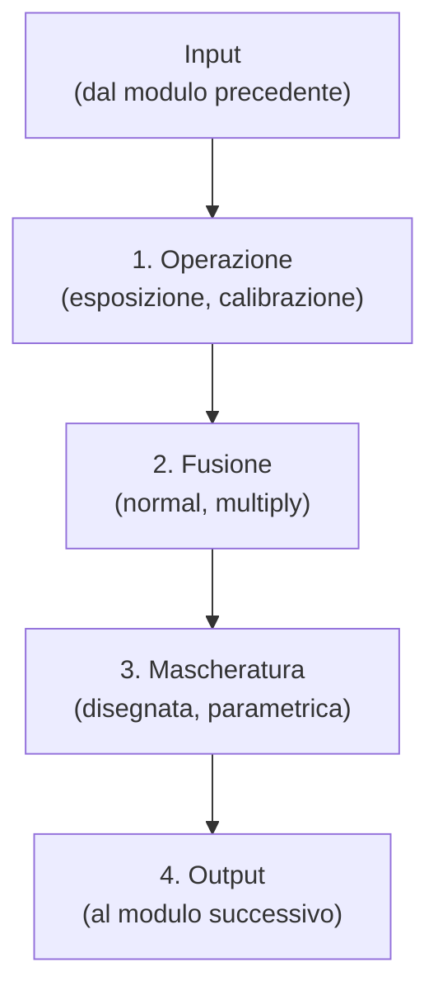

# Anatomia di un modulo

Il modulo di elaborazione è l'elemento fondamentale dell'elaborazione delle immagini in darktable. Per gli utenti provenienti da Photoshop, il concetto di modulo in darktable è analogo a quello di un **adjustment layer**: entrambi applicano una modifica incrementale all'immagine, basandosi sulle regolazioni precedenti e costruendo il risultato finale passo dopo passo.[^anatomy]

A differenza dei moduli di utilità (utility modules) che gestiscono l'interfaccia, i tag o l'organizzazione, i moduli di elaborazione agiscono direttamente sui dati dell'immagine attraverso una pipeline sequenziale definita "pixelpipe".[^anatomy][^workflow]

!!! info "Indipendenza dei Moduli"
    Ogni modulo di elaborazione agisce in modo indipendente dagli altri, ma tutti seguono la stessa struttura interna a 4 fasi per elaborare i dati.[^anatomy]

## Panoramica

Il funzionamento interno di ogni modulo può essere scomposto in quattro passaggi logici sequenziali che trasformano l'input in output:[^anatomy]

1.  **Operazione (Operation)**: Il modulo riceve il *module input* (l'output del modulo precedente) ed esegue un'operazione specifica (es. modifica dell'esposizione, riduzione del rumore) per produrre un *processed output*.
2.  **Blending (Miscelazione)**: Il *module input* e il *processed output* vengono combinati usando un *blending operator* (modalità di blend) per produrre un *blended output*. Se non è attivata nessuna miscelazione, l'output di questo passo coincide con il *processed output*.
3.  **Mascheratura (Masking)**: Viene generata una maschera che definisce un'opacità specifica per ogni pixel dell'immagine. Questa maschera controlla quanto intensamente l'operazione del modulo viene applicata a diverse parti dell'immagine. Può essere disegnata o basata sulle proprietà dei pixel.
4.  **Output Finale**: Il *module input* e il *blended output* vengono combinati pixel per pixel usando la maschera come operatore di mixing. Dove la maschera è al 100%, l'output finale è il *blended output*; dove è 0%, è il *module input*. Questo risultato passa al modulo successivo.

I passaggi 2 e 3 sono opzionali e non supportati da tutti i moduli. Ad esempio, il modulo *demosaic* deve essere applicato all'intero file RAW per produrre un'immagine leggibile, pertanto non supporta maschere o blending.[^anatomy]

## Flusso di lavoro consigliato

Comprendere l'anatomia del modulo è cruciale per sfruttare le capacità avanzate di darktable, come il mascheramento selettivo e il blending.

!!! tip "Istanze Multiple e Maschere Inverse"
    Per gestire situazioni complesse (es. illuminazione mista), puoi utilizzare più istanze dello stesso modulo con maschere diverse. Ad esempio, nel modulo *color calibration*, puoi creare una prima istanza per le regolazioni globali e una seconda istanza riutilizzando la maschera della prima in versione invertita (tramite *raster mask*) per correggere aree specifiche con sorgenti luminose diverse.[^color-cal]

### Passo 1: Operazione Base

Inizia regolando i parametri principali del modulo (l'operazione). In questa fase, il modulo agisce come se fosse applicato globalmente all'intera immagine, partendo dai dati lasciati dal modulo precedente nella pipeline.[^anatomy]

### Passo 2: Definizione della Maschera (Step 3 dell'anatomia)

Se desideri limitare l'effetto a una zona specifica:
- Usa **Drawn mask** per disegnare forme (cerchi, pennelli, percorsi).
- Usa **Parametric mask** per selezionare aree in base a proprietà come colore, luminosità o contrasto.
- La maschera definisce l'opacità per ogni pixel: 1.0 (100%) applica l'effetto pieno, 0.0 lo annulla.[^anatomy]

### Passo 3: Blending e Opacità (Step 2 e 4 dell'anatomia)

Se non definisci una maschera disegnata o parametrica, il modulo assume una maschera uniforme dove tutti i pixel hanno la stessa opacità, controllata dallo slider di **opacità globale**.[^anatomy]

- **Opacità Globale**: Se non è definito alcun blending, l'opacità predefinita è 1.0 (100%).[^anatomy]
- **Blending Modes**: Puoi cambiare il modo in cui il *processed output* si fonde con l'input usando le modalità di blend (es. *normal*, *overlay*, *lighten*).

!!! warning "Eccezioni: Moduli senza Maschere"
    Alcuni moduli, come *demosaic* o *raw black/white point*, non offrono controlli di mascheramento o blending perché operano sui dati grezzi fondamentali. Tentare di forzare questi passaggi su questi moduli non ha senso tecnico.[^anatomy]

## Parametri principali

Sebbene ogni modulo abbia i suoi parametri specifici (es. "Contrast", "Exposure"), l'interfaccia di controllo dell'anatomia del modulo (la parte che gestisce come l'effetto è applicato) condivide questi componenti:

| Parametro / Controllo | Range / Valori | Default | Descrizione |
|-----------------------|----------------|---------|-------------|
| **Opacità Globale** | 0% - 100% | 100% (1.0) | Controlla l'intensità dell'effetto del modulo su ogni pixel se non è attiva una maschera specifica.[^anatomy] |
| **Blending Operator** | Lista modalità (Normal, Multiply, etc.) | Normal | Definisce la funzione matematica per combinare l'input e l'output processato (Passo 2 dell'anatomia).[^anatomy] |
| **Mask Opacity** | 0.0 - 1.0 (per pixel) | Variabile | Definita dalla maschera (disegnata o parametrica). Determina la percentuale di blending per ogni singolo pixel (Passo 3 e 4).[^anatomy] |
| **Invert Mask** | Checkbox | Disattivato | Inverte la maschera definita, scambiando le aree protette con quelle trattate.[^anatomy] |

## Consigli

### Ordine di esecuzione
L'ordine in cui disponi i moduli nel pannello laterale non cambia l'ordine di elaborazione: darktable esegue sempre i moduli nell'ordine prestabilito dalla **pixelpipe**. Ad esempio, *exposure* viene sempre eseguito prima di *filmic rgb*, indipendentemente da dove appaiono visivamente o quale stai modificando attivamente.[^workflow]

### Sfrutta l'Analogia con i Layer
Poiché il funzionamento è simile agli *adjustment layer* di Photoshop, puoi pensare a ogni modulo come a un livello non distruttivo. Tuttavia, a differenza di Photoshop dove l'ordine dei livelli è totalmente libero, in darktable l'ordine è fisso e ottimizzato per la qualità fisica dell'immagine (scene-referred).[^anatomy][^workflow]

### Maschere Raster per Editing Complesso
Quando hai bisogno di un controllo molto preciso o di combinare più maschere disegnate e parametriche, puoi convertire la maschera in una *raster mask*. Questo ti permette, ad esempio, di riutilizzare una maschera complessa creata in un'istanza di *color calibration* in un'altra istanza, invertendola per correggere colori diversi in zone diverse della stessa immagine.[^color-cal]

## Risorse aggiuntive

- [darktable user manual - the anatomy of a processing module](https://docs.darktable.org/usermanual/development/en/darkroom/pixelpipe/the-anatomy-of-a-module/) — *Documentazione ufficiale dettagliata sui 4 passaggi interni.*
- [darktable user manual - processing modules](https://docs.darktable.org/usermanual/development/en/module-reference/processing-modules/) — *Lista completa dei moduli disponibili.*
- [Manuale_Flusso_Lavoro_darktable](#) — *Guida operativa sul funzionamento della pixelpipe e dell'ordine dei moduli.*

## Fonti

[^anatomy]: [darktable user manual - the anatomy of a processing module](https://docs.darktable.org/usermanual/development/en/darkroom/pixelpipe/the-anatomy-of-a-module/)
[^color-cal]: [darktable user manual - color calibration](https://docs.darktable.org/usermanual/development/en/module-reference/processing-modules/color-calibration/)
[^workflow]: [Manuale_Flusso_Lavoro_darktable](#) (Sezione "Ordine di esecuzione")
