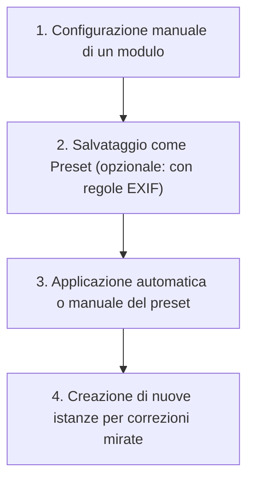

# Preset e istanze multiple

In darktable, i **presets** e le **istanze multiple** sono funzionalità fondamentali per ottimizzare il flusso di lavoro e gestire elaborazioni complesse. A differenza di Lightroom, dove si applicano "preimpostazioni" globali, in darktable i preset sono specifici per ogni singolo modulo e possono essere applicati automaticamente in base ai metadati EXIF, mentre le istanze multiple permettono di eseguire lo stesso modulo più volte nella pipeline con impostazioni diverse.[^presets][^module-header]

!!! info "Gestione centralizzata"
    Tutti i preset definiti possono essere visualizzati, esportati o importati tramite la schermata *Preferences > presets*, accessibile anche dal menu dei preset nel pannello dei moduli.[^preferences-presets]

## Panoramica

Le funzionalità trattate in questa sezione riguardano due aspetti distinti ma correlati gestibili tramite l'intestazione (header) di ogni modulo di elaborazione:

1.  **Presets** -- Permettono di salvare qualsiasi combinazione di parametri di un modulo per riutilizzarla in futuro. I preset possono essere interni (forniti da darktable) o definiti dall'utente.[^presets]
2.  **Istanze Multiple** -- Consente di attivare più copie dello stesso modulo nella pipeline. Ogni istanza opera sul risultato dell'istanza precedente, permettendo correzioni locali o sequenziali (ad esempio, due istanze di *exposure* o *color balance rgb* per aree diverse dell'immagine).[^module-header]

## Flusso di lavoro consigliato

L'utilizzo combinato di preset e istanze multiple segue tipicamente questo schema logico:

### Passo 1: Creare un Preset

Dopo aver regolato i parametri di un modulo:

1. Clicca sull'icona del **menu preset** (l'icona a destra nell'header del modulo).
2. Seleziona **store new preset**.[^presets]
3. Nel campo *name*, inserisci il nome. Usa il carattere `|` (barra verticale) per creare categorie e sottocategorie (es. `MiaObiettivo|24-70mm`).[^presets]
4. Compila la *description* (ricercabile) e definisci se **reset all module parameters to their default values** (utile per creare preset che resettano il modulo invece di applicare valori fissi).[^presets]

### Passo 2: Auto-applicazione basata su EXIF

I preset possono essere applicati automaticamente all'apertura di un'immagine se questa corrisponde a criteri specifici. Questo è potente per correggere automaticamente difetti di obiettivo o comportamenti ISO specifici.[^presets]

Nella finestra di creazione preset, spunta **auto apply this preset to matching images** e definisci i filtri:

| Criterio | Descrizione | Note |
|----------|-------------|------|
| **Model** | Pattern corrispondente al modello della fotocamera | Usa `%` come wildcard.[^presets] |
| **Maker** | Pattern corrispondente al produttore | Usa `%` come wildcard.[^presets] |
| **Lens** | Pattern corrispondente all'obiettivo | Usa `%` come wildcard.[^presets] |
| **ISO** | Range di sensibilità | Mostra `∞` se il limite superiore è illimitato.[^presets] |
| **Exposure** | Range di tempo di esposizione | Usa `+` per esposizioni arbitrariamente lunghe.[^presets] |
| **Aperture** | Range di apertura | Da `f/0` (aperto) a `f/+` (chiuso arbitrariamente).[^presets] |
| **Focal length** | Range di lunghezza focale | Da `0` a `1000` mm.[^presets] |
| **Format** | Tipo di file | Checkbox per: raw, non-raw, HDR, monochrome, color.[^presets] |

!!! tip "Riapplicare preset automatici"
    Se disabiliti e riabiliti un modulo, puoi riapplicare i preset automatici facendo **Ctrl+click** sul pulsante *reset* nell'header del modulo.[^presets]

### Passo 3: Gestire le Istanze Multiple

Per utilizzare più volte lo stesso modulo:

1. Fai **clic destro** sull'icona del **menu multi-instance** (l'icona con le tre linee orizzontali e un piccolo triangolo, a destra del nome del modulo) per creare direttamente una nuova istanza.[^module-header]
2. Oppure, apri il menu e seleziona l'opzione per creare una nuova istanza.
3. La nuova istanza verrà chiamata automaticamente `nome modulo 1`, `nome modulo 2`, ecc.[^module-header]

Puoi rinominare un'istanza per distinguerla (es. "Esposizione viso" vs "Esposizione sfondo") facendo **Ctrl+click** sul nome del modulo nell'header.[^module-header]

!!! warning "Ordine della pipeline"
    Le istanze multiple vengono processate nell'ordine in cui appaiono nel pannello (dal basso verso l'alto). L'istanza successiva riceve l'immagine già elaborata da quella precedente.[^pixelpipe]

## Parametri e Opzioni

### Opzioni del Dialogo Preset

Quando crei o modifichi un preset, hai accesso a questi controlli specifici:[^presets]

| Parametro | Funzione |
|-----------|----------|
| **Name** | Nome del preset. Usa `|` per creare gerarchie (es. `Famiglia|Sottomenu`). |
| **Description** | Testo opzionale descrivente il preset, utilizzabile per la ricerca. |
| **Auto apply this preset...** | Attiva l'applicazione automatica basata sui metadati definiti sotto. |
| **Only show this preset...** | Mostra il preset nel menu solo se l'immagine corrisponde ai criteri (filtro visivo). |
| **Reset all module parameters...** | Se selezionato, il preset resetta il modulo ai valori predefiniti invece di caricare valori specifici. |

### Preferenze correlate

In *Preferences > darkroom > modules*, puoi configurare il comportamento delle istanze e dei preset:[^preferences-darkroom]

| Impostazione | Descrizione | Default |
|--------------|-------------|---------|
| **Prompt for name on addition of new instance** | Chiede immediatamente di rinominare una nuova istanza appena creata. | Off |
| **Automatically update module name** | Aggiorna il nome dell'istanza se i parametri corrispondono a un preset salvato. | On |
| **Hide built-in presets** | Nasconde i preset interni di darktable, mostrando solo quelli utente. | Off |

## Consigli e Best Practices

!!! tip "Sovrascrivere i preset interni"
    Se crei un preset utente con lo stesso nome di uno interno (built-in), la tua versione prevarrà e quella interna non sarà più accessibile finché il tuo preset esiste. Eliminando il tuo preset, quello interno tornerà visibile al riavvio.[^presets]

!!! warning "Conflitti tra preset automatici"
    Se più preset soddisfano i criteri di auto-applicazione per una stessa immagine, darktable creerà un'istanza separata del modulo per ciascun preset, nell'ordine in cui sono stati definiti (l'ultimo creato sarà in fondo alla lista).[^presets]

!!! info "Nomi delle istanze"
    La prima istanza di un modulo ha un nome vuoto (solo il nome del modulo). Le istanze successive ricevono un suffisso numerico automatico (es. `exposure 1`). È buona pratica rinominarle per mantenere l'ordine logico (es. usando numeri `01`, `02` se l'ordinamento alfabetico influenza la visualizzazione, anche se l'ordine di elaborazione è fisso nella pipeline).[^module-header]

## Risorse aggiuntive

- **Guida utente darktable**: Sezione *processing modules > presets* per dettagli sulla creazione e gestione.[^presets]
- **Guida utente darktable**: Sezione *preferences > presets* per gestione globale (import/export).[^preferences-presets]
- **Guida utente darktable**: Sezione *the pixelpipe & module order* per comprendere l'impatto dell'ordine delle istanze.[^pixelpipe]

## Fonti

[^presets]: https://docs.darktable.org/usermanual/development/en/darkroom/processing-modules/presets/#
[^module-header]: https://docs.darktable.org/usermanual/development/en/darkroom/processing-modules/module-header/#
[^preferences-darkroom]: https://docs.darktable.org/usermanual/development/en/preferences-settings/darkroom/#
[^preferences-presets]: https://docs.darktable.org/usermanual/development/en/preferences-settings/presets/#
[^pixelpipe]: https://docs.darktable.org/usermanual/development/en/darkroom/pixelpipe/the-pixelpipe-and-module-order/
