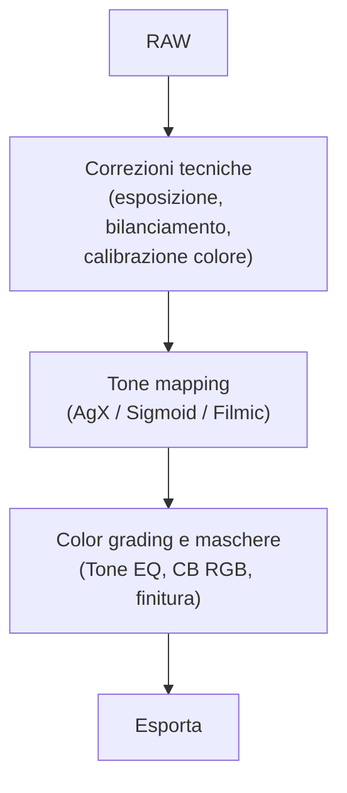

# Flusso di lavoro

Dall'importazione all'esportazione: ogni passo nel giusto ordine.

!!! tip "Il 90% delle foto"
    La maggior parte delle immagini richiede solo i passaggi 3-7. Le correzioni tecniche si automatizzano con i preset, le maschere si usano solo per regolazioni mirate, e la finitura è opzionale.

## Sequenza raccomandata

| Fase | Operazione | Modulo | Dettaglio |
|------|-----------|--------|-----------|
| 1 | [Importazione e organizzazione](import.md) | Lighttable | Organizzazione, stelle, etichette |
| 2 | [Correzioni tecniche](../modules/lens-correction.md) | Lens Correction, Demosaic, Denoise | Auto-preset consigliati |
| 3 | [Esposizione](exposure.md) | Exposure | Posizionare il grigio medio |
| 4 | [Gestione colore](color.md) | Color Calibration | Tab CAT, adattamento cromatico |
| 5 | [Tone mapping](tone.md) | AgX / Sigmoid / Filmic | Uno solo alla volta |
| 6 | [Scultura della luce](../modules/tone-equalizer.md) | Tone Equalizer | Interazione mouse sull'immagine |
| 7 | [Color grading](../modules/color-balance-rgb.md) | Color Balance RGB | Vibrance + look creativo |
| 8 | [Maschere (se necessario)](../masking/index.md) | Drawn / Parametric / AI | Solo per regolazioni mirate |
| 9 | [Finitura](../modules/diffuse-sharpen.md) | Diffuse or Sharpen | Con parsimonia |
| 10 | [Esportazione](export.md) | Export | sRGB per web, AdobeRGB per stampa |

## 10 principi universali

Dall'analisi di 12 video-tutorial di *A Dabble in Photography*:

1. **Attivare sempre il capture sharpening** all'inizio nel modulo Demosaic[^pipeline]
2. **Impostare i punti nero/bianco** all'inizio del workflow AgX[^agx]
3. **Usare il bordo bianco** (`Cmd+B`) per valutare l'esposizione[^firststeps]
4. **Duplicare i moduli** per separare creazione maschera e regolazioni[^landscape]
5. **Creare le maschere in cima alla pipeline** per massima compatibilita'[^dt54]
6. **Monitorare le modalita' di fusione** -- Multiply clippa le alte luci; preferire Overlay[^dragan]
7. **Usare feathering/opacita'** invece di modifiche drastiche ai parametri[^nightsky]
8. **Vettorizzare le maschere raster esterne** per risparmiare spazio[^aimasks]
9. **Sfruttare il sistema snapshot** per confronti prima/dopo[^dt52]
10. **Salvare stili/preset** per consistenza nel batch editing[^pipeline]

## Fonti

[^firststeps]: *[darktable first steps ep01](https://www.youtube.com/watch?v=P4cL61ZHqFw)* -- A Dabble in Photography
[^pipeline]: *[The darktable pipeline for beginners](https://www.youtube.com/watch?v=1nPW6WPhhTo)* -- A Dabble in Photography
[^agx]: *[A guide to AGX in darktable](https://www.youtube.com/watch?v=iaZ2-QvOHyA)* -- A Dabble in Photography
[^dt54]: *[darktable 5.4 NEW UPDATE](https://www.youtube.com/watch?v=yiTqUgoWg6Q)* -- A Dabble in Photography
[^dt52]: *[New Release: darktable 5.2](https://www.youtube.com/watch?v=YcLJMaDbfRA)* -- A Dabble in Photography
[^dragan]: *[The Dragan effect in darktable](https://www.youtube.com/watch?v=EuvG0lh8OB8)* -- A Dabble in Photography
[^nightsky]: *[darktable Night Sky Full Edit](https://www.youtube.com/watch?v=5P0Yj_vqy5w)* -- A Dabble in Photography
[^landscape]: *[Darktable landscape edit with AI](https://www.youtube.com/watch?v=OERXOFz9lEo)* -- A Dabble in Photography
[^aimasks]: *[AI masks in darktable](https://www.youtube.com/watch?v=7yd5riDmUjk)* -- A Dabble in Photography
