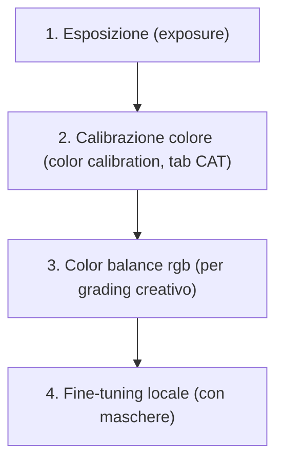

# Color Grading Avanzato: Bilanciamento Colore RGB in darktable

Il modulo **color balance rgb** è lo strumento di *secondary color grading* avanzato per il flusso scene-referred, ispirato al cinema e progettato per operare in spazi cromatici perceptualmente uniformi (JzAzBz e darktable UCS) [^dt48-color-balance-rgb]. Sostituisce progressivamente il vecchio modulo *color balance*, offrendo controllo indipendente su ombre, mezzitoni e luci, con maschere luminose pre-calibrate e gestione precisa della saturazione senza shift cromatici [^dt48-color-balance-rgb].

!!! tip "Color balance rgb ≠ color balance"
    Il modulo *color balance* è deprecato per il workflow scene-referred. *color balance rgb* opera in uno spazio lineare RGB progettato per la correzione cromatica fine, mentre *color balance* lavora in Lab e introduce artefatti tonali [^dt48-color-balance-rgb][^dt48-color-balance].

## Panoramica

Il modulo si articola in tre schede principali:

1. **Master**: controllo globale di *hue*, *vibrance*, *contrast*, *brilliance* e *saturation*
2. **4 ways**: regolazioni ASC CDL (*lift*, *gamma*, *gain*, *offset*, *power*) applicate su maschere luminose
3. **Masks**: configurazione avanzata delle maschere di luminanza e dei fulcri cromatici

La sua forza risiede nella separazione fisica tra **luminanza** e **crominanza**, che permette di modificare la saturazione senza alterare la luminosità — un comportamento impossibile nei moduli legacy [^dt48-color-balance-rgb].

A differenza di Lightroom, qui ogni parametro ha una definizione CIE rigorosa:  
- **Chroma**: distanza dal grigio neutro a *luminanza costante*  
- **Saturation**: rapporto tra crominanza e *brilliance* (percezione visiva)  
- **Brilliance**: luminanza relativa al contesto circostante [^dt48-color-dimensions]

## Flusso di lavoro consigliato

Il flusso ottimale segue l’ordine della pipeline scene-referred [^workflow-manual]:

!!! warning "Non invertire l'ordine"
    Applicare *color balance rgb* prima di *color calibration* produce risultati imprevedibili: la calibrazione del colore deve stabilire un punto di partenza neutro prima di qualsiasi grading creativo [^dt48-color-balance-rgb].

### Passo 1: Preparazione con color calibration

Prima di toccare *color balance rgb*, assicurati che *color calibration* sia impostato su **CAT16** e che l’illuminante sia corretto (es. “detect from surfaces” o “as shot in camera”) [^dt48-color-calibration]. Questo garantisce che i colori siano fisicamente coerenti prima del grading.

### Passo 2: Selezione del profilo iniziale

Nella scheda **Master**, usa il menu a tendina *profile* per scegliere un punto di partenza:
- `basic colorfulness|standard`: bilanciamento neutro, leggera vividezza — ideale per ritratti [^iaZ2-QvOHyA]
- `cinematic teal/orange`: look da film, con verde-ciano attenuato e arancio accentuato [^dt48-color-balance-rgb]
- `monochrome|film`: conversione in bianco e nero basata sulla sensibilità spettrale delle emulsioni [^dt34-color-calibration]

!!! tip "Perché non partire da zero?"
    I profili sono preset testati che rispettano le regole del gamut e della linearità. Partire da `neutral` richiede conoscenze avanzate di teoria del colore e aumenta il rischio di clipping cromatico [^dt48-color-balance-rgb].

### Passo 3: Regolazione master

Applica modifiche globali solo se necessarie — evita di sovraccaricare il modulo:

| Parametro | Valore tipico | Effetto pratico | Quando usarlo |
|-----------|-------------|-----------------|----------------|
| **Hue shift** | -5° a +5° | Rotazione globale dell’intero cerchio cromatico | Correggere dominanti ambientali (es. luce fluorescente gialla) [^dt48-color-balance-rgb] |
| **Global vibrance** | 10–30% | Aumenta la crominanza dei colori *poco saturi*, preservando quelli già vividi | Dare “pop” ai toni medi senza bruciare i rossi del tramonto [^dt48-color-balance-rgb] |
| **Contrast** | 0.1–0.4 | Aumenta la separazione tonale *a crominanza costante* | Aggiungere profondità senza desaturare [^dt48-color-balance-rgb] |
| **Global saturation** | -15% a +25% | Scala la crominanza proporzionalmente all’input | Recuperare vividezza dopo AGX (che desatura naturalmente le alte luci) [^iaZ2-QvOHyA] |

### Passo 4: Controllo per zone (4 ways)

Questa è la fase più potente: regola separatamente ombre, mezzitoni e luci usando le maschere predefinite [^dt48-color-balance-rgb].

#### Esempio pratico: ritratto con cielo blu intenso

1. Nella scheda **4 ways**, attiva **shadows lift**  
   - Imposta *red*: 0.95, *green*: 0.97, *blue*: 1.02 → apri le ombre senza aggiungere freddo [^MJJR8DJ3rr8]  
2. Attiva **highlights gain**  
   - Imposta *red*: 1.03, *green*: 0.94, *blue*: 0.89 → attenua il blu del cielo per evitare clipping [^iaZ2-QvOHyA]  
3. Usa **global power** per bilanciare:  
   - *red*: 0.99, *green*: 1.00, *blue*: 1.01 → leggero aumento di brillianza sulle luci senza shift [^dt48-color-balance-rgb]

!!! info "Maschere luminose: come funzionano"
    Le maschere sono calcolate *all’ingresso del modulo*, quindi sono insensibili alle modifiche interne. La curva di transizione è definita da `shadows fall-off` (default: 0.25) e `highlights fall-off` (default: 0.25) [^dt48-color-balance-rgb].

## Parametri principali

| Parametro | Range | Default | Descrizione |
|-----------|-------|---------|-------------|
| **Hue shift** | -180° to +180° | 0° | Rotazione cromatica globale, a luminanza costante [^dt48-color-balance-rgb] |
| **Global vibrance** | -100% to +100% | 0% | Aumenta la crominanza dei pixel a bassa crominanza, privilegiando i neutri [^dt48-color-balance-rgb] |
| **Contrast** | -1.0 to +1.0 | 0.0 | Contrasto tonale a crominanza costante; fulcro predefinito a 18.45% [^dt48-color-balance-rgb] |
| **Global saturation** | -100% to +100% | 0% | Scala la crominanza proporzionalmente all’input, a tonalità costante [^dt48-color-balance-rgb] |
| **Global brilliance** | -100% to +100% | 0% | Scala la luminanza proporzionalmente all’input, a tonalità costante [^dt48-color-balance-rgb] |
| **Shadows lift (R/G/B)** | 0.0 to 2.0 | 1.0 / 1.0 / 1.0 | Moltiplicatore RGB per le ombre (maschera < 30% luminanza) [^dt48-color-balance-rgb] |
| **Highlights gain (R/G/B)** | 0.0 to 2.0 | 1.0 / 1.0 / 1.0 | Moltiplicatore RGB per le luci (maschera > 70% luminanza) [^dt48-color-balance-rgb] |
| **Global power (R/G/B)** | 0.0 to 2.0 | 1.0 / 1.0 / 1.0 | Esponente RGB globale, normalizzato al white fulcrum (default: 18.45%) [^dt48-color-balance-rgb] |

## Gestione avanzata della saturazione

Il modulo offre due algoritmi per il controllo della saturazione, selezionabili nella scheda **Masks** → *saturation formula*:

| Algoritmo | Vantaggi | Svantaggi | Default |
|-----------|----------|-----------|---------|
| **JzAzBz (2021)** | Basato su standard HDR, accuratezza teorica | Non considera l’effetto Helmholtz-Kohlrausch (i colori vividi appaiono più luminosi) [^dt48-color-balance-rgb] | ❌ |
| **darktable UCS (2022)** | Modellato su dati psicofisici reali, gestisce meglio il gamut e l’HK-effect [^dt48-color-balance-rgb] | Richiede più potenza CPU | ✅ |

!!! tip "Quando usare darktable UCS"
    Sempre. È l’algoritmo predefinito perché mantiene la coerenza percettiva: un rosso intenso appare più luminoso di un grigio chiaro, esattamente come nella realtà [^dt48-color-balance-rgb].

## Consigli operativi

- **Usa il vectorscope**: attivalo con `Ctrl+Shift+V`. Ti mostra la distribuzione cromatica reale: se i pixel si ammassano oltre il bordo del cerchio, stai uscendo dal gamut [^dt48-color-balance-rgb].  
- **Verifica il clipping**: abilita *display sample in vectorscope* nel modulo *color calibration* per monitorare i valori cromatici in tempo reale [^DzdGL30lYjU].  
- **Evita il doppio contrasto**: non usare *contrast* in *color balance rgb* se hai già applicato *tone equalizer* o *AGX contrast* — genera artefatti [^dt48-color-balance-rgb].  
- **Salva i preset per scena**: crea uno stile chiamato `Ritratto_esterno_sole`, `Paesaggio_nuvoloso`, ecc., per riutilizzare rapidamente combinazioni testate [^MJJR8DJ3rr8].

### Esempio: Neutralizzazione intelligente di colori dominanti  
*Da [Some Color calibration ideas](https://www.youtube.com/watch?v=MJJR8DJ3rr8) (timestamp 12:44)*  
1. Apri il modulo **color balance rgb**, vai alla scheda **4 ways**, e clicca sul pulsante *color picker* accanto a **shadows lift**  
2. Disegna un rettangolo su un’area neutra nelle ombre (es. un pavimento in ombra con illuminazione diffusa)  
3. Il modulo calcola automaticamente i valori RGB per neutralizzare quella zona: *red*: 0.98, *green*: 0.99, *blue*: 1.01  
4. Ripeti per **highlights gain**, selezionando un’area neutra nelle luci (es. una parete bianca illuminata direttamente)  
5. Applica **global power** con *red*: 0.995, *green*: 1.002, *blue*: 1.008 per bilanciare la gamma dinamica complessiva  

### Esempio: Creazione di un look “cinematic teal/orange”  
*Da [A guide to AgX in darktable](https://www.youtube.com/watch?v=iaZ2-QvOHyA) (timestamp 27:15)*  
1. Nella scheda **Master**, carica il preset `cinematic teal/orange`  
2. Nella scheda **4 ways**, disattiva **global offset**, **shadows lift**, e **mid-tones gamma**, lasciando attivi solo **highlights gain** e **global power**  
3. Regola **highlights gain** a *red*: 1.07, *green*: 0.92, *blue*: 0.85 per accentuare l’arancio nelle luci  
4. Imposta **global power** a *red*: 0.99, *green*: 1.01, *blue*: 1.03 per rinforzare il ciano nelle ombre  
5. Usa **Masks** → *saturation formula* = `darktable UCS` e abbassa **Global saturation** a -8% per evitare oversaturation sui toni intermedi  

## Domande frequenti

### Problema: Il modulo color balance rgb non risponde ai color picker  
Alcuni utenti segnalano che i color picker non registrano alcun valore quando cliccati su aree neutre. Questo accade perché il modulo opera *dopo* il blocco di calibrazione cromatica, ma i color picker agiscono sull’output finale del pixelpipe. Per un’accuratezza massima, usa il **global color picker** (Ctrl+Alt+C) invece dei color picker integrati: esso campiona nell’ultimo stadio della pipeline e restituisce valori RGB corretti anche in presenza di maschere complesse [^global-color-picker].  

### Problema: I valori RGB inseriti manualmente vengono “arrotondati”  
I cursori RGB di *shadows lift* e *highlights gain* hanno un range di input limitato a 0.0–2.0, ma i valori interni sono memorizzati con precisione IEEE-754 float32. L’apparente arrotondamento è dovuto alla quantizzazione visiva dell’interfaccia: puoi comunque inserire valori come `1.037` digitandoli direttamente dopo aver fatto click destro sul cursore [^dt48-color-balance-rgb].  

### Problema: Differenze tra *color balance rgb* e *color zones*  
Il modulo *color zones* opera in CIE LCh e agisce su curve parametriche basate su luminanza/chroma/hue, ma non garantisce la conservazione della linearità RGB né la coerenza percettiva su tutta la gamma dinamica. *color balance rgb*, invece, è progettato per il flusso scene-referred e mantiene la relazione fisica tra luminanza e crominanza in modo robusto. Per questo motivo, *color zones* è sconsigliato per il grading primario e va usato solo per correzioni locali molto specifiche [^dt48-color-zones].  

## Tabella preset built-in

| Preset | Quando usarlo | Note |
|---|---|---|
| `basic colorfulness\|standard` | Ritratti, paesaggi naturali, editing neutro | Punto di partenza sicuro per tutti i casi, con lieve aumento di crominanza nei toni medi [^iaZ2-QvOHyA] |
| `cinematic teal/orange` | Film, pubblicità, immagini ad alto impatto visivo | Ottimizzato per il gamut Rec.2020; richiede un tone mapper HDR (AgX/Sigmoid) per essere visualizzato correttamente [^dt48-color-balance-rgb] |
| `monochrome\|film` | Conversione B/N artistica | Simula la risposta spettrale di emulsioni analogiche (es. Ilford HP5), non semplice desaturazione [^dt34-color-calibration] |
| `neutral` | Calibrazione tecnica avanzata | Nessuna modifica applicata; usare solo per analisi o come base per scripting personalizzato [^dt48-color-balance-rgb] |

## Risorse

- [Modulo color calibration](../modules/color-calibration.md) — per la calibrazione primaria  
- [Modulo AGX](../modules/agx.md) — per la compressione tonale pre-grading  

## Fonti

[^dt48-color-balance-rgb]: darktable user manual — color balance rgb, [https://docs.darktable.org/usermanual/development/en/module-reference/processing-modules/color-balance-rgb/](https://docs.darktable.org/usermanual/development/en/module-reference/processing-modules/color-balance-rgb/)
[^dt48-color-balance]: darktable user manual — color balance, [https://docs.darktable.org/usermanual/development/en/module-reference/processing-modules/color-balance/](https://docs.darktable.org/usermanual/development/en/module-reference/processing-modules/color-balance/)
[^dt48-color-dimensions]: darktable user manual — color dimensions, [https://docs.darktable.org/usermanual/development/en/special-topics/color-management/color-dimensions/](https://docs.darktable.org/usermanual/development/en/special-topics/color-management/color-dimensions/)
[^dt48-color-calibration]: darktable user manual — color calibration, [https://docs.darktable.org/usermanual/development/en/module-reference/processing-modules/color-calibration/](https://docs.darktable.org/usermanual/development/en/module-reference/processing-modules/color-calibration/)
[^dt34-color-calibration]: darktable 3.4 — color calibration module, [https://darktable.fr/posts/2020/12/darktable-3-4-la-revolution-colorimetrique-continue/](https://darktable.fr/posts/2020/12/darktable-3-4-la-revolution-colorimetrique-continue/)
[^iaZ2-QvOHyA]: [ENG] A guide to AgX in darktable, A Dabble in Photography, [https://www.youtube.com/watch?v=iaZ2-QvOHyA](https://www.youtube.com/watch?v=iaZ2-QvOHyA)
[^MJJR8DJ3rr8]: [ENG] Some Color calibration ideas, A Dabble in Photography, [https://www.youtube.com/watch?v=MJJR8DJ3rr8](https://www.youtube.com/watch?v=MJJR8DJ3rr8)
[^DzdGL30lYjU]: [ENG] darktable Full edit #1, A Dabble in Photography, [https://www.youtube.com/watch?v=DzdGL30lYjU](https://www.youtube.com/watch?v=DzdGL30lYjU)
[^workflow-manual]: Manuale_Flusso_Lavoro_darktable, Aprile 2026, darktable+
[^global-color-picker]: darktable user manual — global color picker, [https://docs.darktable.org/usermanual/development/en/module-reference/utility-modules/darkroom/global-color-picker/](https://docs.darktable.org/usermanual/development/en/module-reference/utility-modules/darkroom/global-color-picker/)
[^dt48-color-zones]: darktable user manual — color zones, [https://docs.darktable.org/usermanual/development/en/module-reference/processing-modules/color-zones/](https://docs.darktable.org/usermanual/development/en/module-reference/processing-modules/color-zones/)
