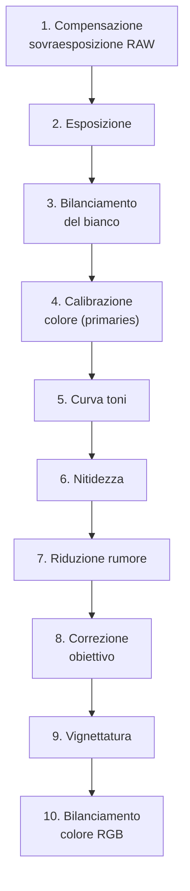

# Migrazione da Lightroom a darktable: Workshop pratico

Questo workshop guida passo-passo un utente proveniente da Lightroom nell’elaborazione di una fotografia RAW in **darktable 5.4+**, replicando un flusso tipico di sviluppo *Lightroom-style* — ma rispettando l’architettura tecnica e la filosofia di darktable: **scene-referred, non-destructive, modulare e controllabile**[^darktable-not-lightroom]. Non si tratta di “fare come Lightroom”, ma di *tradurre il proprio linguaggio creativo* in un sistema più profondo, meno opaco e completamente aperto[^lightroom-darktable-express-01].

!!! info "darktable ≠ clone gratuito"
    darktable non è un “Lightroom open source”: è un sistema di elaborazione basato su modelli fisici della luce (RGB lineare, scene-referred), mentre Lightroom opera in spazio gamma-encodato e con curve predefinite indesiderabili[^darktable-not-lightroom]. Questa differenza fondamentale implica che *non esiste un mapping 1:1 tra i moduli*, ma solo equivalenze funzionali.

---

## Panoramica del workflow

Il flusso qui descritto è stato testato su una foto RAW Canon EOS R6 (CR3) e replica un classico sviluppo Lightroom:  
**Esposizione → Bilanciamento colore → Dettagli → Correzioni geometriche → Stile finale**.  
Ogni modulo è posizionato nella pipeline in ordine ottimale per preservare la qualità e il controllo[^suivre-tutoriels-lr].

> ⚠️ **Attenzione**: In darktable, i moduli agiscono *in sequenza rigida*. L’ordine conta: ad esempio, `sharpening` deve venire *prima* di `denoise`, altrimenti il rumore viene accentuato[^de-lightroom-a-darktable-02].

---

## Passo 1: Apertura e prima valutazione

Apri l’immagine RAW in darktable:  
→ Seleziona la foto nella *lighttable*  
→ Premi `D` per entrare in *darkroom*  
→ Attiva la visualizzazione dell’istogramma (`Ctrl+H`)  

Osserva:
- L’istogramma mostra una distribuzione asimmetrica? (es. pila a sinistra = sottoesposta)  
- Il picco rosso/blu è fuori scala? → indica sbilanciamento cromatico o clipping  
- La preview mostra artefatti? (bande, frange cromatiche, macchie) → richiederà correzioni specifiche  

!!! tip "Prima regola: non toccare nulla subito"
    darktable applica già un profilo di ingresso e una curva base. Prima di modificare, premi `R` per **reimpostare tutti i moduli attivi** — così parti da uno stato pulito e coerente[^suivre-tutoriels-lr].

---

## Passo 2: Esposizione globale (`exposure`)

In Lightroom: *Basic > Exposure*  
In darktable: modulo **`exposure`**, scheda *Exposure*  

| Parametro | Valore tipico | Perché |
|-----------|----------------|--------|
| **Exposure compensation** | +0.30 a +1.20 EV | Compensa sottoesposizione misurata dal sensore; usa la pipetta sul grigio neutro (18%) per calibrare[^de-lightroom-a-darktable-02] |
| **Black level** | -0.05 a -0.25 | Recupera dettagli nelle ombre profonde senza appiattirle; evita valori < -0.30 (rischio banding) |
| **White point** | 0.98–0.995 | Imposta il punto di bianco massimo senza clipping; verifica con `O` (overexposure overlay) |

✅ **Cosa osservare**:  
- Attiva `O`: le zone in rosso sono *clippate* (luminanza > 1.0).  
- Se il rosso appare su cieli o luci speculari, riduci `Exposure compensation`.  
- Se non appare mai, l’immagine è probabilmente sottoesposta.

---

## Passo 3: Bilanciamento del bianco (`white balance`)

In Lightroom: *Basic > Temp/Tint*  
In darktable: modulo **`white balance`**, scheda *White balance*  

| Parametro | Valore tipico | Perché |
|-----------|----------------|--------|
| **Temperature** | 4500–6500 K | Usa la pipetta su una zona neutra (pavimento, muro, carta grigia); evita superfici riflesse o illuminate da fonti miste[^de-lightroom-a-darktable-02] |
| **Tint** | -5 a +10 | Corregge dominanti verdi/magenta; valori estremi (> ±15) indicano problemi di illuminazione o profilo errato |

⚠️ **Attenzione**: `white balance` agisce *prima* di `color calibration`. Se usi profili custom (es. DCP), applicali *prima* di questo modulo[^faire-comme-lightroom].

---

## Passo 4: Gestione del colore (`color calibration`)

In Lightroom: *Basic > Vibrance/Saturation* + *HSL*  
In darktable: modulo **`color calibration`**, scheda *Primaries*  

| Parametro | Valore tipico | Perché |
|-----------|----------------|--------|
| **Red/Green/Blue saturation** | +10% a +30% | Aumenta vividezza *senza* alterare l’equilibrio cromatico globale (meglio di `vibrance`)[^comment-changer-couleurs-lr] |
| **Red/Green/Blue hue shift** | -3° a +3° | Corregge sfumature imprecise (es. rossi troppo aranciati, blu troppo violacei) |
| **Gamut compression** | 85–95% | Previene il clipping cromatico nelle alte luci; valore 90% è sicuro per la maggior parte delle immagini[^de-lightroom-a-darktable-03] |

✅ **Cosa osservare**:  
- Abilita `gamut warning` (icona occhio): le aree gialle indicano colori fuori gamut sRGB.  
- Se compaiono molti gialli dopo `saturation`, abbassa `gamut compression`.

---

## Passo 5: Curva tonale (`tone curve`)

In Lightroom: *Tone Curve > Parametric* o *Point Curve*  
In darktable: modulo **`tone curve`**, scheda *Tone curve*  

Usa la modalità **point curve**, non parametric (più precisa e simile a Lightroom)[^suivre-tutoriels-lr]:  

| Punto | Coordinata (x,y) | Funzione |
|-------|------------------|----------|
| Nero | (0.00, 0.00) | Fissa il punto nero assoluto |
| Ombre | (0.15, 0.12) | Alza leggermente per aprire le ombre |
| Mezzitoni | (0.50, 0.48) | Leggera S-curve per contrasto naturale |
| Luci | (0.85, 0.82) | Controlla compressione luci senza desaturare |
| Bianco | (1.00, 1.00) | Fissa il punto bianco assoluto |

✅ **Cosa osservare**:  
- La curva deve essere sempre monotona crescente (nessun “gobbo”).  
- Se la curva scende, hai invertito i punti → premi `Reset curve`.

---

## Passo 6: Nitidezza e rumore (`sharpening` + `denoise (profiled)`)

In Lightroom: *Detail > Sharpening + Noise Reduction*  
In darktable: due moduli separati, in ordine rigoroso:  

### `sharpening` (prima del rumore)  
| Parametro | Valore tipico | Perché |
|-----------|----------------|--------|
| **Amount** | 45–70 | Valore sufficiente per sensori moderni (R6, A7IV, Z6II) |
| **Radius** | 0.9–1.3 | Evita effetti “halo”; >1.5 genera artefatti sui bordi |
| **Threshold** | 15–25 | Ignora il rumore nelle zone omogenee (cielo, pelle) |

### `denoise (profiled)` (dopo il sharpening)  
| Parametro | Valore tipico | Perché |
|-----------|----------------|--------|
| **Strength** | 25–45 | Regola in base all’ISO: ISO 100 → 25, ISO 3200 → 45 |
| **Spatial detail** | 20–35 | Preserva texture fine (capelli, tessuti) |
| **Range detail** | 15–25 | Controlla rumore cromatico (macchie rosse/verdi) |

⚠️ **Attenzione**: `denoise (non-local means)` è più aggressivo e meno preciso — evitalo per lavori professionali[^de-lightroom-a-darktable-03].

---

## Passo 7: Correzioni geometriche (`lens correction` + `vignetting`)

In Lightroom: *Lens Corrections > Profile + Manual*  
In darktable:  

### `lens correction`  
- Abilita **Enable distortion correction**, **Enable chromatic aberration correction**, **Enable vignetting correction**  
- Seleziona il profilo corretto (es. `Canon RF 24-105mm f/4L IS USM`)  
- Se il profilo manca: usa `manual` → `Distortion` (-5 a +10), `Multiplier` (0.95–1.05)  

### `vignetting`  
| Parametro | Valore tipico | Perché |
|-----------|----------------|--------|
| **Strength** | -15 a -40 | Compensa vignettatura ottica (valore negativo = attenuazione) |
| **Scale** | 50–70 | Controlla l’estensione radiale della correzione |
| **Center X/Y** | 0.00 / 0.00 | Allinea al centro ottico (modifica solo se l’immagine è fortemente decentrata) |

✅ **Cosa osservare**:  
- Attiva `preview grid` (icona griglia): ti aiuta a valutare distorsione e vignettatura[^de-lightroom-a-darktable-04].

---

## Passo 8: Stile finale (`color balance rgb`)

In Lightroom: *Split Toning* o *Calibration*  
In darktable: modulo **`color balance rgb`**, scheda *Global*  

| Parametro | Valore tipico | Perché |
|-----------|----------------|--------|
| **Shadows hue/saturation** | 210° / +15% | Aggiunge un tocco freddo alle ombre (blu-ciano) |
| **Midtones hue/saturation** | 0° / +5% | Neutralità con leggera saturazione |
| **Highlights hue/saturation** | 30° / +10% | Tono caldo alle luci (giallo-ambra) |
| **Global saturation** | +5% a +12% | “Pop” finale senza artificiosità |

✅ **Consiglio avanzato**:  
Per un look “cinematografico”, abilita *Chroma blend mode* → `LCh` e usa `chroma` invece di `saturation` per un controllo più fisiologico del colore[^de-lightroom-a-darktable-05].

---

## Passo 9: Introduzione a `filmic rgb` (alternativa avanzata a `tone curve`)

In Lightroom: *Tone Curve + Highlights/Shadows* combinati  
In darktable: modulo **`filmic rgb`**, scheda *Scene* e *Look*  

Il modulo `filmic rgb` è il sostituto concettuale più potente del vecchio `base curve` e del `tone curve` per flussi *scene-referred*. È progettato per gestire dinamiche ampie, preservare i colori e offrire un controllo fisicamente coerente del tono[^filmic-rgb-intro].  

> ⚠️ **Attenzione**: `filmic rgb` deve essere inserito **dopo** `exposure`, `white balance`, `color calibration`, `demosaic`, `sharpening` e `denoise`, ma **prima** di `color balance rgb` e `vignetting`[^filmic-rgb-order].

### Esempio: configurazione base per scatto ETTR  
*Da [“filmic rgb: remap any dynamic range in darktable 3”](https://www.youtube.com/watch?v=zbPj_TqTF880) (timestamp 4:12)*  
1. Nella scheda *Scene*:  
   - `white relative exposure` = +3.2 EV (per immagine con esposizione a destra)  
   - `black relative exposure` = -6.8 EV  
   - `middle-gray luminance` = lasciato a default (non modificato)  
2. Nella scheda *Look*:  
   - `contrast` = 1.25  
   - `latitude` = 92%  
   - `shadows ↔ highlights balance` = -0.15  
3. Nella scheda *Options*:  
   - `preserve chrominance` = `JzAzBz`  
   - `contrast in shadows` = `soft`  
   - `contrast in highlights` = `medium`  

✅ **Cosa osservare**:  
- Attiva `look only` view (icona grafico): la curva centrale deve essere una S morbida, senza “gobbi” né tagli netti.  
- Se i punti bianchi/neri diventano rossi nel grafico, riduci `latitude` o ricalibra `white/black relative exposure`[^filmic-rgb-graphic-display].

---

## Passo 10: Correzioni tecniche avanzate (`demosaic` + `rotate perspective`)

In Lightroom: *Detail > Sharpening* + *Lens Corrections > Transform*  
In darktable:  

### `demosaic` (con capture sharpening)  
Disponibile da darktable 5.4+, questa funzione applica una nitidezza *durante* la demosaicizzazione, non dopo. È più efficace e meno rumorosa del `sharpening` tradizionale[^discuss-pixls-demosaic].  
- Abilita **Capture sharpening**  
- `radius` = 12 (valore calcolato automaticamente, ma regolabile tra 8–16)  
- `strength` = 0.85  
- `threshold` = 18  

✅ **Nota operativa**:  
Se compare l’errore *“cannot calculate reliable capture radius”*, disattiva temporaneamente `crop` e zooma a 1:1 prima di abilitare il modulo[^discuss-pixls-demosaic].

### `rotate perspective`  
Per correggere orizzonti inclinati o linee cadenti (es. architettura):  
- Abilita **Structure detection** → `Verticals`  
- `correction strength` = 0.65  
- `refinement` = 0.30  
- `rotation` = 0.0° (se la struttura è ben rilevata, non serve regolare manualmente)  

⚠️ **Attenzione**: non eccedere oltre `correction strength = 0.75`: genera artefatti di interpolazione e perdita di dettaglio nei bordi[^darktable-manual-rotate-perspective].

---

## Consigli operativi chiave

- **Non usare mai `base curve` per lo sviluppo**: è deprecata in darktable 5.4+ e interferisce con AGX[^dt54-update]. Usa `tone curve` o `AGX` al suo posto.  
- **I profili DCP non sono equivalenti a quelli Lightroom**: i profili Canon/Nikon in darktable sono generati da `dcraw` e possono differire. Usa `color calibration` per affinamenti locali[^darktable-not-lightroom].  
- **I preset Lightroom (.xmp) NON sono importabili**: darktable usa `.dtstyle`. Converti manualmente o usa strumenti esterni come [`lr2dt`](https://github.com/bradleybuda/lr2dt)[^de-lightroom-a-darktable-05].  
- **La gestione dei cataloghi è diversa**: darktable non ha “cataloghi” nel senso Lightroom. Usa cartelle fisiche + metadati XMP embedded[^de-lightroom-a-darktable-01].  
- **Per il tethering**: darktable supporta USB tethering nativo (Canon/Nikon/Sony), ma *senza anteprima live*: la foto appare solo dopo lo scatto[^tethering-avec-darktable].  
- **`base curve` è compatibile solo con `display-referred`**: se abilitato in un flusso `scene-referred`, causa clipping e comportamenti imprevedibili[^base-curve-display-referred].  
- **Usa `color assessment mode` (Ctrl+B) per ogni regolazione tonale**: il bordo bianco su sfondo grigio al 18% elimina gli errori percettivi causati dal contesto cromatico[^process-color-assessment].  

---

## Domande frequenti

### Problema: “L’immagine sembra piatta dopo aver abilitato `filmic rgb`”  
Ciò accade perché `filmic rgb` rimuove la compressione tonale precoce del `base curve`. Il “piatto” è in realtà neutralità fisica: i dati sono ora lineari e pronti per il grading. Applica `color balance rgb` per reintrodurre vividezza e atmosfera, non `saturation` globale[^filmic-rgb-prerequisites].

### Problema: “Il modulo `color balance rgb` non reagisce ai cursori”  
Verifica che il modulo sia abilitato *dopo* `filmic rgb` e *prima* di `vignetting`. Se è posizionato prima di `filmic`, i suoi effetti saranno compressi e impercettibili. Usa `history stack` per confermare l’ordine esatto[^color-balance-rgb-input].

### Problema: “Il rumore aumenta dopo aver applicato `sharpening`”  
Questo è normale: `sharpening` amplifica il rumore esistente. La soluzione è applicare `denoise (profiled)` *subito dopo*, non prima. L’ordine `sharpening` → `denoise (profiled)` è obbligatorio per un risultato pulito[^de-lightroom-a-darktable-02].

---

## Tabella preset built-in: `color balance rgb`

| Preset | Quando usarlo | Note |
|---|---|---|
| **basic colorfulness** | Come punto di partenza per saturazione globale | Imposta `global saturation = +12%`, `global vibrance = +8%`, `contrast = 0.95`[^color-balance-rgb-presets] |
| **teal/orange color-grading** | Per separazione soggetto/sfondo (ritratti) | Richiede due istanze mascherate: una per sfondo (teal), una per pelle (orange). Non usare su immagini con illuminazione mista[^color-balance-presets-teal-orange] |
| **Kodak Portra 400** | Emulazione film per ritratti naturali | Basato su LUT integrato; applicabile solo in modalità `slope, offset, power`[^color-balance-presets-kodak] |

---

## Risorse utili

- 📹 [Video tutorial “De Lightroom à darktable” (OuiOuiPhoto, 5 parti)](https://www.ouiouiphoto.fr/Wp/2018/02/de-lightroom-a-darktable/) — workflow completo passo-passo[^de-lightroom-a-darktable-01][^de-lightroom-a-darktable-05]  
- 📹 [“Faire comme Lightroom mais avec darktable” (David LaCivita)](https://www.youtube.com/watch?v=...) — confronto diretto risultati[^faire-comme-lightroom]  
- 📚 [Guida ufficiale darktable 5.4 (inglese)](https://www.darktable.org/usermanual/) — riferimento tecnico completo[^manual-agx]  
- 🛠️ [darktable-fr.org](https://darktable.fr) — tutorial in francese con esempi pratici e traduzioni[^darktable-fr]  
- 📹 [“darktable 5.4 - A Introductory Beginner Workflow” (Pixls.us forum)](https://discuss.pixls.us/t/darktable-5-4-a-introductory-beginner-workflow-and-interactive-walkthrough/54755) — walkthrough interattivo con file CR3 scaricabile[^discuss-pixls-demosaic]  
- 📘 [darktable.info — Scene-Referred Workflow](https://darktable.info/en/darktable-first-steps/understand/scene-referred-workflow/) — spiegazione concettuale con diagrammi[^darktable-info-scene-referred]  

---

## Fonti

[^darktable-not-lightroom]: darktable.fr, ["darktable n'est pas le clone gratuit de Lightroom"](https://darktable.fr/posts/2020/01/darktable-nest-pas-le-clone-gratuit-de-lightroom/)
[^suivre-tutoriels-lr]: darktable.fr, ["Suivre les tutoriels Lightroom avec darktable"](https://darktable.fr/posts/2016/04/suivre-les-tutoriels-lightroom-avec-darktable/)
[^de-lightroom-a-darktable-01]: darktable.fr, ["De Lightroom à darktable 01 – Importation et tri"](https://darktable.fr/posts/2018/02/de-lightroom-a-darktable-01-importation-et-tri/)
[^de-lightroom-a-darktable-02]: darktable.fr, ["De Lightroom à darktable 02 – Développement lightroom"](https://darktable.fr/posts/2018/02/de-lightroom-a-darktable-02-developpement-lightroom/)
[^de-lightroom-a-darktable-03]: darktable.fr, ["De Lightroom à darktable 03 – Développement Photoshop"](https://darktable.fr/posts/2018/02/de-lightroom-a-darktable-03-developpement-photoshop/)
[^de-lightroom-a-darktable-04]: darktable.fr, ["De Lightroom à darktable 04 - Autres fonctions"](https://darktable.fr/posts/2018/02/de-lightroom-a-darktable-04-autres-fonctions/)
[^de-lightroom-a-darktable-05]: darktable.fr, ["De Lightroom à darktable 05 - Migration et conclusion"](https://darktable.fr/posts/2018/02/de-lightroom-a-darktable-05-migration-et-conclusion/)
[^comment-changer-couleurs-lr]: darktable.fr, ["Comment changer les couleurs... comme avec Lightroom"](https://darktable.fr/posts/2018/04/comment-changer-les-couleurs-de-vos-photos-avec-darktable-comme-avec-la-selection-de-couleurs-de-lightroom/)
[^faire-comme-lightroom]: darktable.fr, ["Faire comme Lightroom mais avec darktable"](https://darktable.fr/posts/2017/07/faire-comme-lightroom-mais-avec-darktable/)
[^tethering-avec-darktable]: darktable.fr, ["Tethering avec darktable"](https://darktable.fr/posts/2018/01/tethering-avec-darktable/)
[^dt54-update]: darktable.org, ["Release Notes darktable 5.4"](https://www.darktable.org/2024/03/darktable-5-4-released/)
[^manual-agx]: darktable.org, ["User Manual – AGX module"](https://www.darktable.org/usermanual/ch03s04s01.html)
[^darktable-fr]: darktable.fr, community francese di darktable, [https://darktable.fr](https://darktable.fr)
[^lightroom-darktable-express-01]: darktable.fr, serie "De Lightroom à darktable", [https://darktable.fr/posts/2018/02/de-lightroom-a-darktable-01-importation-et-tri/](https://darktable.fr/posts/2018/02/de-lightroom-a-darktable-01-importation-et-tri/)
[^filmic-rgb-intro]: darktable.org, ["filmic rgb: remap any dynamic range in darktable 3"](https://www.youtube.com/watch?v=zbPj_TqTF880)
[^filmic-rgb-order]: darktable.org, ["User Manual – filmic rgb"](https://docs.darktable.org/usermanual/development/en/module-reference/processing-modules/filmic-rgb/#usage)
[^filmic-rgb-graphic-display]: darktable.org, ["User Manual – graphic display"](https://docs.darktable.org/usermanual/development/en/module-reference/processing-modules/filmic-rgb/#graphic-display)
[^discuss-pixls-demosaic]: discuss.pixls.us, ["darktable 5.4 - A Introductory Beginner Workflow"](https://discuss.pixls.us/t/darktable-5-4-a-introductory-beginner-workflow-and-interactive-walkthrough/54755)
[^darktable-manual-rotate-perspective]: darktable.org, ["User Manual – rotate and perspective"](https://docs.darktable.org/usermanual/development/en/module-reference/processing-modules/rotate-perspective/)
[^base-curve-display-referred]: darktable.org, ["User Manual – base curve"](https://docs.darktable.org/usermanual/development/en/module-reference/processing-modules/base-curve/#)
[^process-color-assessment]: darktable.org, ["User Manual – process"](https://docs.darktable.org/usermanual/development/en/overview/workflow/process/#color-assessment-mode)
[^color-balance-rgb-input]: darktable.org, ["User Manual – color balance rgb"](https://docs.darktable.org/usermanual/development/en/module-reference/processing-modules/color-balance-rgb/#)
[^color-balance-rgb-presets]: darktable.org, ["User Manual – color balance rgb presets"](https://docs.darktable.org/usermanual/development/en/module-reference/processing-modules/color-balance-rgb/#presets)
[^color-balance-presets-teal-orange]: darktable.org, ["User Manual – color balance presets (§ teal/orange)"](https://docs.darktable.org/usermanual/development/en/module-reference/processing-modules/color-balance/#presets)
[^color-balance-presets-kodak]: darktable.org, ["User Manual – color balance presets (§ Kodak Portra)"](https://docs.darktable.org/usermanual/development/en/module-reference/processing-modules/color-balance/#presets)
[^darktable-info-scene-referred]: darktable.info, ["Scene-Referred Workflow"](https://darktable.info/en/darktable-first-steps/understand/scene-referred-workflow/)
