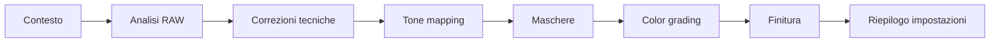

# Workshop -- Casi pratici di editing

Esercitazioni passo-passo basate su video-tutorial reali e articoli della community. Ogni caso mostra il **perche'** dietro ogni scelta, non solo il **come**.

!!! tip "Come usare queste guide"
    Ogni pagina e' un case study completo: parte dall'immagine RAW non elaborata e arriva al risultato finale. Segui i passi nell'ordine, ma adatta i valori alla tua immagine -- i numeri indicati sono punti di partenza, non regole assolute.

## Casi disponibili

| Caso | Genere | Tone mapper | Difficolta' |
|------|--------|-------------|-------------|
| [Bianco e Nero](black-white.md) | IR / Monocromatico | Filmic RGB | Intermedia |
| [Ritratto](portrait.md) | Chiaroscuro / Dragan | AgX / Tone Curve | Intermedia |
| [Paesaggio](landscape.md) | Tramonto con albero | Sigmoid | Avanzata |
| [Scarsa illuminazione](lowlight.md) | Concerto / Notturno | AgX | Intermedia |

## Cosa impari in ogni caso

=== "Bianco e Nero"
    Conversione monocromatica da foto infrarosso, scambio canali RGB, maschere parametriche basate su crominanza, viraggio con Color Balance RGB.

=== "Ritratto"
    Effetto Dragan (alto contrasto), modalita' di fusione, ritocco selettivo dei colori della pelle, contrasto locale, vignettatura creativa.

=== "Paesaggio"
    Maschere combinate (disegnata + parametrica), riutilizzo delle maschere raster, effetto luce solare, gestione della foschia, calibrazione avanzata.

=== "Scarsa illuminazione"
    Esposizione aggressiva su ISO alti, AGX per controllo tonale, Color Equalizer per brillanza, gestione del rumore senza perdere dettaglio.

## Principi trasversali

Dall'analisi dei video-tutorial di *A Dabble in Photography* e degli articoli pixls.us:

1. **L'ordine conta** -- le maschere vanno create in cima alla pipeline per massima compatibilita'
2. **Duplicare i moduli** -- separa creazione maschera e regolazioni in istanze diverse
3. **Monitorare le modalita' di fusione** -- Multiply clippa le alte luci; Overlay e' piu' sicuro
4. **Usare feathering/opacita'** -- evita modifiche drastiche ai parametri
5. **Sfruttare gli snapshot** -- confronti prima/dopo ad ogni passaggio chiave

## Struttura di ogni caso

Ogni pagina segue questa struttura:

Le tabelle **Riepilogo impostazioni** a fine pagina riassumono tutti i moduli e i parametri usati, per riferimento rapido.

