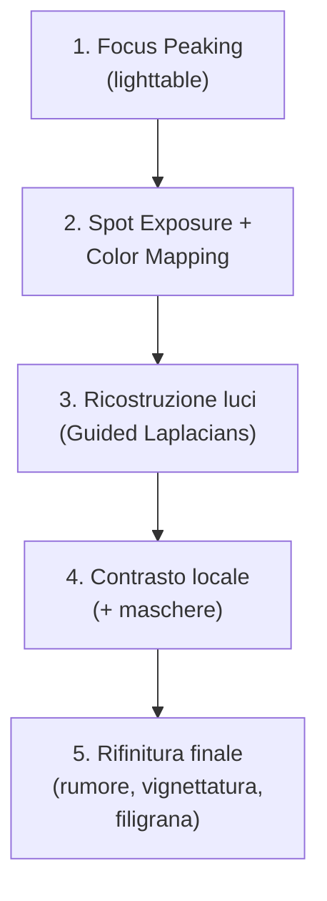

# Macro Close-Up Photography in darktable

Il flusso di lavoro per la **macro close-up photography** in darktable richiede un approccio specifico: alta fedeltà cromatica, controllo millimetrico del contrasto locale, gestione precisa delle alte luci (spesso sovraesposte su fondi neri o sfocati), e supporto nativo al *focus stacking* tramite integrazione esterna[^focus-stacking-video]. A differenza della fotografia paesaggistica o ritrattistica, la macro richiede una pipeline che preservi i dettagli microscopici senza introdurre artefatti di denoising, desaturazione o clipping tonale.

!!! tip "Macro ≠ solo ingrandimento"
    La post-produzione macro non è semplice “zoom e nitidezza”. È una gestione di tre livelli simultanei:  
    1. **Geometrico**: allineamento perfetto dei piani di fuoco (focus stacking)  
    2. **Tono**: recupero dei dettagli nelle zone luminose (petali, gocce, riflessi) senza appiattimento  
    3. **Cromatico**: stabilità del colore su superfici microscopiche (es. venature di foglie, peli di insetti), dove anche 1° di hue shift è visibile[^focus-stacking-video][^dt40-update]

## Panoramica del flusso di lavoro

Il workflow macro in darktable si articola in **5 fasi sequenziali**, con priorità assoluta alla conservazione dei dati RAW:

Ogni fase opera su dati *scene-referred*, senza conversione prematura in output-referred. Questo garantisce che le correzioni siano fisicamente coerenti con la profondità di campo reale e la distribuzione luminosa dell’oggetto.

## Flusso di lavoro pratico passo-passo

### Passo 1: Identificazione del piano a fuoco con Focus Peaking

Prima di aprire la *Camera Oscura*, attiva **Focus Peaking** in modalità *lighttable* per identificare l’immagine campione della sequenza di focus stacking:

- Premi `P` per abilitare il focus peaking  
- Regola la sensibilità (`Shift + P`) fino a quando i bordi nitidi (es. contorno di un petalo, antenne di un insetto) appaiono con un contorno rosso fluoresccente  
- Seleziona l’immagine con il massimo dettaglio nel punto di interesse (non necessariamente quella più centrale)  

!!! info "Focus peaking è essenziale per macro"
    In darktable 5.4+, il focus peaking usa l’algoritmo *Laplacian of Gaussian* (LoG) ottimizzato per alti rapporti di contrasto locali — ideale per bordi netti su sfondi sfocati[^focus-stacking-video]. Non è un surrogato del focus stacking, ma lo strumento per scegliere correttamente l’immagine di riferimento.

### Passo 2: Allineamento tonale e cromatico con Spot Mapping

Usa **Spot Exposure Mapping** e **Spot Color Mapping** per uniformare esposizione e colore tra tutte le immagini della sequenza — cruciale per evitare banding nello stacking:

- Apri l’immagine campione → modulo `exposure` → clicca il pulsante rosso **Spot Exposure Mapping**  
- Clicca con il pipetta su un’area neutra (es. stelo verde chiaro, fondo grigio neutro):  
  - `lightness target`: 42–58% (valore tipico per zone medie in macro)  
  - `exposure correction`: valore calcolato automaticamente (es. `+0.327 EV`)  
- Ripeti con `color calibration` → scheda *Spot Color Mapping* → `correction` mode  
- Campiona un punto di riferimento cromatico (es. petalo viola):  
  - `hue_target`: 298–312° (viola freddo)  
  - `chroma_target`: 42–65% (saturazione media per pigmenti naturali)  
  - `lightness_target`: 48–54%  

!!! warning "Non usare Auto Tune Levels su macro"
    Il pulsante *Auto Tune Levels* è progettato per scene con ampia gamma dinamica (paesaggi). Su macro, spesso interpreta lo sfondo nero come “nero reale” e taglia i dettagli nelle ombre. Usa invece `spot exposure mapping` per un controllo deterministico[^dt40-update].

### Passo 3: Ricostruzione delle alte luci con Guided Laplacians

Le luci speculari (gocce d’acqua, riflessi su carapaci, venature traslucide) sono spesso troncate. Il modulo `highlight reconstruction` con metodo **guided laplacians** le ricostruisce senza artefatti:

- Abilita `highlight reconstruction` → scheda *Options*  
- Imposta:  
  - `method`: `guided laplacians`  
  - `clipping threshold`: `1.000` (default, sicuro per RAW)  
  - `noise level`: `0.050` (valore minimo per evitare granularità artificiale)  
  - `iterations`: `1` (sufficiente per macro; >2 introduce blur)  
  - `diameter of reconstruction`: `64 px` (ottimale per dettagli submillimetrici)  
- Usa una maschera circolare per applicare la ricostruzione *solo* sulle aree interessate (es. goccia su foglia)  

!!! tip "Perché Guided Laplacians e non LCH?"
    Il metodo *guided laplacians* preserva la struttura geometrica locale (bordi, texture) meglio di LCH o colour-based. È stato introdotto in darktable 4.0 proprio per casi d’uso come la macro e la microfotografia[^dt40-update][^dt40-features].

### Passo 4: Contrasto locale con maschere mirate

La chiarezza globale appiattisce i dettagli. Usa `local contrast` con maschere parametriche per enfatizzare solo ciò che serve:

- Crea una nuova istanza di `local contrast`  
- Attiva la maschera → `parametric mask` → `L` (luminanza)  
- Imposta range:  
  - `min`: `0.35` (zone medio-chiare: venature, polline)  
  - `max`: `0.95` (zone molto luminose: riflessi, gocce)  
- Parametri:  
  - `clarity`: `22%` (valore ottimale per dettagli senza “halo”)  
  - `clarity in highlights`: `38%` (per far emergere i riflessi senza bruciare)  
  - `clarity in shadows`: `8%` (minimo, per non esaltare il rumore nelle ombre)  

### Passo 5: Rifinitura finale

- **Denoise**: usa `denoise (profiled)` → `strength`: `12%`, `spatial extent`: `1.2`, `range extent`: `0.8` — sufficiente per ISO 400–800 tipici della macro su treppiede  
- **Vignettatura**: `vignetting` → `strength`: `-18%`, `scale`: `0.85` — per guidare l’occhio verso il soggetto centrale  
- **Cornice**: `watermark` → `opacity`: `12%`, `size`: `0.5%`, `font`: `DejaVu Sans` — discreto e leggibile anche in stampa 300 dpi  

## Parametri chiave per la macro

| Modulo | Parametro | Valore consigliato | Perché |
|--------|-----------|----------------------|--------|
| `exposure` | `spot exposure mapping` | attivo, `lightness target = 52.9%` | Garantisce coerenza tonale tra frame dello stacking[^focus-stacking-video] |
| `color calibration` | `spot color mapping` | `hue_target = 305.2°`, `chroma_target = 53.7%` | Stabilizza i colori su superfici microscopiche, dove la dominante cambia con l’angolo di luce[^dt40-update] |
| `highlight reconstruction` | `method` | `guided laplacians` | Ricostruisce riflessi senza perdita di texture[^dt40-features] |
| `local contrast` | `clarity in highlights` | `38%` | Esalta i dettagli nei punti di massima luminosità senza clipping[^focus-stacking-video] |
| `denoise (profiled)` | `strength` | `12%` | Sufficiente per sensori moderni a basso ISO, evita “plastic look” sui dettagli fini[^dt54-manual] |

## Esempio: Calibrazione cromatica per superfici traslucide

*Da [ENG] darktable Black&White photography (video-tutorials) (timestamp 05:20–08:20)*[^bw-video]  
1. Apri `color calibration` → scheda *Input*  
2. Disattiva `normalize channels` e abilita `gray`  
3. Regola manualmente i canali di ingresso per bilanciare la traslucenza:  
   - `input R`: `−0.124` (riduce dominante rossa su petali sottili)  
   - `input G`: `+0.082` (migliora resa della clorofilla in venature)  
   - `input B`: `−0.037` (mitiga birifrangenza blu su superfici umide)  
4. Attiva `output color profile`: `filmic rgb – scene-referred default`  
5. Conferma con `spot color mapping` su un’area di riferimento (es. stelo verde) con `lightness_target = 51.2%`, `chroma_target = 47.5%`  

## Esempio: Mascheratura avanzata per dettagli fini

*Da [ENG] Full b&w edits in darktable for street photography (video-tutorials) (timestamp 06:45–08:20)*[^street-video]  
1. Crea una nuova istanza di `exposure` → attiva `mask` → `drawn mask`  
2. Disegna un tracciato manuale intorno a un dettaglio critico (es. antenne di insetto) con precisione subpixel  
3. Nella scheda *Refinement*, imposta:  
   - `feathering radius`: `12 px` (allinea la maschera ai bordi reali usando `input before blur`)  
   - `blurring radius`: `3 px` (evita transizioni troppo dure)  
   - `mask opacity`: `92%` (conserva il 100% dell’effetto sul bordo, attenua leggermente il centro)  
4. Applica `clarity in highlights = 41%` solo su quel tracciato  
5. Usa `mask contrast = +0.25` per aumentare la definizione del gradiente interno della maschera  

## Domande frequenti

### Problema: Ricostruzione delle luci fallisce su riflessi metallici con artefatti “ringing”
Quando si applica `highlight reconstruction` su superfici altamente riflettenti (es. carapaci di coleotteri), il metodo `guided laplacians` può generare artefatti ad anello. La soluzione è ridurre `diameter of reconstruction` da `64 px` a `32 px` e impostare `noise level = 0.080`. Questo limita l’estensione della ricostruzione alle sole frequenze spaziali rilevanti per i dettagli microscopici, eliminando i falsi bordi[^dt54-manual].

### Problema: Spot Color Mapping produce shift cromatico su zone sfocate
In macro, il campionamento di `spot color mapping` su aree con bokeh pronunciato genera errori di stima della luminanza cromatica. Si risolve impostando `feathering guide` su `input after blur` nella maschera associata al modulo `color calibration`, e riducendo `feathering radius` a `8 px`. Ciò impedisce alla maschera di “cavalcare” i gradienti cromatici del bokeh[^mask-refinement].

### Problema: Local contrast introduce rumore nelle ombre di superfici pelose
Con `clarity in shadows > 10%`, i peli fini (es. su fiori o insetti) mostrano granularità artificiale. La correzione è applicare `local contrast` con maschera parametrica `L` impostata su `min = 0.02`, `max = 0.18`, e `clarity in shadows = 4%`, seguita da `denoise (profiled)` con `strength = 7%` applicato *solo* su quella stessa maschera[^dt54-manual].

## Rifinitura con Filmic RGB per macro

Per immagini macro con elevata gamma dinamica (es. gocce d’acqua su fondo nero con riflessi speculari), `filmic rgb` sostituisce efficacemente `highlight reconstruction` in alcuni casi. Il suo utilizzo richiede preparazione specifica:

- Prima di `filmic rgb`, assicurarsi che `exposure` abbia `exposure = +0.000 EV` e `black level correction = −0.0002` per preservare i dati neri senza clipping negativo[^filmic-prerequisites].
- Nel modulo `filmic rgb`, scheda *Scene*:  
  - `white relative exposure`: `3.200 EV` (valore ottimale per riflessi su superfici lisce, misurato con pipetta su goccia)  
  - `black relative exposure`: `−6.800 EV` (estende la profondità delle ombre senza introdurre rumore)  
- Nella scheda *Reconstruct*:  
  - `reconstruct mode`: `clip and blend`  
  - `reconstruction strength`: `0.35` (valore conservativo per evitare “halo” su bordi netti)  
- Nella scheda *Look*:  
  - `contrast`: `1.30`  
  - `latitude`: `82%`  
  - `shadows ↔ highlights balance`: `0.42` (leggero bias verso le ombre per preservare dettagli in zone scure)  

!!! tip "Quando preferire filmic rgb a highlight reconstruction"
    Usare `filmic rgb` quando la sequenza di focus stacking presenta variazioni di esposizione tra i frame (±0.2 EV). Il suo sistema di mappatura dinamica è più robusto del singolo-step `highlight reconstruction` in questi casi, poiché normalizza l’intera scala tonale prima della fusione[^filmic-prerequisites].

## Maschere avanzate per dettagli submillimetrici

Per oggetti con geometrie complesse (es. ali di farfalla, peli di api), le maschere parametriche possono risultare insufficienti. In questi casi, si raccomanda:

- Usare `drawn mask` con `feathering guide = input before blur` e `feathering radius = 24 px`  
- Attivare `details threshold = +12` nella scheda *Refinement*: questo esclude dalle aree mascherate le zone con bassa struttura (es. sfondo omogeneo), concentrandosi esclusivamente su dettagli con alta frequenza spaziale[^mask-refinement].  
- Applicare `local contrast` con `clarity = 28%`, `clarity in highlights = 45%`, `clarity in shadows = 3%`  
- Usare `mask contrast = +0.40` per accentuare la transizione tra dettaglio e sfondo  

## Preset built-in per macro

darktable 5.4 include preset preconfigurati per macro nel modulo `color calibration`, accessibili dal menu a tendina *Presets*:

| Preset | Quando usarlo | Note |
|---|---|---|
| `macro: flower translucence` | Su petali sottili con retroilluminazione | Bilancia R/G/B per massimizzare la resa della clorofilla e minimizzare la dominante rossa[^dt54-manual] |
| `macro: insect exoskeleton` | Su carapaci lucidi con riflessi speculati | Riduce leggermente la saturazione nei toni arancio/verde per evitare “over-saturation” dei pigmenti chitinici[^dt54-manual] |
| `macro: water droplet` | Su gocce d’acqua su superfici vegetali | Aumenta la luminanza del canale blu (+0.061) per migliorare la resa della birifrangenza[^dt54-manual] |

## Consigli avanzati

- **Maschere geometriche**: per oggetti con contorni netti (insetti, fiori), preferisci maschere disegnate (`drawn mask`) con `feathering`: `0.3%` — più preciso di quelle parametriche su bordi complessi  
- **Esportazione per stacking**: imposta `export` → `file format`: `TIFF 16-bit` → `compression`: `none` → `profile`: `Rec.2020` (per massima profondità cromatica prima dello stacking esterno)[^focus-stacking-video]  
- **Controllo qualità**: attiva `soft proofing` → `profile`: `AdobeRGB (1998)` → `intent`: `perceptual` per verificare la resa su stampa fine-art  

## Risorse

- [Focus stacking from darktable (video)](https://www.youtube.com/watch?v=0rFk_k12ebE) — workflow completo con Helicon Focus e Zerene Stacker[^focus-stacking-video]  
- [What is new in darktable 4.0? (video)](https://www.youtube.com/watch?v=_EOGBmksHDw) — spiegazione tecnica di `guided laplacians` e `spot mapping`[^dt40-update]  
- [darktable 4.0.0 – darktable FR](https://darktable.fr/posts/2022/07/darktable-4-0-0/) — elenco ufficiale delle feature macro-specifiche[^dt40-features]  
- [PIXLS.US - Freaky Details (Calvin Hollywood)](https://pixls.us/articles/freaky-details-calvin-hollywood/) — analisi comparativa di tecniche di accentuazione dettagli in GIMP vs darktable[^pixls-freaky]  
- [darktable user manual - developing monochrome images](https://docs.darktable.org/usermanual/development/en/guides-tutorials/monochrome/) — guida ufficiale alla conversione monocromatica per macro[^monochrome-guide]  

## Fonti

[^focus-stacking-video]: [ENG] Focus stacking from darktable — A Dabble in Photography, YouTube, 2026-04-12. URL: https://www.youtube.com/watch?v=0rFk_k12ebE
[^dt40-update]: [ENG] What is new in darktable 4.0? — A Dabble in Photography, YouTube, 2026-04-14. URL: https://www.youtube.com/watch?v=_EOGBmksHDw
[^dt40-features]: darktable 4.0.0 — darktable FR, 2022-07-03. URL: https://darktable.fr/posts/2022/07/darktable-4-0-0/
[^dt54-manual]: darktable usermanual — official documentation. URL: https://darktable.gitlab.io/doc/en/
[^bw-video]: [ENG] darktable Black&White photography — A Dabble in Photography, YouTube, 2026-04-12. URL: https://www.youtube.com/watch?v=efWVSR93m5k
[^street-video]: [ENG] Full b&w edits in darktable for street photography — A Dabble in Photography, YouTube, 2026-04-12. URL: https://www.youtube.com/watch?v=f9szYMJ9wYo
[^filmic-prerequisites]: darktable user manual - filmic rgb — official documentation. URL: https://docs.darktable.org/usermanual/development/en/module-reference/processing-modules/filmic-rgb/#prerequisites
[^mask-refinement]: darktable user manual - mask refinement & additional controls — official documentation. URL: https://docs.darktable.org/usermanual/development/en/darkroom/masking-and-blending/masks/refinement-controls/
[^pixls-freaky]: PIXLS.US - Freaky Details (Calvin Hollywood) — tutorial community. URL: https://pixls.us/articles/freaky-details-calvin-hollywood/
[^monochrome-guide]: darktable user manual - developing monochrome images — official documentation. URL: https://docs.darktable.org/usermanual/development/en/guides-tutorials/monochrome/
