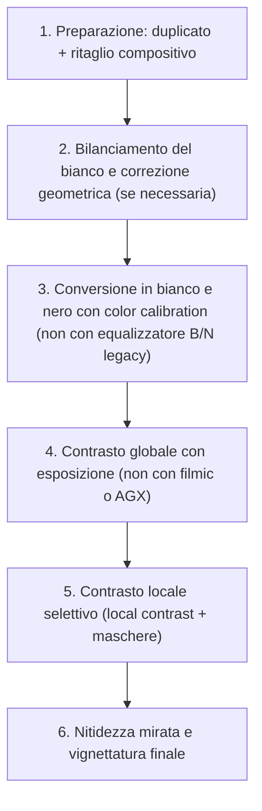

# Street Photography in darktable: Workshop Pratico B/N

Il workflow per la street photography in bianco e nero in darktable 5.4+ si basa su **controllo selettivo del contrasto tonale**, **gestione precisa della luminosità locale** e **preservazione del carattere “spontaneo” dell’immagine**, senza cadere in effetti artificiali o sovra-elaborati[^street-video-1][^bw-video]. A differenza della fotografia paesaggistica, qui il focus non è sulla gamma dinamica estrema, ma sulla **gerarchia visiva**: chi/che cosa guida lo sguardo, dove l’occhio si ferma, come la luce modella il soggetto nel caos urbano[^street-video-1].

!!! tip "Street ≠ paesaggio: priorità diverse"
    In street photography, i moduli più critici sono:  
    - `exposure` (per bilanciare luci/ombre *senza* appiattire)  
    - `color calibration` (per conversione B/N controllata)  
    - `local contrast` (per definire bordi e texture senza artefatti)  
    - `mask manager` (per mascherature rapide su volti, occhi, mani)  
    Non serve `dehaze`, `filmic RGB` o `sigmoid` — AGX è opzionale e spesso sovrabbondante[^street-video-1][^bw-video].

## Panoramica del flusso di lavoro

Il workflow segue un ordine rigoroso, ispirato alle tecniche analogiche di dodging & burning e alla pratica del *“less is more”* tipica della street[^bw-video]:

Questo ordine evita l’accumulo di artefatti: ad esempio, applicare `local contrast` *prima* della conversione B/N genera distorsioni cromatiche indesiderate[^bw-video]. Il modulo `color calibration` è usato **due volte**: una per il bilanciamento del bianco (tab *White Balance*), una per la conversione (tab *Colorfulness*, con `gray` abilitato)[^street-video-1].

## Flusso di lavoro passo-passo

### Passo 1: Duplicato e ritaglio compositivo

Apri l’immagine RAW in modalità *lighttable*, selezionala e premi `Ctrl+D` per creare un duplicato. Questo preserva l’originale per eventuali revisioni[^street-video-1].

Usa il modulo `crop` per:
- Applicare un ritaglio artistico (es. formato 1:1 o 4:5 per enfatizzare la centralità del soggetto)
- Correggere lievi inclinazioni (massimo ±0.5° per mantenere l’impressione di spontaneità)
- Allineare linee guida orizzontali/verticali (marciapiedi, facciate) senza rigidità

> **Perché?** Un ritaglio preciso elimina distrazioni marginali e rafforza la narrazione visiva — fondamentale quando il soggetto è un dettaglio fugace (una mano, uno sguardo, un riflesso)[^street-video-1].

### Passo 2: Bilanciamento del bianco con color calibration

Attiva la prima istanza di `color calibration`. Vai alla scheda *White Balance* e usa la pipetta sul grigio neutro più affidabile (es. marciapiede bagnato, muro chiaro, cielo uniforme). Se non disponibile, imposta manualmente:

| Parametro | Valore tipico | Osservazione |
|-----------|----------------|--------------|
| illuminant | Daylight (5500K) o Cloudy (6500K) | Evita Tungsten (<3500K): rende le scene urbane innaturalmente fredde[^street-video-1] |
| CAT | CAT16 | Preserva la relazione tonale tra zone chiare/scure meglio di Bradford[^manual-color-calibration] |

!!! warning "Non usare il bilanciamento automatico"
    Il bilanciamento automatico (`Auto WB`) spesso sbaglia su scene miste (ombra/luce diretta, insegne al neon, vetrine riflettenti). Preferisci la pipetta su una zona neutra o un valore manuale testato[^street-video-1].

### Passo 3: Conversione in bianco e nero con color calibration (seconda istanza)

Aggiungi una **seconda istanza** di `color calibration`. Rinominala `"BW conversion"` per chiarezza.

Vai alla scheda *Colorfulness* e imposta:

| Parametro | Valore | Perché |
|-----------|--------|--------|
| gray | ✅ abilitato | Attiva la modalità scala di grigi vera[^street-video-1] |
| normalize channels | ✅ abilitato | Garantisce che R, G, B contribuiscano equamente alla luminanza finale[^street-video-1] |
| input R / G / B | tutti a `0.000` | Partenza neutrale: ogni canale ha peso identico[^street-video-1] |
| output color profile | `filmic rgb • scene-referred default` | Profilo predefinito stabile per B/N[^manual-color-calibration] |

> **Osserva**: L’istogramma cambia forma — diventa un’unica curva concentrata (non tre curve separate RGB). Se rimangono picchi separati, `normalize channels` non è attivo o `gray` è disattivato[^street-video-1].

### Passo 4: Contrasto globale con esposizione (non con AGX)

In street photography, **evita AGX, Filmic RGB e Sigmoid**. Usa invece il modulo `exposure` per un controllo diretto e prevedibile[^street-video-1][^bw-video]:

| Parametro | Valore tipico | Cosa osservare |
|-----------|----------------|------------------|
| exposure | da `-0.30` a `+0.80` EV | Regola solo per compensare l’esposizione iniziale — non per “creare” contrasto[^street-video-1] |
| black level correction | da `-0.0002` a `+0.0002` | Corregge leggeri offset del nero (es. ombre grigie invece che nere)[^street-video-1] |
| clarity | `15–45%` | Aumenta il contrasto locale *globale*: definisce bordi senza introdurre halos[^street-video-1] |
| mode | `Manual` | Evita `Automatic`: troppo aggressivo su scene caotiche[^bw-video] |

!!! tip "Clarity > Contrast per la street"
    La `clarity` agisce sulle transizioni medie (non sui dettagli fini né sulle zone omogenee), rendendo i volti, i tessuti e le superfici urbane immediatamente più incisivi — senza rischio di granulosità[^street-video-1].

### Passo 5: Contrasto locale selettivo con local contrast e maschere

Attiva `local contrast`. Questo modulo è **centrale** per la street: definisce il soggetto senza alterare lo sfondo caotico[^street-video-1].

| Parametro | Valore tipico | Quando usarlo |
|-----------|----------------|----------------|
| clarity | `25–55%` | Base per tutta l’immagine (valore già impostato in `exposure` può essere ridotto qui)[^street-video-1] |
| clarity in highlights | `30–65%` | Per far risaltare occhi, capelli bagnati, superfici lucide[^street-video-1] |
| clarity in shadows | `15–40%` | Per recuperare dettagli in ombre profonde (portoni, tunnel, sottopassaggi)[^street-video-1] |
| radius | `15–45 px` | Più piccolo = dettagli più fini (pelle, tessuti); più grande = forme generali (silhouette, volumi)[^manual-local-contrast] |

> **Esempio pratico**: Su un ritratto di strada, imposta `clarity in highlights = 48%`, `radius = 22 px`. Poi applica una maschera circolare sull’occhio destro: l’iride diventa immediatamente più presente, senza toccare la pelle circostante[^street-video-1].

### Passo 6: Mascheratura avanzata con mask manager

Usa `mask manager` per interventi mirati:

1. Crea una nuova maschera → `Circle` → posiziona sul volto
2. Imposta `Opacity = 75%`, `Feather = 12%`, `Size = 38%`
3. Nell’istanza di `exposure` associata, regola:
   - `exposure = +0.25 EV` (per illuminare leggermente il volto)
   - `clarity = 32%` (per definire i contorni)

> **Perché non usare `tone equalizer`?** È troppo fine per la street: richiede tempo e precisione che contrasta con la natura istantanea del genere. Le maschere geometriche (`Circle`, `Gradient`, `Path`) sono 5× più veloci e altrettanto efficaci[^street-video-1].

### Passo 7: Nitidezza e vignettatura finale

- **Nitidezza**: Usa `sharpen` (non `unsharp mask`). Imposta:
  - `amount = 45–65%`
  - `radius = 0.8–1.2 px`
  - `threshold = 15–25` (per evitare di accentuare il rumore ISO alto tipico della street)[^manual-sharpen]

- **Vignettatura**: Usa `vignette` con:
  - `strength = -15%` (scurisce leggermente i bordi)
  - `scale = 75%` (interessa solo gli angoli, non il centro)
  - `shape = Round` (naturale, non artificiale)

!!! info "Vignettatura: strumento narrativo, non tecnico"
    Una vignettatura leggera guida l’occhio verso il centro — dove, nella street, accade l’azione. Non è un effetto “vintage”, ma una gerarchia visiva consapevole[^street-video-1].

## Parametri chiave per la street photography

| Modulo | Parametro | Range utile | Default | Note |
|--------|-----------|-------------|---------|------|
| `exposure` | clarity | 15–45% | 25% | Primo controllo del “peso visivo” dell’immagine[^street-video-1] |
| `color calibration` (BW) | normalize channels | ✅ abilitato | disabilitato | Fondamentale per una conversione B/N fedele[^street-video-1] |
| `local contrast` | clarity in highlights | 30–65% | 35% | Priorità assoluta per occhi, capelli, superfici riflettenti[^street-video-1] |
| `mask manager` | Opacity (maschera circolare) | 60–85% | 75% | Valore ottimale per integrazione naturale[^street-video-1] |
| `sharpen` | threshold | 15–25 | 20 | Impedisci l’amplificazione del rumore ISO 1600+[^manual-sharpen] |

## Consigli operativi

- **ISO alto?** Usa `denoise (profiled)` *prima* di `local contrast`, non dopo. Imposta `strength = 35–55%`, `patch-based = false`, `spatial extent = 1.2`[^manual-denoise].  
- **Luci dure?** Evita `fill light` — preferisci una maschera `Gradient` su una zona d’ombra con `exposure = +0.40 EV`[^street-video-1].  
- **Sfondo caotico?** Non usare `background blur`: crea artefatti. Usa invece `local contrast` con `clarity in shadows = 10%` e `radius = 40 px` per “appiattire” leggermente lo sfondo senza sfocarlo[^street-video-1].  
- **Velocità:** Salva uno stile chiamato `"Street B/N Quick"` con i parametri base (`exposure.clarity=25`, `color calibration.gray=true`, `local contrast.clarity=35`) — applicalo con un click su nuove immagini[^street-video-1].

### Esempio: Maschera circolare su occhio con clarity in highlights
*Da [Full b&w edits in darktable for street photography](https://www.youtube.com/watch?v=f9szYMJ9wYo) (timestamp 02:34)*  
1. Crea una maschera `Circle` centrata sull’iride destra  
2. Imposta `Opacity = 82%`, `Feather = 14%`, `Size = 28%`  
3. Nell’istanza di `local contrast` associata, imposta `clarity in highlights = 48%`, `radius = 22 px`  
4. Verifica che l’occhio risulti più definito senza alterare la pelle circostante[^street-video-1]

### Esempio: Controllo del nero con black level correction
*Da [Full b&w edits in darktable for street photography](https://www.youtube.com/watch?v=f9szYMJ9wYo) (timestamp 03:17)*  
1. Attiva `exposure`  
2. Regola `black level correction` fino a ottenere neri veri (non grigi) nelle ombre profonde  
3. Valore tipico osservato: `+0.00015` per immagini scattate in condizioni umide o nebbiose  
4. Conferma con l’istogramma: il picco sinistro deve toccare il bordo sinistro senza gap[^street-video-1]

### Esempio: Ritaglio 1:1 per enfasi compositiva
*Da [darktable Black&White photography](https://www.youtube.com/watch?v=efWVSR93m5k) (timestamp 04:08)*  
1. Attiva `crop`  
2. Imposta `Aspect ratio = 1:1`  
3. Allinea la linea orizzontale inferiore con il bordo del marciapiede  
4. Centra il volto del soggetto esattamente nel quadrato, lasciando 1/3 di spazio sopra la testa  
5. Valore di rotazione finale: `+0.27°` — sufficiente per correggere la prospettiva senza sembrare artificiale[^bw-video]

## Domande frequenti

### Problema: `color calibration` mostra ancora tre curve RGB dopo aver abilitato `gray`
La funzione `gray` non impone una conversione monochrome se `normalize channels` è disattivato. Abilitare entrambi i parametri è obbligatorio per ottenere una singola curva Luminance. Se il comportamento persiste, controlla che l’immagine non sia già stata flaggata come monochrome tramite demosaic passthrough[^manual-color-calibration].

### Problema: `local contrast` introduce artefatti ai bordi dei vestiti
Questo accade tipicamente con `radius > 45 px` su tessuti fini (lino, seta) o con `clarity in highlights > 65%` su superfici lucide. Riduci `radius` a `28–32 px` e abbassa `clarity in highlights` a `52%`; aggiungi una maschera `Path` lungo il contorno del capo per limitare l’effetto[^manual-local-contrast].

### Problema: maschera circolare troppo rigida su pelle anziana
L’eccessiva `Feather` (oltre 18%) causa perdita di definizione; una `Feather` troppo bassa (<8%) produce transizioni nette non naturali. Il valore ottimale per pelle rugosa è `12–14%`, combinato con `Opacity = 72%` e `Size = 35%`[^street-video-1].

## Risorse utili

- [Video tutorial completo: “Full b&w edits in darktable for street photography”](https://www.youtube.com/watch?v=f9szYMJ9wYo) — workflow reale su 3 immagini diverse[^street-video-1]  
- [Manuale ufficiale darktable: sezione `color calibration`](https://darktable.gitlab.io/doc/en/color_calibration.html) — spiegazione tecnica dei parametri B/N[^manual-color-calibration]  
- [Manuale ufficiale: `local contrast`](https://darktable.gitlab.io/doc/en/local_contrast.html) — comportamento del raggio e interazione con le maschere[^manual-local-contrast]  
- [Manuale ufficiale: sviluppo di immagini monocromatiche](https://docs.darktable.org/usermanual/development/en/guides-tutorials/monochrome/) — confronto tra approccio fisico (filmico) e percettivo (Lab)[^reference-monochrome]  

## Fonti

[^street-video-1]: [ENG] Full b&w edits in darktable for street photography, A Dabble in Photography, YouTube, 2026. URL: https://www.youtube.com/watch?v=f9szYMJ9wYo
[^bw-video]: [ENG] darktable Black&White photography, A Dabble in Photography, YouTube, 2026. URL: https://www.youtube.com/watch?v=efWVSR93m5k
[^manual-color-calibration]: darktable User Manual, “Color Calibration”, darktable.gitlab.io/doc/en/color_calibration.html
[^manual-local-contrast]: darktable User Manual, “Local Contrast”, darktable.gitlab.io/doc/en/local_contrast.html
[^manual-sharpen]: darktable User Manual, “Sharpen”, darktable.gitlab.io/doc/en/sharpen.html
[^manual-denoise]: darktable User Manual, “Denoise (profiled)”, darktable.gitlab.io/doc/en/denoise_profiled.html
[^reference-monochrome]: darktable user manual — developing monochrome images, docs.darktable.org/usermanual/development/en/guides-tutorials/monochrome/
